# Summary of 3_Linear

[<< Go back](../README.md)

## Logistic Regression (Linear)
- **n_jobs**: -1
- **explain_level**: 2

## Validation
 - **validation_type**: split
 - **train_ratio**: 0.75
 - **shuffle**: True
 - **stratify**: True

## Optimized metric
accuracy

## Training time

10.4 seconds

## Metric details
|           |    score |     threshold |
|:----------|---------:|--------------:|
| logloss   | 0.017381 | nan           |
| auc       | 1        | nan           |
| f1        | 1        |   0.461086    |
| accuracy  | 1        |   0.461086    |
| precision | 1        |   0.461086    |
| recall    | 1        |   0.000319926 |
| mcc       | 1        |   0.461086    |

## Confusion matrix (at threshold=0.461086)
|                      |   Predicted as real |   Predicted as simulated |
|:---------------------|--------------------:|-------------------------:|
| Labeled as real      |                  40 |                        0 |
| Labeled as simulated |                   0 |                       47 |

## Learning curves

## Coefficients
| feature                                 |   Learner_1 |
|:----------------------------------------|------------:|
| return_autocorrelation_lag1_rolling_sd2 |   1.47989   |
| return_autocorrelation_lag1_rolling_sd1 |   1.46721   |
| return_sd2                              |   1.29662   |
| standardised_price_mean1                |   1.21487   |
| price_adf_p_values                      |   0.704133  |
| co_integration_statistic                |   0.698378  |
| return_mean1                            |   0.328688  |
| durbin_watson_statistic2                |   0.119965  |
| return_autocorrelation_lag1_2           |   0.0734745 |
| return_kurtosis1                        |   0.0509559 |
| return_autocorrelation_lag1_1           |   0.0490932 |
| return_correlation_ts1_lag_2            |   0.0288793 |
| return_sd1                              |  -0.0203377 |
| price1_granger_cause_price2             |  -0.0282417 |
| return_correlation_ts1_lag_1            |  -0.0309381 |
| return_correlation_ts2_lag_2            |  -0.0334638 |
| intercept                               |  -0.0445253 |
| return_correlation_ts2_lag_1            |  -0.0575146 |
| return_skew2                            |  -0.0790646 |
| return_correlation_ts1_lag_3            |  -0.0821987 |
| return_correlation_ts2_lag_3            |  -0.100381  |
| return_correlation_ts1_lag_0            |  -0.141085  |
| price2_granger_cause_price1             |  -0.160509  |
| return_skew1                            |  -0.188472  |
| return_kurtosis2                        |  -0.24182   |
| durbin_watson_statistic1                |  -0.349071  |
| return_mean2                            |  -0.420982  |
| standardised_price_mean2                |  -1.90285   |

## Permutation-based Importance
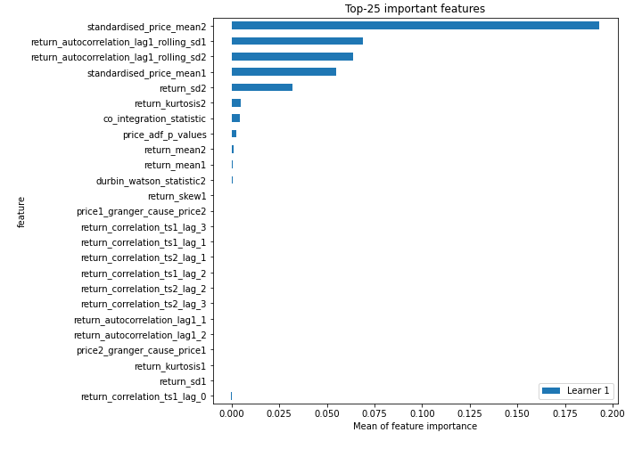
## Confusion Matrix

## Normalized Confusion Matrix

## ROC Curve

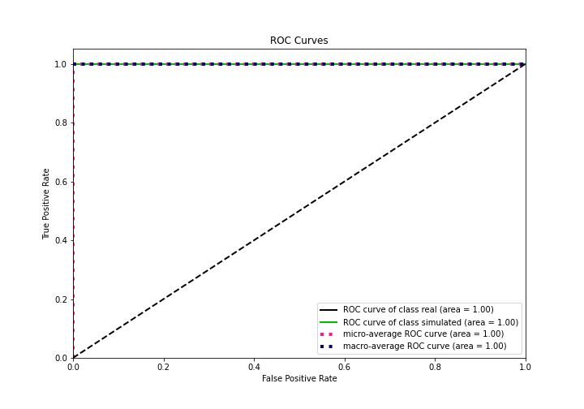

## Kolmogorov-Smirnov Statistic

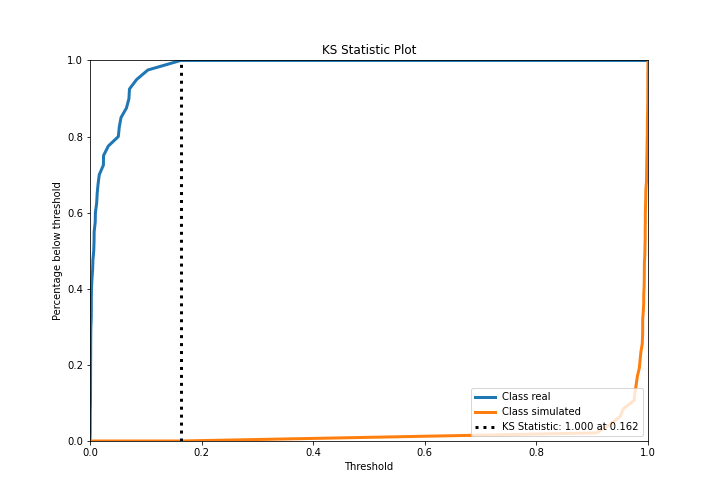

## Precision-Recall Curve

## Calibration Curve

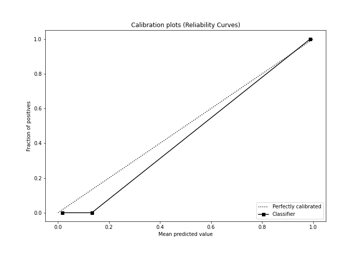

## Cumulative Gains Curve

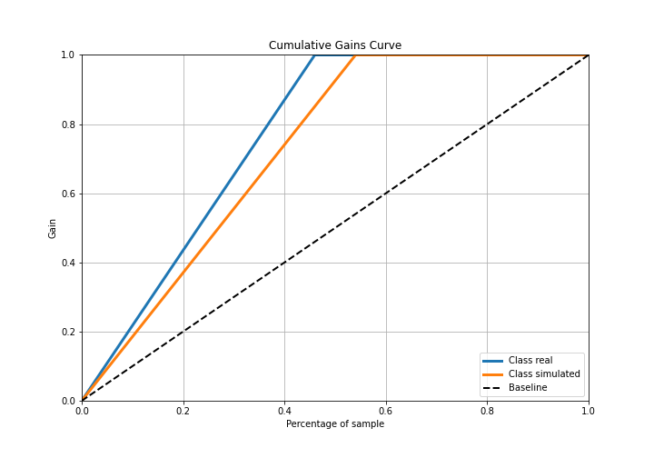

## Lift Curve

## SHAP Importance
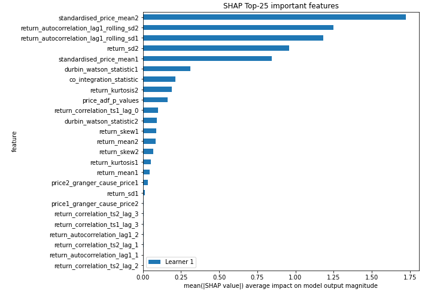

## SHAP Dependence plots

### Dependence (Fold 1)
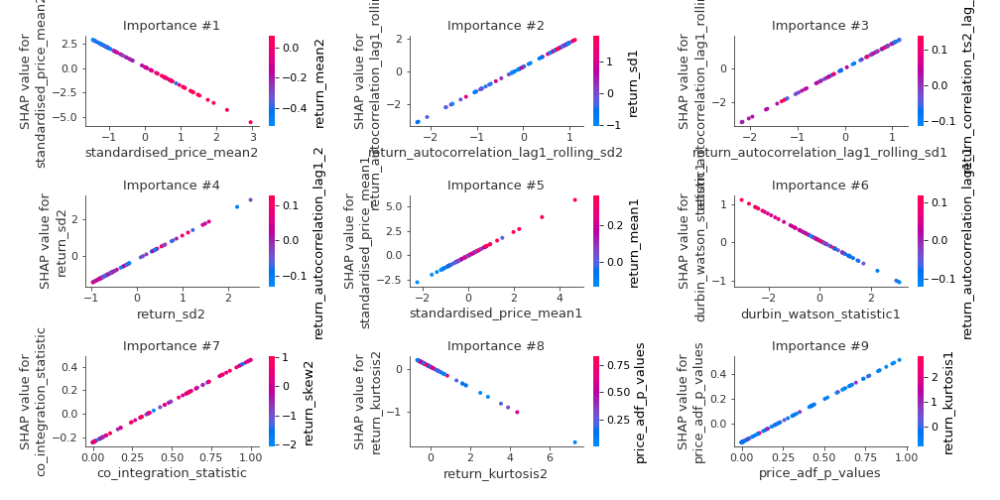

## SHAP Decision plots

### Top-10 Worst decisions for class 0 (Fold 1)
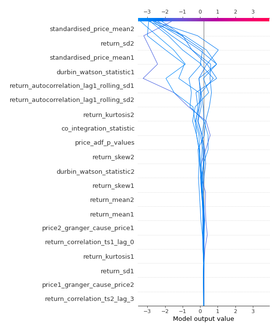
### Top-10 Best decisions for class 0 (Fold 1)
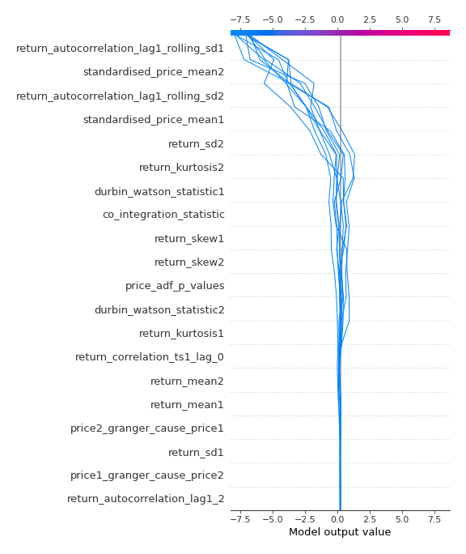
### Top-10 Worst decisions for class 1 (Fold 1)
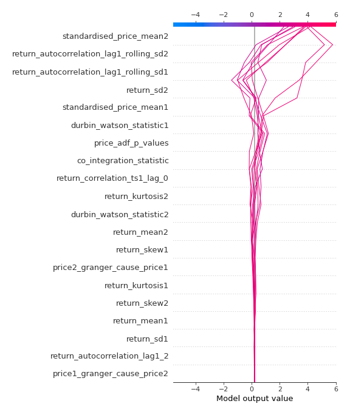
### Top-10 Best decisions for class 1 (Fold 1)
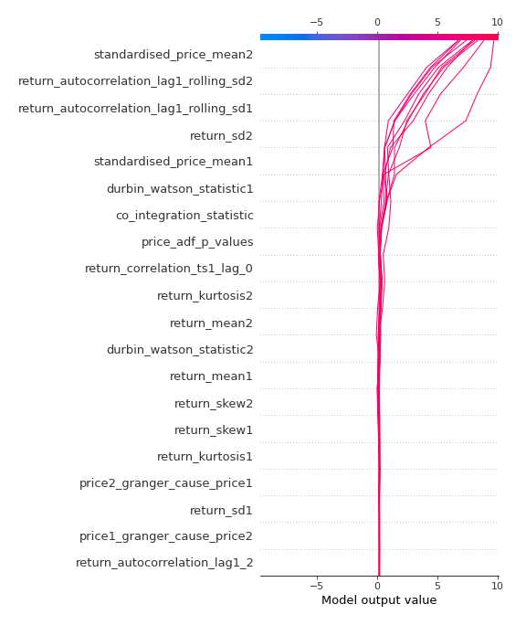

[<< Go back](../README.md)
