# Exploratory Data Analysis

[<< Go back](../README.md)
## Feature : target
- **Feature type** : categorical
- **Missing** : 0.0%
- **Unique** : 2
- **Count** :347
- **Unique** :2
- **Top** :simulated
- **Freq** :186

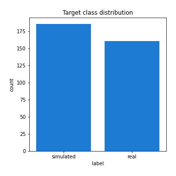
## Feature : standardised_price_mean1
- **Feature type** : continous
- **Missing** : 0.0%
- **Unique** : 347
- **Count** :347.0
- **Mean** :122.61414941647014
- **Std** :27.241099000240265
- **Min** :61.90028384066058
- **25%th Percentile** : 101.8667814445622
- **50%th Percentile** : 120.02474395509687
- **75%th Percentile** : 134.92976438339724
- **Max** :274.922675607238

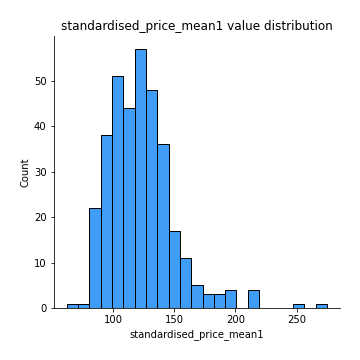
## Feature : standardised_price_mean2
- **Feature type** : continous
- **Missing** : 0.0%
- **Unique** : 347
- **Count** :347.0
- **Mean** :87.75908246103539
- **Std** :21.319335534187218
- **Min** :51.60030967904407
- **25%th Percentile** : 68.76260035578423
- **50%th Percentile** : 87.98143348982708
- **75%th Percentile** : 103.19818646471029
- **Max** :180.9892307692308

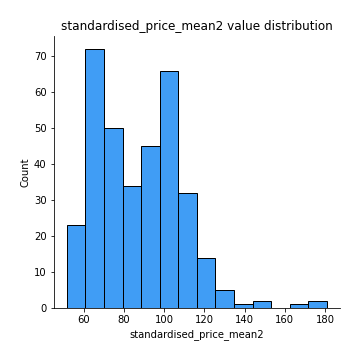
## Feature : return_mean1
- **Feature type** : continous
- **Missing** : 0.0%
- **Unique** : 347
- **Count** :347.0
- **Mean** :0.10759804986704127
- **Std** :0.17911033502342041
- **Min** :-0.31570612099423523
- **25%th Percentile** : -0.010198945755420477
- **50%th Percentile** : 0.08830507050216277
- **75%th Percentile** : 0.2042555640444588
- **Max** :0.9386941568685135

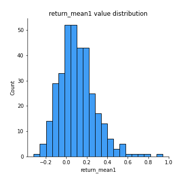
## Feature : return_mean2
- **Feature type** : continous
- **Missing** : 0.0%
- **Unique** : 347
- **Count** :347.0
- **Mean** :-0.19832384114900253
- **Std** :0.24796536817307396
- **Min** :-1.302547860013404
- **25%th Percentile** : -0.3612551844972409
- **50%th Percentile** : -0.15251779091101403
- **75%th Percentile** : -0.0232885636970045
- **Max** :0.7146705042826522

## Feature : return_sd1
- **Feature type** : continous
- **Missing** : 0.0%
- **Unique** : 347
- **Count** :347.0
- **Mean** :2.1317012299147624
- **Std** :0.8218739443154011
- **Min** :0.5303704957148373
- **25%th Percentile** : 1.522203285003616
- **50%th Percentile** : 1.899225017516598
- **75%th Percentile** : 2.667665983755346
- **Max** :4.884444514263637

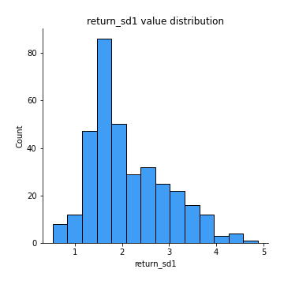
## Feature : return_sd2
- **Feature type** : continous
- **Missing** : 0.0%
- **Unique** : 347
- **Count** :347.0
- **Mean** :3.048871547010984
- **Std** :2.0038652268328665
- **Min** :0.882283648900384
- **25%th Percentile** : 1.566665637681611
- **50%th Percentile** : 2.1603395046243152
- **75%th Percentile** : 3.9860429348511
- **Max** :10.714366325995224

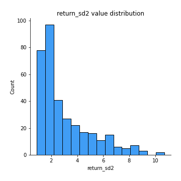
## Feature : return_skew1
- **Feature type** : continous
- **Missing** : 0.0%
- **Unique** : 347
- **Count** :347.0
- **Mean** :-0.3021914451560762
- **Std** :0.6466162109381017
- **Min** :-4.499550695415954
- **25%th Percentile** : -0.5359976870345915
- **50%th Percentile** : -0.2703820256820285
- **75%th Percentile** : -0.04177805224498867
- **Max** :3.972992894648776

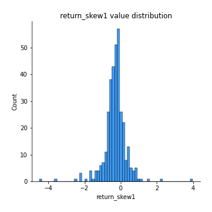
## Feature : return_skew2
- **Feature type** : continous
- **Missing** : 0.0%
- **Unique** : 347
- **Count** :347.0
- **Mean** :-0.5028473220688581
- **Std** :0.8152481701416475
- **Min** :-6.262899561987459
- **25%th Percentile** : -0.7470659230073968
- **50%th Percentile** : -0.40465344349229243
- **75%th Percentile** : -0.1547757085287922
- **Max** :2.3516100629951677

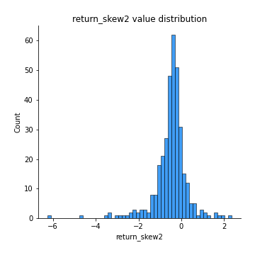
## Feature : return_kurtosis1
- **Feature type** : continous
- **Missing** : 0.0%
- **Unique** : 347
- **Count** :347.0
- **Mean** :3.3041229831672667
- **Std** :4.24449167570478
- **Min** :0.20395233444823946
- **25%th Percentile** : 1.3448316783376109
- **50%th Percentile** : 2.1530056075097606
- **75%th Percentile** : 3.493712856836933
- **Max** :43.33367798924404

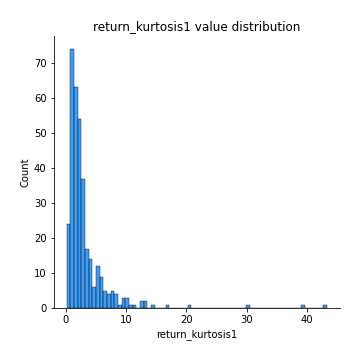
## Feature : return_kurtosis2
- **Feature type** : continous
- **Missing** : 0.0%
- **Unique** : 347
- **Count** :347.0
- **Mean** :4.800521848612442
- **Std** :6.203088850866422
- **Min** :0.2491149174916849
- **25%th Percentile** : 1.8773649301919375
- **50%th Percentile** : 2.9327913786839486
- **75%th Percentile** : 5.0220714054221975
- **Max** :64.99818629655663

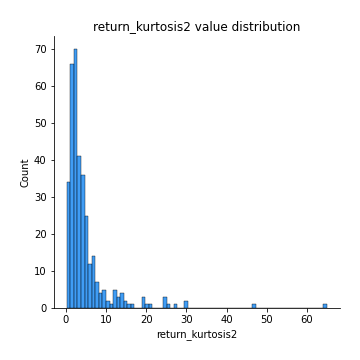
## Feature : return_autocorrelation_lag1_1
- **Feature type** : continous
- **Missing** : 0.0%
- **Unique** : 347
- **Count** :347.0
- **Mean** :-0.007168982649058381
- **Std** :0.07792124706772262
- **Min** :-0.22446132737334415
- **25%th Percentile** : -0.05543198663967956
- **50%th Percentile** : -0.010178662437983368
- **75%th Percentile** : 0.04200875063930917
- **Max** :0.22977851453331116

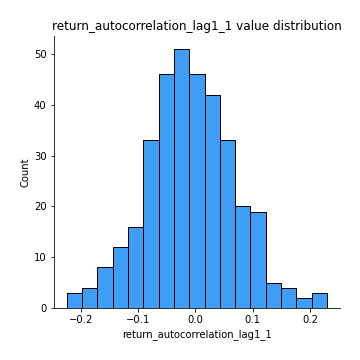
## Feature : return_autocorrelation_lag1_2
- **Feature type** : continous
- **Missing** : 0.0%
- **Unique** : 347
- **Count** :347.0
- **Mean** :-0.003670312307360588
- **Std** :0.08291948297523999
- **Min** :-0.279707665160321
- **25%th Percentile** : -0.05699223759401479
- **50%th Percentile** : -0.0034554349547440506
- **75%th Percentile** : 0.04773245931699449
- **Max** :0.31067565215452675

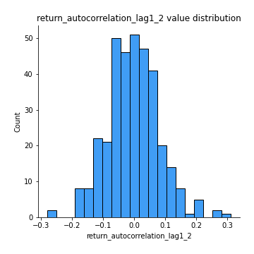
## Feature : return_autocorrelation_lag1_rolling_sd1
- **Feature type** : continous
- **Missing** : 0.0%
- **Unique** : 347
- **Count** :347.0
- **Mean** :0.9782027734964741
- **Std** :0.016151023871248532
- **Min** :0.9268739413055933
- **25%th Percentile** : 0.9667373378709644
- **50%th Percentile** : 0.9838743651735062
- **75%th Percentile** : 0.9919461728258168
- **Max** :0.997884084523498

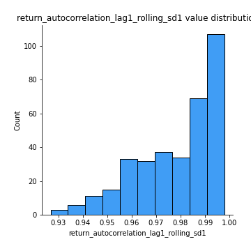
## Feature : return_autocorrelation_lag1_rolling_sd2
- **Feature type** : continous
- **Missing** : 0.0%
- **Unique** : 347
- **Count** :347.0
- **Mean** :0.9760405255107047
- **Std** :0.019786159071606767
- **Min** :0.8849206290342239
- **25%th Percentile** : 0.9629145227049041
- **50%th Percentile** : 0.9835007043774296
- **75%th Percentile** : 0.9928787286652998
- **Max** :0.9980827659306994

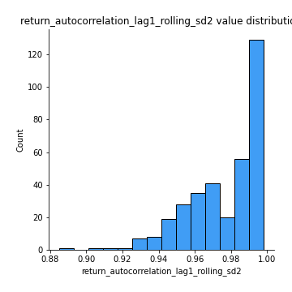
## Feature : price_adf_p_values
- **Feature type** : continous
- **Missing** : 0.0%
- **Unique** : 347
- **Count** :347.0
- **Mean** :0.2648498701482021
- **Std** :0.29766689357090376
- **Min** :2.5539372737169943e-05
- **25%th Percentile** : 0.014424316250803532
- **50%th Percentile** : 0.1319252721773294
- **75%th Percentile** : 0.48556585726029045
- **Max** :0.9968894420109302

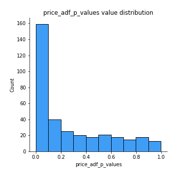
## Feature : return_correlation_ts1_lag_0
- **Feature type** : continous
- **Missing** : 0.0%
- **Unique** : 347
- **Count** :347.0
- **Mean** :0.5276598608551438
- **Std** :0.2836579208654006
- **Min** :-0.5292859909364974
- **25%th Percentile** : 0.36057380199734546
- **50%th Percentile** : 0.5737719349851739
- **75%th Percentile** : 0.7730258761248787
- **Max** :0.9937227277077512

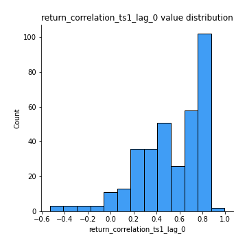
## Feature : return_correlation_ts1_lag_1
- **Feature type** : continous
- **Missing** : 0.0%
- **Unique** : 347
- **Count** :347.0
- **Mean** :-0.002479505192536351
- **Std** :0.07142677841380063
- **Min** :-0.18538593472635223
- **25%th Percentile** : -0.05437595170335541
- **50%th Percentile** : -0.004005844503980475
- **75%th Percentile** : 0.04245602690068834
- **Max** :0.3220824069250143

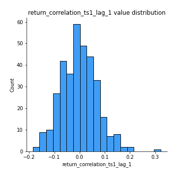
## Feature : return_correlation_ts1_lag_2
- **Feature type** : continous
- **Missing** : 0.0%
- **Unique** : 347
- **Count** :347.0
- **Mean** :-0.004710755676715696
- **Std** :0.07674624649504551
- **Min** :-0.27948383229767015
- **25%th Percentile** : -0.05141273138225356
- **50%th Percentile** : -0.01122887883622303
- **75%th Percentile** : 0.040144445591595176
- **Max** :0.22067744951473664

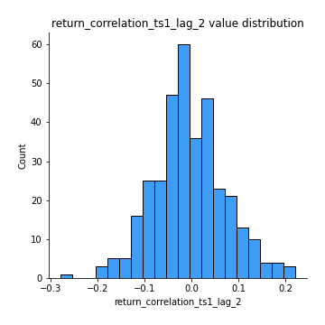
## Feature : return_correlation_ts1_lag_3
- **Feature type** : continous
- **Missing** : 0.0%
- **Unique** : 347
- **Count** :347.0
- **Mean** :0.004710964826659307
- **Std** :0.07557446158573579
- **Min** :-0.22448197214038315
- **25%th Percentile** : -0.043165791203708476
- **50%th Percentile** : 0.006520675484819677
- **75%th Percentile** : 0.0566415142958176
- **Max** :0.21380560255886633

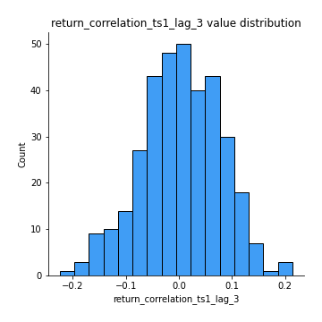
## Feature : return_correlation_ts2_lag_1
- **Feature type** : continous
- **Missing** : 0.0%
- **Unique** : 347
- **Count** :347.0
- **Mean** :0.00488593333881395
- **Std** :0.0799446525459832
- **Min** :-0.23412647142576898
- **25%th Percentile** : -0.047403323192224456
- **50%th Percentile** : 0.008196471274772557
- **75%th Percentile** : 0.053283150833122045
- **Max** :0.3425036902091001

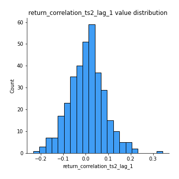
## Feature : return_correlation_ts2_lag_2
- **Feature type** : continous
- **Missing** : 0.0%
- **Unique** : 347
- **Count** :347.0
- **Mean** :-0.013105044248935226
- **Std** :0.07701683264034832
- **Min** :-0.2089510172526114
- **25%th Percentile** : -0.06193758308068996
- **50%th Percentile** : -0.012461671831692318
- **75%th Percentile** : 0.03623269365328893
- **Max** :0.22671954360613863

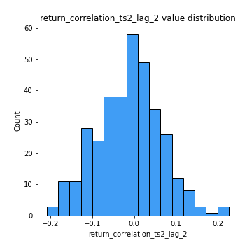
## Feature : return_correlation_ts2_lag_3
- **Feature type** : continous
- **Missing** : 0.0%
- **Unique** : 347
- **Count** :347.0
- **Mean** :0.011392432947084093
- **Std** :0.07744563301122544
- **Min** :-0.2753445684644438
- **25%th Percentile** : -0.036794800168250694
- **50%th Percentile** : 0.012469845369443615
- **75%th Percentile** : 0.06192647583540148
- **Max** :0.25104008788552046

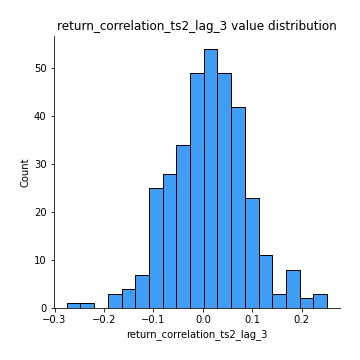
## Feature : durbin_watson_statistic1
- **Feature type** : continous
- **Missing** : 0.0%
- **Unique** : 347
- **Count** :347.0
- **Mean** :1.9849238406896077
- **Std** :0.0984653476776867
- **Min** :1.694532696029157
- **25%th Percentile** : 1.9436937131378604
- **50%th Percentile** : 1.9880969536094926
- **75%th Percentile** : 2.030970938311751
- **Max** :2.297476091935293

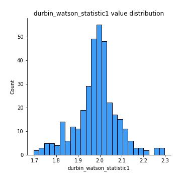
## Feature : durbin_watson_statistic2
- **Feature type** : continous
- **Missing** : 0.0%
- **Unique** : 347
- **Count** :347.0
- **Mean** :1.989985897170483
- **Std** :0.10136419563202295
- **Min** :1.7140284721882426
- **25%th Percentile** : 1.941171358800039
- **50%th Percentile** : 1.9957842165647974
- **75%th Percentile** : 2.0336688541003367
- **Max** :2.284393801661815

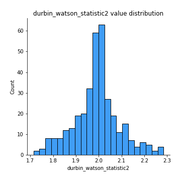
## Feature : co_integration_statistic
- **Feature type** : continous
- **Missing** : 0.0%
- **Unique** : 345
- **Count** :347.0
- **Mean** :0.3872136664749875
- **Std** :0.3497637530833237
- **Min** :7.478497249518302e-05
- **25%th Percentile** : 0.04175188356794751
- **50%th Percentile** : 0.3006461640822664
- **75%th Percentile** : 0.6991969984863947
- **Max** :1.0

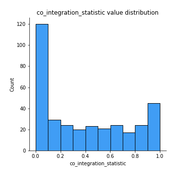
## Feature : price2_granger_cause_price1
- **Feature type** : continous
- **Missing** : 0.0%
- **Unique** : 347
- **Count** :347.0
- **Mean** :0.21166758010256528
- **Std** :0.2693813588916939
- **Min** :1.327523548249137e-07
- **25%th Percentile** : 0.005899911394538366
- **50%th Percentile** : 0.0816575782444313
- **75%th Percentile** : 0.3528330686721619
- **Max** :0.9961333090619894

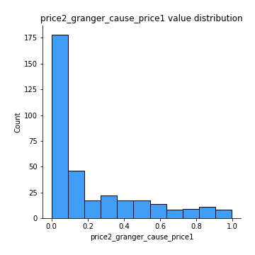
## Feature : price1_granger_cause_price2
- **Feature type** : continous
- **Missing** : 0.0%
- **Unique** : 347
- **Count** :347.0
- **Mean** :0.18575662163923004
- **Std** :0.2515308702152917
- **Min** :1.2012269232170316e-11
- **25%th Percentile** : 0.007166981102117914
- **50%th Percentile** : 0.06736663722736586
- **75%th Percentile** : 0.27091231267989757
- **Max** :0.9935188980102787

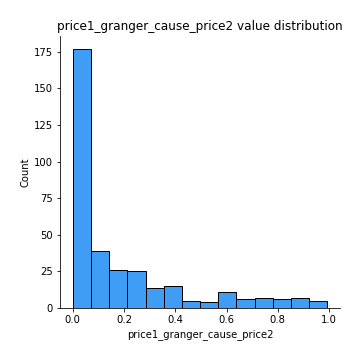

[<< Go back](../README.md)
