# Summary of 3_Linear

[<< Go back](../README.md)

## Logistic Regression (Linear)
- **n_jobs**: -1
- **explain_level**: 2

## Validation
 - **validation_type**: split
 - **train_ratio**: 0.75
 - **shuffle**: True
 - **stratify**: True

## Optimized metric
accuracy

## Training time

2.7 seconds

## Metric details
|           |     score |     threshold |
|:----------|----------:|--------------:|
| logloss   | 0.0841791 | nan           |
| auc       | 0.997884  | nan           |
| f1        | 0.989011  |   0.475665    |
| accuracy  | 0.988506  |   0.475665    |
| precision | 1         |   0.891612    |
| recall    | 1         |   5.84238e-06 |
| mcc       | 0.977225  |   0.475665    |

## Confusion matrix (at threshold=0.475665)
|                      |   Predicted as real |   Predicted as simulated |
|:---------------------|--------------------:|-------------------------:|
| Labeled as real      |                  41 |                        1 |
| Labeled as simulated |                   0 |                       45 |

## Learning curves
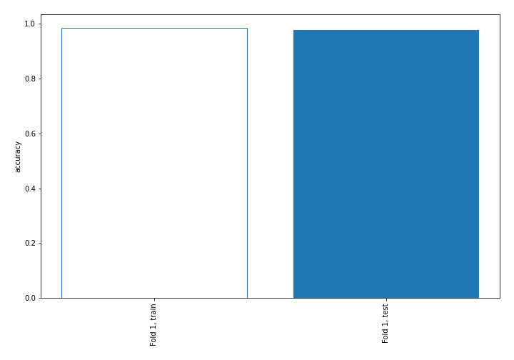

## Coefficients
| feature                                 |   Learner_1 |
|:----------------------------------------|------------:|
| return_autocorrelation_lag1_rolling_sd2 |  2.93659    |
| return_autocorrelation_lag1_rolling_sd1 |  2.31068    |
| return_sd1                              |  0.908752   |
| return_autocorrelation_lag1_1           |  0.270657   |
| return_sd2                              |  0.160609   |
| return_autocorrelation_lag1_2           |  0.145445   |
| return_correlation_ts2_lag_1            |  0.138159   |
| return_kurtosis2                        |  0.117729   |
| return_skew1                            |  0.116651   |
| return_correlation_ts1_lag_1            |  0.111933   |
| return_correlation_ts2_lag_2            |  0.0620887  |
| return_skew2                            |  0.0286651  |
| return_correlation_ts1_lag_2            | -0.00507429 |
| price1_granger_cause_price2             | -0.0365938  |
| return_correlation_ts1_lag_3            | -0.0807856  |
| return_correlation_ts1_lag_0            | -0.0960598  |
| return_kurtosis1                        | -0.219233   |
| intercept                               | -0.236509   |
| return_correlation_ts2_lag_3            | -0.265529   |
| price2_granger_cause_price1             | -0.313686   |
| return_mean1                            | -0.441559   |
| return_mean2                            | -1.06123    |

## Permutation-based Importance

## Confusion Matrix

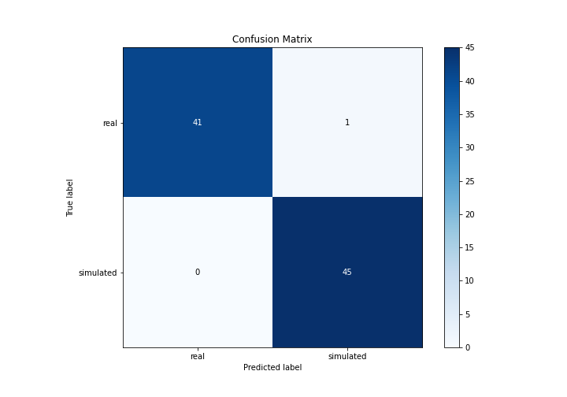

## Normalized Confusion Matrix

## ROC Curve

## Kolmogorov-Smirnov Statistic

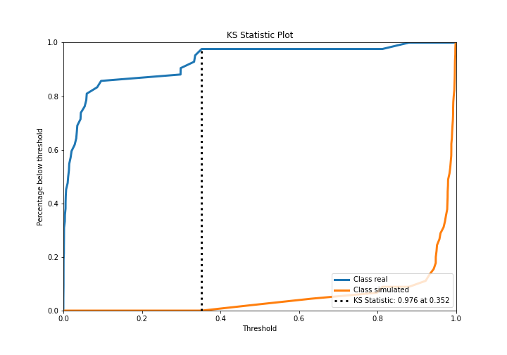

## Precision-Recall Curve

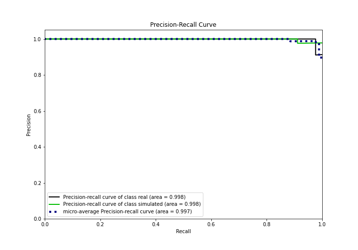

## Calibration Curve

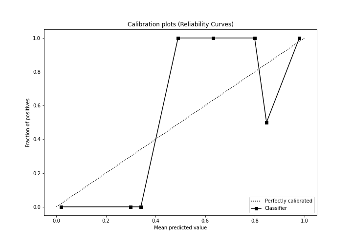

## Cumulative Gains Curve

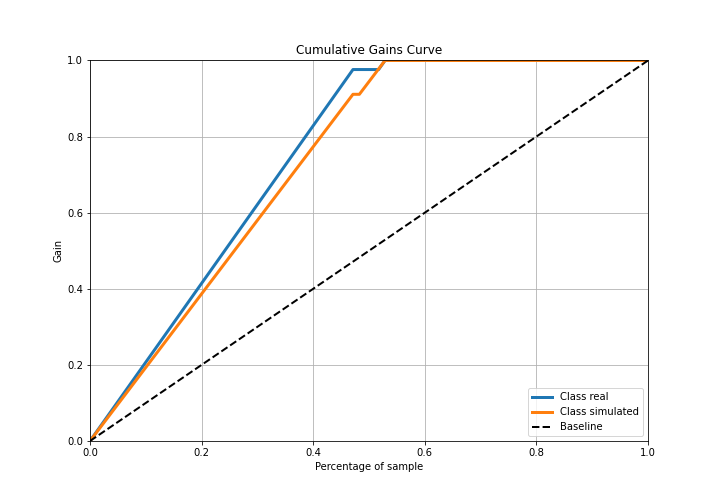

## Lift Curve

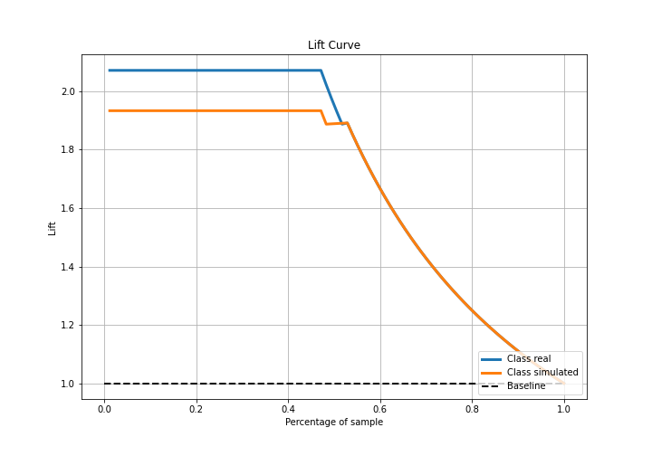

## SHAP Importance
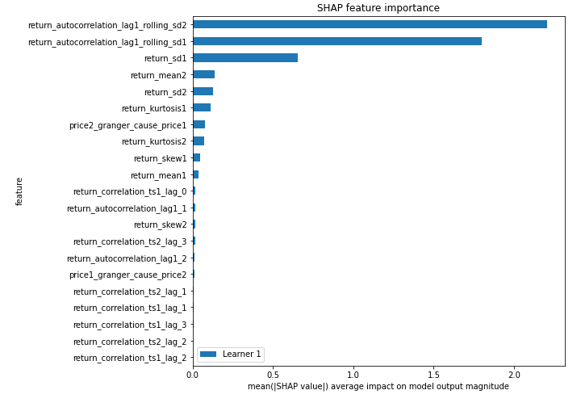

## SHAP Dependence plots

### Dependence (Fold 1)
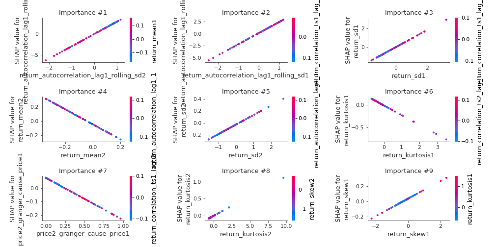

## SHAP Decision plots

### Top-10 Worst decisions for class 0 (Fold 1)
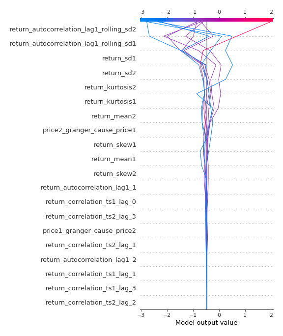
### Top-10 Best decisions for class 0 (Fold 1)
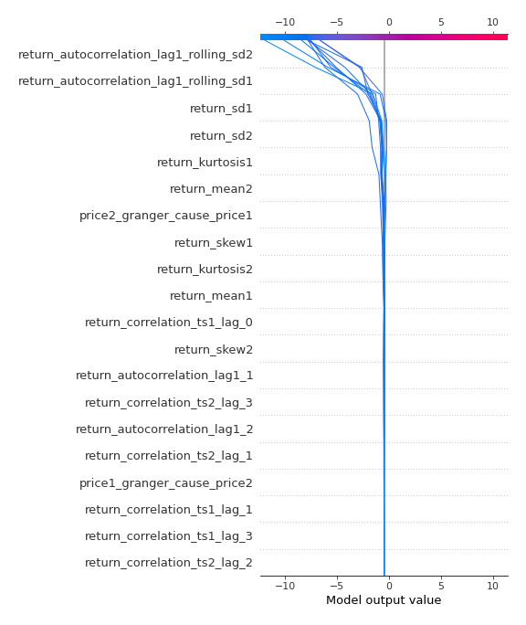
### Top-10 Worst decisions for class 1 (Fold 1)
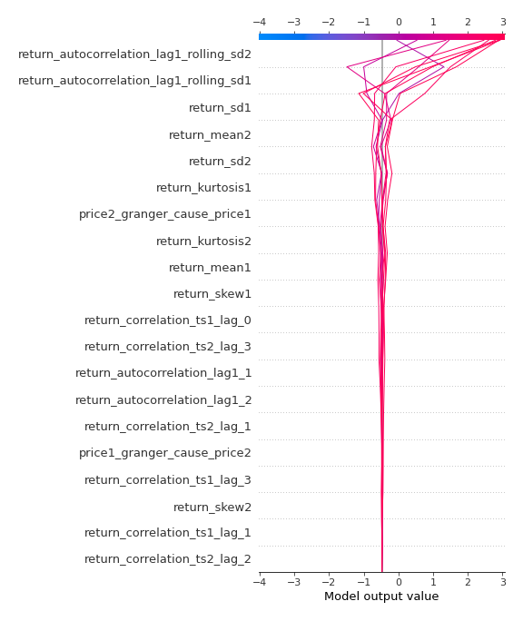
### Top-10 Best decisions for class 1 (Fold 1)
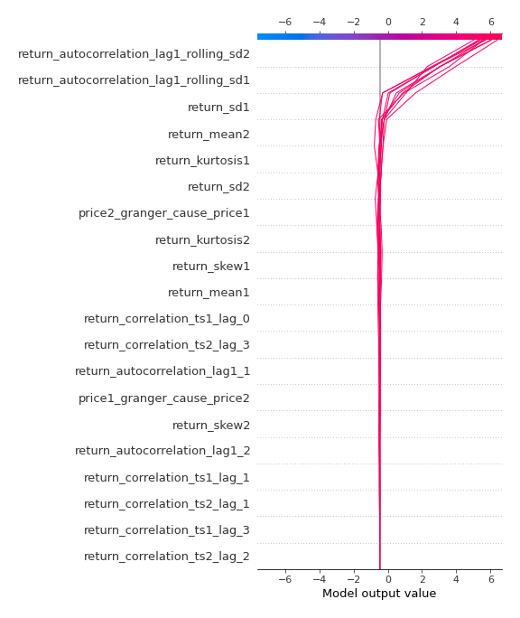

[<< Go back](../README.md)
