# Exploratory Data Analysis

[<< Go back](../README.md)
## Feature : target
- **Feature type** : categorical
- **Missing** : 0.0%
- **Unique** : 2
- **Count** :347
- **Unique** :2
- **Top** :simulated
- **Freq** :178

## Feature : return_mean1
- **Feature type** : continous
- **Missing** : 0.0%
- **Unique** : 347
- **Count** :347.0
- **Mean** :-0.009009856197819095
- **Std** :0.12434907590054324
- **Min** :-0.3166942901218858
- **25%th Percentile** : -0.10398695763576488
- **50%th Percentile** : -0.017642431798751003
- **75%th Percentile** : 0.09135175949900279
- **Max** :0.37910563367339584

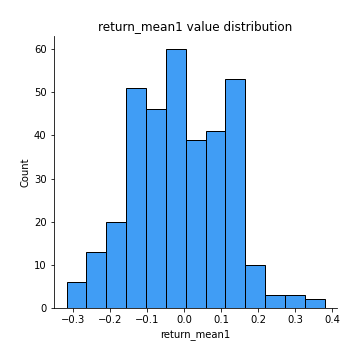
## Feature : return_mean2
- **Feature type** : continous
- **Missing** : 0.0%
- **Unique** : 347
- **Count** :347.0
- **Mean** :-0.06662223495288966
- **Std** :0.15224750197191378
- **Min** :-0.3749321499620784
- **25%th Percentile** : -0.18455641340067236
- **50%th Percentile** : -0.06551252742478349
- **75%th Percentile** : 0.04738231561563348
- **Max** :0.6801605239983173

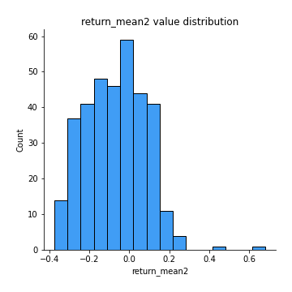
## Feature : return_sd1
- **Feature type** : continous
- **Missing** : 0.0%
- **Unique** : 347
- **Count** :347.0
- **Mean** :2.1089682249962873
- **Std** :0.8215741958687792
- **Min** :0.636475973838059
- **25%th Percentile** : 1.4536514932100626
- **50%th Percentile** : 1.976585052078002
- **75%th Percentile** : 2.5970732170932367
- **Max** :4.980688439830322

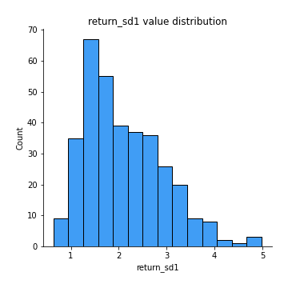
## Feature : return_sd2
- **Feature type** : continous
- **Missing** : 0.0%
- **Unique** : 347
- **Count** :347.0
- **Mean** :1.926856493663847
- **Std** :0.6612598800922638
- **Min** :0.9060171249911689
- **25%th Percentile** : 1.4525171122329694
- **50%th Percentile** : 1.7764633545052453
- **75%th Percentile** : 2.2834516859545646
- **Max** :4.59233049161685

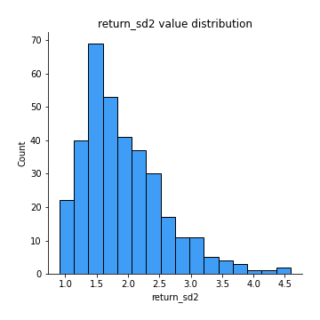
## Feature : return_skew1
- **Feature type** : continous
- **Missing** : 0.0%
- **Unique** : 347
- **Count** :347.0
- **Mean** :-0.31753263304997104
- **Std** :0.7470519799452042
- **Min** :-4.239645236578449
- **25%th Percentile** : -0.5502052403674399
- **50%th Percentile** : -0.2819701290894739
- **75%th Percentile** : -0.01608927881520764
- **Max** :2.351757728252051

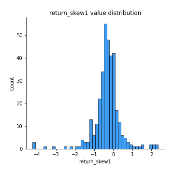
## Feature : return_skew2
- **Feature type** : continous
- **Missing** : 0.0%
- **Unique** : 347
- **Count** :347.0
- **Mean** :-0.4143522273164186
- **Std** :1.1019220513716153
- **Min** :-7.3762354994385335
- **25%th Percentile** : -0.6437818555577302
- **50%th Percentile** : -0.3143415754161768
- **75%th Percentile** : 0.03212134006277943
- **Max** :4.1920266082732045

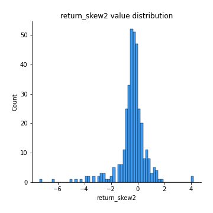
## Feature : return_kurtosis1
- **Feature type** : continous
- **Missing** : 0.0%
- **Unique** : 347
- **Count** :347.0
- **Mean** :3.9366815622436895
- **Std** :5.27159985000301
- **Min** :-0.25728451726546053
- **25%th Percentile** : 1.4910165469395706
- **50%th Percentile** : 2.297760887964418
- **75%th Percentile** : 4.047495607223594
- **Max** :40.485294874464934

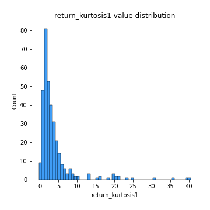
## Feature : return_kurtosis2
- **Feature type** : continous
- **Missing** : 0.0%
- **Unique** : 347
- **Count** :347.0
- **Mean** :6.319613021325399
- **Std** :9.539028624457377
- **Min** :0.30940620859925794
- **25%th Percentile** : 2.1950611578564434
- **50%th Percentile** : 3.366644055030466
- **75%th Percentile** : 5.763845323003189
- **Max** :94.01659180149953

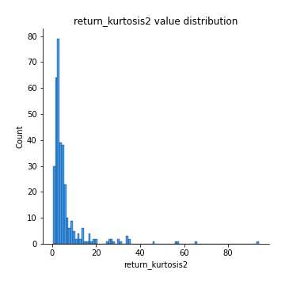
## Feature : return_autocorrelation_lag1_1
- **Feature type** : continous
- **Missing** : 0.0%
- **Unique** : 347
- **Count** :347.0
- **Mean** :-0.01211161101633553
- **Std** :0.07659056901944915
- **Min** :-0.22393175928356351
- **25%th Percentile** : -0.06495921712534009
- **50%th Percentile** : -0.01682598038709268
- **75%th Percentile** : 0.03560383161608953
- **Max** :0.20528818168724872

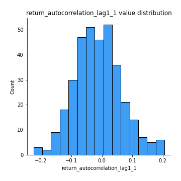
## Feature : return_autocorrelation_lag1_2
- **Feature type** : continous
- **Missing** : 0.0%
- **Unique** : 347
- **Count** :347.0
- **Mean** :-0.01052661193340546
- **Std** :0.0782311695854138
- **Min** :-0.35298963771558695
- **25%th Percentile** : -0.0610642311666486
- **50%th Percentile** : -0.009870858873054236
- **75%th Percentile** : 0.046318519854474334
- **Max** :0.2024676054184499

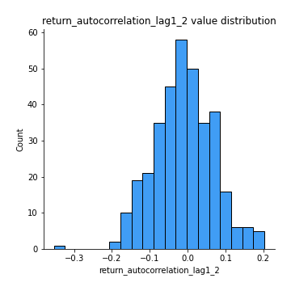
## Feature : return_autocorrelation_lag1_rolling_sd1
- **Feature type** : continous
- **Missing** : 0.0%
- **Unique** : 347
- **Count** :347.0
- **Mean** :0.9746606515279437
- **Std** :0.017896018148261802
- **Min** :0.9085782794458048
- **25%th Percentile** : 0.9618479958998518
- **50%th Percentile** : 0.9787933940847958
- **75%th Percentile** : 0.9903980869328175
- **Max** :0.9974844884207954

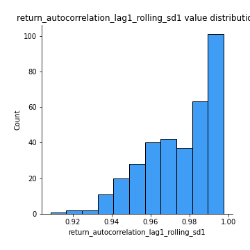
## Feature : return_autocorrelation_lag1_rolling_sd2
- **Feature type** : continous
- **Missing** : 0.0%
- **Unique** : 347
- **Count** :347.0
- **Mean** :0.970685973609031
- **Std** :0.020643558792391308
- **Min** :0.8938359734442779
- **25%th Percentile** : 0.956725315161169
- **50%th Percentile** : 0.9779664119310773
- **75%th Percentile** : 0.9882680982007659
- **Max** :0.9965427200968054

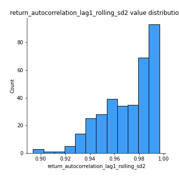
## Feature : return_correlation_ts1_lag_0
- **Feature type** : continous
- **Missing** : 0.0%
- **Unique** : 347
- **Count** :347.0
- **Mean** :0.46125135353530317
- **Std** :0.23276742859332128
- **Min** :-0.20142525351301063
- **25%th Percentile** : 0.30286293574164747
- **50%th Percentile** : 0.46590644245675467
- **75%th Percentile** : 0.654167700983525
- **Max** :0.9937227277077512

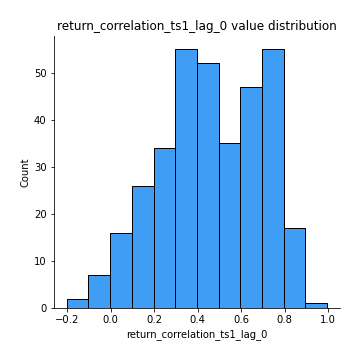
## Feature : return_correlation_ts1_lag_1
- **Feature type** : continous
- **Missing** : 0.0%
- **Unique** : 347
- **Count** :347.0
- **Mean** :-0.009829786718566833
- **Std** :0.06787780375048809
- **Min** :-0.18856827637524448
- **25%th Percentile** : -0.05431400561189152
- **50%th Percentile** : -0.009026247553850777
- **75%th Percentile** : 0.03408303955526766
- **Max** :0.20975272220747354

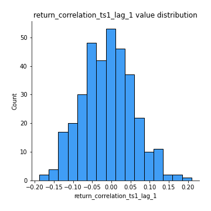
## Feature : return_correlation_ts1_lag_2
- **Feature type** : continous
- **Missing** : 0.0%
- **Unique** : 347
- **Count** :347.0
- **Mean** :-0.010113690607059357
- **Std** :0.07367214303901969
- **Min** :-0.29151170438088697
- **25%th Percentile** : -0.05936976574582063
- **50%th Percentile** : -0.012749764638877146
- **75%th Percentile** : 0.03779232164104836
- **Max** :0.20741328991362584

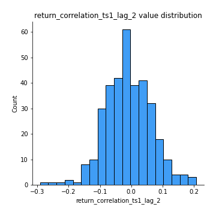
## Feature : return_correlation_ts1_lag_3
- **Feature type** : continous
- **Missing** : 0.0%
- **Unique** : 347
- **Count** :347.0
- **Mean** :-0.000832728121363089
- **Std** :0.0709565533565935
- **Min** :-0.23055787816431864
- **25%th Percentile** : -0.04738754633645062
- **50%th Percentile** : 0.004066337606492693
- **75%th Percentile** : 0.04818594218897432
- **Max** :0.23808054096877584

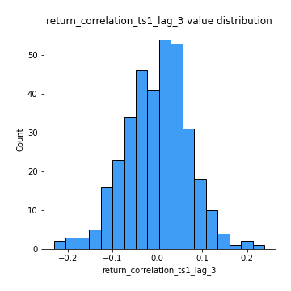
## Feature : return_correlation_ts2_lag_1
- **Feature type** : continous
- **Missing** : 0.0%
- **Unique** : 347
- **Count** :347.0
- **Mean** :-0.004789366501634908
- **Std** :0.07347570336462712
- **Min** :-0.181571100144972
- **25%th Percentile** : -0.05492953482532269
- **50%th Percentile** : -0.00810205939251099
- **75%th Percentile** : 0.041366320059562554
- **Max** :0.3425036902091001

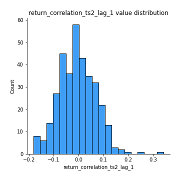
## Feature : return_correlation_ts2_lag_2
- **Feature type** : continous
- **Missing** : 0.0%
- **Unique** : 347
- **Count** :347.0
- **Mean** :-0.007061838272871791
- **Std** :0.07183771287537857
- **Min** :-0.24202683339418565
- **25%th Percentile** : -0.05003230988580076
- **50%th Percentile** : -0.0053882890490349385
- **75%th Percentile** : 0.03804538388952513
- **Max** :0.2030425072303847

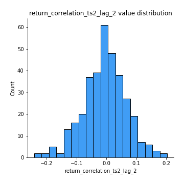
## Feature : return_correlation_ts2_lag_3
- **Feature type** : continous
- **Missing** : 0.0%
- **Unique** : 347
- **Count** :347.0
- **Mean** :0.002866833714945858
- **Std** :0.06828998451949735
- **Min** :-0.2002920051362424
- **25%th Percentile** : -0.044195905502517105
- **50%th Percentile** : 0.00453512749628552
- **75%th Percentile** : 0.049997868811553436
- **Max** :0.205841631448449

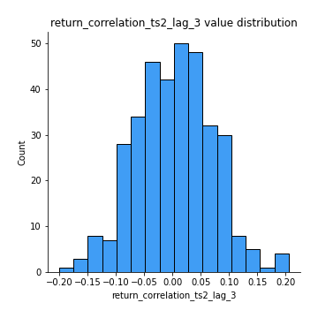
## Feature : price2_granger_cause_price1
- **Feature type** : continous
- **Missing** : 0.0%
- **Unique** : 347
- **Count** :347.0
- **Mean** :0.25510499300949635
- **Std** :0.27901070819654533
- **Min** :2.4312048970873696e-09
- **25%th Percentile** : 0.01958824118722004
- **50%th Percentile** : 0.1524425596454873
- **75%th Percentile** : 0.4138777684234888
- **Max** :0.9898380228448623

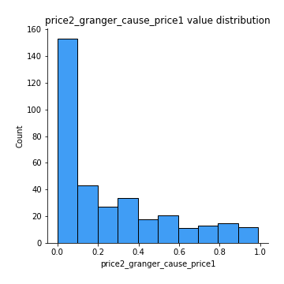
## Feature : price1_granger_cause_price2
- **Feature type** : continous
- **Missing** : 0.0%
- **Unique** : 347
- **Count** :347.0
- **Mean** :0.295233158699873
- **Std** :0.292506781478988
- **Min** :1.2012269232170316e-11
- **25%th Percentile** : 0.03720060596397454
- **50%th Percentile** : 0.18843856152772567
- **75%th Percentile** : 0.5346485753127137
- **Max** :0.9996969947795783

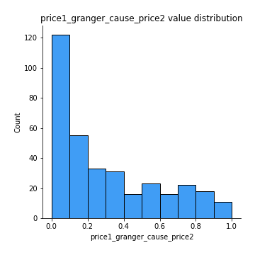

[<< Go back](../README.md)
