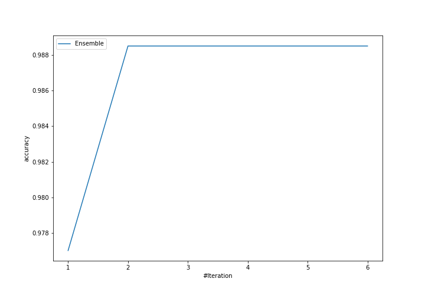
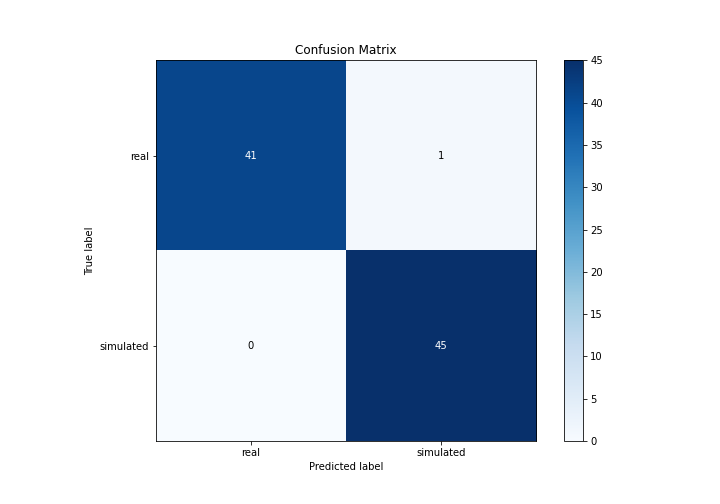
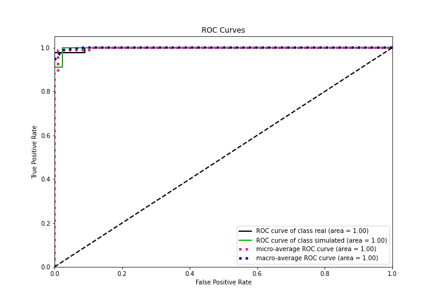
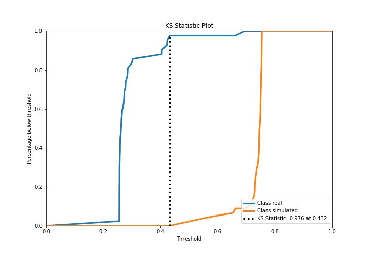
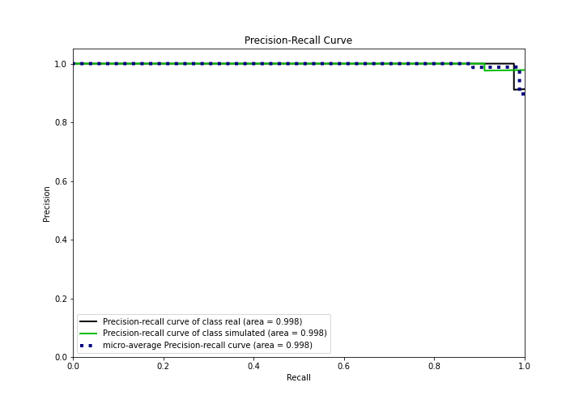
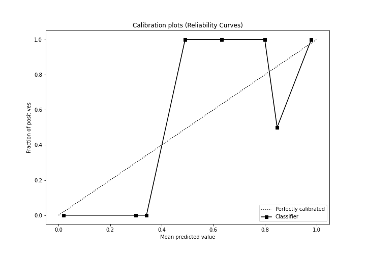
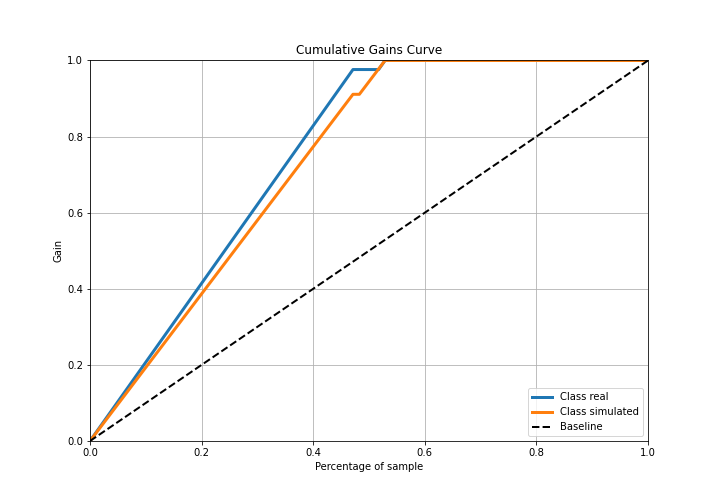
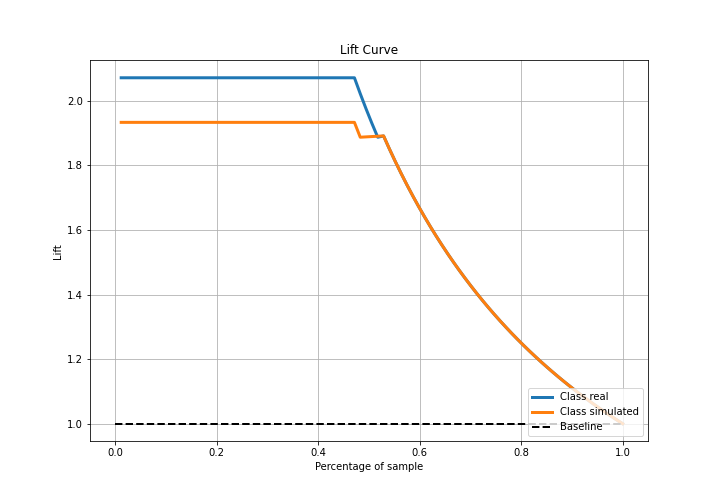

# Summary of Ensemble

[<< Go back](../README.md)

## Ensemble structure
| Model      |   Weight |
|:-----------|---------:|
| 1_Baseline |        1 |
| 3_Linear   |        1 |

## Metric details
|           |    score |   threshold |
|:----------|---------:|------------:|
| logloss   | 0.33541  |  nan        |
| auc       | 0.997884 |  nan        |
| f1        | 0.989011 |    0.493602 |
| accuracy  | 0.988506 |    0.493602 |
| precision | 1        |    0.701575 |
| recall    | 1        |    0.230195 |
| mcc       | 0.977225 |    0.493602 |

## Confusion matrix (at threshold=0.493602)
|                      |   Predicted as real |   Predicted as simulated |
|:---------------------|--------------------:|-------------------------:|
| Labeled as real      |                  41 |                        1 |
| Labeled as simulated |                   0 |                       45 |

## Learning curves

## Confusion Matrix

## Normalized Confusion Matrix

## ROC Curve

## Kolmogorov-Smirnov Statistic

## Precision-Recall Curve

## Calibration Curve

## Cumulative Gains Curve

## Lift Curve

[<< Go back](../README.md)
