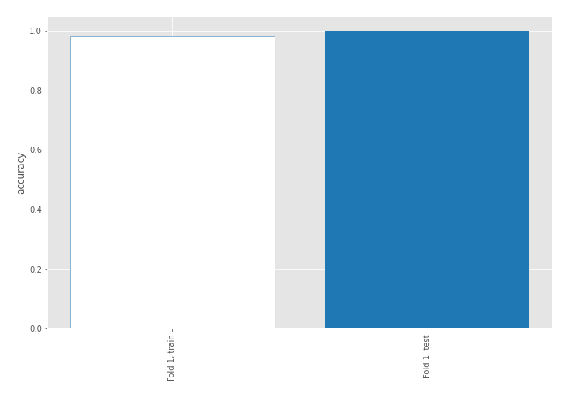
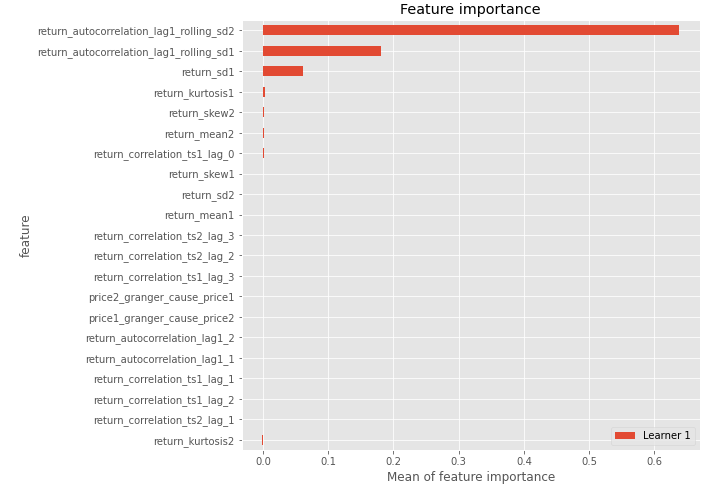
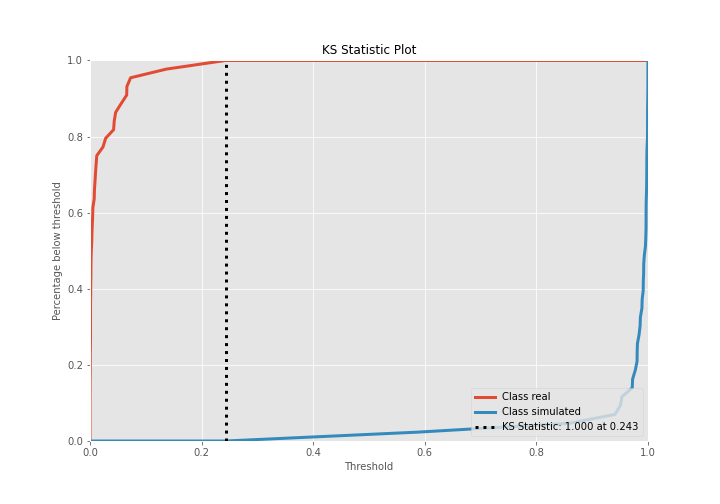
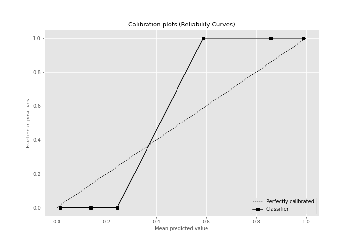
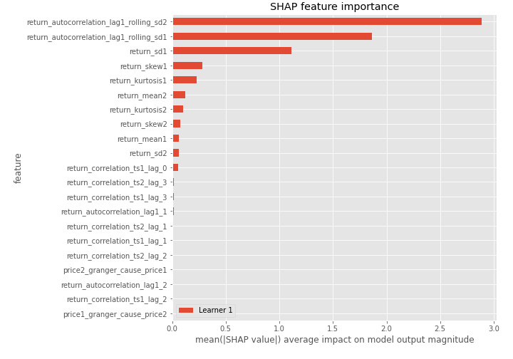
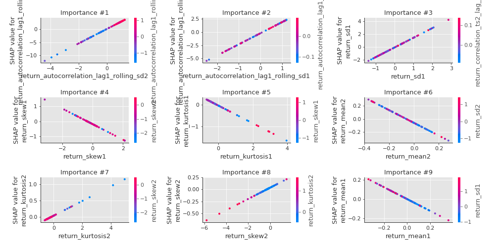
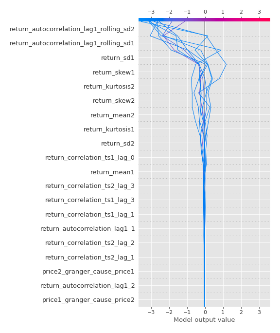
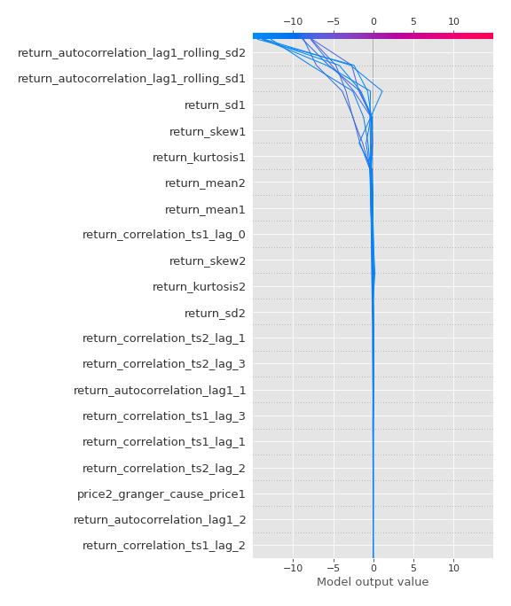
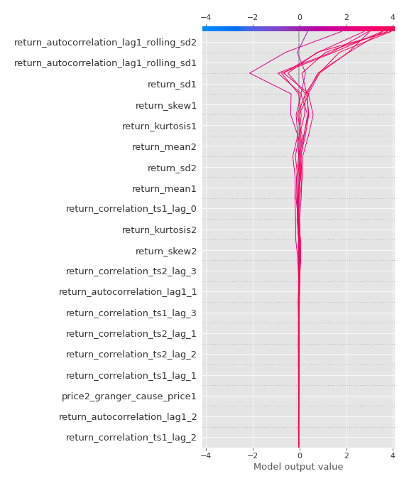
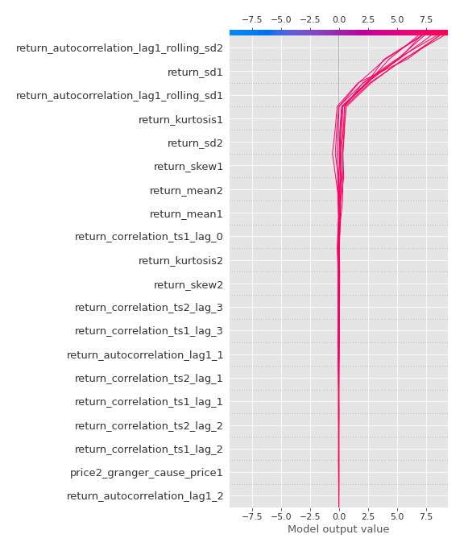

# Summary of 3_Linear

[<< Go back](../README.md)

## Logistic Regression (Linear)
- **n_jobs**: -1
- **explain_level**: 2

## Validation
 - **validation_type**: split
 - **train_ratio**: 0.75
 - **shuffle**: True
 - **stratify**: True

## Optimized metric
accuracy

## Training time

3.0 seconds

## Metric details
|           |     score |     threshold |
|:----------|----------:|--------------:|
| logloss   | 0.0242018 | nan           |
| auc       | 1         | nan           |
| f1        | 1         |   0.499182    |
| accuracy  | 1         |   0.499182    |
| precision | 1         |   0.499182    |
| recall    | 1         |   4.98892e-07 |
| mcc       | 1         |   0.499182    |

## Confusion matrix (at threshold=0.499182)
|                      |   Predicted as real |   Predicted as simulated |
|:---------------------|--------------------:|-------------------------:|
| Labeled as real      |                  44 |                        0 |
| Labeled as simulated |                   0 |                       43 |

## Learning curves

## Coefficients
| feature                                 |   Learner_1 |
|:----------------------------------------|------------:|
| return_autocorrelation_lag1_rolling_sd2 |   2.74046   |
| return_autocorrelation_lag1_rolling_sd1 |   2.11542   |
| return_sd1                              |   1.50576   |
| return_correlation_ts1_lag_0            |   0.247017  |
| return_autocorrelation_lag1_1           |   0.234107  |
| return_kurtosis2                        |   0.226384  |
| return_correlation_ts1_lag_1            |   0.217469  |
| return_correlation_ts2_lag_1            |   0.192949  |
| return_skew2                            |   0.116079  |
| return_sd2                              |   0.0868007 |
| return_correlation_ts1_lag_2            |   0.0552606 |
| price2_granger_cause_price1             |   0.0226734 |
| price1_granger_cause_price2             |   0.0125232 |
| return_autocorrelation_lag1_2           |  -0.0687377 |
| return_correlation_ts2_lag_2            |  -0.162478  |
| return_correlation_ts1_lag_3            |  -0.241119  |
| return_correlation_ts2_lag_3            |  -0.305619  |
| return_kurtosis1                        |  -0.404417  |
| return_skew1                            |  -0.516489  |
| intercept                               |  -0.552027  |
| return_mean1                            |  -0.610538  |
| return_mean2                            |  -0.966064  |

## Permutation-based Importance

## Confusion Matrix

## Normalized Confusion Matrix

## ROC Curve

## Kolmogorov-Smirnov Statistic

## Precision-Recall Curve

## Calibration Curve

## Cumulative Gains Curve

## Lift Curve

## SHAP Importance

## SHAP Dependence plots

### Dependence (Fold 1)

## SHAP Decision plots

### Top-10 Worst decisions for class 0 (Fold 1)

### Top-10 Best decisions for class 0 (Fold 1)

### Top-10 Worst decisions for class 1 (Fold 1)

### Top-10 Best decisions for class 1 (Fold 1)

[<< Go back](../README.md)
