# Exploratory Data Analysis

[<< Go back](../README.md)
## Feature : target
- **Feature type** : categorical
- **Missing** : 0.0%
- **Unique** : 2
- **Count** :347
- **Unique** :2
- **Top** :real
- **Freq** :175

## Feature : return_mean1
- **Feature type** : continous
- **Missing** : 0.0%
- **Unique** : 347
- **Count** :347.0
- **Mean** :-0.010277522605201206
- **Std** :0.12372530374668843
- **Min** :-0.40568072562939006
- **25%th Percentile** : -0.09720437364296064
- **50%th Percentile** : -0.006662359151521024
- **75%th Percentile** : 0.07847956922898745
- **Max** :0.3602793017097547

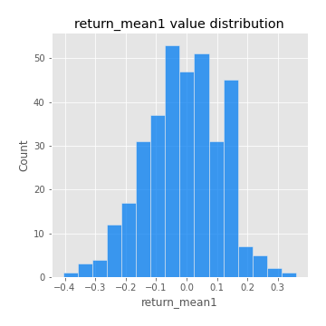
## Feature : return_mean2
- **Feature type** : continous
- **Missing** : 0.0%
- **Unique** : 347
- **Count** :347.0
- **Mean** :-0.054466031908351975
- **Std** :0.15480468219671953
- **Min** :-0.37658264502355066
- **25%th Percentile** : -0.17191715506678729
- **50%th Percentile** : -0.05927878593423213
- **75%th Percentile** : 0.05565008264950945
- **Max** :0.6801605239983173

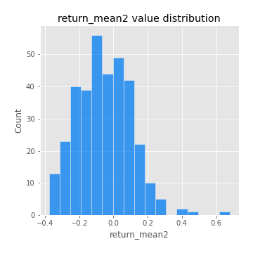
## Feature : return_sd1
- **Feature type** : continous
- **Missing** : 0.0%
- **Unique** : 347
- **Count** :347.0
- **Mean** :2.190770686303455
- **Std** :0.9552298135077935
- **Min** :0.8102430347636637
- **25%th Percentile** : 1.4481390480685699
- **50%th Percentile** : 1.9183550524056143
- **75%th Percentile** : 2.7431259348323795
- **Max** :6.2250221152925835

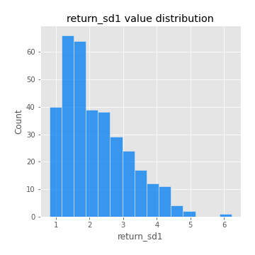
## Feature : return_sd2
- **Feature type** : continous
- **Missing** : 0.0%
- **Unique** : 347
- **Count** :347.0
- **Mean** :2.003315909430035
- **Std** :0.7229769966987439
- **Min** :0.8198779632289204
- **25%th Percentile** : 1.482839281008403
- **50%th Percentile** : 1.8173069012058551
- **75%th Percentile** : 2.437914301679908
- **Max** :5.095872619973981

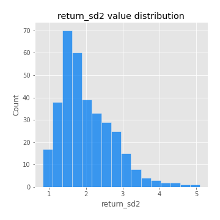
## Feature : return_skew1
- **Feature type** : continous
- **Missing** : 0.0%
- **Unique** : 347
- **Count** :347.0
- **Mean** :-0.3260128869418906
- **Std** :0.7548524665168546
- **Min** :-4.239645236578449
- **25%th Percentile** : -0.5384147297177844
- **50%th Percentile** : -0.3020458314519933
- **75%th Percentile** : 0.002338269020938021
- **Max** :2.3044235031125564

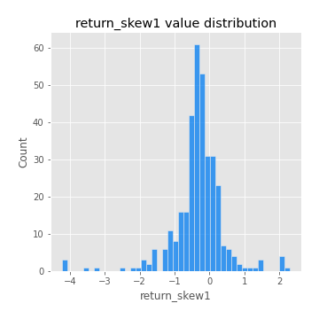
## Feature : return_skew2
- **Feature type** : continous
- **Missing** : 0.0%
- **Unique** : 347
- **Count** :347.0
- **Mean** :-0.39481316506022407
- **Std** :1.0855974111283906
- **Min** :-7.3762354994385335
- **25%th Percentile** : -0.604886240955071
- **50%th Percentile** : -0.2370166448619999
- **75%th Percentile** : 0.09011409208556573
- **Max** :4.0310261345618

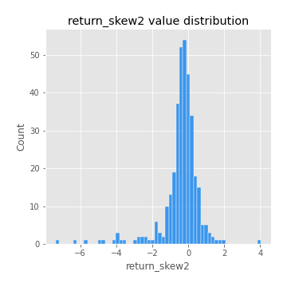
## Feature : return_kurtosis1
- **Feature type** : continous
- **Missing** : 0.0%
- **Unique** : 347
- **Count** :347.0
- **Mean** :4.030707581371552
- **Std** :5.305811865969146
- **Min** :-0.029320765513062952
- **25%th Percentile** : 1.4590345891578156
- **50%th Percentile** : 2.3628533596101517
- **75%th Percentile** : 4.317300819153779
- **Max** :40.485294874464934

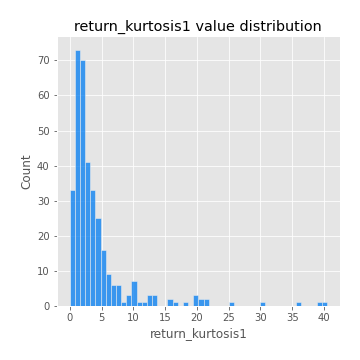
## Feature : return_kurtosis2
- **Feature type** : continous
- **Missing** : 0.0%
- **Unique** : 347
- **Count** :347.0
- **Mean** :6.077120160573765
- **Std** :9.530483152255087
- **Min** :-0.1693240760286967
- **25%th Percentile** : 1.957710306529368
- **50%th Percentile** : 3.46253879069592
- **75%th Percentile** : 6.095838001345236
- **Max** :94.01659180149953

## Feature : return_autocorrelation_lag1_1
- **Feature type** : continous
- **Missing** : 0.0%
- **Unique** : 347
- **Count** :347.0
- **Mean** :-0.011493397805010136
- **Std** :0.07487665966678177
- **Min** :-0.21241286613111138
- **25%th Percentile** : -0.06129757040701772
- **50%th Percentile** : -0.008964989677899677
- **75%th Percentile** : 0.038979106969988374
- **Max** :0.21312208764185156

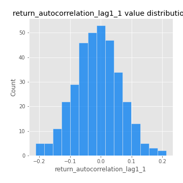
## Feature : return_autocorrelation_lag1_2
- **Feature type** : continous
- **Missing** : 0.0%
- **Unique** : 347
- **Count** :347.0
- **Mean** :-0.007140912815433235
- **Std** :0.08626381927071498
- **Min** :-0.23610967044364195
- **25%th Percentile** : -0.061939970225242856
- **50%th Percentile** : -0.008048966802515161
- **75%th Percentile** : 0.05567191313444929
- **Max** :0.31376540065971814

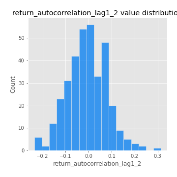
## Feature : return_autocorrelation_lag1_rolling_sd1
- **Feature type** : continous
- **Missing** : 0.0%
- **Unique** : 347
- **Count** :347.0
- **Mean** :0.972914877750573
- **Std** :0.01836137337413657
- **Min** :0.9069675055307085
- **25%th Percentile** : 0.9616916652964649
- **50%th Percentile** : 0.9755300457893429
- **75%th Percentile** : 0.9892774533263355
- **Max** :0.9968990522514593

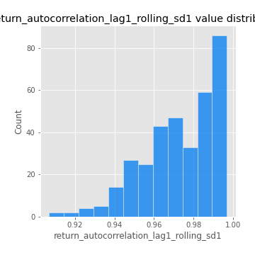
## Feature : return_autocorrelation_lag1_rolling_sd2
- **Feature type** : continous
- **Missing** : 0.0%
- **Unique** : 347
- **Count** :347.0
- **Mean** :0.9701588969037458
- **Std** :0.021067915724498704
- **Min** :0.8849206290342239
- **25%th Percentile** : 0.9555560973126282
- **50%th Percentile** : 0.9742577405054105
- **75%th Percentile** : 0.9882153272141521
- **Max** :0.9953736675316087

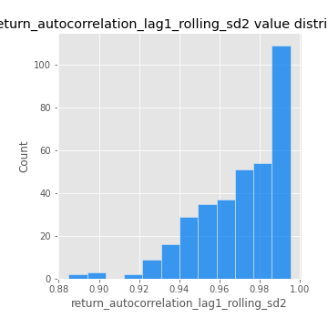
## Feature : return_correlation_ts1_lag_0
- **Feature type** : continous
- **Missing** : 0.0%
- **Unique** : 347
- **Count** :347.0
- **Mean** :0.4662127390019583
- **Std** :0.2361762499848379
- **Min** :-0.10256711281206837
- **25%th Percentile** : 0.2923126924473435
- **50%th Percentile** : 0.46123385782678816
- **75%th Percentile** : 0.6792078060944661
- **Max** :0.8572445570279289

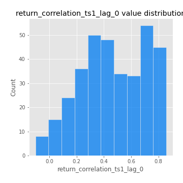
## Feature : return_correlation_ts1_lag_1
- **Feature type** : continous
- **Missing** : 0.0%
- **Unique** : 347
- **Count** :347.0
- **Mean** :-0.0073919388843555695
- **Std** :0.06758643553960655
- **Min** :-0.2322875918335447
- **25%th Percentile** : -0.04748603888781151
- **50%th Percentile** : -0.0027098255381353517
- **75%th Percentile** : 0.036518526241803545
- **Max** :0.21969394034909043

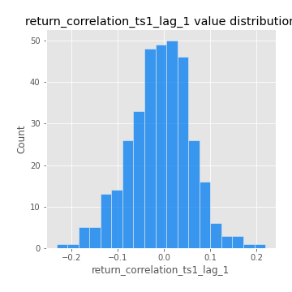
## Feature : return_correlation_ts1_lag_2
- **Feature type** : continous
- **Missing** : 0.0%
- **Unique** : 347
- **Count** :347.0
- **Mean** :-0.01037573274459542
- **Std** :0.07133701174456007
- **Min** :-0.2500368363110005
- **25%th Percentile** : -0.05583842283727174
- **50%th Percentile** : -0.015339071938014422
- **75%th Percentile** : 0.037966124404425886
- **Max** :0.28232781594691314

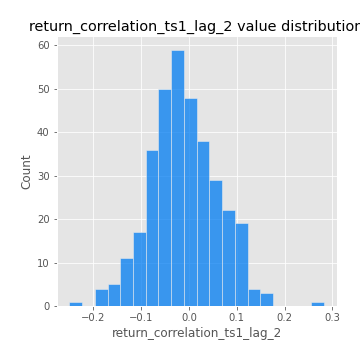
## Feature : return_correlation_ts1_lag_3
- **Feature type** : continous
- **Missing** : 0.0%
- **Unique** : 347
- **Count** :347.0
- **Mean** :0.0010109036934905417
- **Std** :0.07148989292843123
- **Min** :-0.21147540839842804
- **25%th Percentile** : -0.042522385923612925
- **50%th Percentile** : 0.00537649469466002
- **75%th Percentile** : 0.048124314361353025
- **Max** :0.23808054096877584

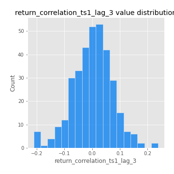
## Feature : return_correlation_ts2_lag_1
- **Feature type** : continous
- **Missing** : 0.0%
- **Unique** : 347
- **Count** :347.0
- **Mean** :0.0034197428666364184
- **Std** :0.07715920168226743
- **Min** :-0.22939129057906532
- **25%th Percentile** : -0.05021734092889575
- **50%th Percentile** : -0.0022497363921198995
- **75%th Percentile** : 0.05471741475328333
- **Max** :0.3425036902091001

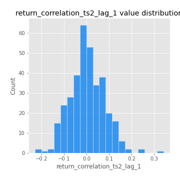
## Feature : return_correlation_ts2_lag_2
- **Feature type** : continous
- **Missing** : 0.0%
- **Unique** : 347
- **Count** :347.0
- **Mean** :-0.007591968358151119
- **Std** :0.07011300699620295
- **Min** :-0.2757460186107768
- **25%th Percentile** : -0.04889474661882726
- **50%th Percentile** : -0.0063072060080509185
- **75%th Percentile** : 0.03702912331410227
- **Max** :0.1668209648754713

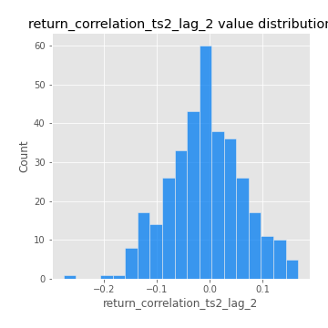
## Feature : return_correlation_ts2_lag_3
- **Feature type** : continous
- **Missing** : 0.0%
- **Unique** : 347
- **Count** :347.0
- **Mean** :0.009798958903587488
- **Std** :0.06691878842061591
- **Min** :-0.18918407507290744
- **25%th Percentile** : -0.03562205515525409
- **50%th Percentile** : 0.009917298712859283
- **75%th Percentile** : 0.05506776448283067
- **Max** :0.20963003818284676

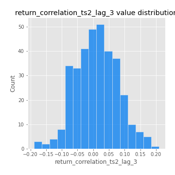
## Feature : price2_granger_cause_price1
- **Feature type** : continous
- **Missing** : 0.0%
- **Unique** : 347
- **Count** :347.0
- **Mean** :0.2616880085286625
- **Std** :0.2866177789812964
- **Min** :2.4312048970873696e-09
- **25%th Percentile** : 0.019295127324834647
- **50%th Percentile** : 0.16443057479727008
- **75%th Percentile** : 0.4511252512030761
- **Max** :0.9975276082587359

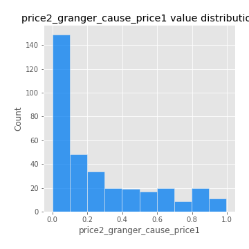
## Feature : price1_granger_cause_price2
- **Feature type** : continous
- **Missing** : 0.0%
- **Unique** : 347
- **Count** :347.0
- **Mean** :0.27177900439150815
- **Std** :0.28286261307998317
- **Min** :1.2012269232170316e-11
- **25%th Percentile** : 0.03641295377465069
- **50%th Percentile** : 0.17181146593247254
- **75%th Percentile** : 0.4294682450998156
- **Max** :0.9871292066441198

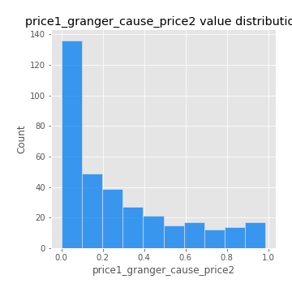

[<< Go back](../README.md)
