# Summary of 3_Linear

[<< Go back](../README.md)

## Logistic Regression (Linear)
- **n_jobs**: -1
- **explain_level**: 2

## Validation
 - **validation_type**: split
 - **train_ratio**: 0.75
 - **shuffle**: True
 - **stratify**: True

## Optimized metric
accuracy

## Training time

3.2 seconds

## Metric details
|           |     score |     threshold |
|:----------|----------:|--------------:|
| logloss   | 0.0791084 | nan           |
| auc       | 0.997349  | nan           |
| f1        | 0.97619   |   0.379702    |
| accuracy  | 0.977011  |   0.379702    |
| precision | 1         |   0.990144    |
| recall    | 1         |   5.14117e-07 |
| mcc       | 0.955004  |   0.379702    |

## Confusion matrix (at threshold=0.379702)
|                      |   Predicted as real |   Predicted as simulated |
|:---------------------|--------------------:|-------------------------:|
| Labeled as real      |                  44 |                        2 |
| Labeled as simulated |                   0 |                       41 |

## Learning curves
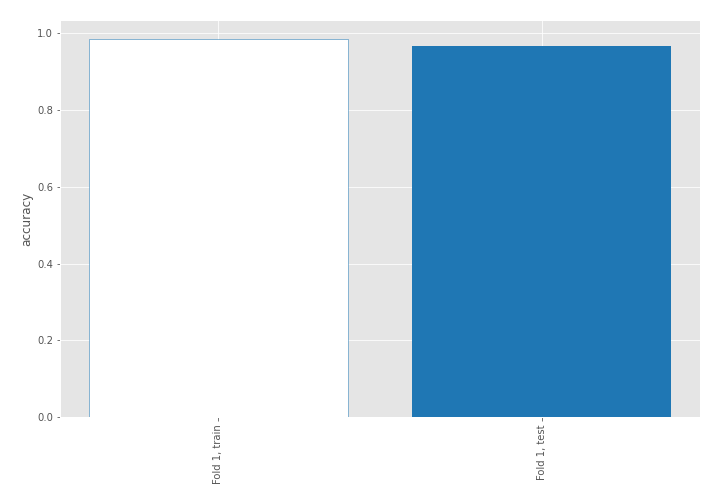

## Coefficients
| feature                                 |   Learner_1 |
|:----------------------------------------|------------:|
| return_autocorrelation_lag1_rolling_sd2 |   2.68106   |
| return_autocorrelation_lag1_rolling_sd1 |   2.40562   |
| return_sd1                              |   0.98781   |
| return_skew1                            |   0.321014  |
| return_skew2                            |   0.310651  |
| price1_granger_cause_price2             |   0.295226  |
| return_correlation_ts1_lag_1            |   0.191129  |
| return_autocorrelation_lag1_1           |   0.180107  |
| return_correlation_ts1_lag_2            |   0.161432  |
| return_sd2                              |   0.102923  |
| price2_granger_cause_price1             |   0.0563286 |
| return_correlation_ts2_lag_2            |   0.0337492 |
| return_autocorrelation_lag1_2           |  -0.0421565 |
| return_kurtosis2                        |  -0.103143  |
| return_correlation_ts2_lag_1            |  -0.116657  |
| return_correlation_ts1_lag_3            |  -0.174646  |
| return_correlation_ts1_lag_0            |  -0.184852  |
| return_kurtosis1                        |  -0.339195  |
| return_correlation_ts2_lag_3            |  -0.346137  |
| return_mean1                            |  -0.39125   |
| return_mean2                            |  -0.90481   |
| intercept                               |  -0.997578  |

## Permutation-based Importance
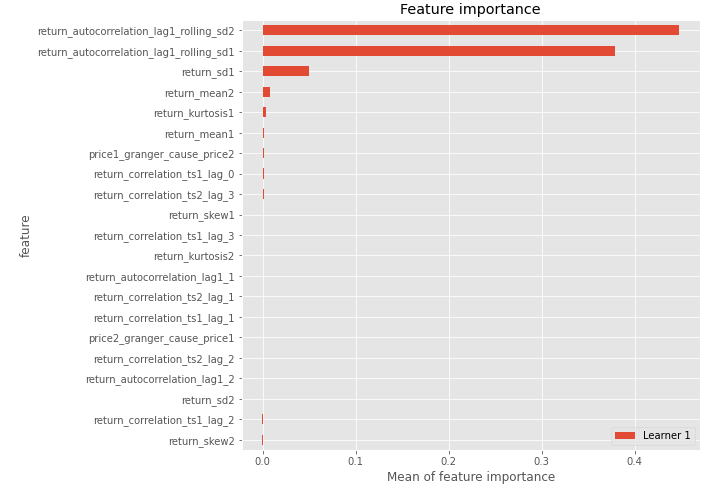
## Confusion Matrix

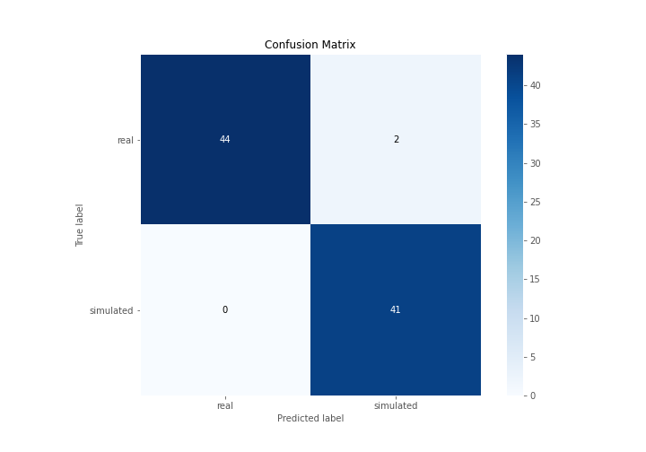

## Normalized Confusion Matrix

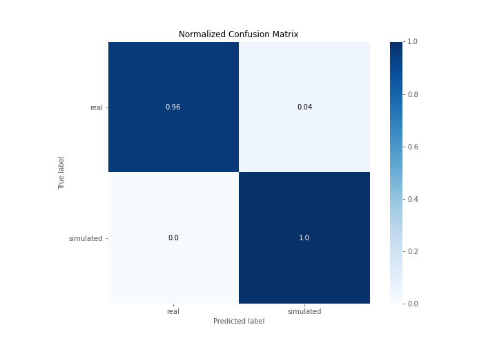

## ROC Curve

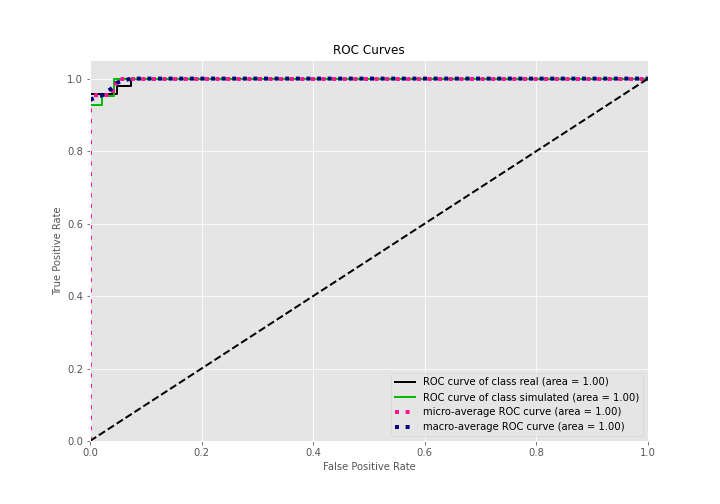

## Kolmogorov-Smirnov Statistic

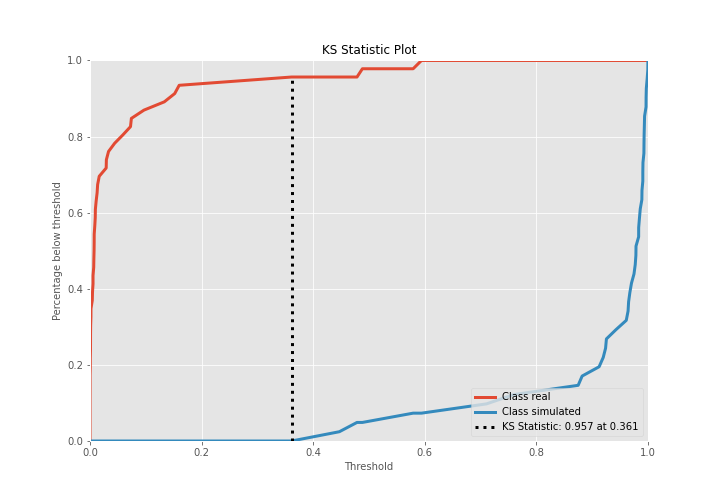

## Precision-Recall Curve

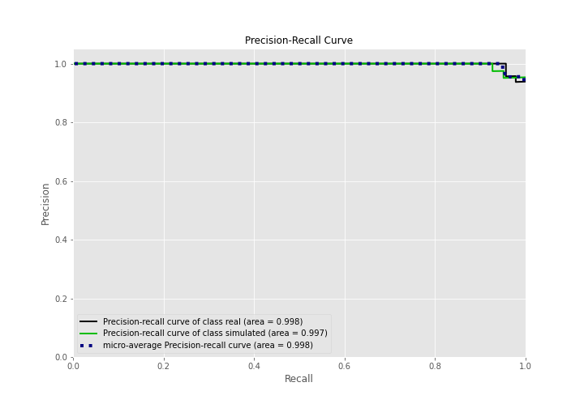

## Calibration Curve

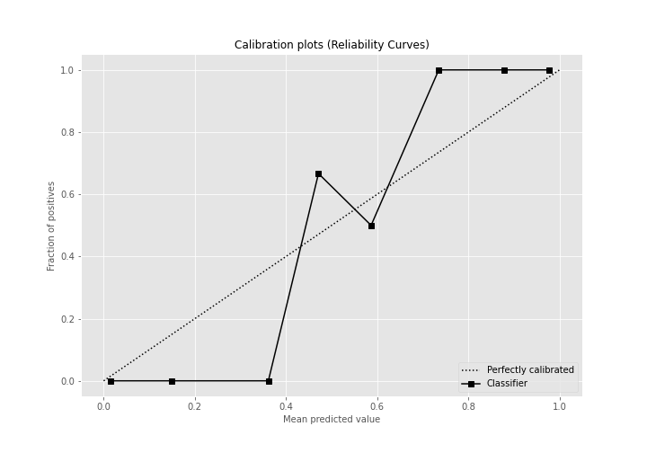

## Cumulative Gains Curve

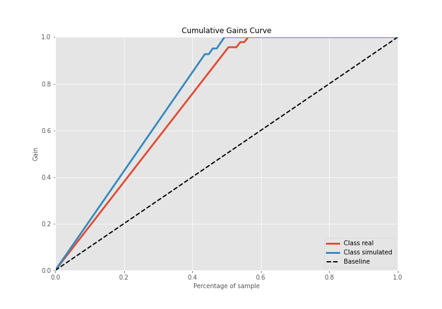

## Lift Curve

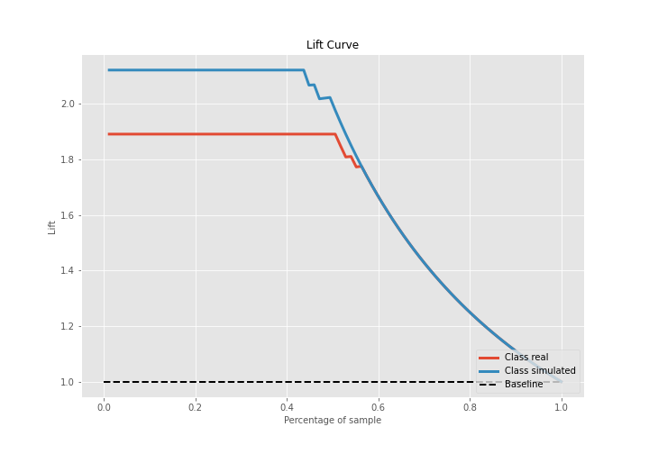

## SHAP Importance
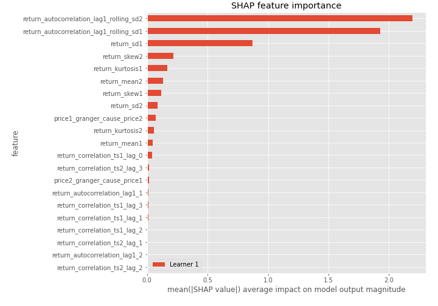

## SHAP Dependence plots

### Dependence (Fold 1)
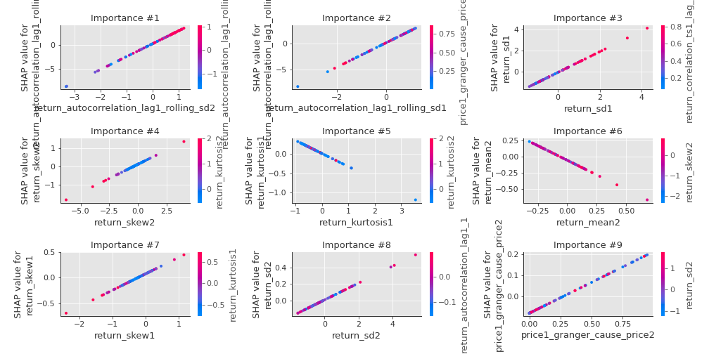

## SHAP Decision plots

### Top-10 Worst decisions for class 0 (Fold 1)
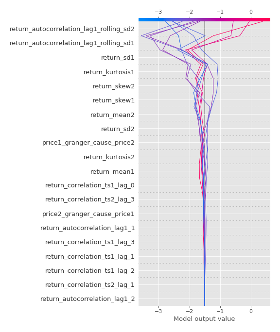
### Top-10 Best decisions for class 0 (Fold 1)
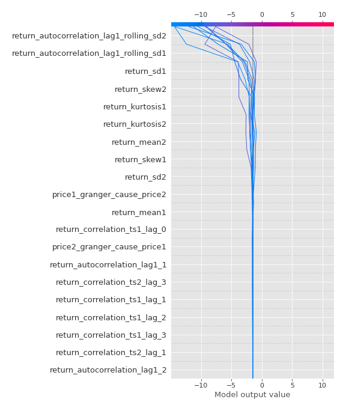
### Top-10 Worst decisions for class 1 (Fold 1)
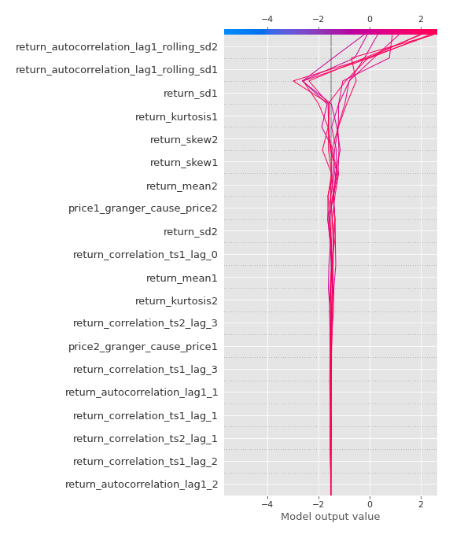
### Top-10 Best decisions for class 1 (Fold 1)
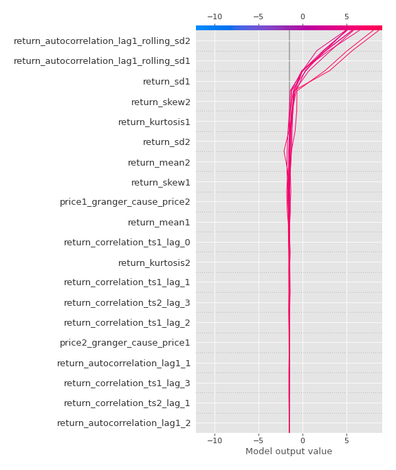

[<< Go back](../README.md)
