# Exploratory Data Analysis

[<< Go back](../README.md)
## Feature : target
- **Feature type** : categorical
- **Missing** : 0.0%
- **Unique** : 2
- **Count** :347
- **Unique** :2
- **Top** :real
- **Freq** :183

## Feature : return_mean1
- **Feature type** : continous
- **Missing** : 0.0%
- **Unique** : 347
- **Count** :347.0
- **Mean** :-0.005852828312700359
- **Std** :0.13331502406378898
- **Min** :-0.40467795536655726
- **25%th Percentile** : -0.10387202305724358
- **50%th Percentile** : -0.0035230712911274013
- **75%th Percentile** : 0.09235264893051519
- **Max** :0.4960776323067264

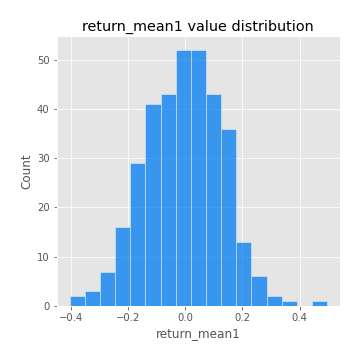
## Feature : return_mean2
- **Feature type** : continous
- **Missing** : 0.0%
- **Unique** : 347
- **Count** :347.0
- **Mean** :-0.05476567353934609
- **Std** :0.1502000332933513
- **Min** :-0.4301744123380726
- **25%th Percentile** : -0.18132880486032768
- **50%th Percentile** : -0.06228866352368745
- **75%th Percentile** : 0.05565008264950945
- **Max** :0.6801605239983173

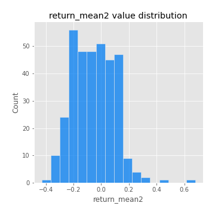
## Feature : return_sd1
- **Feature type** : continous
- **Missing** : 0.0%
- **Unique** : 347
- **Count** :347.0
- **Mean** :2.179178162232665
- **Std** :0.9325648356312969
- **Min** :0.8733078831717243
- **25%th Percentile** : 1.4461333059034707
- **50%th Percentile** : 1.9086610333819334
- **75%th Percentile** : 2.775906038529615
- **Max** :6.040666633273632

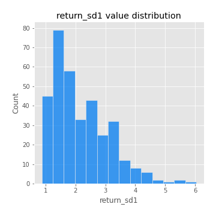
## Feature : return_sd2
- **Feature type** : continous
- **Missing** : 0.0%
- **Unique** : 347
- **Count** :347.0
- **Mean** :1.974704849225534
- **Std** :0.7153004515417041
- **Min** :0.8198779632289204
- **25%th Percentile** : 1.4590863461789243
- **50%th Percentile** : 1.8170412310799373
- **75%th Percentile** : 2.340147526832618
- **Max** :5.568816626028836

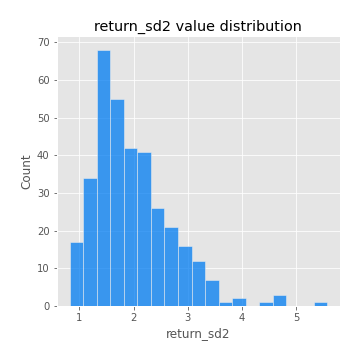
## Feature : return_skew1
- **Feature type** : continous
- **Missing** : 0.0%
- **Unique** : 347
- **Count** :347.0
- **Mean** :-0.24155333008966004
- **Std** :0.6101718541043623
- **Min** :-2.5068500114696386
- **25%th Percentile** : -0.5190834750026512
- **50%th Percentile** : -0.2677566513833697
- **75%th Percentile** : 0.04030037875138681
- **Max** :2.351757728252051

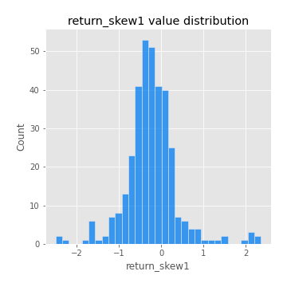
## Feature : return_skew2
- **Feature type** : continous
- **Missing** : 0.0%
- **Unique** : 347
- **Count** :347.0
- **Mean** :-0.3752707194049776
- **Std** :1.0592563952389553
- **Min** :-7.3762354994385335
- **25%th Percentile** : -0.6305437776288487
- **50%th Percentile** : -0.27353051162651126
- **75%th Percentile** : 0.07466480073888168
- **Max** :4.1920266082732045

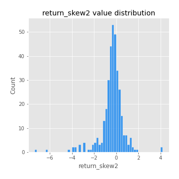
## Feature : return_kurtosis1
- **Feature type** : continous
- **Missing** : 0.0%
- **Unique** : 347
- **Count** :347.0
- **Mean** :3.433168590311706
- **Std** :3.732844944140659
- **Min** :-0.06351720637621838
- **25%th Percentile** : 1.455314783079141
- **50%th Percentile** : 2.202724504748399
- **75%th Percentile** : 3.973988456085457
- **Max** :23.612665658846073

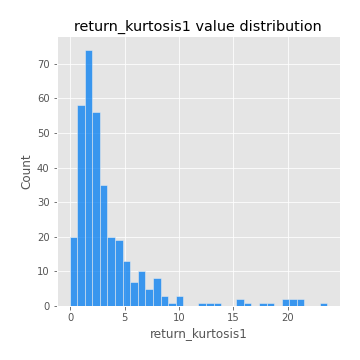
## Feature : return_kurtosis2
- **Feature type** : continous
- **Missing** : 0.0%
- **Unique** : 347
- **Count** :347.0
- **Mean** :6.0124025604862394
- **Std** :8.936122964942237
- **Min** :-0.1693240760286967
- **25%th Percentile** : 1.8435902640925796
- **50%th Percentile** : 3.3440047527955046
- **75%th Percentile** : 6.128566378253842
- **Max** :94.01659180149953

## Feature : return_autocorrelation_lag1_1
- **Feature type** : continous
- **Missing** : 0.0%
- **Unique** : 347
- **Count** :347.0
- **Mean** :-0.013055307421186128
- **Std** :0.07515003723230745
- **Min** :-0.3124561711080374
- **25%th Percentile** : -0.06241599474200042
- **50%th Percentile** : -0.01768217085901171
- **75%th Percentile** : 0.030264040449362817
- **Max** :0.2362441692188797

## Feature : return_autocorrelation_lag1_2
- **Feature type** : continous
- **Missing** : 0.0%
- **Unique** : 347
- **Count** :347.0
- **Mean** :-0.0007045940934092757
- **Std** :0.07850584944553478
- **Min** :-0.24075988299999124
- **25%th Percentile** : -0.05244048736884356
- **50%th Percentile** : 0.00042047166591331413
- **75%th Percentile** : 0.05421360730370428
- **Max** :0.19866926159912862

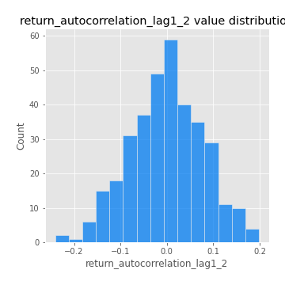
## Feature : return_autocorrelation_lag1_rolling_sd1
- **Feature type** : continous
- **Missing** : 0.0%
- **Unique** : 347
- **Count** :347.0
- **Mean** :0.9733259365189865
- **Std** :0.01836691778283033
- **Min** :0.8703309691717807
- **25%th Percentile** : 0.9618459593063922
- **50%th Percentile** : 0.9767187233288651
- **75%th Percentile** : 0.9893503472310887
- **Max** :0.996804669388559

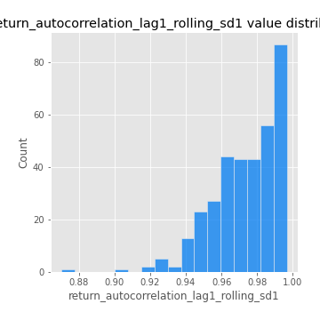
## Feature : return_autocorrelation_lag1_rolling_sd2
- **Feature type** : continous
- **Missing** : 0.0%
- **Unique** : 347
- **Count** :347.0
- **Mean** :0.9697901158863483
- **Std** :0.020455893200182897
- **Min** :0.8849206290342239
- **25%th Percentile** : 0.9558543984907947
- **50%th Percentile** : 0.9740513922742877
- **75%th Percentile** : 0.9873223069232703
- **Max** :0.9954336442162943

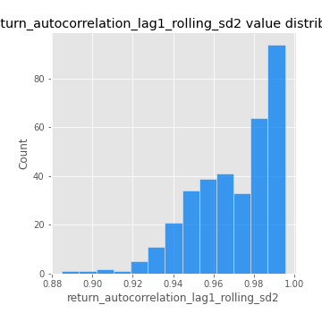
## Feature : return_correlation_ts1_lag_0
- **Feature type** : continous
- **Missing** : 0.0%
- **Unique** : 347
- **Count** :347.0
- **Mean** :0.4631165950272987
- **Std** :0.2372732929523496
- **Min** :-0.15688443222032616
- **25%th Percentile** : 0.2910714441032257
- **50%th Percentile** : 0.4542377257201418
- **75%th Percentile** : 0.6932151267957516
- **Max** :0.9937227277077512

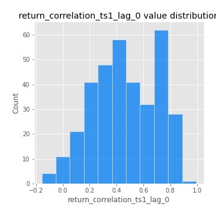
## Feature : return_correlation_ts1_lag_1
- **Feature type** : continous
- **Missing** : 0.0%
- **Unique** : 347
- **Count** :347.0
- **Mean** :-0.005673223478052328
- **Std** :0.07357911096730539
- **Min** :-0.31929611923363405
- **25%th Percentile** : -0.05295182347773045
- **50%th Percentile** : -0.00024243483539062766
- **75%th Percentile** : 0.04031095543578459
- **Max** :0.2056223156583709

## Feature : return_correlation_ts1_lag_2
- **Feature type** : continous
- **Missing** : 0.0%
- **Unique** : 347
- **Count** :347.0
- **Mean** :-0.007355065942845265
- **Std** :0.07317818184421614
- **Min** :-0.21094329360671052
- **25%th Percentile** : -0.05439661404362849
- **50%th Percentile** : -0.011098917440681722
- **75%th Percentile** : 0.03921780444020671
- **Max** :0.3002150030527118

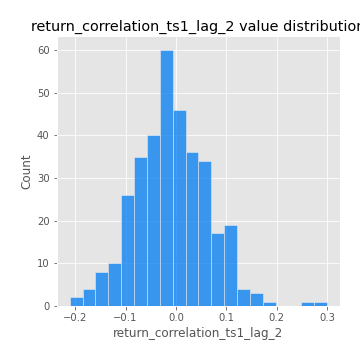
## Feature : return_correlation_ts1_lag_3
- **Feature type** : continous
- **Missing** : 0.0%
- **Unique** : 347
- **Count** :347.0
- **Mean** :-0.0011499963482177026
- **Std** :0.07639489061573856
- **Min** :-0.21451827912552632
- **25%th Percentile** : -0.051800901605655814
- **50%th Percentile** : 0.0019468898316459323
- **75%th Percentile** : 0.05328916122552405
- **Max** :0.23808054096877584

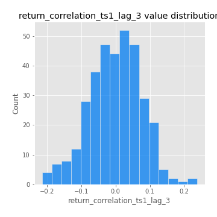
## Feature : return_correlation_ts2_lag_1
- **Feature type** : continous
- **Missing** : 0.0%
- **Unique** : 347
- **Count** :347.0
- **Mean** :-0.00019960313340502384
- **Std** :0.06870072016984766
- **Min** :-0.3022921617450171
- **25%th Percentile** : -0.049740901849283856
- **50%th Percentile** : 0.0006455642291732153
- **75%th Percentile** : 0.047816635820334574
- **Max** :0.18684400992271985

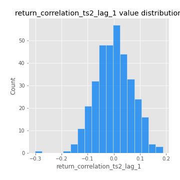
## Feature : return_correlation_ts2_lag_2
- **Feature type** : continous
- **Missing** : 0.0%
- **Unique** : 347
- **Count** :347.0
- **Mean** :-0.009135604081733173
- **Std** :0.07213897491151088
- **Min** :-0.2757460186107768
- **25%th Percentile** : -0.054418831007775476
- **50%th Percentile** : -0.007283448958688956
- **75%th Percentile** : 0.03210969810267472
- **Max** :0.21795918367705341

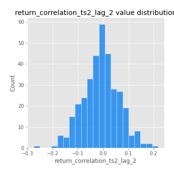
## Feature : return_correlation_ts2_lag_3
- **Feature type** : continous
- **Missing** : 0.0%
- **Unique** : 347
- **Count** :347.0
- **Mean** :0.0036923501913629225
- **Std** :0.0701638860161252
- **Min** :-0.20406230442862025
- **25%th Percentile** : -0.042975045623624177
- **50%th Percentile** : 0.004729976346413592
- **75%th Percentile** : 0.049288431861580106
- **Max** :0.21406786267171943

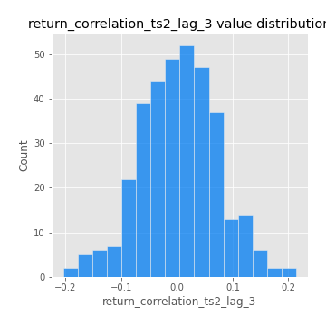
## Feature : price2_granger_cause_price1
- **Feature type** : continous
- **Missing** : 0.0%
- **Unique** : 347
- **Count** :347.0
- **Mean** :0.27096087585957
- **Std** :0.29609424096041415
- **Min** :8.654601019914943e-09
- **25%th Percentile** : 0.027862640853136243
- **50%th Percentile** : 0.1309755643179102
- **75%th Percentile** : 0.472275606672243
- **Max** :0.9898380228448623

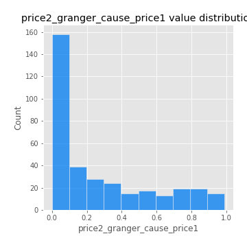
## Feature : price1_granger_cause_price2
- **Feature type** : continous
- **Missing** : 0.0%
- **Unique** : 347
- **Count** :347.0
- **Mean** :0.28866394741370444
- **Std** :0.28687785763366197
- **Min** :1.2109694592222877e-07
- **25%th Percentile** : 0.03841493937208408
- **50%th Percentile** : 0.18954771540239154
- **75%th Percentile** : 0.47543681049864916
- **Max** :0.9771607710702622

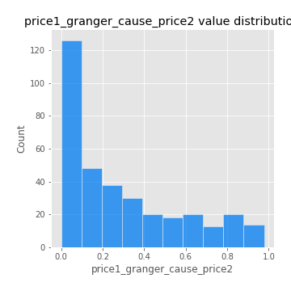

[<< Go back](../README.md)
