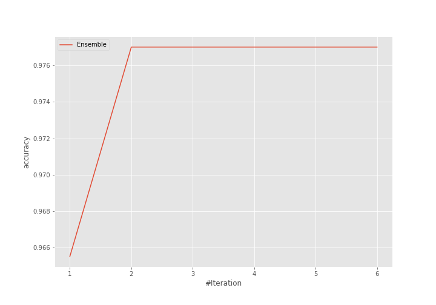
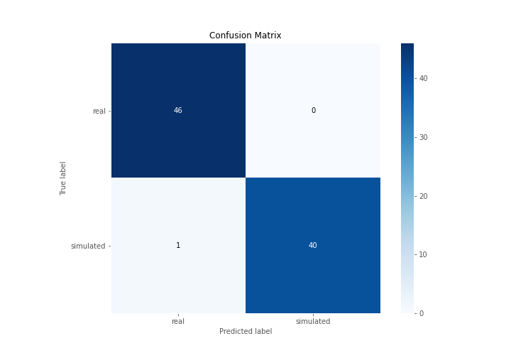
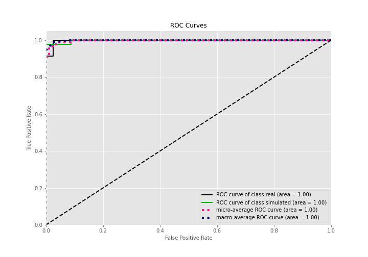
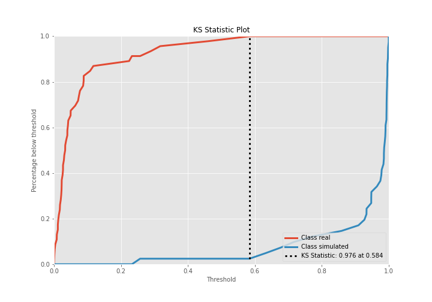
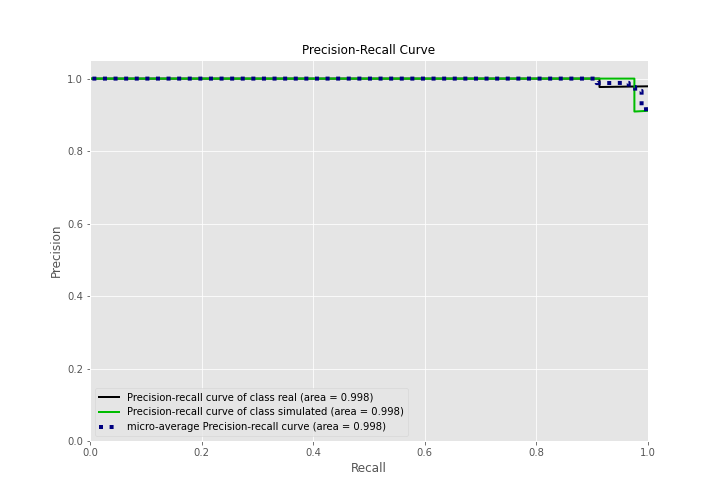
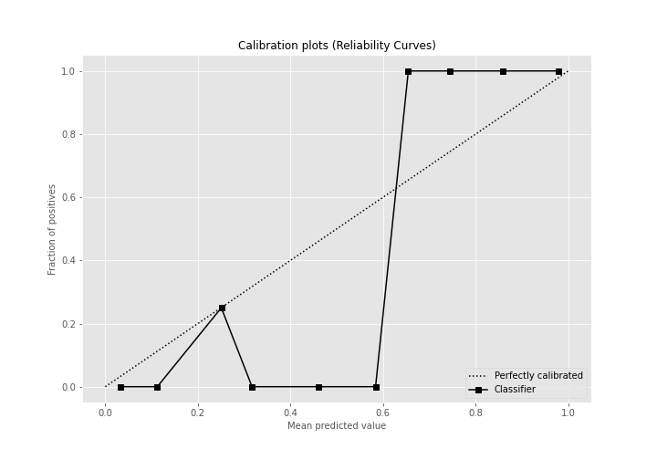
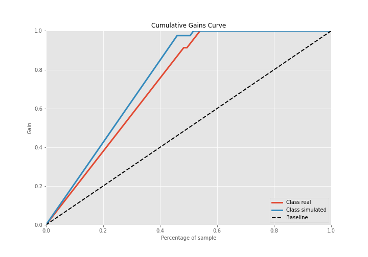
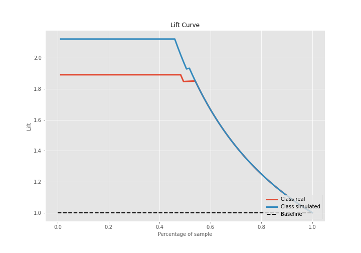

# Summary of Ensemble

[<< Go back](../README.md)

## Ensemble structure
| Model                   |   Weight |
|:------------------------|---------:|
| 3_Linear                |        1 |
| 5_Default_NeuralNetwork |        1 |

## Metric details
|           |     score |     threshold |
|:----------|----------:|--------------:|
| logloss   | 0.0917846 | nan           |
| auc       | 0.997879  | nan           |
| f1        | 0.987654  |   0.614198    |
| accuracy  | 0.988506  |   0.614198    |
| precision | 1         |   0.991572    |
| recall    | 1         |   0.000317733 |
| mcc       | 0.977165  |   0.614198    |

## Confusion matrix (at threshold=0.614198)
|                      |   Predicted as real |   Predicted as simulated |
|:---------------------|--------------------:|-------------------------:|
| Labeled as real      |                  46 |                        0 |
| Labeled as simulated |                   1 |                       40 |

## Learning curves

## Confusion Matrix

## Normalized Confusion Matrix

## ROC Curve

## Kolmogorov-Smirnov Statistic

## Precision-Recall Curve

## Calibration Curve

## Cumulative Gains Curve

## Lift Curve

[<< Go back](../README.md)
