# Summary of 3_Linear

[<< Go back](../README.md)

## Logistic Regression (Linear)
- **n_jobs**: -1
- **explain_level**: 2

## Validation
 - **validation_type**: split
 - **train_ratio**: 0.75
 - **shuffle**: True
 - **stratify**: True

## Optimized metric
accuracy

## Training time

3.7 seconds

## Metric details
|           |    score |     threshold |
|:----------|---------:|--------------:|
| logloss   | 0.131162 | nan           |
| auc       | 0.989958 | nan           |
| f1        | 0.976744 |   0.37672     |
| accuracy  | 0.977011 |   0.37672     |
| precision | 1        |   0.501229    |
| recall    | 1        |   3.30496e-06 |
| mcc       | 0.95505  |   0.37672     |

## Confusion matrix (at threshold=0.37672)
|                      |   Predicted as real |   Predicted as simulated |
|:---------------------|--------------------:|-------------------------:|
| Labeled as real      |                  43 |                        0 |
| Labeled as simulated |                   2 |                       42 |

## Learning curves

## Coefficients
| feature                                 |   Learner_1 |
|:----------------------------------------|------------:|
| return_autocorrelation_lag1_rolling_sd1 |   2.76022   |
| return_autocorrelation_lag1_rolling_sd2 |   2.59809   |
| return_sd1                              |   0.794146  |
| price1_granger_cause_price2             |   0.375048  |
| return_sd2                              |   0.316159  |
| return_correlation_ts1_lag_2            |   0.284564  |
| return_skew2                            |   0.249016  |
| return_skew1                            |   0.236546  |
| return_kurtosis2                        |   0.188174  |
| return_correlation_ts2_lag_2            |   0.072063  |
| return_correlation_ts1_lag_1            |   0.0582016 |
| return_autocorrelation_lag1_1           |   0.047175  |
| return_autocorrelation_lag1_2           |   0.0255516 |
| return_correlation_ts2_lag_1            |  -0.16791   |
| return_correlation_ts1_lag_3            |  -0.220443  |
| return_correlation_ts2_lag_3            |  -0.224859  |
| price2_granger_cause_price1             |  -0.359367  |
| return_correlation_ts1_lag_0            |  -0.485585  |
| intercept                               |  -0.509325  |
| return_mean1                            |  -0.571882  |
| return_kurtosis1                        |  -0.729591  |
| return_mean2                            |  -0.970665  |

## Permutation-based Importance
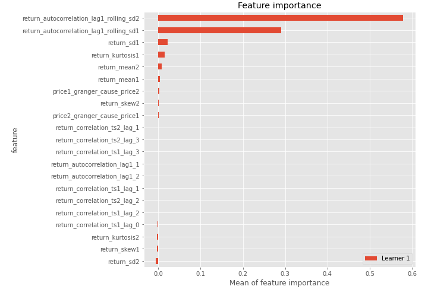
## Confusion Matrix

## Normalized Confusion Matrix

## ROC Curve

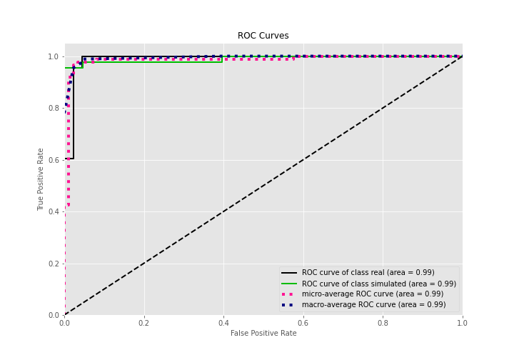

## Kolmogorov-Smirnov Statistic

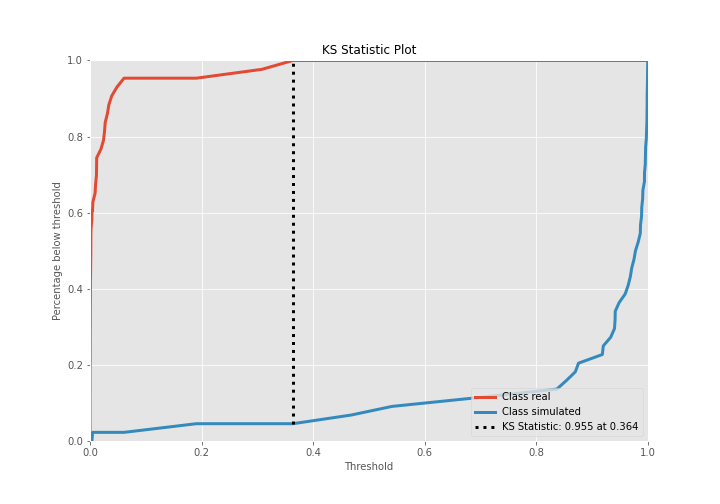

## Precision-Recall Curve

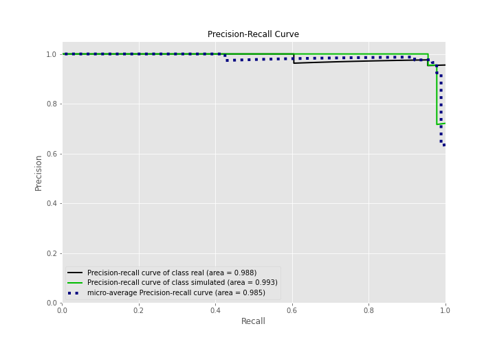

## Calibration Curve

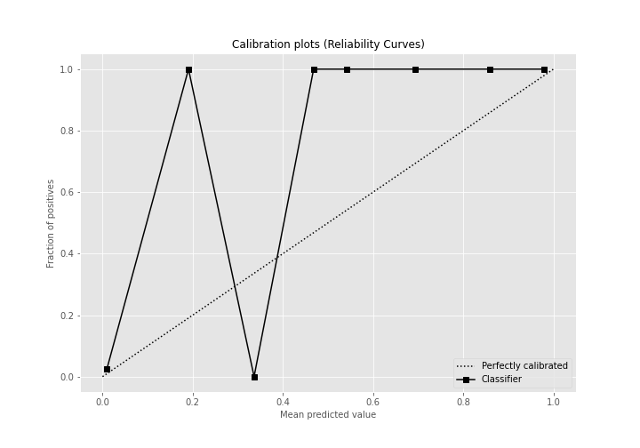

## Cumulative Gains Curve

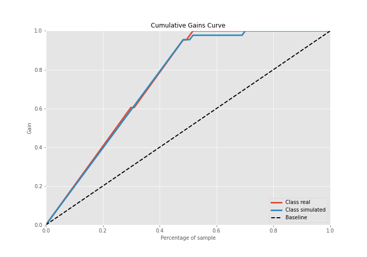

## Lift Curve

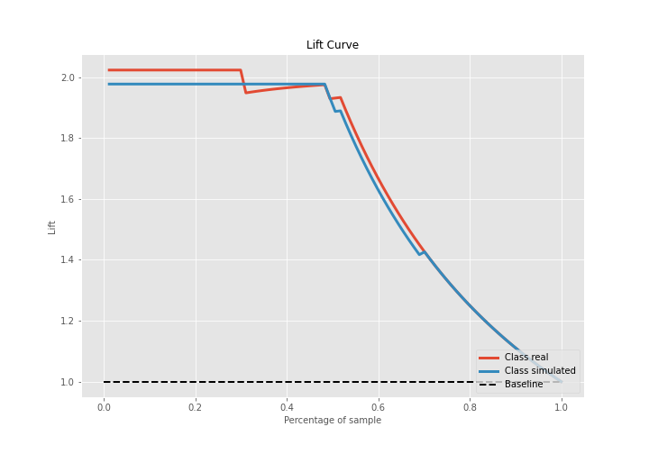

## SHAP Importance
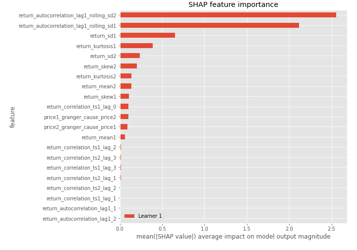

## SHAP Dependence plots

### Dependence (Fold 1)
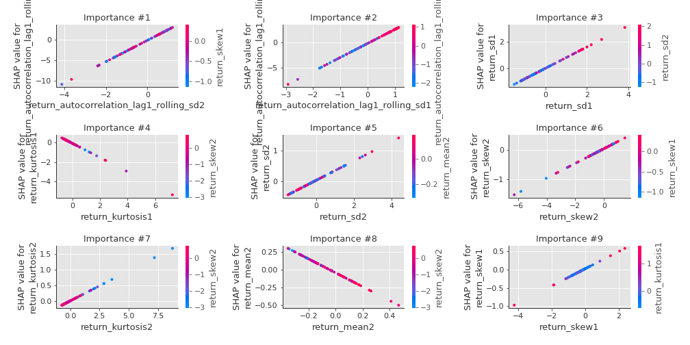

## SHAP Decision plots

### Top-10 Worst decisions for class 0 (Fold 1)
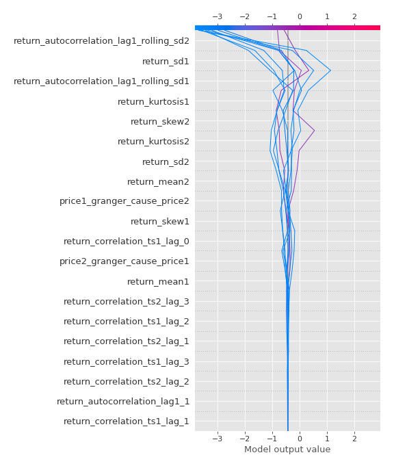
### Top-10 Best decisions for class 0 (Fold 1)
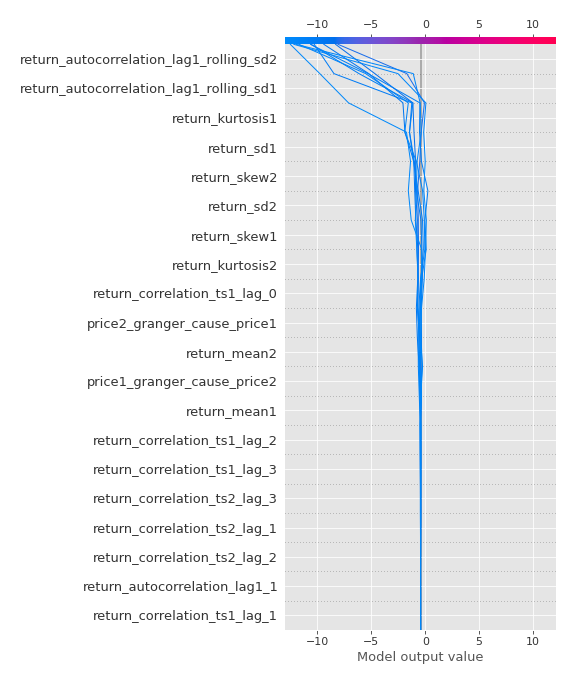
### Top-10 Worst decisions for class 1 (Fold 1)
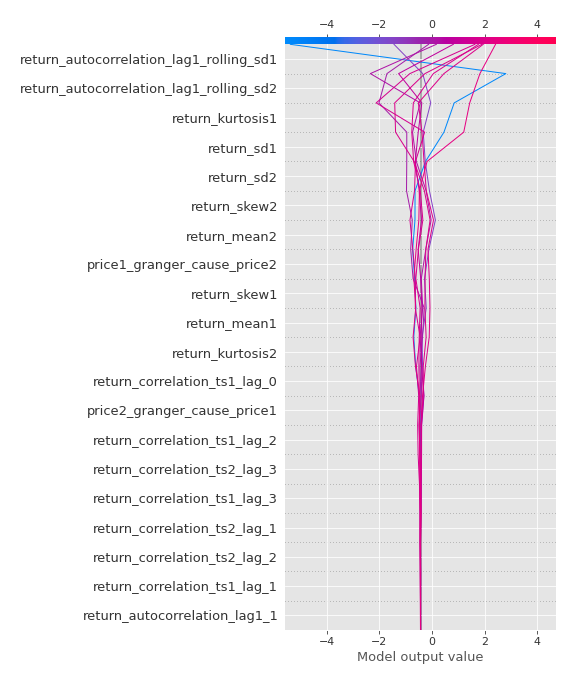
### Top-10 Best decisions for class 1 (Fold 1)
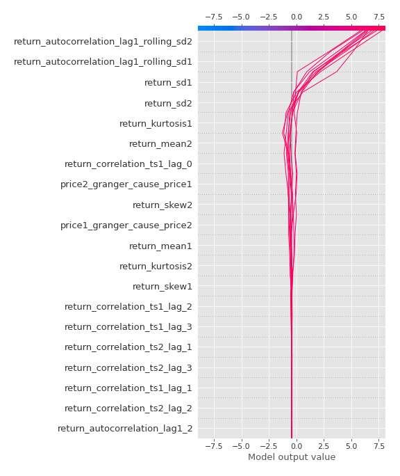

[<< Go back](../README.md)
