# Exploratory Data Analysis

[<< Go back](../README.md)
## Feature : target
- **Feature type** : categorical
- **Missing** : 0.0%
- **Unique** : 2
- **Count** :347
- **Unique** :2
- **Top** :simulated
- **Freq** :176

## Feature : return_mean1
- **Feature type** : continous
- **Missing** : 0.0%
- **Unique** : 347
- **Count** :347.0
- **Mean** :-0.0077588507879086345
- **Std** :0.1327179186609439
- **Min** :-0.39630470944512536
- **25%th Percentile** : -0.11340003753686004
- **50%th Percentile** : -0.002462735873350752
- **75%th Percentile** : 0.09006328492257537
- **Max** :0.54796441394019

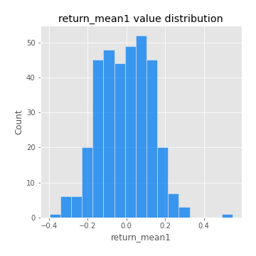
## Feature : return_mean2
- **Feature type** : continous
- **Missing** : 0.0%
- **Unique** : 347
- **Count** :347.0
- **Mean** :-0.05804533450851885
- **Std** :0.16038119853107044
- **Min** :-0.421324271590717
- **25%th Percentile** : -0.1877629883443384
- **50%th Percentile** : -0.06859260073682868
- **75%th Percentile** : 0.05565008264950945
- **Max** :0.6801605239983173

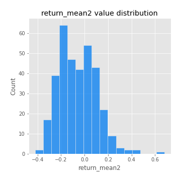
## Feature : return_sd1
- **Feature type** : continous
- **Missing** : 0.0%
- **Unique** : 347
- **Count** :347.0
- **Mean** :2.2527848480707355
- **Std** :0.9669538399153922
- **Min** :0.8102430347636637
- **25%th Percentile** : 1.5301426522861292
- **50%th Percentile** : 2.0071952556076558
- **75%th Percentile** : 2.89552450093998
- **Max** :5.914793653010042

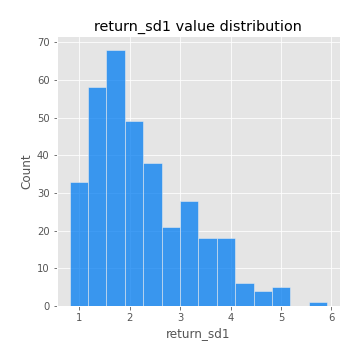
## Feature : return_sd2
- **Feature type** : continous
- **Missing** : 0.0%
- **Unique** : 347
- **Count** :347.0
- **Mean** :1.9983220137244417
- **Std** :0.7526767935757667
- **Min** :0.8198779632289204
- **25%th Percentile** : 1.4869209122829856
- **50%th Percentile** : 1.808454268907102
- **75%th Percentile** : 2.3215557754660168
- **Max** :5.235215670040115

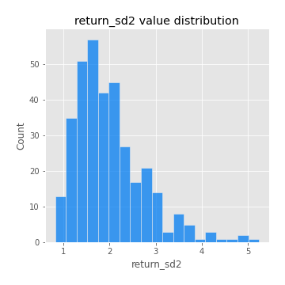
## Feature : return_skew1
- **Feature type** : continous
- **Missing** : 0.0%
- **Unique** : 347
- **Count** :347.0
- **Mean** :-0.3247853916675242
- **Std** :0.7208791620470962
- **Min** :-4.239645236578449
- **25%th Percentile** : -0.5727006142016264
- **50%th Percentile** : -0.2938171498794342
- **75%th Percentile** : -0.02418806677810465
- **Max** :2.351757728252051

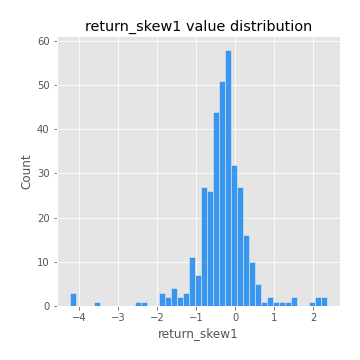
## Feature : return_skew2
- **Feature type** : continous
- **Missing** : 0.0%
- **Unique** : 347
- **Count** :347.0
- **Mean** :-0.38538749492329955
- **Std** :1.0150432612198281
- **Min** :-6.262899561987459
- **25%th Percentile** : -0.6289754953026068
- **50%th Percentile** : -0.2894033440438487
- **75%th Percentile** : 0.05456565984781571
- **Max** :4.1920266082732045

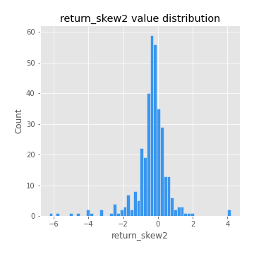
## Feature : return_kurtosis1
- **Feature type** : continous
- **Missing** : 0.0%
- **Unique** : 347
- **Count** :347.0
- **Mean** :3.8738551179067464
- **Std** :5.143333069628428
- **Min** :-0.0499870459535674
- **25%th Percentile** : 1.455314783079141
- **50%th Percentile** : 2.293935314761747
- **75%th Percentile** : 4.225964176285437
- **Max** :40.485294874464934

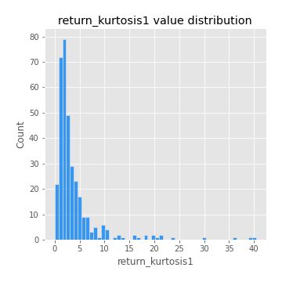
## Feature : return_kurtosis2
- **Feature type** : continous
- **Missing** : 0.0%
- **Unique** : 347
- **Count** :347.0
- **Mean** :5.850103242935621
- **Std** :7.812281267627968
- **Min** :0.024044458596995
- **25%th Percentile** : 1.9999049714229564
- **50%th Percentile** : 3.5702096359085265
- **75%th Percentile** : 6.081003583326814
- **Max** :64.99818629655663

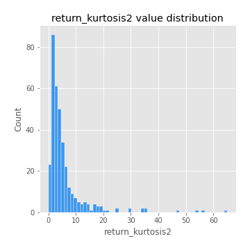
## Feature : return_autocorrelation_lag1_1
- **Feature type** : continous
- **Missing** : 0.0%
- **Unique** : 347
- **Count** :347.0
- **Mean** :-0.011780335414832947
- **Std** :0.0746577933404387
- **Min** :-0.23872307765703174
- **25%th Percentile** : -0.06415278785282721
- **50%th Percentile** : -0.014958509602797215
- **75%th Percentile** : 0.03947988382205151
- **Max** :0.29188020312383833

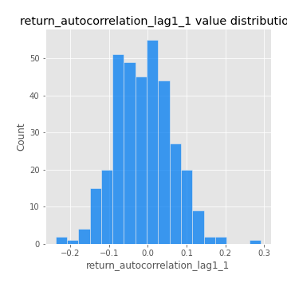
## Feature : return_autocorrelation_lag1_2
- **Feature type** : continous
- **Missing** : 0.0%
- **Unique** : 347
- **Count** :347.0
- **Mean** :-0.013827085051249001
- **Std** :0.08604503149953359
- **Min** :-0.2364404317158175
- **25%th Percentile** : -0.07292933345209024
- **50%th Percentile** : -0.018526851381973474
- **75%th Percentile** : 0.04125233217661396
- **Max** :0.2423907962335401

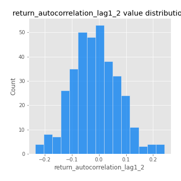
## Feature : return_autocorrelation_lag1_rolling_sd1
- **Feature type** : continous
- **Missing** : 0.0%
- **Unique** : 347
- **Count** :347.0
- **Mean** :0.9734042527073501
- **Std** :0.01977684683195626
- **Min** :0.8703309691717807
- **25%th Percentile** : 0.9599591860116288
- **50%th Percentile** : 0.9780536168154536
- **75%th Percentile** : 0.9901206683718256
- **Max** :0.9974685035396977

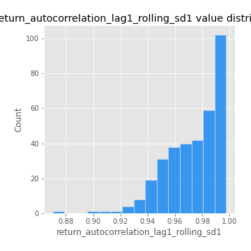
## Feature : return_autocorrelation_lag1_rolling_sd2
- **Feature type** : continous
- **Missing** : 0.0%
- **Unique** : 347
- **Count** :347.0
- **Mean** :0.9712308972621123
- **Std** :0.020057082156699615
- **Min** :0.8849206290342239
- **25%th Percentile** : 0.9573819961696062
- **50%th Percentile** : 0.976682055028489
- **75%th Percentile** : 0.988144818704787
- **Max** :0.9959729276720157

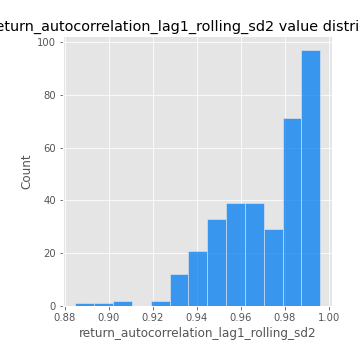
## Feature : return_correlation_ts1_lag_0
- **Feature type** : continous
- **Missing** : 0.0%
- **Unique** : 347
- **Count** :347.0
- **Mean** :0.47182885053749285
- **Std** :0.24516985792278254
- **Min** :-0.09359497075028665
- **25%th Percentile** : 0.303892326353202
- **50%th Percentile** : 0.46644275004835367
- **75%th Percentile** : 0.6970322381125188
- **Max** :0.9937227277077512

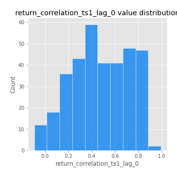
## Feature : return_correlation_ts1_lag_1
- **Feature type** : continous
- **Missing** : 0.0%
- **Unique** : 347
- **Count** :347.0
- **Mean** :-0.00938060561089503
- **Std** :0.06904098830315827
- **Min** :-0.19176377033800976
- **25%th Percentile** : -0.05692617366915312
- **50%th Percentile** : -0.01243743389882646
- **75%th Percentile** : 0.03864021855306783
- **Max** :0.2079208379904105

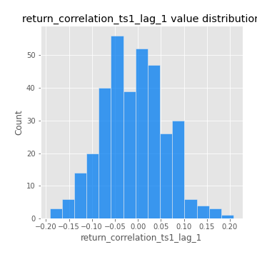
## Feature : return_correlation_ts1_lag_2
- **Feature type** : continous
- **Missing** : 0.0%
- **Unique** : 347
- **Count** :347.0
- **Mean** :-0.00671269229546701
- **Std** :0.07232288562483692
- **Min** :-0.21756886401161793
- **25%th Percentile** : -0.05172709585797427
- **50%th Percentile** : -0.00978249514836984
- **75%th Percentile** : 0.04107644901478803
- **Max** :0.2586554475346096

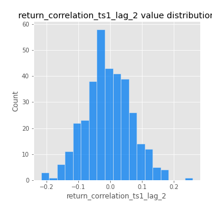
## Feature : return_correlation_ts1_lag_3
- **Feature type** : continous
- **Missing** : 0.0%
- **Unique** : 347
- **Count** :347.0
- **Mean** :0.00494834553377544
- **Std** :0.07610112275781807
- **Min** :-0.27997060802061885
- **25%th Percentile** : -0.044714956739490073
- **50%th Percentile** : 0.007944628013571164
- **75%th Percentile** : 0.051379021853651084
- **Max** :0.3409418338735325

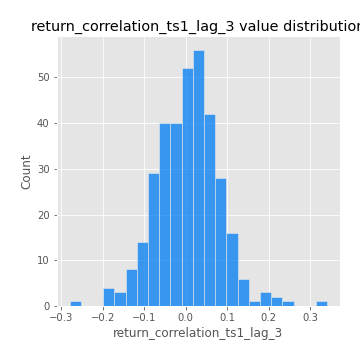
## Feature : return_correlation_ts2_lag_1
- **Feature type** : continous
- **Missing** : 0.0%
- **Unique** : 347
- **Count** :347.0
- **Mean** :-0.0021299312120134696
- **Std** :0.0769014045911401
- **Min** :-0.2675793158939278
- **25%th Percentile** : -0.05502798613208494
- **50%th Percentile** : -0.0037277704157955387
- **75%th Percentile** : 0.04628734116845745
- **Max** :0.3425036902091001

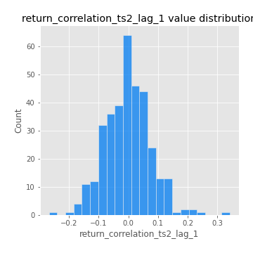
## Feature : return_correlation_ts2_lag_2
- **Feature type** : continous
- **Missing** : 0.0%
- **Unique** : 347
- **Count** :347.0
- **Mean** :-0.011824081458942447
- **Std** :0.07538890625083527
- **Min** :-0.24436198417921187
- **25%th Percentile** : -0.06156545614716215
- **50%th Percentile** : -0.013943575055196155
- **75%th Percentile** : 0.03695845376937031
- **Max** :0.2602758090169827

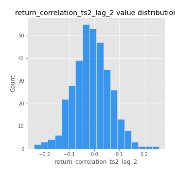
## Feature : return_correlation_ts2_lag_3
- **Feature type** : continous
- **Missing** : 0.0%
- **Unique** : 347
- **Count** :347.0
- **Mean** :0.011866845793568418
- **Std** :0.0735740026995532
- **Min** :-0.2241527597468644
- **25%th Percentile** : -0.036681617633598354
- **50%th Percentile** : 0.0126371009109018
- **75%th Percentile** : 0.061506441097757325
- **Max** :0.3013249163798015

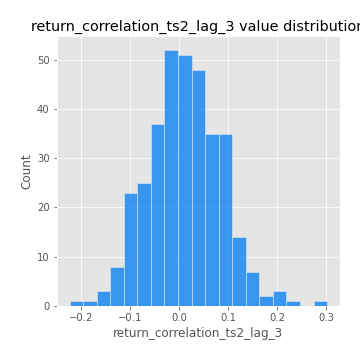
## Feature : price2_granger_cause_price1
- **Feature type** : continous
- **Missing** : 0.0%
- **Unique** : 347
- **Count** :347.0
- **Mean** :0.2542643631316586
- **Std** :0.28296147976113284
- **Min** :2.4312048970873696e-09
- **25%th Percentile** : 0.021042170993211512
- **50%th Percentile** : 0.13230653936543704
- **75%th Percentile** : 0.42520997147956435
- **Max** :0.9898380228448623

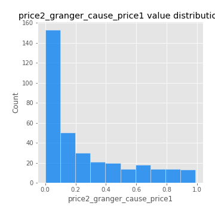
## Feature : price1_granger_cause_price2
- **Feature type** : continous
- **Missing** : 0.0%
- **Unique** : 347
- **Count** :347.0
- **Mean** :0.27594883796707215
- **Std** :0.29280535699409815
- **Min** :1.9600216676951196e-14
- **25%th Percentile** : 0.02595298214126996
- **50%th Percentile** : 0.1409871963313082
- **75%th Percentile** : 0.4758227348398598
- **Max** :0.9960303220185149

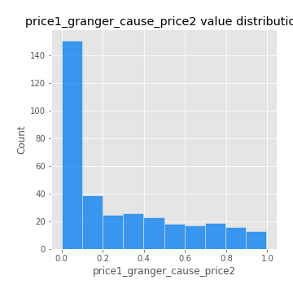

[<< Go back](../README.md)
