# Exploratory Data Analysis

[<< Go back](../README.md)
## Feature : target
- **Feature type** : categorical
- **Missing** : 0.0%
- **Unique** : 2
- **Count** :347
- **Unique** :2
- **Top** :real
- **Freq** :176

## Feature : return_mean1
- **Feature type** : continous
- **Missing** : 0.0%
- **Unique** : 347
- **Count** :347.0
- **Mean** :-0.009965020142528116
- **Std** :0.13200905642716415
- **Min** :-0.3564971494772962
- **25%th Percentile** : -0.11527834221393049
- **50%th Percentile** : -0.010880428456284721
- **75%th Percentile** : 0.090519938290053
- **Max** :0.3602793017097547

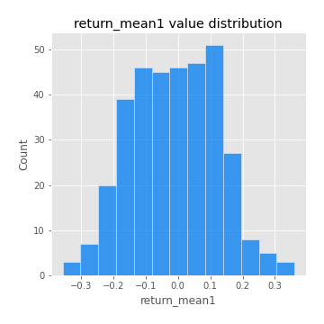
## Feature : return_mean2
- **Feature type** : continous
- **Missing** : 0.0%
- **Unique** : 347
- **Count** :347.0
- **Mean** :-0.05389556004262296
- **Std** :0.1545866990880144
- **Min** :-0.39714035583901774
- **25%th Percentile** : -0.1653758157993523
- **50%th Percentile** : -0.05649003650360168
- **75%th Percentile** : 0.05343104933421744
- **Max** :0.6801605239983173

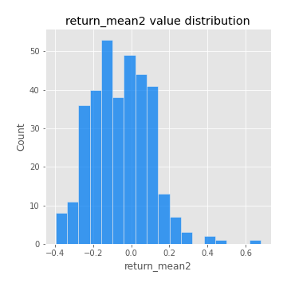
## Feature : return_sd1
- **Feature type** : continous
- **Missing** : 0.0%
- **Unique** : 347
- **Count** :347.0
- **Mean** :2.215941353793579
- **Std** :0.9360964947842924
- **Min** :0.5879082800271022
- **25%th Percentile** : 1.4733505337263901
- **50%th Percentile** : 1.976585052078002
- **75%th Percentile** : 2.838563690021328
- **Max** :5.096963215717593

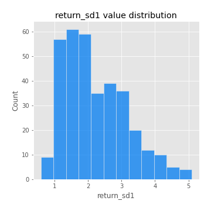
## Feature : return_sd2
- **Feature type** : continous
- **Missing** : 0.0%
- **Unique** : 347
- **Count** :347.0
- **Mean** :2.0032385082753854
- **Std** :0.7086057590952024
- **Min** :0.8198779632289204
- **25%th Percentile** : 1.4704467249227733
- **50%th Percentile** : 1.8226944940050505
- **75%th Percentile** : 2.4706281134555685
- **Max** :4.59233049161685

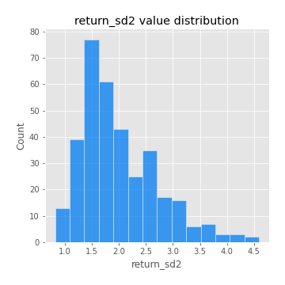
## Feature : return_skew1
- **Feature type** : continous
- **Missing** : 0.0%
- **Unique** : 347
- **Count** :347.0
- **Mean** :-0.3392550946755381
- **Std** :0.7499125894582311
- **Min** :-4.239645236578449
- **25%th Percentile** : -0.5725041280904768
- **50%th Percentile** : -0.3000102380727801
- **75%th Percentile** : -0.030889894412823242
- **Max** :2.1285977762978217

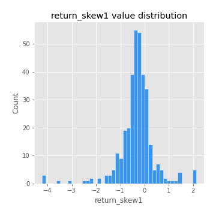
## Feature : return_skew2
- **Feature type** : continous
- **Missing** : 0.0%
- **Unique** : 347
- **Count** :347.0
- **Mean** :-0.34032401427967357
- **Std** :1.0088987495489934
- **Min** :-6.262899561987459
- **25%th Percentile** : -0.5733382143851402
- **50%th Percentile** : -0.2562888659209638
- **75%th Percentile** : 0.09380472586531288
- **Max** :4.0310261345618

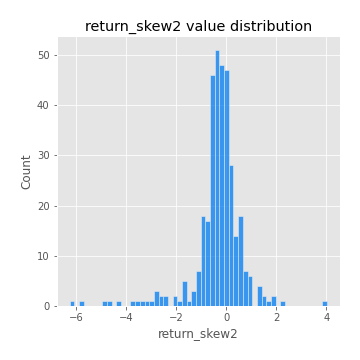
## Feature : return_kurtosis1
- **Feature type** : continous
- **Missing** : 0.0%
- **Unique** : 347
- **Count** :347.0
- **Mean** :3.9142462034376475
- **Std** :5.109805757624172
- **Min** :0.08806594822616987
- **25%th Percentile** : 1.4821005840458328
- **50%th Percentile** : 2.4030695613303448
- **75%th Percentile** : 4.293460032308514
- **Max** :40.485294874464934

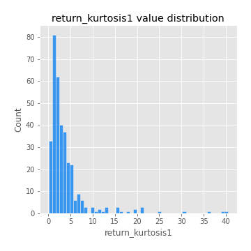
## Feature : return_kurtosis2
- **Feature type** : continous
- **Missing** : 0.0%
- **Unique** : 347
- **Count** :347.0
- **Mean** :5.8233347654925645
- **Std** :8.182999490785221
- **Min** :-0.1693240760286967
- **25%th Percentile** : 2.1393175197706555
- **50%th Percentile** : 3.448209963460695
- **75%th Percentile** : 5.8367874373040625
- **Max** :64.99818629655663

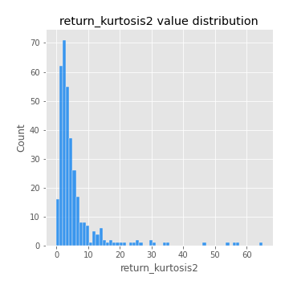
## Feature : return_autocorrelation_lag1_1
- **Feature type** : continous
- **Missing** : 0.0%
- **Unique** : 347
- **Count** :347.0
- **Mean** :-0.012423900701039313
- **Std** :0.08032848146719909
- **Min** :-0.31587362367179944
- **25%th Percentile** : -0.06288647877572706
- **50%th Percentile** : -0.018567471360587295
- **75%th Percentile** : 0.03638651443480709
- **Max** :0.24738074440266683

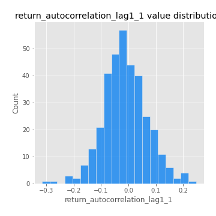
## Feature : return_autocorrelation_lag1_2
- **Feature type** : continous
- **Missing** : 0.0%
- **Unique** : 347
- **Count** :347.0
- **Mean** :-0.00650022934939025
- **Std** :0.08138066594676513
- **Min** :-0.24430311584888015
- **25%th Percentile** : -0.06021749748028342
- **50%th Percentile** : -0.00563982239545521
- **75%th Percentile** : 0.04923063638782975
- **Max** :0.2335942808155912

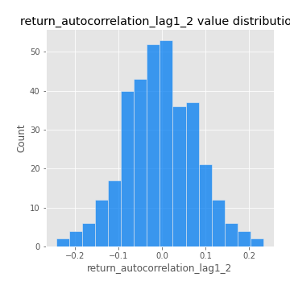
## Feature : return_autocorrelation_lag1_rolling_sd1
- **Feature type** : continous
- **Missing** : 0.0%
- **Unique** : 347
- **Count** :347.0
- **Mean** :0.9736460426950911
- **Std** :0.01928662503116893
- **Min** :0.8703309691717807
- **25%th Percentile** : 0.9617879228658544
- **50%th Percentile** : 0.9795452852984275
- **75%th Percentile** : 0.989956415711613
- **Max** :0.9966485677611996

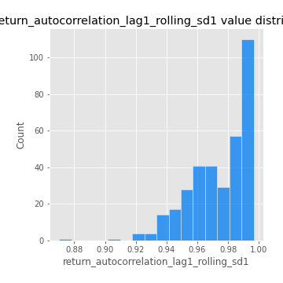
## Feature : return_autocorrelation_lag1_rolling_sd2
- **Feature type** : continous
- **Missing** : 0.0%
- **Unique** : 347
- **Count** :347.0
- **Mean** :0.9705445532979996
- **Std** :0.020358180677036364
- **Min** :0.8849206290342239
- **25%th Percentile** : 0.9571020101679139
- **50%th Percentile** : 0.9746141325895539
- **75%th Percentile** : 0.9875610530848937
- **Max** :0.9950254218078037

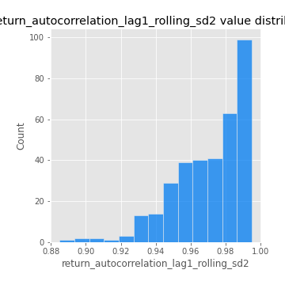
## Feature : return_correlation_ts1_lag_0
- **Feature type** : continous
- **Missing** : 0.0%
- **Unique** : 347
- **Count** :347.0
- **Mean** :0.47240889363551003
- **Std** :0.24210334265078365
- **Min** :-0.13719081891191884
- **25%th Percentile** : 0.29697126953005804
- **50%th Percentile** : 0.47738650476341443
- **75%th Percentile** : 0.6904299082982988
- **Max** :0.9937227277077512

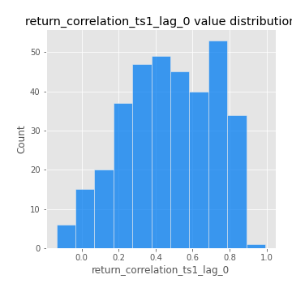
## Feature : return_correlation_ts1_lag_1
- **Feature type** : continous
- **Missing** : 0.0%
- **Unique** : 347
- **Count** :347.0
- **Mean** :-0.010093841409797508
- **Std** :0.07044275091400551
- **Min** :-0.2300725122791964
- **25%th Percentile** : -0.057429613761768215
- **50%th Percentile** : -0.004993646875954634
- **75%th Percentile** : 0.038059672412595516
- **Max** :0.17236552992540058

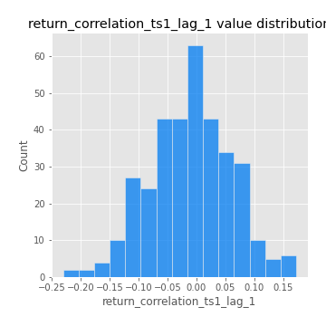
## Feature : return_correlation_ts1_lag_2
- **Feature type** : continous
- **Missing** : 0.0%
- **Unique** : 347
- **Count** :347.0
- **Mean** :-0.012929478518249979
- **Std** :0.07315757077828454
- **Min** :-0.28851102919459587
- **25%th Percentile** : -0.05972195417234463
- **50%th Percentile** : -0.013855558377022358
- **75%th Percentile** : 0.038057167031813624
- **Max** :0.21265205036240892

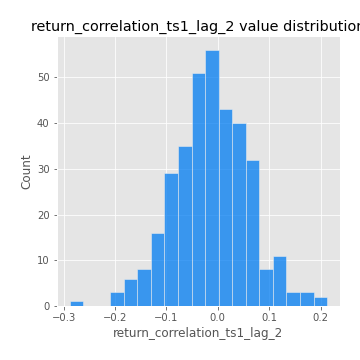
## Feature : return_correlation_ts1_lag_3
- **Feature type** : continous
- **Missing** : 0.0%
- **Unique** : 347
- **Count** :347.0
- **Mean** :-0.0023204385457402084
- **Std** :0.07378331260576348
- **Min** :-0.25173567867789454
- **25%th Percentile** : -0.04970101252999251
- **50%th Percentile** : 0.0008111258091437905
- **75%th Percentile** : 0.044869610673587426
- **Max** :0.23808054096877584

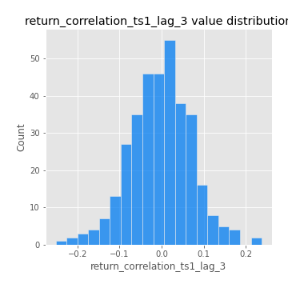
## Feature : return_correlation_ts2_lag_1
- **Feature type** : continous
- **Missing** : 0.0%
- **Unique** : 347
- **Count** :347.0
- **Mean** :0.0011453534745231423
- **Std** :0.08082925418705063
- **Min** :-0.24507303366329988
- **25%th Percentile** : -0.05713543951127108
- **50%th Percentile** : 0.0006455642291732153
- **75%th Percentile** : 0.055519982425442024
- **Max** :0.3425036902091001

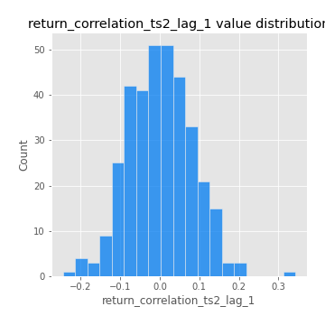
## Feature : return_correlation_ts2_lag_2
- **Feature type** : continous
- **Missing** : 0.0%
- **Unique** : 347
- **Count** :347.0
- **Mean** :-0.01570629360493867
- **Std** :0.0753147370852175
- **Min** :-0.35990495776245074
- **25%th Percentile** : -0.058801778695135476
- **50%th Percentile** : -0.012014558552719904
- **75%th Percentile** : 0.030703921850122422
- **Max** :0.27704225553168815

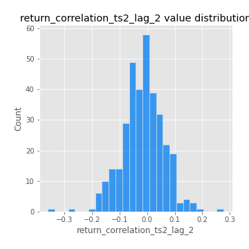
## Feature : return_correlation_ts2_lag_3
- **Feature type** : continous
- **Missing** : 0.0%
- **Unique** : 347
- **Count** :347.0
- **Mean** :0.003159810097893857
- **Std** :0.07104178055538579
- **Min** :-0.1935390459280291
- **25%th Percentile** : -0.04849742769976741
- **50%th Percentile** : 0.005503181262678729
- **75%th Percentile** : 0.0494936515092149
- **Max** :0.21907558752956724

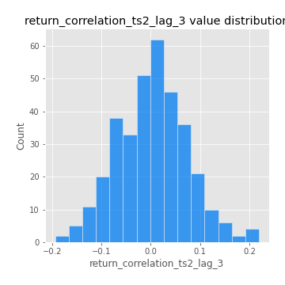
## Feature : price2_granger_cause_price1
- **Feature type** : continous
- **Missing** : 0.0%
- **Unique** : 347
- **Count** :347.0
- **Mean** :0.2738978208526622
- **Std** :0.29161631900405444
- **Min** :4.840282809518645e-10
- **25%th Percentile** : 0.024478304877180126
- **50%th Percentile** : 0.1648829730954338
- **75%th Percentile** : 0.475869708998419
- **Max** :0.9956876066606772

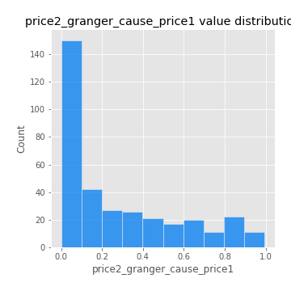
## Feature : price1_granger_cause_price2
- **Feature type** : continous
- **Missing** : 0.0%
- **Unique** : 347
- **Count** :347.0
- **Mean** :0.27168465729503405
- **Std** :0.28871267436619036
- **Min** :1.2012269232170316e-11
- **25%th Percentile** : 0.02611610470864478
- **50%th Percentile** : 0.17010557066003704
- **75%th Percentile** : 0.44866393696784773
- **Max** :0.9981705710150857

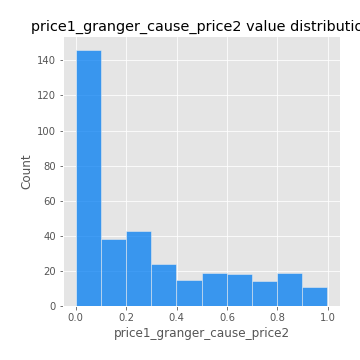

[<< Go back](../README.md)
