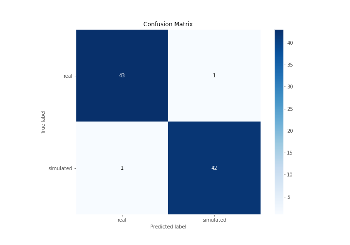
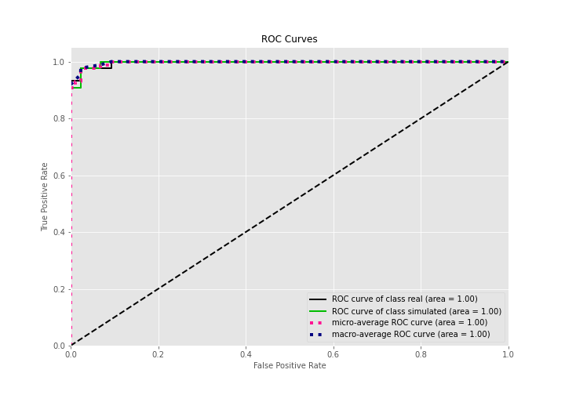
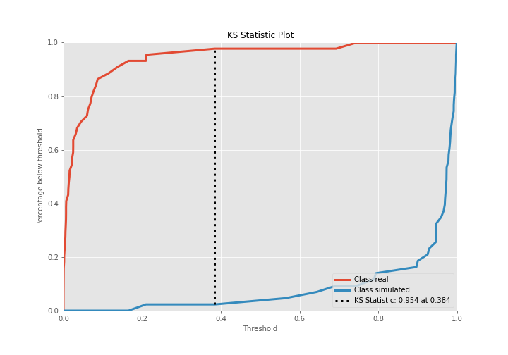
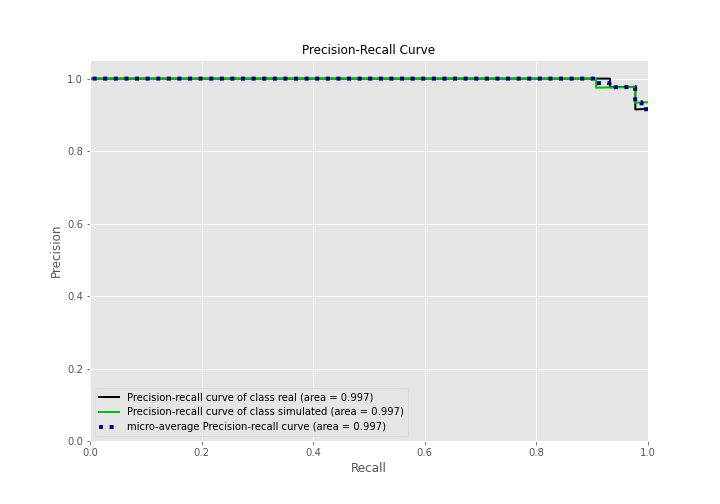
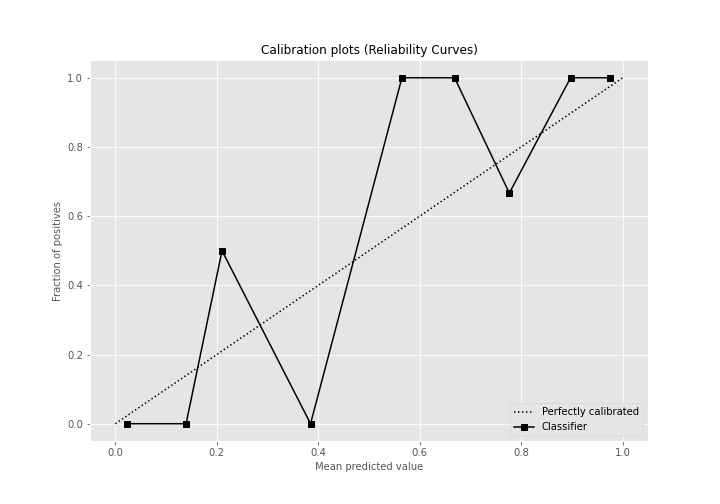
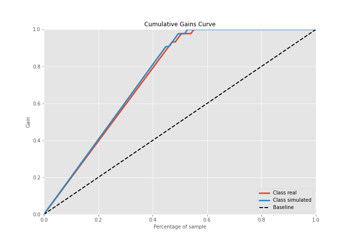
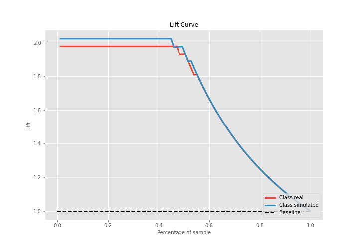

# Summary of Ensemble

[<< Go back](../README.md)

## Ensemble structure
| Model    |   Weight |
|:---------|---------:|
| 3_Linear |        1 |

## Metric details
|           |     score |   threshold |
|:----------|----------:|------------:|
| logloss   | 0.0908078 | nan         |
| auc       | 0.996829  | nan         |
| f1        | 0.976744  |   0.498006  |
| accuracy  | 0.977011  |   0.498006  |
| precision | 1         |   0.98213   |
| recall    | 1         |   3.077e-06 |
| mcc       | 0.954017  |   0.498006  |

## Confusion matrix (at threshold=0.498006)
|                      |   Predicted as real |   Predicted as simulated |
|:---------------------|--------------------:|-------------------------:|
| Labeled as real      |                  43 |                        1 |
| Labeled as simulated |                   1 |                       42 |

## Learning curves

## Confusion Matrix

## Normalized Confusion Matrix

## ROC Curve

## Kolmogorov-Smirnov Statistic

## Precision-Recall Curve

## Calibration Curve

## Cumulative Gains Curve

## Lift Curve

[<< Go back](../README.md)
