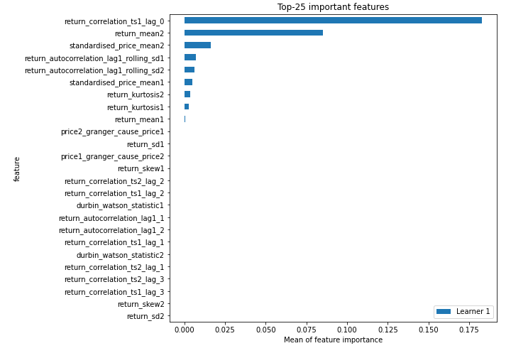
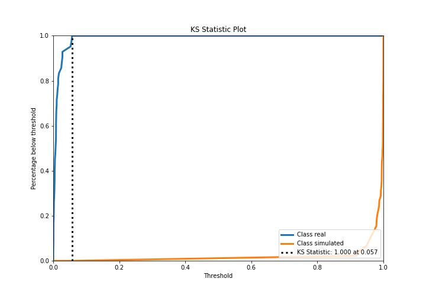
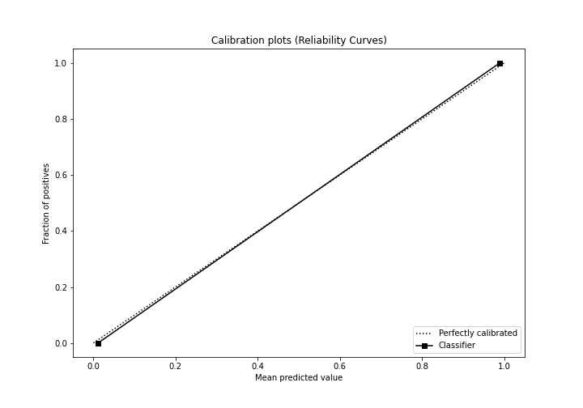
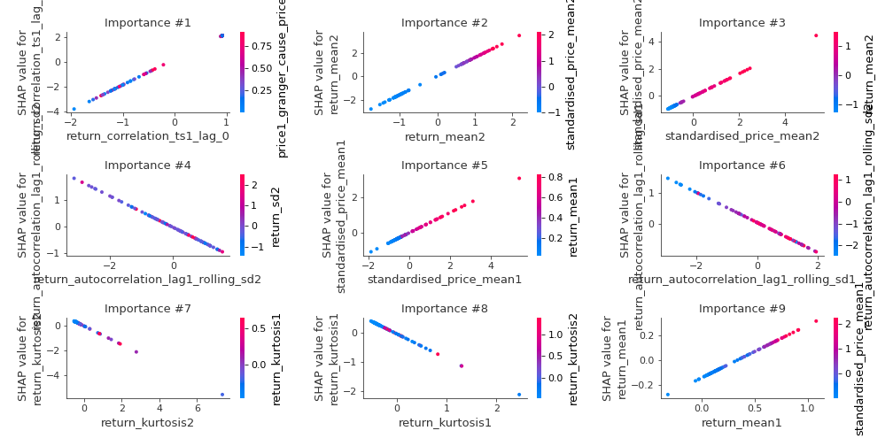
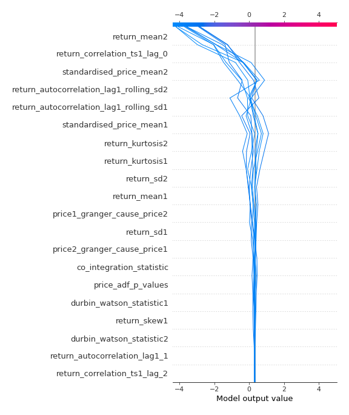
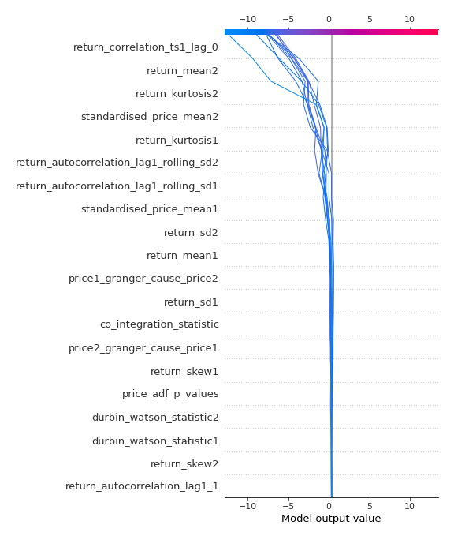
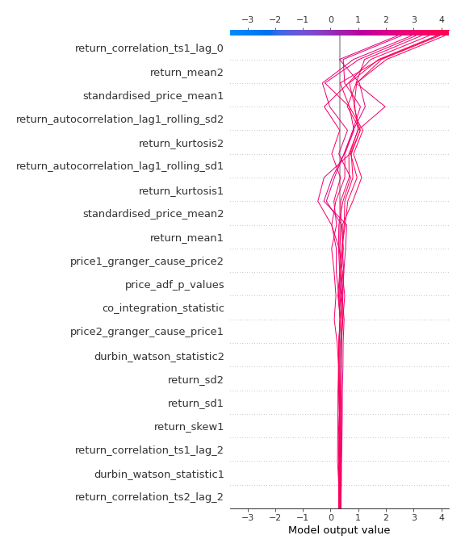
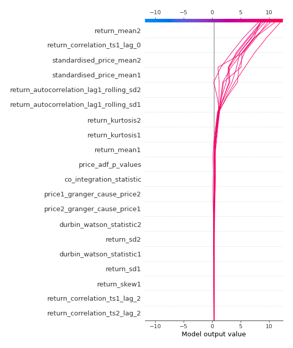

# Summary of 3_Linear

[<< Go back](../README.md)

## Logistic Regression (Linear)
- **n_jobs**: -1
- **explain_level**: 2

## Validation
 - **validation_type**: split
 - **train_ratio**: 0.75
 - **shuffle**: True
 - **stratify**: True

## Optimized metric
accuracy

## Training time

2.6 seconds

## Metric details
|           |     score |     threshold |
|:----------|----------:|--------------:|
| logloss   | 0.0112788 | nan           |
| auc       | 1         | nan           |
| f1        | 1         |   0.500666    |
| accuracy  | 1         |   0.500666    |
| precision | 1         |   0.999512    |
| recall    | 1         |   3.99655e-06 |
| mcc       | 1         |   0.500666    |

## Confusion matrix (at threshold=0.500666)
|                      |   Predicted as real |   Predicted as simulated |
|:---------------------|--------------------:|-------------------------:|
| Labeled as real      |                  42 |                        0 |
| Labeled as simulated |                   0 |                       45 |

## Learning curves

## Coefficients
| feature                                 |   Learner_1 |
|:----------------------------------------|------------:|
| return_correlation_ts1_lag_0            |  2.05834    |
| return_mean2                            |  1.58719    |
| standardised_price_mean2                |  0.84968    |
| standardised_price_mean1                |  0.56753    |
| intercept                               |  0.462315   |
| return_mean1                            |  0.423476   |
| return_correlation_ts1_lag_2            |  0.143326   |
| return_correlation_ts2_lag_2            |  0.132708   |
| return_autocorrelation_lag1_1           |  0.099733   |
| return_correlation_ts2_lag_1            |  0.0784731  |
| return_skew1                            |  0.0761082  |
| return_autocorrelation_lag1_2           |  0.0751956  |
| return_correlation_ts1_lag_1            |  0.0644817  |
| co_integration_statistic                |  0.0522037  |
| return_correlation_ts2_lag_3            |  0.0399402  |
| return_correlation_ts1_lag_3            |  0.031421   |
| return_skew2                            |  0.00401867 |
| durbin_watson_statistic1                | -0.0231351  |
| durbin_watson_statistic2                | -0.029039   |
| return_sd1                              | -0.0532177  |
| return_sd2                              | -0.104908   |
| price_adf_p_values                      | -0.151507   |
| price2_granger_cause_price1             | -0.19005    |
| price1_granger_cause_price2             | -0.20885    |
| return_autocorrelation_lag1_rolling_sd1 | -0.474837   |
| return_autocorrelation_lag1_rolling_sd2 | -0.599251   |
| return_kurtosis2                        | -0.752382   |
| return_kurtosis1                        | -0.833929   |

## Permutation-based Importance

## Confusion Matrix

## Normalized Confusion Matrix

## ROC Curve

## Kolmogorov-Smirnov Statistic

## Precision-Recall Curve

## Calibration Curve

## Cumulative Gains Curve

## Lift Curve

## SHAP Importance

## SHAP Dependence plots

### Dependence (Fold 1)

## SHAP Decision plots

### Top-10 Worst decisions for class 0 (Fold 1)

### Top-10 Best decisions for class 0 (Fold 1)

### Top-10 Worst decisions for class 1 (Fold 1)

### Top-10 Best decisions for class 1 (Fold 1)

[<< Go back](../README.md)
