# Exploratory Data Analysis

[<< Go back](../README.md)
## Feature : target
- **Feature type** : categorical
- **Missing** : 0.0%
- **Unique** : 2
- **Count** :347
- **Unique** :2
- **Top** :simulated
- **Freq** :178

## Feature : standardised_price_mean1
- **Feature type** : continous
- **Missing** : 0.0%
- **Unique** : 347
- **Count** :347.0
- **Mean** :157.73103539867975
- **Std** :62.63995351758295
- **Min** :43.818674613537056
- **25%th Percentile** : 117.82203729264458
- **50%th Percentile** : 132.20384919332574
- **75%th Percentile** : 189.22421231986834
- **Max** :487.57094927614696

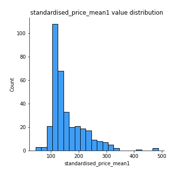
## Feature : standardised_price_mean2
- **Feature type** : continous
- **Missing** : 0.0%
- **Unique** : 347
- **Count** :347.0
- **Mean** :244.20098818009572
- **Std** :157.75877094165918
- **Min** :77.36570036335733
- **25%th Percentile** : 117.36760694204618
- **50%th Percentile** : 168.98687648380778
- **75%th Percentile** : 340.07692941154573
- **Max** :1057.3579960624554

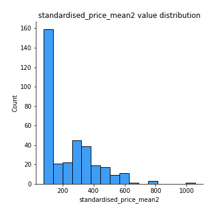
## Feature : return_mean1
- **Feature type** : continous
- **Missing** : 0.0%
- **Unique** : 347
- **Count** :347.0
- **Mean** :0.34660575621802386
- **Std** :0.27538236128073174
- **Min** :-0.31556073795310474
- **25%th Percentile** : 0.11272465033122188
- **50%th Percentile** : 0.24738407821164754
- **75%th Percentile** : 0.5915219773409226
- **Max** :1.0790323531503891

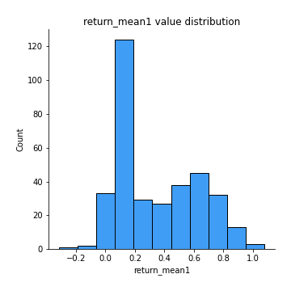
## Feature : return_mean2
- **Feature type** : continous
- **Missing** : 0.0%
- **Unique** : 347
- **Count** :347.0
- **Mean** :0.5240493586497048
- **Std** :0.44872019493799564
- **Min** :-0.24668577454402457
- **25%th Percentile** : 0.09876351490891382
- **50%th Percentile** : 0.5633386067197521
- **75%th Percentile** : 0.9269228858865645
- **Max** :1.493875067872129

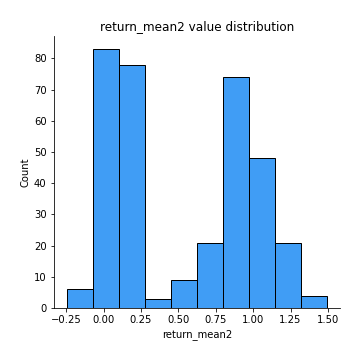
## Feature : return_sd1
- **Feature type** : continous
- **Missing** : 0.0%
- **Unique** : 347
- **Count** :347.0
- **Mean** :1.533805476660116
- **Std** :0.3400739415286328
- **Min** :0.7917186262639786
- **25%th Percentile** : 1.431502848400648
- **50%th Percentile** : 1.5127607833112897
- **75%th Percentile** : 1.6067226819553477
- **Max** :3.3277429018214417

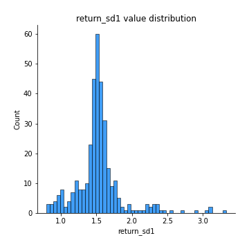
## Feature : return_sd2
- **Feature type** : continous
- **Missing** : 0.0%
- **Unique** : 347
- **Count** :347.0
- **Mean** :1.6198989918304352
- **Std** :0.41513920932672543
- **Min** :0.8243843596443498
- **25%th Percentile** : 1.4668961969777232
- **50%th Percentile** : 1.5733023277399705
- **75%th Percentile** : 1.6609295894894305
- **Max** :4.598857143139886

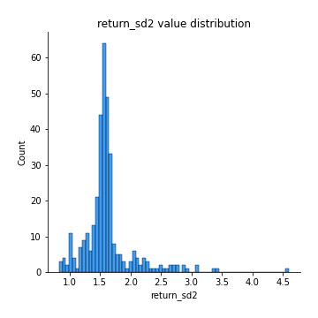
## Feature : return_skew1
- **Feature type** : continous
- **Missing** : 0.0%
- **Unique** : 347
- **Count** :347.0
- **Mean** :-0.13539598894957483
- **Std** :0.7040510870348381
- **Min** :-6.857840543649597
- **25%th Percentile** : -0.2976120578086641
- **50%th Percentile** : -0.0644591000692597
- **75%th Percentile** : 0.07169980991911694
- **Max** :4.140719546467752

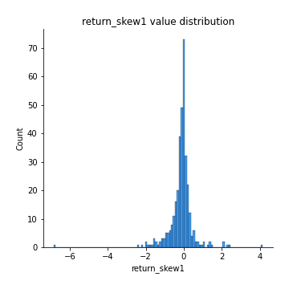
## Feature : return_skew2
- **Feature type** : continous
- **Missing** : 0.0%
- **Unique** : 347
- **Count** :347.0
- **Mean** :-0.25684568360120824
- **Std** :1.0975962524137197
- **Min** :-6.613535067863222
- **25%th Percentile** : -0.3545048602870988
- **50%th Percentile** : -0.07572299137181368
- **75%th Percentile** : 0.09002238285222924
- **Max** :4.289944724188784

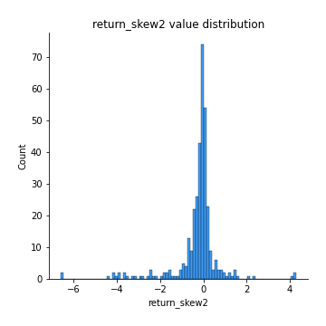
## Feature : return_kurtosis1
- **Feature type** : continous
- **Missing** : 0.0%
- **Unique** : 347
- **Count** :347.0
- **Mean** :2.5451202444377765
- **Std** :6.146995230559579
- **Min** :-0.7516091963598552
- **25%th Percentile** : -0.048607576379209094
- **50%th Percentile** : 0.45230865662978426
- **75%th Percentile** : 2.7205831738974378
- **Max** :80.08765409662804

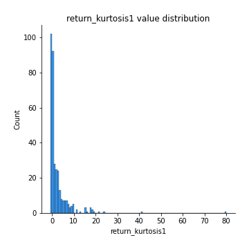
## Feature : return_kurtosis2
- **Feature type** : continous
- **Missing** : 0.0%
- **Unique** : 347
- **Count** :347.0
- **Mean** :4.516036419251864
- **Std** :10.520720237912267
- **Min** :-0.7491598741876042
- **25%th Percentile** : -0.04493600568955447
- **50%th Percentile** : 0.48389674074649713
- **75%th Percentile** : 3.430194930614488
- **Max** :81.96076596987915

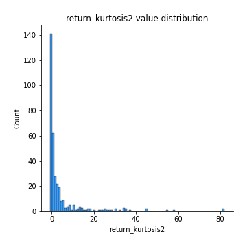
## Feature : return_autocorrelation_lag1_1
- **Feature type** : continous
- **Missing** : 0.0%
- **Unique** : 347
- **Count** :347.0
- **Mean** :0.014517295177095497
- **Std** :0.07786381614366597
- **Min** :-0.21106657115766964
- **25%th Percentile** : -0.03541844686687719
- **50%th Percentile** : 0.01579908421674958
- **75%th Percentile** : 0.06770370640578546
- **Max** :0.23310127090148183

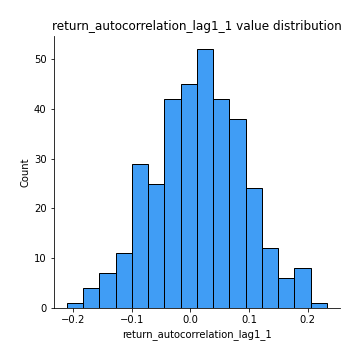
## Feature : return_autocorrelation_lag1_2
- **Feature type** : continous
- **Missing** : 0.0%
- **Unique** : 347
- **Count** :347.0
- **Mean** :0.011172033113684811
- **Std** :0.07368337798198286
- **Min** :-0.23650716165005362
- **25%th Percentile** : -0.033303151895350935
- **50%th Percentile** : 0.014655649678680691
- **75%th Percentile** : 0.062245076696902726
- **Max** :0.20789800390089375

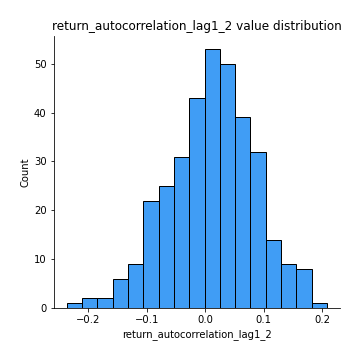
## Feature : return_autocorrelation_lag1_rolling_sd1
- **Feature type** : continous
- **Missing** : 0.0%
- **Unique** : 347
- **Count** :347.0
- **Mean** :0.9457018396691255
- **Std** :0.01948461262543981
- **Min** :0.8911226755990125
- **25%th Percentile** : 0.9336214256854429
- **50%th Percentile** : 0.9486474731982839
- **75%th Percentile** : 0.9599005941778969
- **Max** :0.9817860359018395

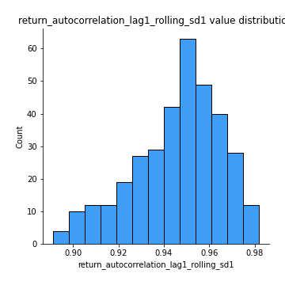
## Feature : return_autocorrelation_lag1_rolling_sd2
- **Feature type** : continous
- **Missing** : 0.0%
- **Unique** : 347
- **Count** :347.0
- **Mean** :0.9442288895104411
- **Std** :0.018479971852231776
- **Min** :0.8893228984340695
- **25%th Percentile** : 0.9325669193690068
- **50%th Percentile** : 0.9475779943834561
- **75%th Percentile** : 0.957320984232906
- **Max** :0.9816307701771863

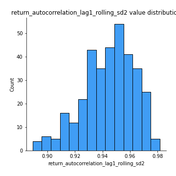
## Feature : price_adf_p_values
- **Feature type** : continous
- **Missing** : 0.0%
- **Unique** : 347
- **Count** :347.0
- **Mean** :0.40289976649281095
- **Std** :0.3480488272098585
- **Min** :5.4676549893335844e-08
- **25%th Percentile** : 0.08090717031913708
- **50%th Percentile** : 0.29854316652216
- **75%th Percentile** : 0.703498805654321
- **Max** :0.9990301011719359

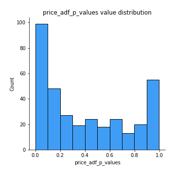
## Feature : return_correlation_ts1_lag_0
- **Feature type** : continous
- **Missing** : 0.0%
- **Unique** : 347
- **Count** :347.0
- **Mean** :0.6494407112728731
- **Std** :0.37925274102486956
- **Min** :-0.12507580812872535
- **25%th Percentile** : 0.28780723867864744
- **50%th Percentile** : 0.9912584680875127
- **75%th Percentile** : 0.9985380121641799
- **Max** :0.9994557154738104

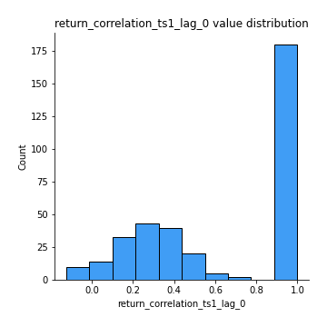
## Feature : return_correlation_ts1_lag_1
- **Feature type** : continous
- **Missing** : 0.0%
- **Unique** : 347
- **Count** :347.0
- **Mean** :0.012087705070866702
- **Std** :0.07354166633911614
- **Min** :-0.18856712556884056
- **25%th Percentile** : -0.03513089513658875
- **50%th Percentile** : 0.011430749803300805
- **75%th Percentile** : 0.06078114133803439
- **Max** :0.2204172275377606

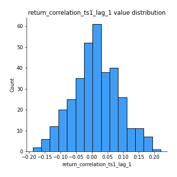
## Feature : return_correlation_ts1_lag_2
- **Feature type** : continous
- **Missing** : 0.0%
- **Unique** : 347
- **Count** :347.0
- **Mean** :0.008839098127212558
- **Std** :0.06669263333358479
- **Min** :-0.17301760826170318
- **25%th Percentile** : -0.037258950596816096
- **50%th Percentile** : 0.0053973402331238705
- **75%th Percentile** : 0.05715545596422597
- **Max** :0.1848360541788846

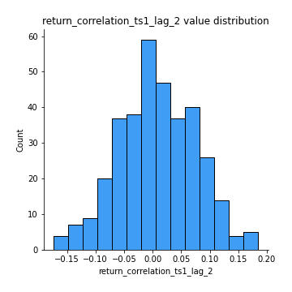
## Feature : return_correlation_ts1_lag_3
- **Feature type** : continous
- **Missing** : 0.0%
- **Unique** : 347
- **Count** :347.0
- **Mean** :0.015657904931108673
- **Std** :0.070156882420513
- **Min** :-0.21184867865910795
- **25%th Percentile** : -0.02857960683040929
- **50%th Percentile** : 0.017809019389282355
- **75%th Percentile** : 0.061768307666140276
- **Max** :0.23792600845612338

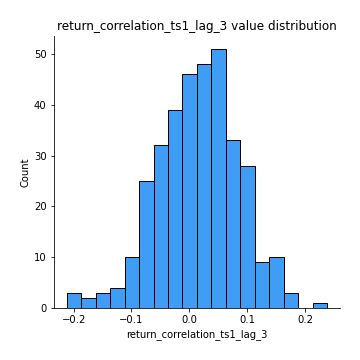
## Feature : return_correlation_ts2_lag_1
- **Feature type** : continous
- **Missing** : 0.0%
- **Unique** : 347
- **Count** :347.0
- **Mean** :0.016356754473731815
- **Std** :0.07144146936445164
- **Min** :-0.20434596106030414
- **25%th Percentile** : -0.029713636287426702
- **50%th Percentile** : 0.018644347231655766
- **75%th Percentile** : 0.06595238851083313
- **Max** :0.2188700459912286

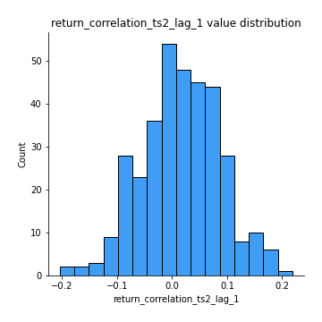
## Feature : return_correlation_ts2_lag_2
- **Feature type** : continous
- **Missing** : 0.0%
- **Unique** : 347
- **Count** :347.0
- **Mean** :0.011442852595700426
- **Std** :0.06527810430667895
- **Min** :-0.1864220921035808
- **25%th Percentile** : -0.029642809354165436
- **50%th Percentile** : 0.012199926003930347
- **75%th Percentile** : 0.06028965830930376
- **Max** :0.18445185333071518

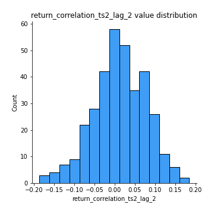
## Feature : return_correlation_ts2_lag_3
- **Feature type** : continous
- **Missing** : 0.0%
- **Unique** : 347
- **Count** :347.0
- **Mean** :0.017998799851400803
- **Std** :0.06202556959678369
- **Min** :-0.14516745978840945
- **25%th Percentile** : -0.025294630148814525
- **50%th Percentile** : 0.016267605704494162
- **75%th Percentile** : 0.058639009995234734
- **Max** :0.17110984485908334

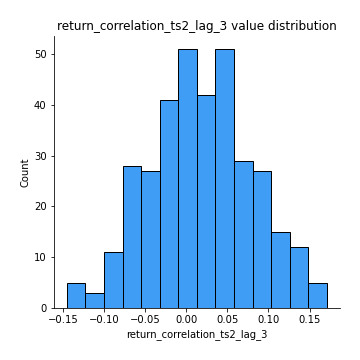
## Feature : durbin_watson_statistic1
- **Feature type** : continous
- **Missing** : 0.0%
- **Unique** : 347
- **Count** :347.0
- **Mean** :1.9913808936713993
- **Std** :0.08117023908245127
- **Min** :1.7394615350036977
- **25%th Percentile** : 1.962074325241193
- **50%th Percentile** : 1.988733642655975
- **75%th Percentile** : 2.0173970523523366
- **Max** :2.3147835328996527

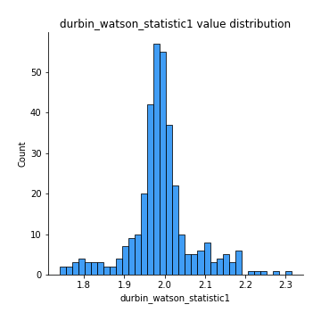
## Feature : durbin_watson_statistic2
- **Feature type** : continous
- **Missing** : 0.0%
- **Unique** : 347
- **Count** :347.0
- **Mean** :1.9863808141786254
- **Std** :0.09103906513362232
- **Min** :1.649823119450525
- **25%th Percentile** : 1.9527060144413726
- **50%th Percentile** : 1.985843102762369
- **75%th Percentile** : 2.018366927629467
- **Max** :2.334073172550357

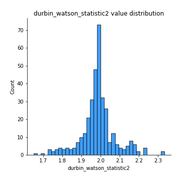
## Feature : co_integration_statistic
- **Feature type** : continous
- **Missing** : 0.0%
- **Unique** : 347
- **Count** :347.0
- **Mean** :0.5245174756976856
- **Std** :0.344467768566471
- **Min** :1.2500061398339287e-05
- **25%th Percentile** : 0.1927506765815301
- **50%th Percentile** : 0.5089407664726197
- **75%th Percentile** : 0.8805865471374488
- **Max** :0.9939092353376776

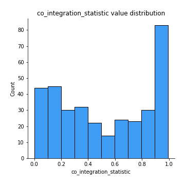
## Feature : price2_granger_cause_price1
- **Feature type** : continous
- **Missing** : 0.0%
- **Unique** : 347
- **Count** :347.0
- **Mean** :0.229236746639162
- **Std** :0.284060248544138
- **Min** :2.3655116242603476e-09
- **25%th Percentile** : 0.012982905631730338
- **50%th Percentile** : 0.08621119884374089
- **75%th Percentile** : 0.3851684736016786
- **Max** :0.9879764520831139

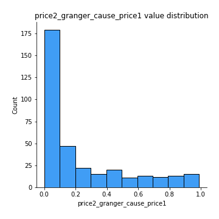
## Feature : price1_granger_cause_price2
- **Feature type** : continous
- **Missing** : 0.0%
- **Unique** : 347
- **Count** :347.0
- **Mean** :0.28778580554320726
- **Std** :0.29037169424699844
- **Min** :6.607726210169445e-06
- **25%th Percentile** : 0.03570555379129593
- **50%th Percentile** : 0.19168253703649213
- **75%th Percentile** : 0.4628722055177561
- **Max** :0.9912763272907406

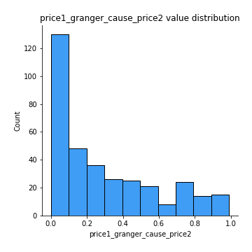

[<< Go back](../README.md)
