# Exploratory Data Analysis

[<< Go back](../README.md)
## Feature : target
- **Feature type** : categorical
- **Missing** : 0.0%
- **Unique** : 2
- **Count** :347
- **Unique** :2
- **Top** :simulated
- **Freq** :177

## Feature : standardised_price_mean1
- **Feature type** : continous
- **Missing** : 0.0%
- **Unique** : 347
- **Count** :347.0
- **Mean** :160.27674737034718
- **Std** :69.9319713451988
- **Min** :43.818674613537056
- **25%th Percentile** : 117.4576749757274
- **50%th Percentile** : 132.17763421014027
- **75%th Percentile** : 192.2515987273585
- **Max** :591.3703024125841

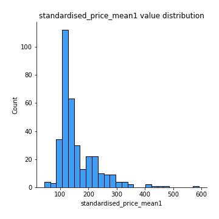
## Feature : standardised_price_mean2
- **Feature type** : continous
- **Missing** : 0.0%
- **Unique** : 347
- **Count** :347.0
- **Mean** :252.7257694666386
- **Std** :169.8143420446234
- **Min** :80.35718998347672
- **25%th Percentile** : 117.75554727219323
- **50%th Percentile** : 168.8368280472394
- **75%th Percentile** : 342.6400833343897
- **Max** :1057.3579960624554

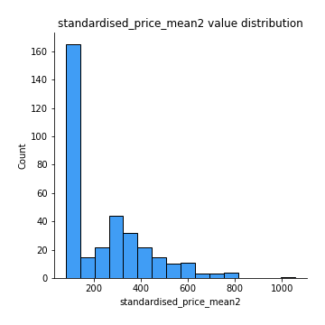
## Feature : return_mean1
- **Feature type** : continous
- **Missing** : 0.0%
- **Unique** : 347
- **Count** :347.0
- **Mean** :0.3488495092399003
- **Std** :0.2869237193822232
- **Min** :-0.31556073795310474
- **25%th Percentile** : 0.10978477007784865
- **50%th Percentile** : 0.2511732676700955
- **75%th Percentile** : 0.5999805963298595
- **Max** :1.2336414655560004

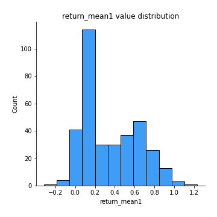
## Feature : return_mean2
- **Feature type** : continous
- **Missing** : 0.0%
- **Unique** : 347
- **Count** :347.0
- **Mean** :0.535871532397411
- **Std** :0.4549001947168231
- **Min** :-0.24668577454402457
- **25%th Percentile** : 0.10518814238542168
- **50%th Percentile** : 0.5537184414988882
- **75%th Percentile** : 0.9476966760025454
- **Max** :1.493875067872129

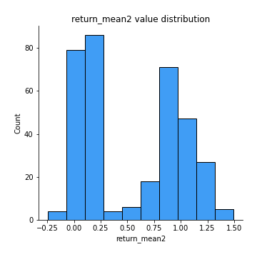
## Feature : return_sd1
- **Feature type** : continous
- **Missing** : 0.0%
- **Unique** : 347
- **Count** :347.0
- **Mean** :1.5436077667046346
- **Std** :0.3568272928906896
- **Min** :0.7917186262639786
- **25%th Percentile** : 1.4290457335633664
- **50%th Percentile** : 1.516472857252578
- **75%th Percentile** : 1.6067226819553477
- **Max** :3.1366764469130217

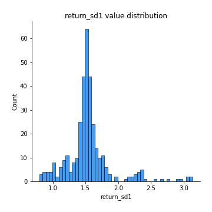
## Feature : return_sd2
- **Feature type** : continous
- **Missing** : 0.0%
- **Unique** : 347
- **Count** :347.0
- **Mean** :1.5855777465651906
- **Std** :0.36703007614174565
- **Min** :0.8184811977504522
- **25%th Percentile** : 1.4558868024037661
- **50%th Percentile** : 1.5672702173552202
- **75%th Percentile** : 1.652373679258869
- **Max** :3.397240761887529

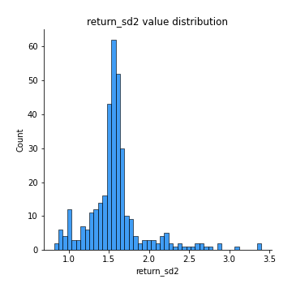
## Feature : return_skew1
- **Feature type** : continous
- **Missing** : 0.0%
- **Unique** : 347
- **Count** :347.0
- **Mean** :-0.17104296469876415
- **Std** :0.7826809878278264
- **Min** :-6.857840543649597
- **25%th Percentile** : -0.2938341479028892
- **50%th Percentile** : -0.060588845172114464
- **75%th Percentile** : 0.07771829586842355
- **Max** :2.4626801359026347

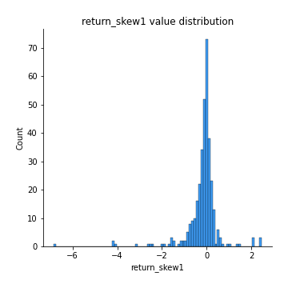
## Feature : return_skew2
- **Feature type** : continous
- **Missing** : 0.0%
- **Unique** : 347
- **Count** :347.0
- **Mean** :-0.20906656402307522
- **Std** :1.0732382154619828
- **Min** :-9.5467599340665
- **25%th Percentile** : -0.34209196490722915
- **50%th Percentile** : -0.05981197738260722
- **75%th Percentile** : 0.10343021097082034
- **Max** :4.289944724188784

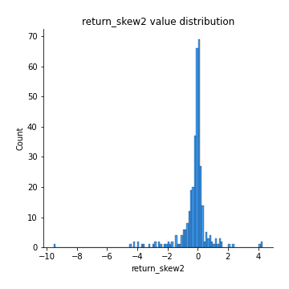
## Feature : return_kurtosis1
- **Feature type** : continous
- **Missing** : 0.0%
- **Unique** : 347
- **Count** :347.0
- **Mean** :2.891910029291334
- **Std** :7.751389089067072
- **Min** :-0.7516091963598552
- **25%th Percentile** : -0.0551822439036318
- **50%th Percentile** : 0.554433994966399
- **75%th Percentile** : 2.548616449868581
- **Max** :80.08765409662804

## Feature : return_kurtosis2
- **Feature type** : continous
- **Missing** : 0.0%
- **Unique** : 347
- **Count** :347.0
- **Mean** :4.16351477264394
- **Std** :10.523976843171068
- **Min** :-0.7491598741876042
- **25%th Percentile** : -0.06554303187695298
- **50%th Percentile** : 0.6363051729984983
- **75%th Percentile** : 3.346702310715077
- **Max** :127.80647138658917

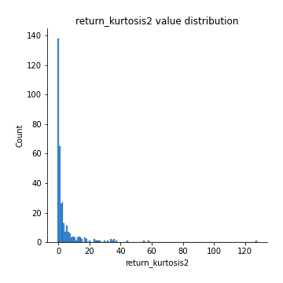
## Feature : return_autocorrelation_lag1_1
- **Feature type** : continous
- **Missing** : 0.0%
- **Unique** : 347
- **Count** :347.0
- **Mean** :0.012572257409766701
- **Std** :0.0764085173358851
- **Min** :-0.21106657115766964
- **25%th Percentile** : -0.0360679506857495
- **50%th Percentile** : 0.015627692438032654
- **75%th Percentile** : 0.06452696904266927
- **Max** :0.23310127090148183

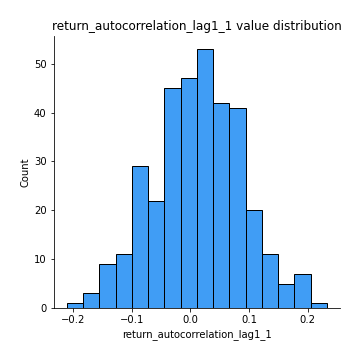
## Feature : return_autocorrelation_lag1_2
- **Feature type** : continous
- **Missing** : 0.0%
- **Unique** : 347
- **Count** :347.0
- **Mean** :0.007807687483417753
- **Std** :0.07156057705614531
- **Min** :-0.23650716165005362
- **25%th Percentile** : -0.035682441055003566
- **50%th Percentile** : 0.011166336738644634
- **75%th Percentile** : 0.0560478309764723
- **Max** :0.20789800390089375

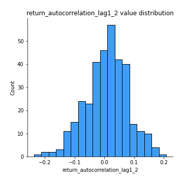
## Feature : return_autocorrelation_lag1_rolling_sd1
- **Feature type** : continous
- **Missing** : 0.0%
- **Unique** : 347
- **Count** :347.0
- **Mean** :0.9449906491624019
- **Std** :0.02015718074775695
- **Min** :0.8706732948271847
- **25%th Percentile** : 0.9327150807119919
- **50%th Percentile** : 0.949025883961323
- **75%th Percentile** : 0.9599005941778969
- **Max** :0.9811283501208863

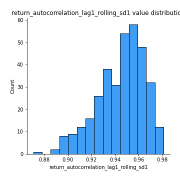
## Feature : return_autocorrelation_lag1_rolling_sd2
- **Feature type** : continous
- **Missing** : 0.0%
- **Unique** : 347
- **Count** :347.0
- **Mean** :0.9441206830001434
- **Std** :0.019338428075311075
- **Min** :0.8893228984340695
- **25%th Percentile** : 0.9328139810786442
- **50%th Percentile** : 0.9476884518273657
- **75%th Percentile** : 0.9584006293841978
- **Max** :0.9816307701771863

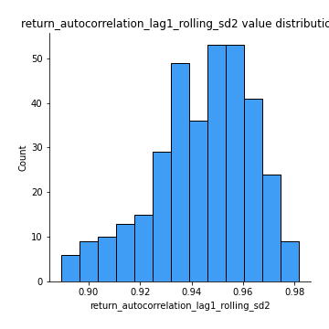
## Feature : price_adf_p_values
- **Feature type** : continous
- **Missing** : 0.0%
- **Unique** : 347
- **Count** :347.0
- **Mean** :0.42697254059233425
- **Std** :0.35424882964583104
- **Min** :5.4676549893335844e-08
- **25%th Percentile** : 0.08748476947933095
- **50%th Percentile** : 0.35707172773436163
- **75%th Percentile** : 0.7615996438153948
- **Max** :0.9990301011719359

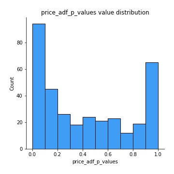
## Feature : return_correlation_ts1_lag_0
- **Feature type** : continous
- **Missing** : 0.0%
- **Unique** : 347
- **Count** :347.0
- **Mean** :0.6502190204215549
- **Std** :0.3771302175820089
- **Min** :-0.12507580812872535
- **25%th Percentile** : 0.3064155935305122
- **50%th Percentile** : 0.9907580634161446
- **75%th Percentile** : 0.9983677531759032
- **Max** :0.9994557154738104

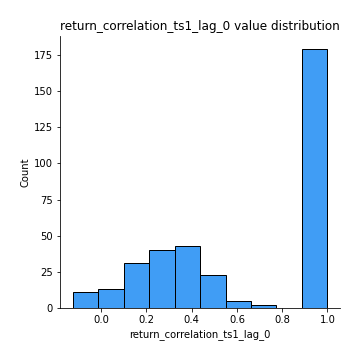
## Feature : return_correlation_ts1_lag_1
- **Feature type** : continous
- **Missing** : 0.0%
- **Unique** : 347
- **Count** :347.0
- **Mean** :0.008307610842016252
- **Std** :0.07009855590839378
- **Min** :-0.18856712556884056
- **25%th Percentile** : -0.037316862821863
- **50%th Percentile** : 0.009302544538209969
- **75%th Percentile** : 0.055523729154184395
- **Max** :0.2204172275377606

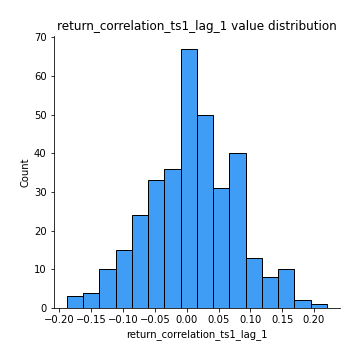
## Feature : return_correlation_ts1_lag_2
- **Feature type** : continous
- **Missing** : 0.0%
- **Unique** : 347
- **Count** :347.0
- **Mean** :0.004998764871346284
- **Std** :0.0647111498125455
- **Min** :-0.17458049302943662
- **25%th Percentile** : -0.03477491447016692
- **50%th Percentile** : 0.003321557693207737
- **75%th Percentile** : 0.05281200668305565
- **Max** :0.1848360541788846

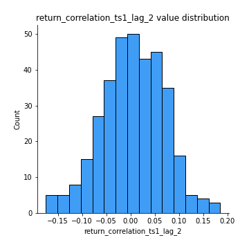
## Feature : return_correlation_ts1_lag_3
- **Feature type** : continous
- **Missing** : 0.0%
- **Unique** : 347
- **Count** :347.0
- **Mean** :0.01289848807693731
- **Std** :0.07110208247646944
- **Min** :-0.19794973933319396
- **25%th Percentile** : -0.03706077804425527
- **50%th Percentile** : 0.012516059940532058
- **75%th Percentile** : 0.060940838083762286
- **Max** :0.23792600845612338

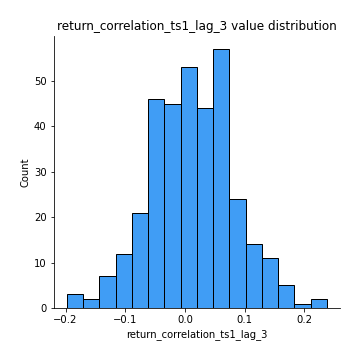
## Feature : return_correlation_ts2_lag_1
- **Feature type** : continous
- **Missing** : 0.0%
- **Unique** : 347
- **Count** :347.0
- **Mean** :0.012218813034388997
- **Std** :0.0687978181917573
- **Min** :-0.18799836210175325
- **25%th Percentile** : -0.034475752706804495
- **50%th Percentile** : 0.01424412240599166
- **75%th Percentile** : 0.06194464779477826
- **Max** :0.2188700459912286

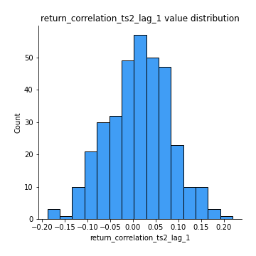
## Feature : return_correlation_ts2_lag_2
- **Feature type** : continous
- **Missing** : 0.0%
- **Unique** : 347
- **Count** :347.0
- **Mean** :0.006247035339168053
- **Std** :0.06762901779013451
- **Min** :-0.2758654278092797
- **25%th Percentile** : -0.035191742045874885
- **50%th Percentile** : 0.0074375591195404624
- **75%th Percentile** : 0.05579696406872928
- **Max** :0.18445185333071518

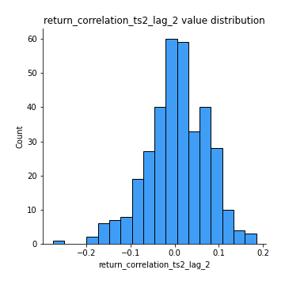
## Feature : return_correlation_ts2_lag_3
- **Feature type** : continous
- **Missing** : 0.0%
- **Unique** : 347
- **Count** :347.0
- **Mean** :0.012324107023786224
- **Std** :0.06558245348073515
- **Min** :-0.1770774021770153
- **25%th Percentile** : -0.03256573662075239
- **50%th Percentile** : 0.01140348046022216
- **75%th Percentile** : 0.05548387343693717
- **Max** :0.1931758318086702

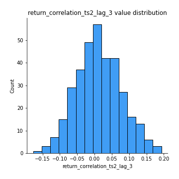
## Feature : durbin_watson_statistic1
- **Feature type** : continous
- **Missing** : 0.0%
- **Unique** : 347
- **Count** :347.0
- **Mean** :1.9892564785883389
- **Std** :0.07789900133077848
- **Min** :1.7347545360512986
- **25%th Percentile** : 1.9617968850933138
- **50%th Percentile** : 1.989434036198407
- **75%th Percentile** : 2.0126418732140827
- **Max** :2.3147835328996527

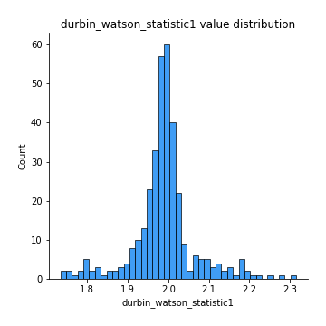
## Feature : durbin_watson_statistic2
- **Feature type** : continous
- **Missing** : 0.0%
- **Unique** : 347
- **Count** :347.0
- **Mean** :1.9847874996217416
- **Std** :0.08205799880774532
- **Min** :1.649823119450525
- **25%th Percentile** : 1.9528323577511102
- **50%th Percentile** : 1.9872489820235864
- **75%th Percentile** : 2.012850627500114
- **Max** :2.334073172550357

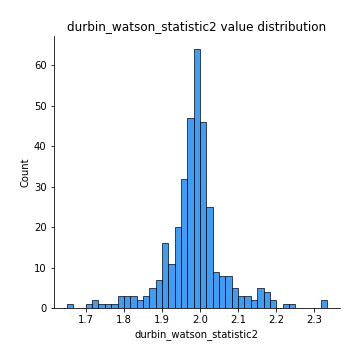
## Feature : co_integration_statistic
- **Feature type** : continous
- **Missing** : 0.0%
- **Unique** : 347
- **Count** :347.0
- **Mean** :0.5457454479675619
- **Std** :0.3419274537227797
- **Min** :3.3706511469754662e-06
- **25%th Percentile** : 0.2191007374006705
- **50%th Percentile** : 0.5822386469462743
- **75%th Percentile** : 0.9020575903131607
- **Max** :0.9939092353376776

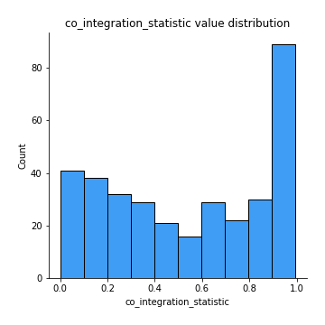
## Feature : price2_granger_cause_price1
- **Feature type** : continous
- **Missing** : 0.0%
- **Unique** : 347
- **Count** :347.0
- **Mean** :0.23535464696518937
- **Std** :0.28402631592658306
- **Min** :2.4523503187491247e-07
- **25%th Percentile** : 0.01707010566166967
- **50%th Percentile** : 0.091354694506757
- **75%th Percentile** : 0.39080662702007773
- **Max** :0.9879764520831139

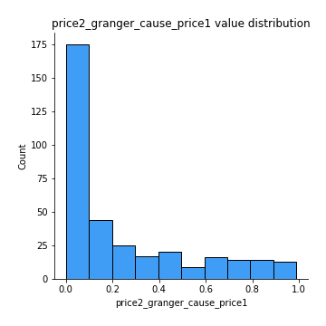
## Feature : price1_granger_cause_price2
- **Feature type** : continous
- **Missing** : 0.0%
- **Unique** : 347
- **Count** :347.0
- **Mean** :0.3055653956999675
- **Std** :0.29055614334612334
- **Min** :6.607726210169445e-06
- **25%th Percentile** : 0.0491180011137601
- **50%th Percentile** : 0.21571671240089185
- **75%th Percentile** : 0.5151598833726964
- **Max** :0.9901374584957848

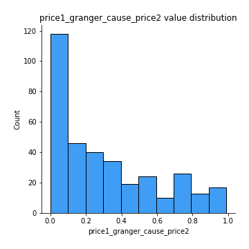

[<< Go back](../README.md)
