# Exploratory Data Analysis

[<< Go back](../README.md)
## Feature : target
- **Feature type** : categorical
- **Missing** : 0.0%
- **Unique** : 2
- **Count** :347
- **Unique** :2
- **Top** :real
- **Freq** :175

## Feature : return_mean1
- **Feature type** : continous
- **Missing** : 0.0%
- **Unique** : 347
- **Count** :347.0
- **Mean** :0.07688171518623473
- **Std** :0.15685633197196513
- **Min** :-0.4377530049698628
- **25%th Percentile** : -0.027238698982195754
- **50%th Percentile** : 0.07956795476897403
- **75%th Percentile** : 0.15450709799017234
- **Max** :0.6723612872579772

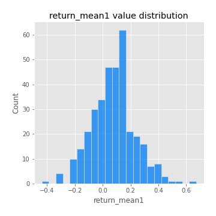
## Feature : return_mean2
- **Feature type** : continous
- **Missing** : 0.0%
- **Unique** : 347
- **Count** :347.0
- **Mean** :-0.042714661753198636
- **Std** :0.17124250489015874
- **Min** :-0.9030539586639528
- **25%th Percentile** : -0.14176362587975855
- **50%th Percentile** : -0.027513139830979406
- **75%th Percentile** : 0.06340574662755646
- **Max** :0.6801605239983173

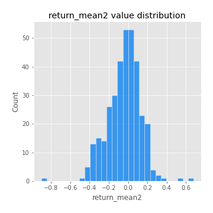
## Feature : return_sd1
- **Feature type** : continous
- **Missing** : 0.0%
- **Unique** : 347
- **Count** :347.0
- **Mean** :1.5909577313181917
- **Std** :0.36231519421676306
- **Min** :0.8102430347636637
- **25%th Percentile** : 1.447036739582159
- **50%th Percentile** : 1.5388527724931904
- **75%th Percentile** : 1.6356588784956179
- **Max** :3.332494027875222

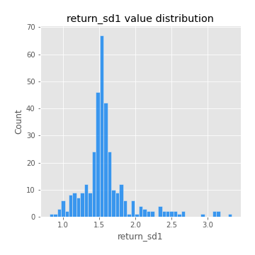
## Feature : return_sd2
- **Feature type** : continous
- **Missing** : 0.0%
- **Unique** : 347
- **Count** :347.0
- **Mean** :1.7028858926157522
- **Std** :0.4132807284598558
- **Min** :0.8198779632289204
- **25%th Percentile** : 1.534652727441014
- **50%th Percentile** : 1.6682607714964497
- **75%th Percentile** : 1.772446022032156
- **Max** :4.59233049161685

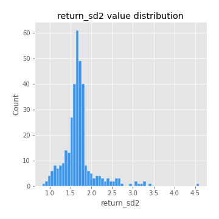
## Feature : return_skew1
- **Feature type** : continous
- **Missing** : 0.0%
- **Unique** : 347
- **Count** :347.0
- **Mean** :-0.19218706115805229
- **Std** :0.7229524300921243
- **Min** :-4.239645236578449
- **25%th Percentile** : -0.3533619636785188
- **50%th Percentile** : -0.08548827478221882
- **75%th Percentile** : 0.08342203403114631
- **Max** :2.3044235031125564

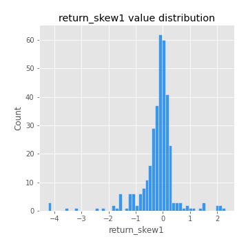
## Feature : return_skew2
- **Feature type** : continous
- **Missing** : 0.0%
- **Unique** : 347
- **Count** :347.0
- **Mean** :-0.3076535520748744
- **Std** :1.0538662123806737
- **Min** :-7.3762354994385335
- **25%th Percentile** : -0.3614898838261238
- **50%th Percentile** : -0.07853831742236349
- **75%th Percentile** : 0.08436209910328438
- **Max** :4.0310261345618

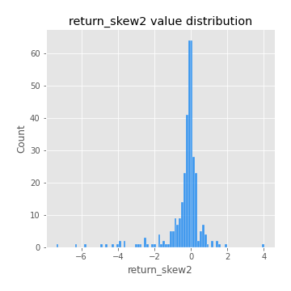
## Feature : return_kurtosis1
- **Feature type** : continous
- **Missing** : 0.0%
- **Unique** : 347
- **Count** :347.0
- **Mean** :2.674853604331359
- **Std** :5.60359059939227
- **Min** :-0.595189692077212
- **25%th Percentile** : -0.05448699903622556
- **50%th Percentile** : 0.6246090462991178
- **75%th Percentile** : 2.627323675085121
- **Max** :40.485294874464934

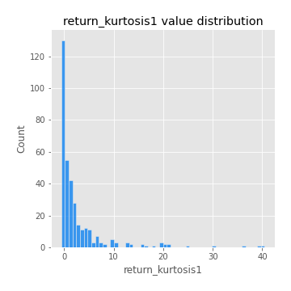
## Feature : return_kurtosis2
- **Feature type** : continous
- **Missing** : 0.0%
- **Unique** : 347
- **Count** :347.0
- **Mean** :4.047373235350906
- **Std** :9.967221375683886
- **Min** :-0.5698634660886261
- **25%th Percentile** : -0.024038316712192254
- **50%th Percentile** : 0.7198797782556361
- **75%th Percentile** : 3.3434029241276617
- **Max** :94.01659180149953

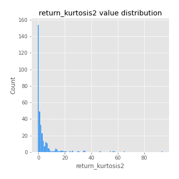
## Feature : return_autocorrelation_lag1_1
- **Feature type** : continous
- **Missing** : 0.0%
- **Unique** : 347
- **Count** :347.0
- **Mean** :0.006131962608921972
- **Std** :0.06706862808391062
- **Min** :-0.2110198016529991
- **25%th Percentile** : -0.043559698139465114
- **50%th Percentile** : 0.01026002595586414
- **75%th Percentile** : 0.05354071154923913
- **Max** :0.19581156706714908

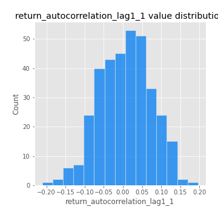
## Feature : return_autocorrelation_lag1_2
- **Feature type** : continous
- **Missing** : 0.0%
- **Unique** : 347
- **Count** :347.0
- **Mean** :0.005263129158620651
- **Std** :0.06631965663341316
- **Min** :-0.17778763204400128
- **25%th Percentile** : -0.03637117825579667
- **50%th Percentile** : 0.011218149718501496
- **75%th Percentile** : 0.04816978228595497
- **Max** :0.22104682478472748

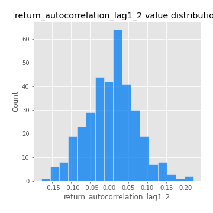
## Feature : return_autocorrelation_lag1_rolling_sd1
- **Feature type** : continous
- **Missing** : 0.0%
- **Unique** : 347
- **Count** :347.0
- **Mean** :0.9474329016806147
- **Std** :0.020918995224876703
- **Min** :0.865797865322417
- **25%th Percentile** : 0.9359067404876082
- **50%th Percentile** : 0.950119722749304
- **75%th Percentile** : 0.9636160147281619
- **Max** :0.9816370074661068

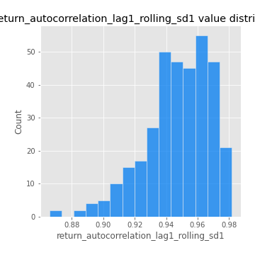
## Feature : return_autocorrelation_lag1_rolling_sd2
- **Feature type** : continous
- **Missing** : 0.0%
- **Unique** : 347
- **Count** :347.0
- **Mean** :0.9454950769241075
- **Std** :0.021687978682240906
- **Min** :0.8433795811593879
- **25%th Percentile** : 0.93470181993346
- **50%th Percentile** : 0.9495433621373444
- **75%th Percentile** : 0.9609043862348067
- **Max** :0.983940118474517

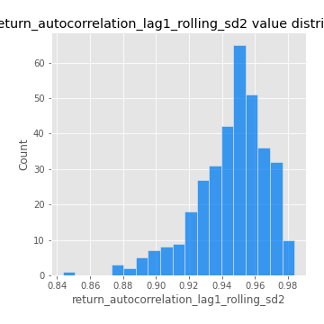
## Feature : return_correlation_ts1_lag_0
- **Feature type** : continous
- **Missing** : 0.0%
- **Unique** : 347
- **Count** :347.0
- **Mean** :0.3830881475042283
- **Std** :0.1415186144817659
- **Min** :-0.10256711281206837
- **25%th Percentile** : 0.3213982675530799
- **50%th Percentile** : 0.4270787358776296
- **75%th Percentile** : 0.47358623551606405
- **Max** :0.7227330027882508

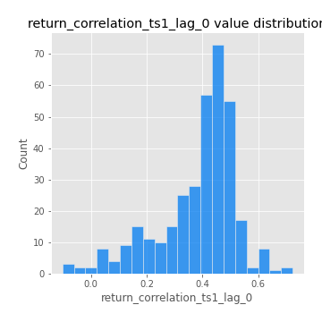
## Feature : return_correlation_ts1_lag_1
- **Feature type** : continous
- **Missing** : 0.0%
- **Unique** : 347
- **Count** :347.0
- **Mean** :0.0080625726543588
- **Std** :0.06342613456587379
- **Min** :-0.17367613999676684
- **25%th Percentile** : -0.038919444447760417
- **50%th Percentile** : 0.009838234873985583
- **75%th Percentile** : 0.04829000360823346
- **Max** :0.17417439275090124

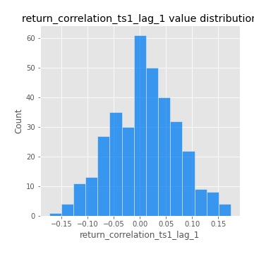
## Feature : return_correlation_ts1_lag_2
- **Feature type** : continous
- **Missing** : 0.0%
- **Unique** : 347
- **Count** :347.0
- **Mean** :0.004677862426570279
- **Std** :0.06425498317515144
- **Min** :-0.172871336111873
- **25%th Percentile** : -0.03569803571581078
- **50%th Percentile** : 0.002453647987604593
- **75%th Percentile** : 0.04865729384794834
- **Max** :0.19308681625270593

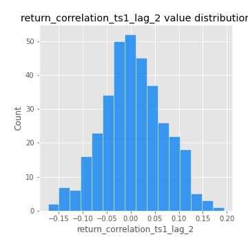
## Feature : return_correlation_ts1_lag_3
- **Feature type** : continous
- **Missing** : 0.0%
- **Unique** : 347
- **Count** :347.0
- **Mean** :0.01151117238848204
- **Std** :0.06517943675084793
- **Min** :-0.21147540839842804
- **25%th Percentile** : -0.030472115813407356
- **50%th Percentile** : 0.013507287775103037
- **75%th Percentile** : 0.05383856101737751
- **Max** :0.23808054096877584

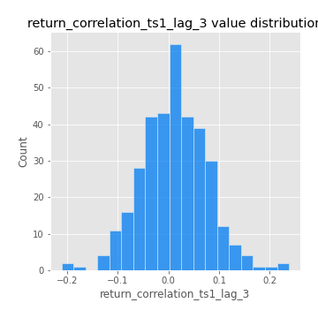
## Feature : return_correlation_ts2_lag_1
- **Feature type** : continous
- **Missing** : 0.0%
- **Unique** : 347
- **Count** :347.0
- **Mean** :0.01380118756230016
- **Std** :0.07080798460638675
- **Min** :-0.17665751184419612
- **25%th Percentile** : -0.03527071704254067
- **50%th Percentile** : 0.014776879858539253
- **75%th Percentile** : 0.061897909444256716
- **Max** :0.3425036902091001

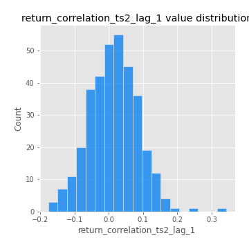
## Feature : return_correlation_ts2_lag_2
- **Feature type** : continous
- **Missing** : 0.0%
- **Unique** : 347
- **Count** :347.0
- **Mean** :0.0062719903123232825
- **Std** :0.06713156278612495
- **Min** :-0.2757460186107768
- **25%th Percentile** : -0.038677870857381114
- **50%th Percentile** : 0.006969465309201096
- **75%th Percentile** : 0.0552559623320074
- **Max** :0.1668209648754713

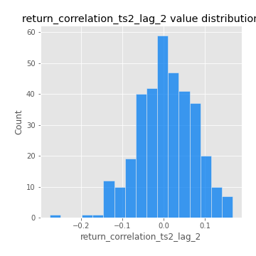
## Feature : return_correlation_ts2_lag_3
- **Feature type** : continous
- **Missing** : 0.0%
- **Unique** : 347
- **Count** :347.0
- **Mean** :0.017866015844550887
- **Std** :0.05891787426633576
- **Min** :-0.13094827171341789
- **25%th Percentile** : -0.02240344890510907
- **50%th Percentile** : 0.01727591778723078
- **75%th Percentile** : 0.05942606784023499
- **Max** :0.18227042221329348

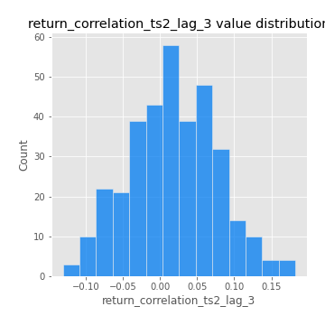
## Feature : price2_granger_cause_price1
- **Feature type** : continous
- **Missing** : 0.0%
- **Unique** : 347
- **Count** :347.0
- **Mean** :0.24358676583352853
- **Std** :0.28725771648463283
- **Min** :2.4312048970873696e-09
- **25%th Percentile** : 0.01453769612630764
- **50%th Percentile** : 0.1086051035076674
- **75%th Percentile** : 0.402131866519123
- **Max** :0.9985721699017299

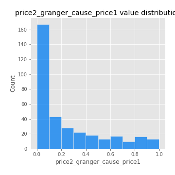
## Feature : price1_granger_cause_price2
- **Feature type** : continous
- **Missing** : 0.0%
- **Unique** : 347
- **Count** :347.0
- **Mean** :0.28628241419622247
- **Std** :0.29018894316412536
- **Min** :1.2012269232170316e-11
- **25%th Percentile** : 0.033840356446961366
- **50%th Percentile** : 0.18478421497674521
- **75%th Percentile** : 0.49170471807702
- **Max** :0.9995095490577433

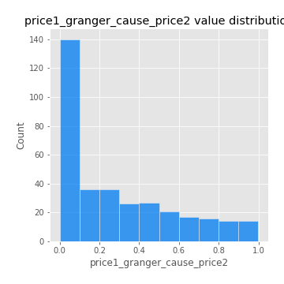

[<< Go back](../README.md)
