# Exploratory Data Analysis

[<< Go back](../README.md)
## Feature : target
- **Feature type** : categorical
- **Missing** : 0.0%
- **Unique** : 2
- **Count** :347
- **Unique** :2
- **Top** :real
- **Freq** :183

## Feature : return_mean1
- **Feature type** : continous
- **Missing** : 0.0%
- **Unique** : 347
- **Count** :347.0
- **Mean** :0.0760066984456124
- **Std** :0.1703585609328777
- **Min** :-0.8640068968539797
- **25%th Percentile** : -0.024606265709526745
- **50%th Percentile** : 0.07097753386830025
- **75%th Percentile** : 0.16974106815917536
- **Max** :0.6962677106134117

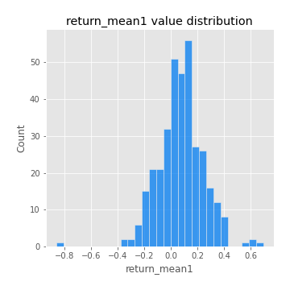
## Feature : return_mean2
- **Feature type** : continous
- **Missing** : 0.0%
- **Unique** : 347
- **Count** :347.0
- **Mean** :-0.037030912706534046
- **Std** :0.18070171269657193
- **Min** :-0.8394822130635892
- **25%th Percentile** : -0.14076325059100503
- **50%th Percentile** : -0.016249324946804766
- **75%th Percentile** : 0.08280547986672553
- **Max** :0.6801605239983173

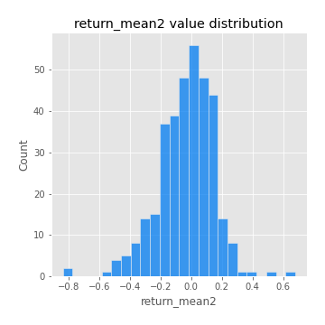
## Feature : return_sd1
- **Feature type** : continous
- **Missing** : 0.0%
- **Unique** : 347
- **Count** :347.0
- **Mean** :1.5957096737202545
- **Std** :0.36357323809641057
- **Min** :0.8733078831717243
- **25%th Percentile** : 1.4458988342836239
- **50%th Percentile** : 1.547833298806299
- **75%th Percentile** : 1.6307660725820643
- **Max** :3.332494027875222

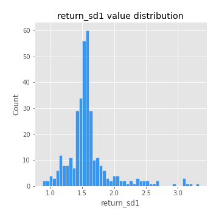
## Feature : return_sd2
- **Feature type** : continous
- **Missing** : 0.0%
- **Unique** : 347
- **Count** :347.0
- **Mean** :1.705970053550992
- **Std** :0.4290641382278022
- **Min** :0.8198779632289204
- **25%th Percentile** : 1.524385916416842
- **50%th Percentile** : 1.6678435779642453
- **75%th Percentile** : 1.7775380827589877
- **Max** :4.59233049161685

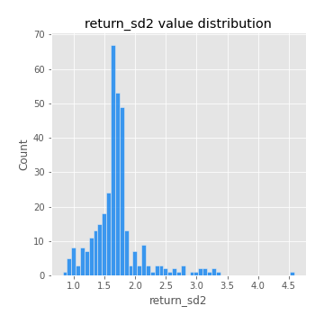
## Feature : return_skew1
- **Feature type** : continous
- **Missing** : 0.0%
- **Unique** : 347
- **Count** :347.0
- **Mean** :-0.11881093477241846
- **Std** :0.5733940573822961
- **Min** :-2.5068500114696386
- **25%th Percentile** : -0.32636362418518394
- **50%th Percentile** : -0.07062087436265768
- **75%th Percentile** : 0.10363126969363182
- **Max** :2.351757728252051

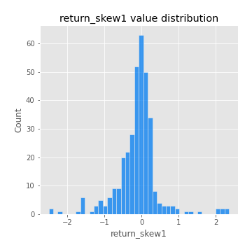
## Feature : return_skew2
- **Feature type** : continous
- **Missing** : 0.0%
- **Unique** : 347
- **Count** :347.0
- **Mean** :-0.2780357639193605
- **Std** :1.026945503338874
- **Min** :-7.3762354994385335
- **25%th Percentile** : -0.39532210765236386
- **50%th Percentile** : -0.06995265660176915
- **75%th Percentile** : 0.08428993565200546
- **Max** :4.1920266082732045

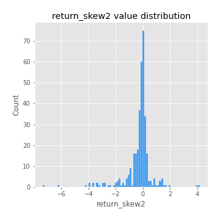
## Feature : return_kurtosis1
- **Feature type** : continous
- **Missing** : 0.0%
- **Unique** : 347
- **Count** :347.0
- **Mean** :2.290209374018989
- **Std** :4.061980143081381
- **Min** :-0.6782236720298775
- **25%th Percentile** : -0.02119190492012324
- **50%th Percentile** : 0.7727247604808016
- **75%th Percentile** : 2.624353558208778
- **Max** :23.612665658846073

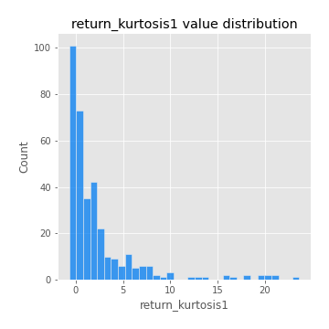
## Feature : return_kurtosis2
- **Feature type** : continous
- **Missing** : 0.0%
- **Unique** : 347
- **Count** :347.0
- **Mean** :4.222537578442772
- **Std** :9.434123574504262
- **Min** :-0.5517844482806087
- **25%th Percentile** : -0.05144500272090813
- **50%th Percentile** : 0.9966328054964189
- **75%th Percentile** : 3.6557789302663313
- **Max** :94.01659180149953

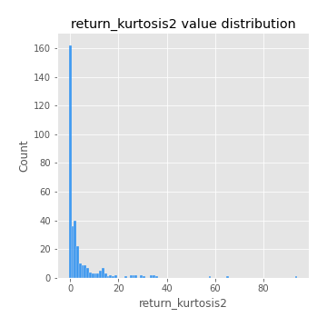
## Feature : return_autocorrelation_lag1_1
- **Feature type** : continous
- **Missing** : 0.0%
- **Unique** : 347
- **Count** :347.0
- **Mean** :0.0027699469691179384
- **Std** :0.06894741676078096
- **Min** :-0.2110198016529991
- **25%th Percentile** : -0.04688661562912805
- **50%th Percentile** : 0.002940837650506415
- **75%th Percentile** : 0.048739991644569394
- **Max** :0.20132571463207988

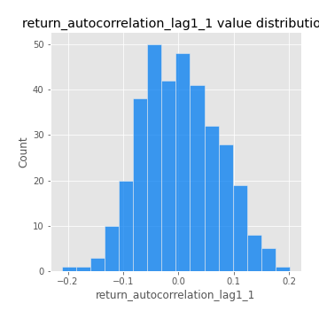
## Feature : return_autocorrelation_lag1_2
- **Feature type** : continous
- **Missing** : 0.0%
- **Unique** : 347
- **Count** :347.0
- **Mean** :0.008859464216745737
- **Std** :0.06748355258525945
- **Min** :-0.17778763204400128
- **25%th Percentile** : -0.03553824174761943
- **50%th Percentile** : 0.005177440432900092
- **75%th Percentile** : 0.05524393637577896
- **Max** :0.24324109476066813

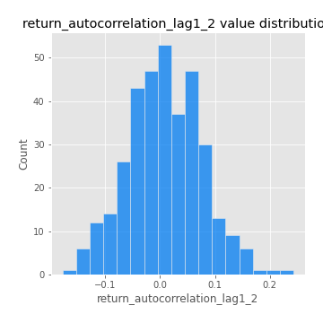
## Feature : return_autocorrelation_lag1_rolling_sd1
- **Feature type** : continous
- **Missing** : 0.0%
- **Unique** : 347
- **Count** :347.0
- **Mean** :0.9504831818409087
- **Std** :0.02076205729105037
- **Min** :0.8703309691717807
- **25%th Percentile** : 0.9414851160908353
- **50%th Percentile** : 0.9534160753861699
- **75%th Percentile** : 0.964536821385283
- **Max** :0.9870342687296267

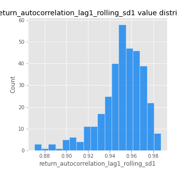
## Feature : return_autocorrelation_lag1_rolling_sd2
- **Feature type** : continous
- **Missing** : 0.0%
- **Unique** : 347
- **Count** :347.0
- **Mean** :0.9457596436233867
- **Std** :0.02098901770304634
- **Min** :0.8674418812186585
- **25%th Percentile** : 0.9343371661297125
- **50%th Percentile** : 0.9497042445389731
- **75%th Percentile** : 0.9600746324890359
- **Max** :0.9871675952783526

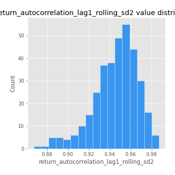
## Feature : return_correlation_ts1_lag_0
- **Feature type** : continous
- **Missing** : 0.0%
- **Unique** : 347
- **Count** :347.0
- **Mean** :0.3926602867048936
- **Std** :0.14619149786167163
- **Min** :-0.10256711281206837
- **25%th Percentile** : 0.334352777791327
- **50%th Percentile** : 0.4371287667831847
- **75%th Percentile** : 0.47982386285514933
- **Max** :0.9937227277077512

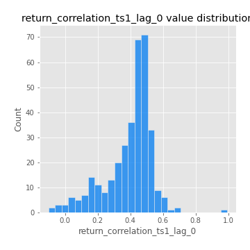
## Feature : return_correlation_ts1_lag_1
- **Feature type** : continous
- **Missing** : 0.0%
- **Unique** : 347
- **Count** :347.0
- **Mean** :0.009057244080517467
- **Std** :0.06483881804385665
- **Min** :-0.1756115085536608
- **25%th Percentile** : -0.03968287593493552
- **50%th Percentile** : 0.01080863885489263
- **75%th Percentile** : 0.05295070663891675
- **Max** :0.17320382095689543

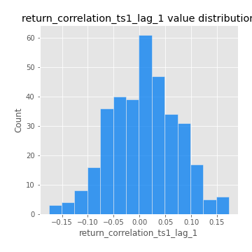
## Feature : return_correlation_ts1_lag_2
- **Feature type** : continous
- **Missing** : 0.0%
- **Unique** : 347
- **Count** :347.0
- **Mean** :0.009866268972596424
- **Std** :0.06902267407554813
- **Min** :-0.16285598016928493
- **25%th Percentile** : -0.03617918509953663
- **50%th Percentile** : 0.006003884429558877
- **75%th Percentile** : 0.06134960617356092
- **Max** :0.23834522347674816

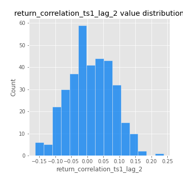
## Feature : return_correlation_ts1_lag_3
- **Feature type** : continous
- **Missing** : 0.0%
- **Unique** : 347
- **Count** :347.0
- **Mean** :0.019333172932213216
- **Std** :0.06862435737509279
- **Min** :-0.21147540839842804
- **25%th Percentile** : -0.025554467313413987
- **50%th Percentile** : 0.019607740511766173
- **75%th Percentile** : 0.059547502391899584
- **Max** :0.23808054096877584

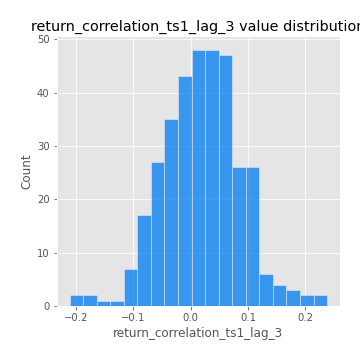
## Feature : return_correlation_ts2_lag_1
- **Feature type** : continous
- **Missing** : 0.0%
- **Unique** : 347
- **Count** :347.0
- **Mean** :0.012021361998318532
- **Std** :0.06951276718149621
- **Min** :-0.18249470099619458
- **25%th Percentile** : -0.03196408459089076
- **50%th Percentile** : 0.013522318745555617
- **75%th Percentile** : 0.06170434599490484
- **Max** :0.21197471023913403

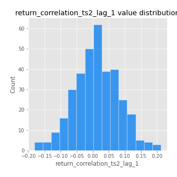
## Feature : return_correlation_ts2_lag_2
- **Feature type** : continous
- **Missing** : 0.0%
- **Unique** : 347
- **Count** :347.0
- **Mean** :0.004138806145035959
- **Std** :0.06526077411892967
- **Min** :-0.2757460186107768
- **25%th Percentile** : -0.030976434630792735
- **50%th Percentile** : 0.004135077276831679
- **75%th Percentile** : 0.04397207222955926
- **Max** :0.17450397192771194

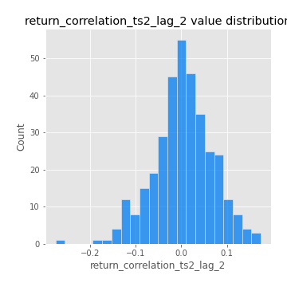
## Feature : return_correlation_ts2_lag_3
- **Feature type** : continous
- **Missing** : 0.0%
- **Unique** : 347
- **Count** :347.0
- **Mean** :0.018965248093109326
- **Std** :0.06300004149461216
- **Min** :-0.17697863431182184
- **25%th Percentile** : -0.02240344890510907
- **50%th Percentile** : 0.020399994641567266
- **75%th Percentile** : 0.06243129141330534
- **Max** :0.18227042221329348

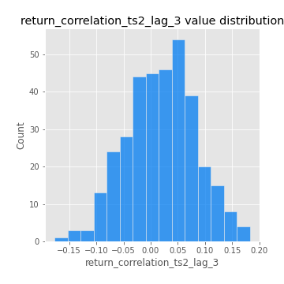
## Feature : price2_granger_cause_price1
- **Feature type** : continous
- **Missing** : 0.0%
- **Unique** : 347
- **Count** :347.0
- **Mean** :0.2527354043350158
- **Std** :0.28340248099423027
- **Min** :7.246976842004893e-07
- **25%th Percentile** : 0.01960738196183555
- **50%th Percentile** : 0.110759348549784
- **75%th Percentile** : 0.4247442463713301
- **Max** :0.9969124919279723

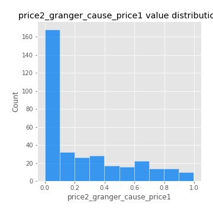
## Feature : price1_granger_cause_price2
- **Feature type** : continous
- **Missing** : 0.0%
- **Unique** : 347
- **Count** :347.0
- **Mean** :0.28851153418845354
- **Std** :0.3018267472660564
- **Min** :1.1899895894395574e-05
- **25%th Percentile** : 0.027036120807352633
- **50%th Percentile** : 0.17010557066003704
- **75%th Percentile** : 0.4915843072802102
- **Max** :0.9738943523084054

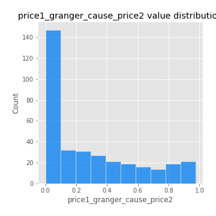

[<< Go back](../README.md)
