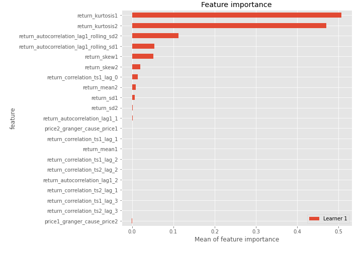
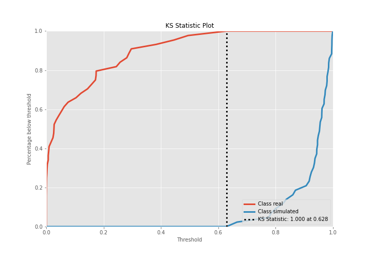
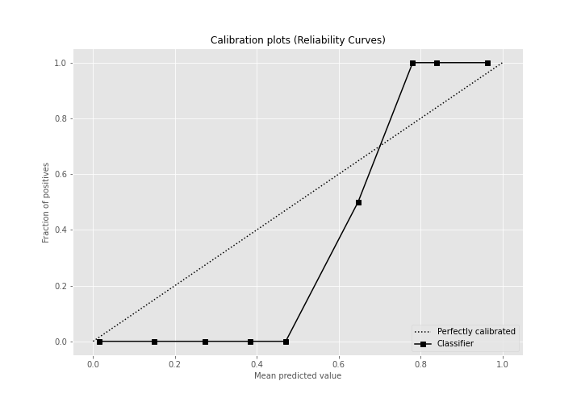
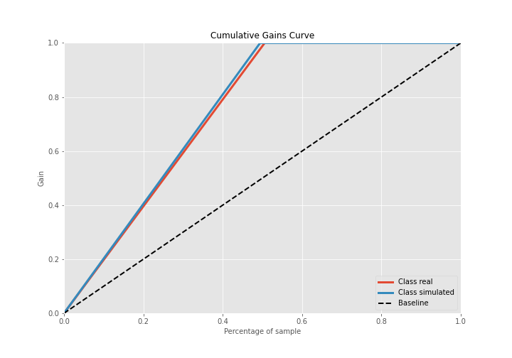
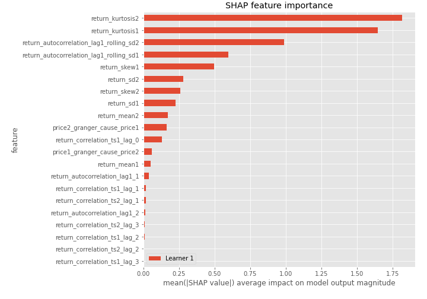
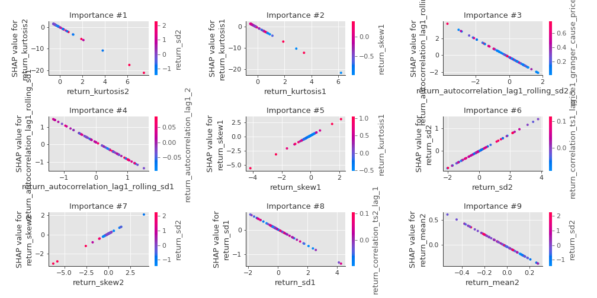
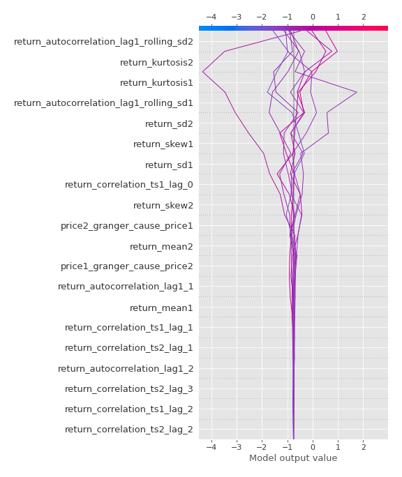
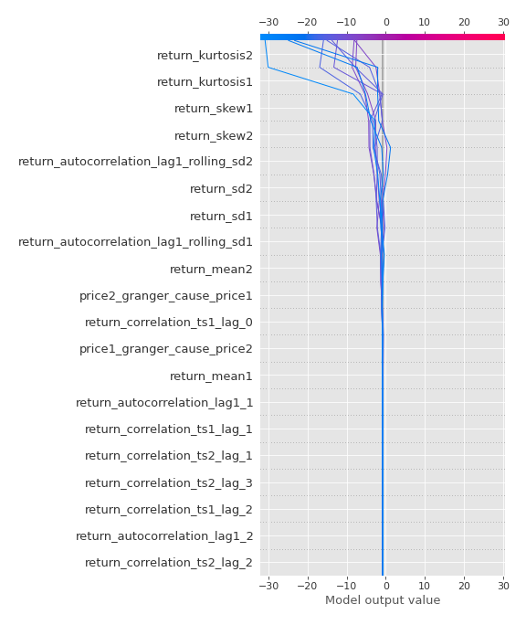
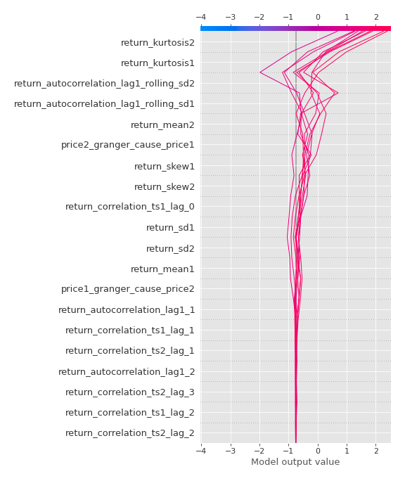

# Summary of 3_Linear

[<< Go back](../README.md)

## Logistic Regression (Linear)
- **n_jobs**: -1
- **explain_level**: 2

## Validation
 - **validation_type**: split
 - **train_ratio**: 0.75
 - **shuffle**: True
 - **stratify**: True

## Optimized metric
accuracy

## Training time

4.1 seconds

## Metric details
|           |    score |     threshold |
|:----------|---------:|--------------:|
| logloss   | 0.104208 | nan           |
| auc       | 1        | nan           |
| f1        | 1        |   0.642254    |
| accuracy  | 1        |   0.642254    |
| precision | 1        |   0.699966    |
| recall    | 1        |   3.44266e-14 |
| mcc       | 1        |   0.642254    |

## Confusion matrix (at threshold=0.642254)
|                      |   Predicted as real |   Predicted as simulated |
|:---------------------|--------------------:|-------------------------:|
| Labeled as real      |                  44 |                        0 |
| Labeled as simulated |                   0 |                       43 |

## Learning curves

## Coefficients
| feature                                 |   Learner_1 |
|:----------------------------------------|------------:|
| return_skew1                            |   1.39125   |
| return_correlation_ts1_lag_0            |   1.2653    |
| return_autocorrelation_lag1_1           |   0.588231  |
| return_skew2                            |   0.494744  |
| return_correlation_ts1_lag_1            |   0.382153  |
| return_sd2                              |   0.373019  |
| return_mean1                            |   0.362462  |
| return_correlation_ts2_lag_1            |   0.300731  |
| return_autocorrelation_lag1_2           |   0.254267  |
| return_correlation_ts2_lag_3            |   0.231268  |
| return_correlation_ts1_lag_2            |   0.14667   |
| return_correlation_ts2_lag_2            |   0.120886  |
| return_correlation_ts1_lag_3            |   0.0189037 |
| price1_granger_cause_price2             |  -0.251768  |
| return_sd1                              |  -0.326642  |
| price2_granger_cause_price1             |  -0.656932  |
| return_autocorrelation_lag1_rolling_sd1 |  -0.976742  |
| return_autocorrelation_lag1_rolling_sd2 |  -1.06577   |
| return_mean2                            |  -1.22232   |
| intercept                               |  -1.40565   |
| return_kurtosis2                        |  -2.84717   |
| return_kurtosis1                        |  -3.40996   |

## Permutation-based Importance

## Confusion Matrix

## Normalized Confusion Matrix

## ROC Curve

## Kolmogorov-Smirnov Statistic

## Precision-Recall Curve

## Calibration Curve

## Cumulative Gains Curve

## Lift Curve

## SHAP Importance

## SHAP Dependence plots

### Dependence (Fold 1)

## SHAP Decision plots

### Top-10 Worst decisions for class 0 (Fold 1)

### Top-10 Best decisions for class 0 (Fold 1)

### Top-10 Worst decisions for class 1 (Fold 1)

### Top-10 Best decisions for class 1 (Fold 1)

[<< Go back](../README.md)
