# Exploratory Data Analysis

[<< Go back](../README.md)
## Feature : target
- **Feature type** : categorical
- **Missing** : 0.0%
- **Unique** : 2
- **Count** :347
- **Unique** :2
- **Top** :simulated
- **Freq** :178

## Feature : return_mean1
- **Feature type** : continous
- **Missing** : 0.0%
- **Unique** : 347
- **Count** :347.0
- **Mean** :0.07015068572997081
- **Std** :0.17447420127651248
- **Min** :-0.8013257464924618
- **25%th Percentile** : -0.02748559582007254
- **50%th Percentile** : 0.07523096373166653
- **75%th Percentile** : 0.15450709799017234
- **Max** :0.6098958291204337

## Feature : return_mean2
- **Feature type** : continous
- **Missing** : 0.0%
- **Unique** : 347
- **Count** :347.0
- **Mean** :-0.04157332895336051
- **Std** :0.16811204833774526
- **Min** :-0.6585837225542701
- **25%th Percentile** : -0.15157972510140472
- **50%th Percentile** : -0.0220208674878389
- **75%th Percentile** : 0.07696993190833729
- **Max** :0.6801605239983173

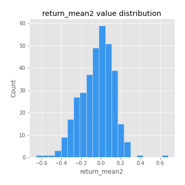
## Feature : return_sd1
- **Feature type** : continous
- **Missing** : 0.0%
- **Unique** : 347
- **Count** :347.0
- **Mean** :1.5892142082665053
- **Std** :0.3530830868663967
- **Min** :0.8102430347636637
- **25%th Percentile** : 1.4537943541433824
- **50%th Percentile** : 1.5290286933045119
- **75%th Percentile** : 1.6532963400481675
- **Max** :3.332494027875222

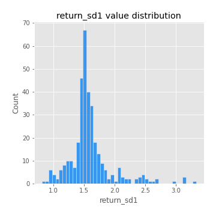
## Feature : return_sd2
- **Feature type** : continous
- **Missing** : 0.0%
- **Unique** : 347
- **Count** :347.0
- **Mean** :1.6876559672799905
- **Std** :0.39835124896595037
- **Min** :0.9060171249911689
- **25%th Percentile** : 1.5339838283209464
- **50%th Percentile** : 1.668028501312796
- **75%th Percentile** : 1.7570526028486728
- **Max** :4.59233049161685

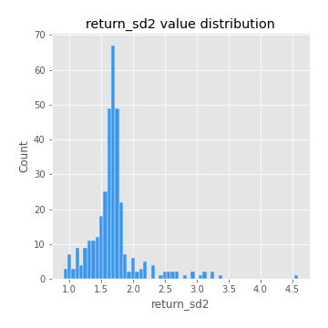
## Feature : return_skew1
- **Feature type** : continous
- **Missing** : 0.0%
- **Unique** : 347
- **Count** :347.0
- **Mean** :-0.1626606886940272
- **Std** :0.7215767322302696
- **Min** :-4.239645236578449
- **25%th Percentile** : -0.29753503610502047
- **50%th Percentile** : -0.06261693496669146
- **75%th Percentile** : 0.10165323872816934
- **Max** :2.351757728252051

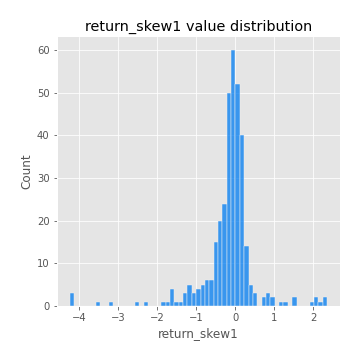
## Feature : return_skew2
- **Feature type** : continous
- **Missing** : 0.0%
- **Unique** : 347
- **Count** :347.0
- **Mean** :-0.2901606192814508
- **Std** :1.0661826544949644
- **Min** :-7.3762354994385335
- **25%th Percentile** : -0.3670605176742122
- **50%th Percentile** : -0.07736221891294377
- **75%th Percentile** : 0.08946204717500877
- **Max** :4.1920266082732045

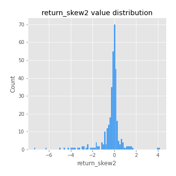
## Feature : return_kurtosis1
- **Feature type** : continous
- **Missing** : 0.0%
- **Unique** : 347
- **Count** :347.0
- **Mean** :2.5839848343092346
- **Std** :5.637225078925182
- **Min** :-0.6049033322794957
- **25%th Percentile** : -0.08047528849993202
- **50%th Percentile** : 0.5107230220101044
- **75%th Percentile** : 2.373444226909248
- **Max** :40.485294874464934

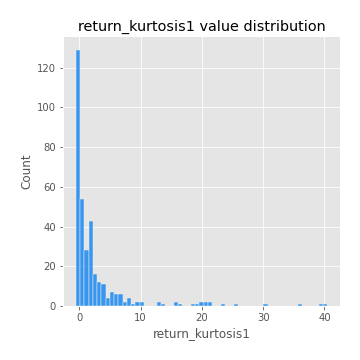
## Feature : return_kurtosis2
- **Feature type** : continous
- **Missing** : 0.0%
- **Unique** : 347
- **Count** :347.0
- **Mean** :4.354950636914062
- **Std** :10.041031179162948
- **Min** :-0.7080693705387682
- **25%th Percentile** : -0.06683151588209535
- **50%th Percentile** : 0.6016295471419948
- **75%th Percentile** : 3.8586921564822534
- **Max** :94.01659180149953

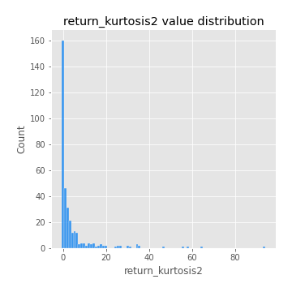
## Feature : return_autocorrelation_lag1_1
- **Feature type** : continous
- **Missing** : 0.0%
- **Unique** : 347
- **Count** :347.0
- **Mean** :0.005784598292376021
- **Std** :0.06968032839367141
- **Min** :-0.2110198016529991
- **25%th Percentile** : -0.04342586233947582
- **50%th Percentile** : 0.005498420456186117
- **75%th Percentile** : 0.05587976093181109
- **Max** :0.20132571463207988

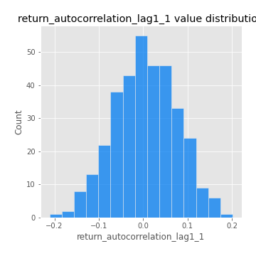
## Feature : return_autocorrelation_lag1_2
- **Feature type** : continous
- **Missing** : 0.0%
- **Unique** : 347
- **Count** :347.0
- **Mean** :0.009076459957925487
- **Std** :0.06630891159999695
- **Min** :-0.21004711091130504
- **25%th Percentile** : -0.03628194992169537
- **50%th Percentile** : 0.01203464190523633
- **75%th Percentile** : 0.056026344311910115
- **Max** :0.2317751711366467

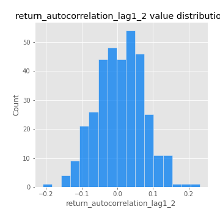
## Feature : return_autocorrelation_lag1_rolling_sd1
- **Feature type** : continous
- **Missing** : 0.0%
- **Unique** : 347
- **Count** :347.0
- **Mean** :0.9474670782956316
- **Std** :0.02109998478928041
- **Min** :0.8551013296183808
- **25%th Percentile** : 0.9369566856922718
- **50%th Percentile** : 0.9490390787826323
- **75%th Percentile** : 0.9636230351394989
- **Max** :0.9853323132723477

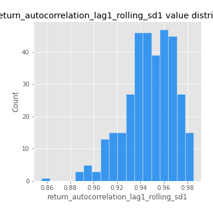
## Feature : return_autocorrelation_lag1_rolling_sd2
- **Feature type** : continous
- **Missing** : 0.0%
- **Unique** : 347
- **Count** :347.0
- **Mean** :0.9450780077437024
- **Std** :0.02179256598730799
- **Min** :0.8000678266532857
- **25%th Percentile** : 0.9345505213554177
- **50%th Percentile** : 0.9473482094274005
- **75%th Percentile** : 0.959460461422738
- **Max** :0.983940118474517

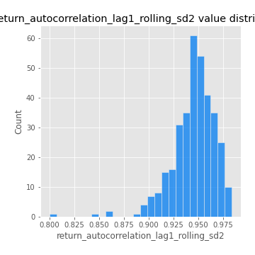
## Feature : return_correlation_ts1_lag_0
- **Feature type** : continous
- **Missing** : 0.0%
- **Unique** : 347
- **Count** :347.0
- **Mean** :0.38910808262786667
- **Std** :0.14726370645219924
- **Min** :-0.10256711281206837
- **25%th Percentile** : 0.334352777791327
- **50%th Percentile** : 0.42064006675910653
- **75%th Percentile** : 0.47907046780101914
- **Max** :0.9937227277077512

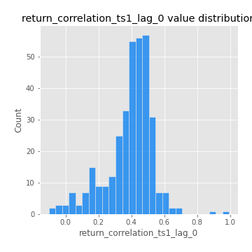
## Feature : return_correlation_ts1_lag_1
- **Feature type** : continous
- **Missing** : 0.0%
- **Unique** : 347
- **Count** :347.0
- **Mean** :0.011331414799149241
- **Std** :0.06508240302230708
- **Min** :-0.18856827637524448
- **25%th Percentile** : -0.036116067908467074
- **50%th Percentile** : 0.009551420430529015
- **75%th Percentile** : 0.05294146731693922
- **Max** :0.22656232473927565

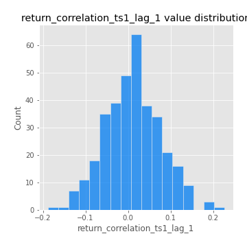
## Feature : return_correlation_ts1_lag_2
- **Feature type** : continous
- **Missing** : 0.0%
- **Unique** : 347
- **Count** :347.0
- **Mean** :0.008946579265467226
- **Std** :0.06560478234972299
- **Min** :-0.14326176299733834
- **25%th Percentile** : -0.033365053082787116
- **50%th Percentile** : 0.008033673319028429
- **75%th Percentile** : 0.04956481593857143
- **Max** :0.23969123806344567

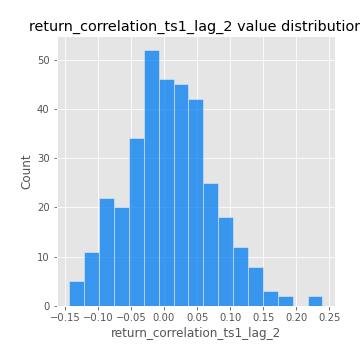
## Feature : return_correlation_ts1_lag_3
- **Feature type** : continous
- **Missing** : 0.0%
- **Unique** : 347
- **Count** :347.0
- **Mean** :0.017431728362516507
- **Std** :0.0676592357683752
- **Min** :-0.21147540839842804
- **25%th Percentile** : -0.030420444513918236
- **50%th Percentile** : 0.019558867744993123
- **75%th Percentile** : 0.060620494686071794
- **Max** :0.23808054096877584

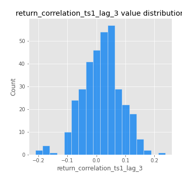
## Feature : return_correlation_ts2_lag_1
- **Feature type** : continous
- **Missing** : 0.0%
- **Unique** : 347
- **Count** :347.0
- **Mean** :0.015469215790673303
- **Std** :0.06815779163077472
- **Min** :-0.1363859619205903
- **25%th Percentile** : -0.031282316328475473
- **50%th Percentile** : 0.013485612437064295
- **75%th Percentile** : 0.06209626340771757
- **Max** :0.3425036902091001

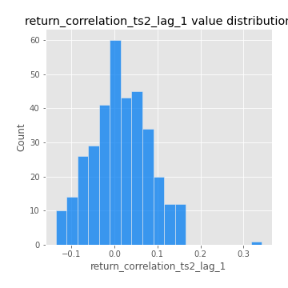
## Feature : return_correlation_ts2_lag_2
- **Feature type** : continous
- **Missing** : 0.0%
- **Unique** : 347
- **Count** :347.0
- **Mean** :0.0053665990283018085
- **Std** :0.06649758920989934
- **Min** :-0.18381967289455395
- **25%th Percentile** : -0.037649368359409206
- **50%th Percentile** : 0.005486304639546648
- **75%th Percentile** : 0.05014757151635624
- **Max** :0.1668209648754713

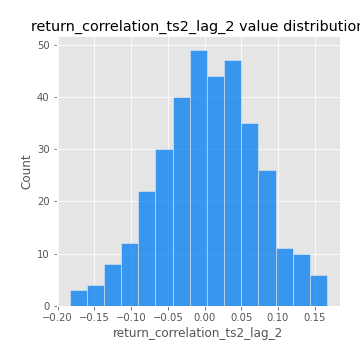
## Feature : return_correlation_ts2_lag_3
- **Feature type** : continous
- **Missing** : 0.0%
- **Unique** : 347
- **Count** :347.0
- **Mean** :0.01935291913594506
- **Std** :0.05880634410494692
- **Min** :-0.15950107809134745
- **25%th Percentile** : -0.01640971251072368
- **50%th Percentile** : 0.0199216920989213
- **75%th Percentile** : 0.06059024934419949
- **Max** :0.1756605418705817

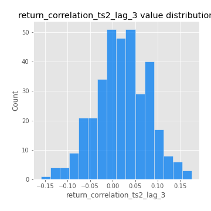
## Feature : price2_granger_cause_price1
- **Feature type** : continous
- **Missing** : 0.0%
- **Unique** : 347
- **Count** :347.0
- **Mean** :0.2439146212175465
- **Std** :0.2875318960590505
- **Min** :1.2389484779659792e-09
- **25%th Percentile** : 0.011847325207121322
- **50%th Percentile** : 0.1086483733524221
- **75%th Percentile** : 0.41489127942649945
- **Max** :0.9898380228448623

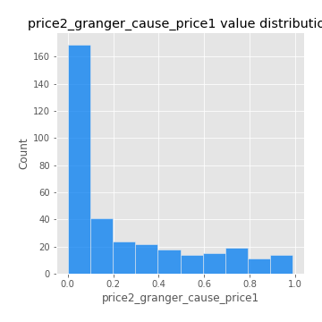
## Feature : price1_granger_cause_price2
- **Feature type** : continous
- **Missing** : 0.0%
- **Unique** : 347
- **Count** :347.0
- **Mean** :0.30087460927447435
- **Std** :0.2946329788800104
- **Min** :1.2012269232170316e-11
- **25%th Percentile** : 0.03225725011224353
- **50%th Percentile** : 0.21339232528017482
- **75%th Percentile** : 0.504710884748006
- **Max** :0.9871292066441198

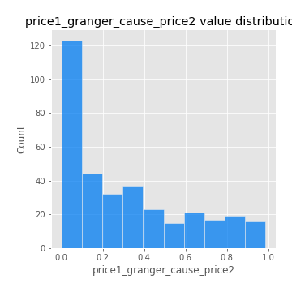

[<< Go back](../README.md)
