# Summary of 3_Linear

[<< Go back](../README.md)

## Logistic Regression (Linear)
- **n_jobs**: -1
- **explain_level**: 2

## Validation
 - **validation_type**: split
 - **train_ratio**: 0.75
 - **shuffle**: True
 - **stratify**: True

## Optimized metric
accuracy

## Training time

4.4 seconds

## Metric details
|           |     score |    threshold |
|:----------|----------:|-------------:|
| logloss   | 0.0899327 | nan          |
| auc       | 0.998409  | nan          |
| f1        | 0.987952  |   0.497747   |
| accuracy  | 0.988506  |   0.497747   |
| precision | 1         |   0.896599   |
| recall    | 1         |   1.5316e-11 |
| mcc       | 0.977225  |   0.497747   |

## Confusion matrix (at threshold=0.497747)
|                      |   Predicted as real |   Predicted as simulated |
|:---------------------|--------------------:|-------------------------:|
| Labeled as real      |                  45 |                        1 |
| Labeled as simulated |                   0 |                       41 |

## Learning curves
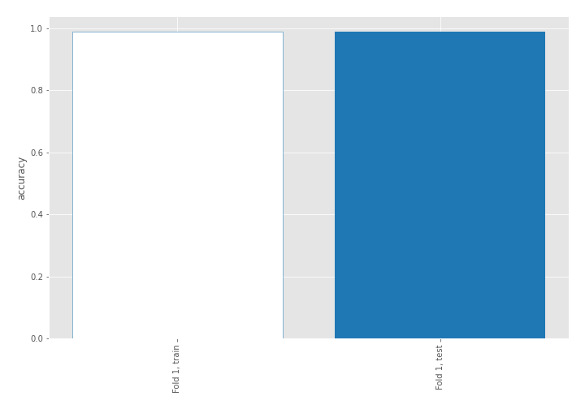

## Coefficients
| feature                                 |   Learner_1 |
|:----------------------------------------|------------:|
| return_skew1                            |   1.77694   |
| return_correlation_ts1_lag_0            |   1.02124   |
| return_skew2                            |   0.921431  |
| return_mean1                            |   0.88722   |
| return_correlation_ts1_lag_2            |   0.337916  |
| return_autocorrelation_lag1_2           |   0.306076  |
| return_sd2                              |   0.2998    |
| return_autocorrelation_lag1_1           |   0.270093  |
| return_correlation_ts2_lag_2            |   0.263514  |
| return_correlation_ts1_lag_1            |   0.232673  |
| return_correlation_ts2_lag_1            |   0.175568  |
| return_correlation_ts1_lag_3            |   0.0463198 |
| return_correlation_ts2_lag_3            |  -0.0421663 |
| return_sd1                              |  -0.215339  |
| price1_granger_cause_price2             |  -0.386847  |
| return_autocorrelation_lag1_rolling_sd1 |  -0.655589  |
| price2_granger_cause_price1             |  -0.720035  |
| return_mean2                            |  -0.822563  |
| return_autocorrelation_lag1_rolling_sd2 |  -1.00256   |
| intercept                               |  -1.61342   |
| return_kurtosis2                        |  -2.99543   |
| return_kurtosis1                        |  -3.58376   |

## Permutation-based Importance
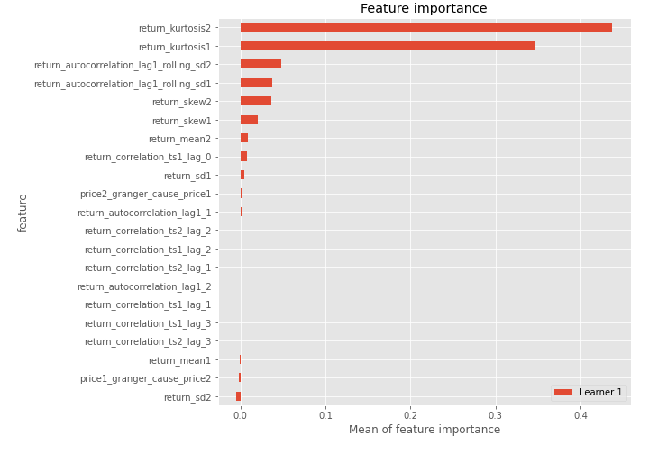
## Confusion Matrix

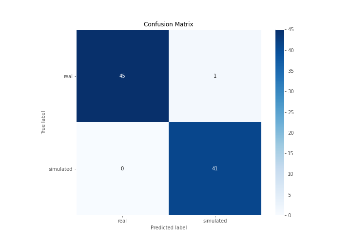

## Normalized Confusion Matrix

## ROC Curve

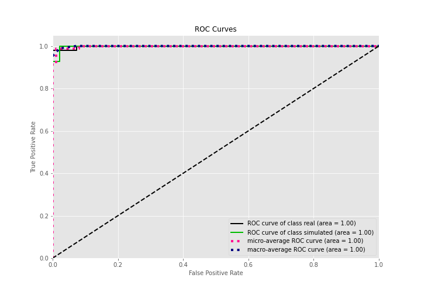

## Kolmogorov-Smirnov Statistic

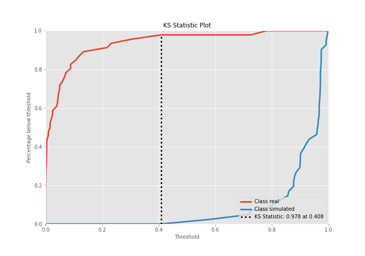

## Precision-Recall Curve

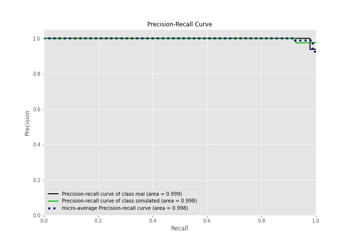

## Calibration Curve

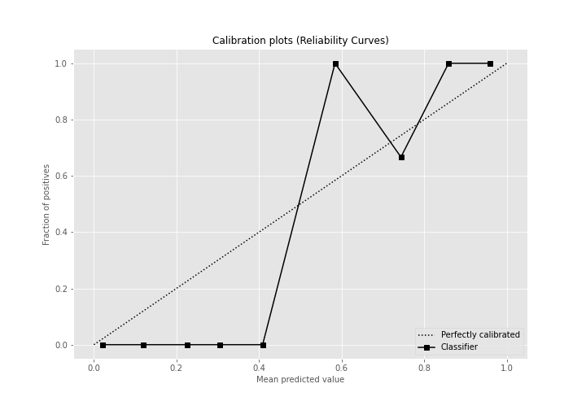

## Cumulative Gains Curve

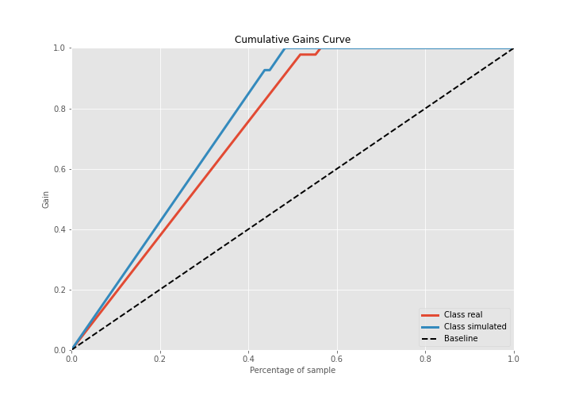

## Lift Curve

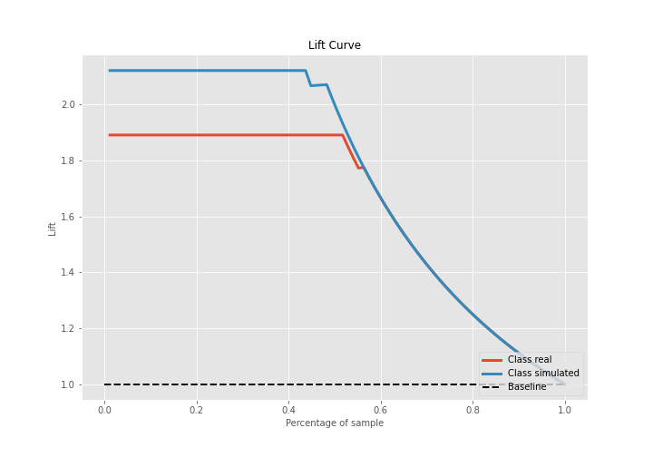

## SHAP Importance
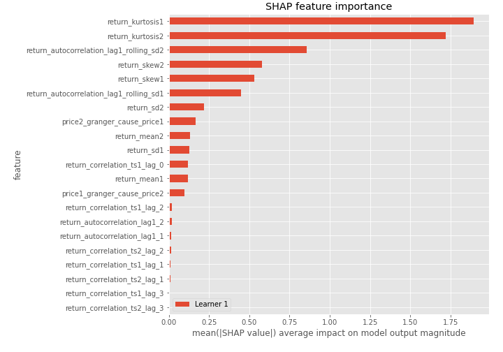

## SHAP Dependence plots

### Dependence (Fold 1)
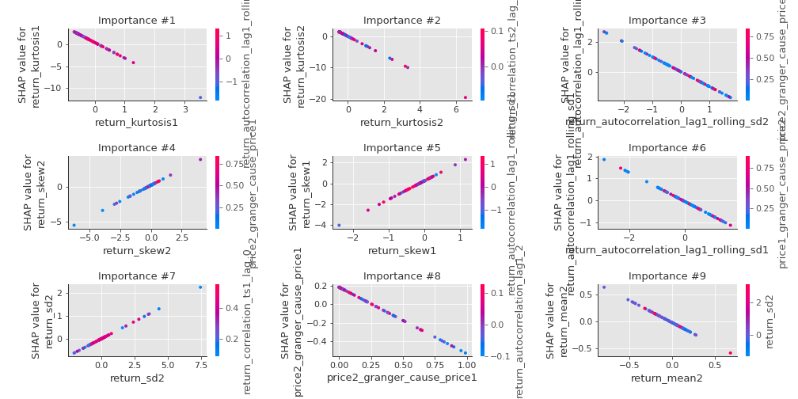

## SHAP Decision plots

### Top-10 Worst decisions for class 0 (Fold 1)
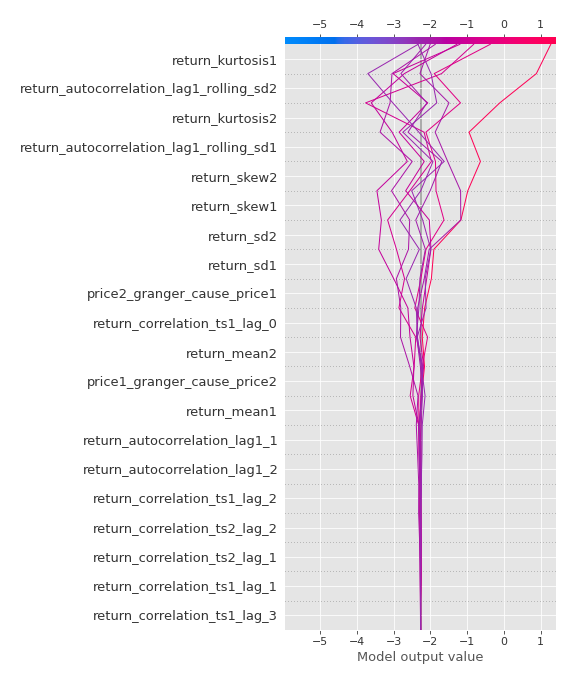
### Top-10 Best decisions for class 0 (Fold 1)
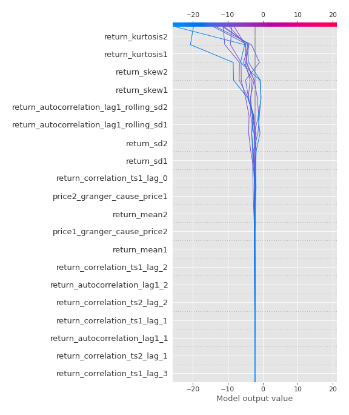
### Top-10 Worst decisions for class 1 (Fold 1)
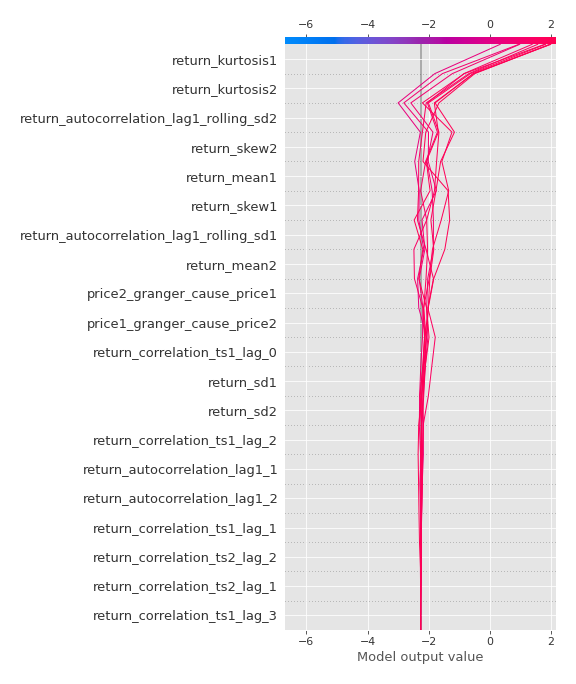
### Top-10 Best decisions for class 1 (Fold 1)
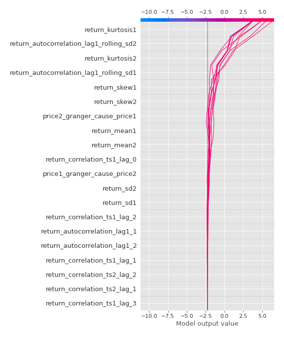

[<< Go back](../README.md)
