# Summary of 3_Linear

[<< Go back](../README.md)

## Logistic Regression (Linear)
- **n_jobs**: -1
- **explain_level**: 2

## Validation
 - **validation_type**: split
 - **train_ratio**: 0.75
 - **shuffle**: True
 - **stratify**: True

## Optimized metric
accuracy

## Training time

6.7 seconds

## Metric details
|           |    score |     threshold |
|:----------|---------:|--------------:|
| logloss   | 0.108098 | nan           |
| auc       | 0.999471 | nan           |
| f1        | 0.988764 |   0.624688    |
| accuracy  | 0.988506 |   0.624688    |
| precision | 1        |   0.941595    |
| recall    | 1        |   5.38547e-16 |
| mcc       | 0.977273 |   0.752373    |

## Confusion matrix (at threshold=0.624688)
|                      |   Predicted as real |   Predicted as simulated |
|:---------------------|--------------------:|-------------------------:|
| Labeled as real      |                  42 |                        1 |
| Labeled as simulated |                   0 |                       44 |

## Learning curves

## Coefficients
| feature                                 |   Learner_1 |
|:----------------------------------------|------------:|
| return_skew1                            |   1.22534   |
| return_skew2                            |   1.15096   |
| return_correlation_ts1_lag_0            |   0.917972  |
| return_autocorrelation_lag1_1           |   0.45948   |
| return_mean1                            |   0.456781  |
| return_correlation_ts2_lag_2            |   0.455092  |
| return_correlation_ts2_lag_1            |   0.410267  |
| return_sd2                              |   0.398952  |
| return_autocorrelation_lag1_2           |   0.353323  |
| return_correlation_ts1_lag_1            |   0.34041   |
| return_correlation_ts1_lag_2            |   0.283771  |
| return_sd1                              |  -0.0798713 |
| return_correlation_ts2_lag_3            |  -0.154505  |
| return_correlation_ts1_lag_3            |  -0.173821  |
| price1_granger_cause_price2             |  -0.369272  |
| price2_granger_cause_price1             |  -0.467355  |
| return_autocorrelation_lag1_rolling_sd1 |  -0.730169  |
| return_autocorrelation_lag1_rolling_sd2 |  -0.775437  |
| return_mean2                            |  -1.07089   |
| intercept                               |  -1.34915   |
| return_kurtosis1                        |  -3.38027   |
| return_kurtosis2                        |  -3.39806   |

## Permutation-based Importance
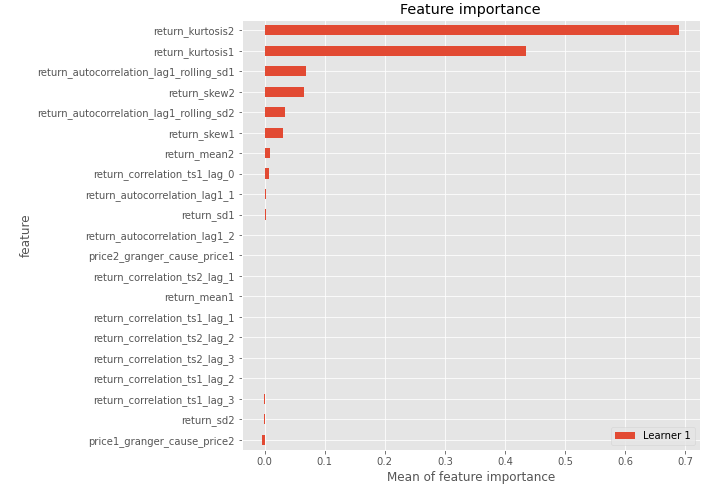
## Confusion Matrix

## Normalized Confusion Matrix

## ROC Curve

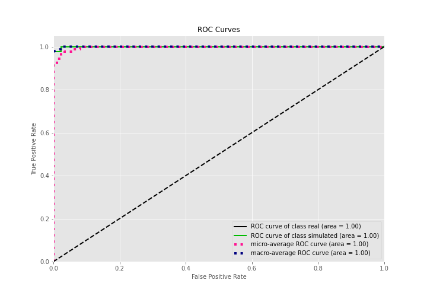

## Kolmogorov-Smirnov Statistic

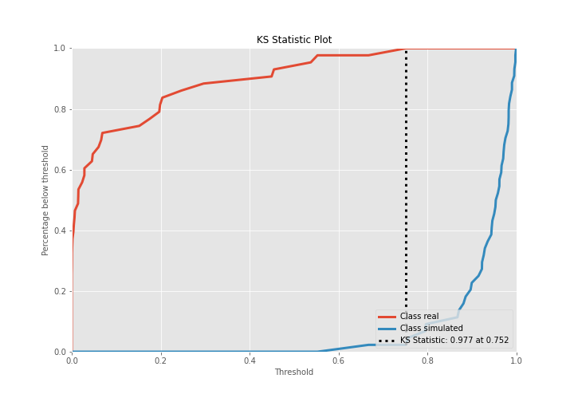

## Precision-Recall Curve

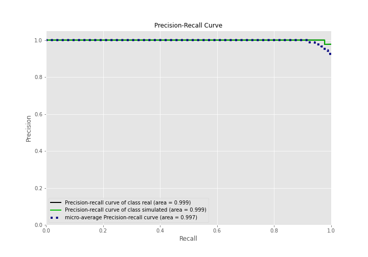

## Calibration Curve

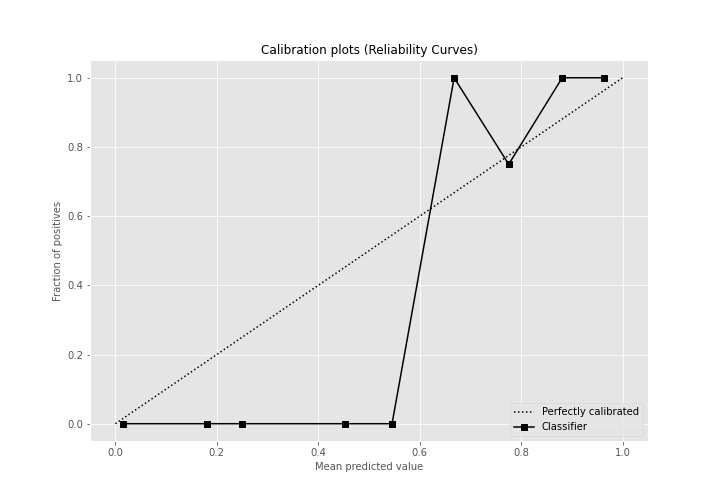

## Cumulative Gains Curve

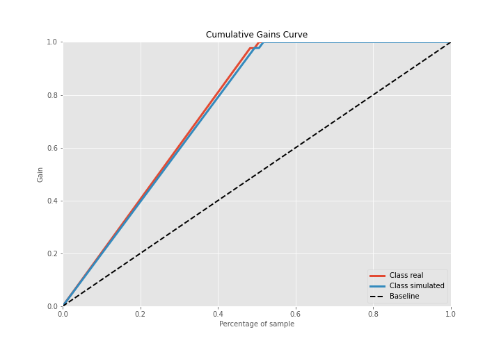

## Lift Curve

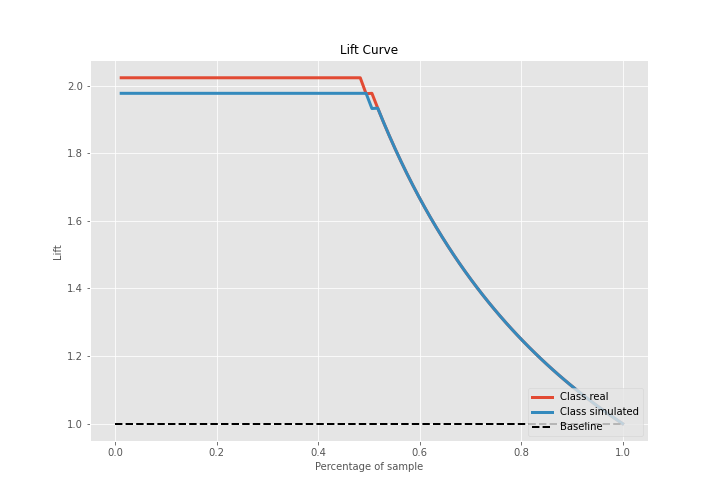

## SHAP Importance
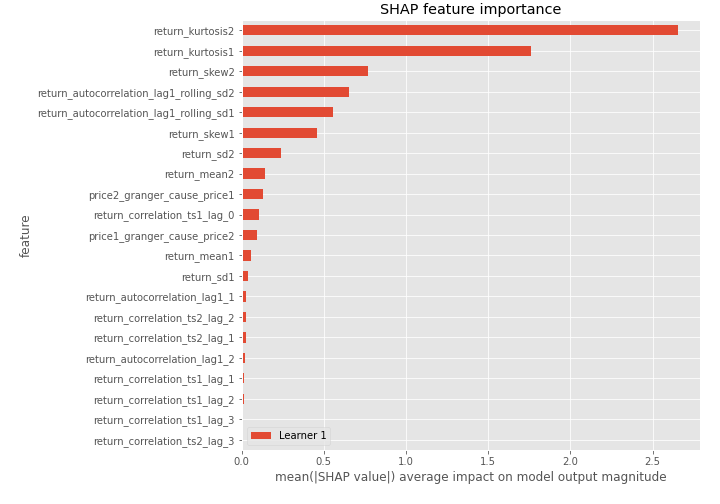

## SHAP Dependence plots

### Dependence (Fold 1)
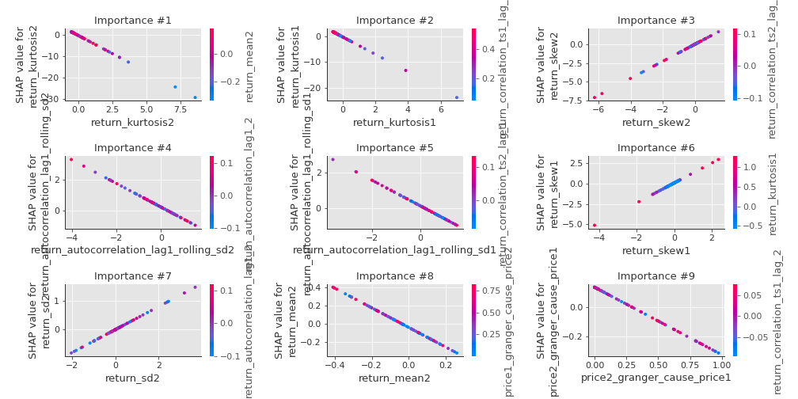

## SHAP Decision plots

### Top-10 Worst decisions for class 0 (Fold 1)
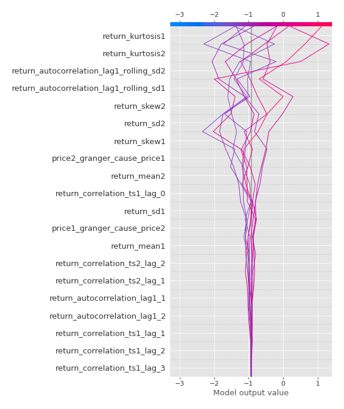
### Top-10 Best decisions for class 0 (Fold 1)
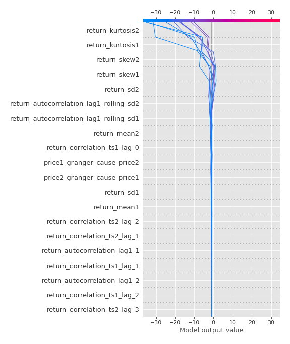
### Top-10 Worst decisions for class 1 (Fold 1)
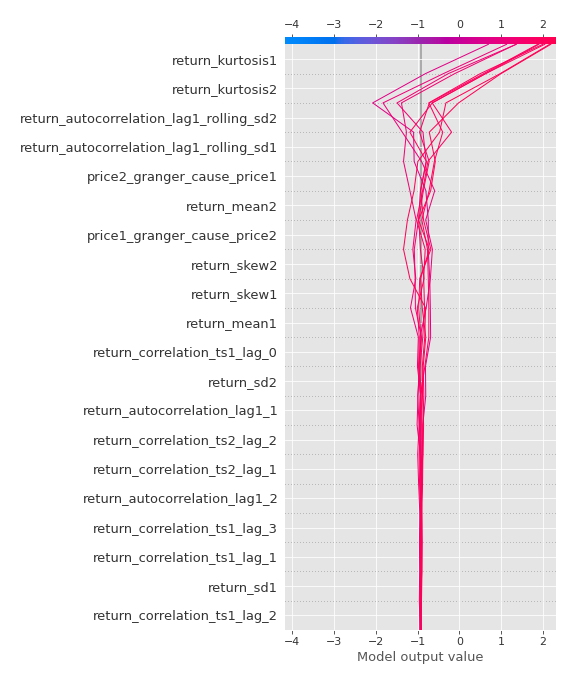
### Top-10 Best decisions for class 1 (Fold 1)
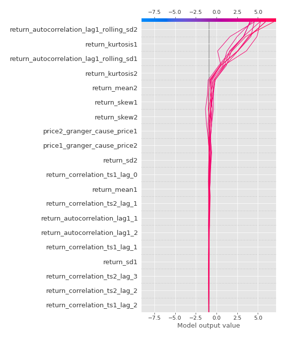

[<< Go back](../README.md)
