# Exploratory Data Analysis

[<< Go back](../README.md)
## Feature : target
- **Feature type** : categorical
- **Missing** : 0.0%
- **Unique** : 2
- **Count** :347
- **Unique** :2
- **Top** :simulated
- **Freq** :176

## Feature : return_mean1
- **Feature type** : continous
- **Missing** : 0.0%
- **Unique** : 347
- **Count** :347.0
- **Mean** :0.07259240329450053
- **Std** :0.17335933428730077
- **Min** :-0.7531570066930683
- **25%th Percentile** : -0.028335614521701948
- **50%th Percentile** : 0.07815830301519558
- **75%th Percentile** : 0.1607428647344547
- **Max** :0.673571647578221

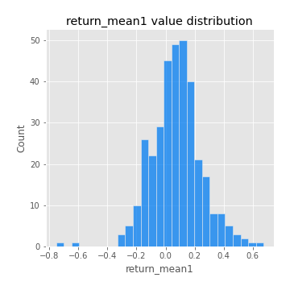
## Feature : return_mean2
- **Feature type** : continous
- **Missing** : 0.0%
- **Unique** : 347
- **Count** :347.0
- **Mean** :-0.04321262810069643
- **Std** :0.17823057299306425
- **Min** :-0.8939370049755802
- **25%th Percentile** : -0.15122574874300368
- **50%th Percentile** : -0.024488387396509936
- **75%th Percentile** : 0.07489950324317052
- **Max** :0.6801605239983173

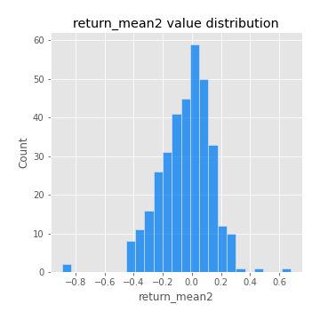
## Feature : return_sd1
- **Feature type** : continous
- **Missing** : 0.0%
- **Unique** : 347
- **Count** :347.0
- **Mean** :1.6001663327986486
- **Std** :0.35301160292033995
- **Min** :0.8102430347636637
- **25%th Percentile** : 1.4773802419858337
- **50%th Percentile** : 1.5439605005739672
- **75%th Percentile** : 1.6617565823516647
- **Max** :3.181425034216533

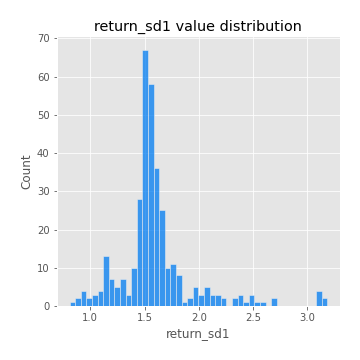
## Feature : return_sd2
- **Feature type** : continous
- **Missing** : 0.0%
- **Unique** : 347
- **Count** :347.0
- **Mean** :1.6867377965376749
- **Std** :0.3806182130642567
- **Min** :0.8198779632289204
- **25%th Percentile** : 1.5506539315032022
- **50%th Percentile** : 1.6718066831123215
- **75%th Percentile** : 1.7637641013725327
- **Max** :4.59233049161685

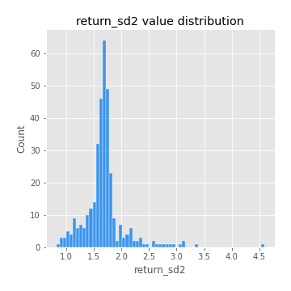
## Feature : return_skew1
- **Feature type** : continous
- **Missing** : 0.0%
- **Unique** : 347
- **Count** :347.0
- **Mean** :-0.19484940808006912
- **Std** :0.7021993752810023
- **Min** :-4.239645236578449
- **25%th Percentile** : -0.36055649237129156
- **50%th Percentile** : -0.0784995625142623
- **75%th Percentile** : 0.0875701566260993
- **Max** :2.351757728252051

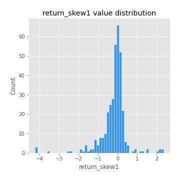
## Feature : return_skew2
- **Feature type** : continous
- **Missing** : 0.0%
- **Unique** : 347
- **Count** :347.0
- **Mean** :-0.22754860606023644
- **Std** :0.9816100961322948
- **Min** :-6.262899561987459
- **25%th Percentile** : -0.31928949914624727
- **50%th Percentile** : -0.059226085785390216
- **75%th Percentile** : 0.12482442560331825
- **Max** :4.1920266082732045

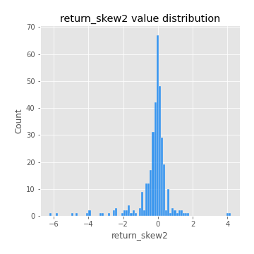
## Feature : return_kurtosis1
- **Feature type** : continous
- **Missing** : 0.0%
- **Unique** : 347
- **Count** :347.0
- **Mean** :2.580633432722403
- **Std** :5.448861987145237
- **Min** :-0.6263899656014491
- **25%th Percentile** : -0.05939746411365876
- **50%th Percentile** : 0.5362575434880732
- **75%th Percentile** : 2.6990337880253565
- **Max** :40.485294874464934

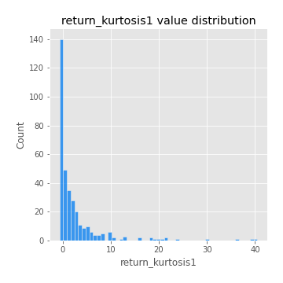
## Feature : return_kurtosis2
- **Feature type** : continous
- **Missing** : 0.0%
- **Unique** : 347
- **Count** :347.0
- **Mean** :3.731417522945178
- **Std** :8.299737103727535
- **Min** :-0.6123028610737098
- **25%th Percentile** : -0.0958519477699713
- **50%th Percentile** : 0.559257462732206
- **75%th Percentile** : 3.3451525378866567
- **Max** :64.99818629655663

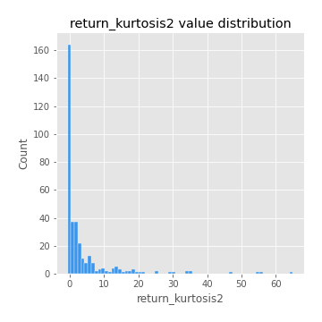
## Feature : return_autocorrelation_lag1_1
- **Feature type** : continous
- **Missing** : 0.0%
- **Unique** : 347
- **Count** :347.0
- **Mean** :0.008788506261173517
- **Std** :0.07066531204110987
- **Min** :-0.2110198016529991
- **25%th Percentile** : -0.04064468510817551
- **50%th Percentile** : 0.012753025276945879
- **75%th Percentile** : 0.05290751621111203
- **Max** :0.20920724875773594

## Feature : return_autocorrelation_lag1_2
- **Feature type** : continous
- **Missing** : 0.0%
- **Unique** : 347
- **Count** :347.0
- **Mean** :0.005173566058887642
- **Std** :0.07018554099016636
- **Min** :-0.2364404317158175
- **25%th Percentile** : -0.03772834804311248
- **50%th Percentile** : 0.005145753195619776
- **75%th Percentile** : 0.05463353735869733
- **Max** :0.2024676054184499

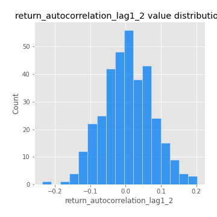
## Feature : return_autocorrelation_lag1_rolling_sd1
- **Feature type** : continous
- **Missing** : 0.0%
- **Unique** : 347
- **Count** :347.0
- **Mean** :0.9466795487401355
- **Std** :0.02348049184645366
- **Min** :0.8079562545969908
- **25%th Percentile** : 0.9354033413348029
- **50%th Percentile** : 0.9510443005174596
- **75%th Percentile** : 0.962386069837422
- **Max** :0.9870342687296267

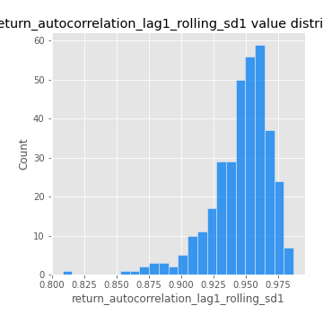
## Feature : return_autocorrelation_lag1_rolling_sd2
- **Feature type** : continous
- **Missing** : 0.0%
- **Unique** : 347
- **Count** :347.0
- **Mean** :0.9474481553860635
- **Std** :0.019008660835541938
- **Min** :0.8738338113950629
- **25%th Percentile** : 0.937008015372636
- **50%th Percentile** : 0.9498316223681775
- **75%th Percentile** : 0.9610203382620155
- **Max** :0.983940118474517

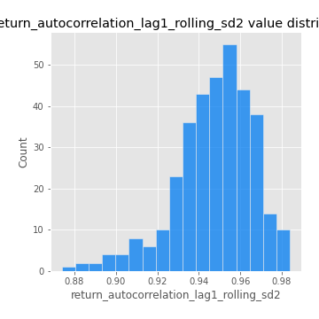
## Feature : return_correlation_ts1_lag_0
- **Feature type** : continous
- **Missing** : 0.0%
- **Unique** : 347
- **Count** :347.0
- **Mean** :0.38650829789856245
- **Std** :0.14725418044687116
- **Min** :-0.07366870340906873
- **25%th Percentile** : 0.33593985726953524
- **50%th Percentile** : 0.42501486761214
- **75%th Percentile** : 0.46830733277219816
- **Max** :0.9937227277077512

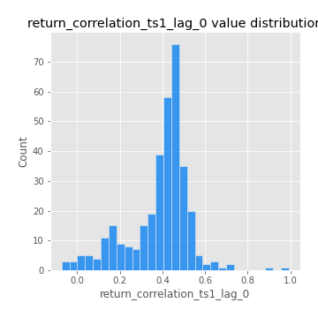
## Feature : return_correlation_ts1_lag_1
- **Feature type** : continous
- **Missing** : 0.0%
- **Unique** : 347
- **Count** :347.0
- **Mean** :0.009160528003133385
- **Std** :0.06726940083474262
- **Min** :-0.18856827637524448
- **25%th Percentile** : -0.040496429235236435
- **50%th Percentile** : 0.0079563888037946
- **75%th Percentile** : 0.052339421056514325
- **Max** :0.2116449191036058

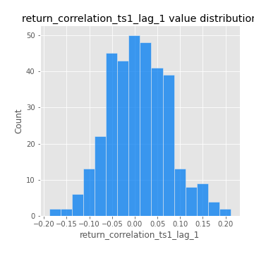
## Feature : return_correlation_ts1_lag_2
- **Feature type** : continous
- **Missing** : 0.0%
- **Unique** : 347
- **Count** :347.0
- **Mean** :0.005165368540261473
- **Std** :0.067809820935616
- **Min** :-0.172871336111873
- **25%th Percentile** : -0.03810510627824404
- **50%th Percentile** : 0.003892095911325179
- **75%th Percentile** : 0.05111191043128638
- **Max** :0.20348321667884745

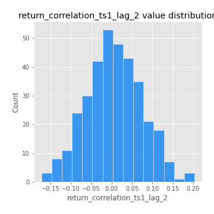
## Feature : return_correlation_ts1_lag_3
- **Feature type** : continous
- **Missing** : 0.0%
- **Unique** : 347
- **Count** :347.0
- **Mean** :0.015540823794638467
- **Std** :0.06780055323883648
- **Min** :-0.18059033867783728
- **25%th Percentile** : -0.030322033407036847
- **50%th Percentile** : 0.019105763303354704
- **75%th Percentile** : 0.05915410947181528
- **Max** :0.23808054096877584

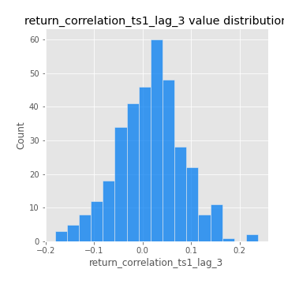
## Feature : return_correlation_ts2_lag_1
- **Feature type** : continous
- **Missing** : 0.0%
- **Unique** : 347
- **Count** :347.0
- **Mean** :0.019953098170035342
- **Std** :0.06794514260749072
- **Min** :-0.17665751184419612
- **25%th Percentile** : -0.021085916406840953
- **50%th Percentile** : 0.017853655111711834
- **75%th Percentile** : 0.062657409509762
- **Max** :0.3425036902091001

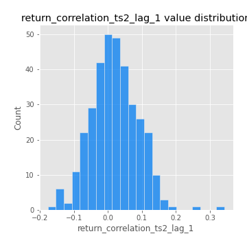
## Feature : return_correlation_ts2_lag_2
- **Feature type** : continous
- **Missing** : 0.0%
- **Unique** : 347
- **Count** :347.0
- **Mean** :0.006396256209232325
- **Std** :0.06631541498862271
- **Min** :-0.18793480063267962
- **25%th Percentile** : -0.03732972786958494
- **50%th Percentile** : 0.006060400813448756
- **75%th Percentile** : 0.0523762209447812
- **Max** :0.1955078103166214

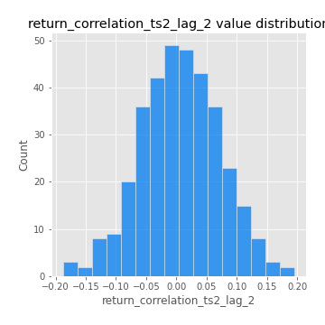
## Feature : return_correlation_ts2_lag_3
- **Feature type** : continous
- **Missing** : 0.0%
- **Unique** : 347
- **Count** :347.0
- **Mean** :0.015588727943548413
- **Std** :0.06406221568770704
- **Min** :-0.13287767820660334
- **25%th Percentile** : -0.026865738352337354
- **50%th Percentile** : 0.019352267336313542
- **75%th Percentile** : 0.06481486543046919
- **Max** :0.18227042221329348

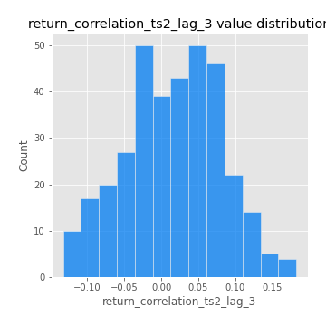
## Feature : price2_granger_cause_price1
- **Feature type** : continous
- **Missing** : 0.0%
- **Unique** : 347
- **Count** :347.0
- **Mean** :0.26491160905529343
- **Std** :0.2998934080849627
- **Min** :2.4312048970873696e-09
- **25%th Percentile** : 0.015983367933633863
- **50%th Percentile** : 0.11657921226010325
- **75%th Percentile** : 0.46445116551793547
- **Max** :0.9898380228448623

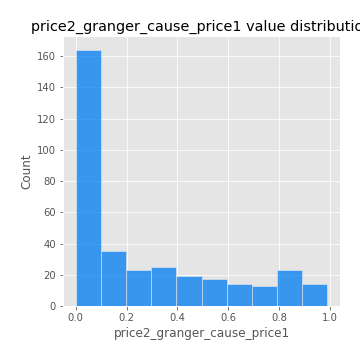
## Feature : price1_granger_cause_price2
- **Feature type** : continous
- **Missing** : 0.0%
- **Unique** : 347
- **Count** :347.0
- **Mean** :0.28676116651886197
- **Std** :0.2909323903397782
- **Min** :1.2012269232170316e-11
- **25%th Percentile** : 0.027672130297497398
- **50%th Percentile** : 0.19221278710217546
- **75%th Percentile** : 0.48106967109175763
- **Max** :0.9944149461063002

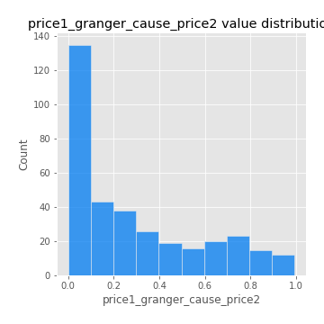

[<< Go back](../README.md)
