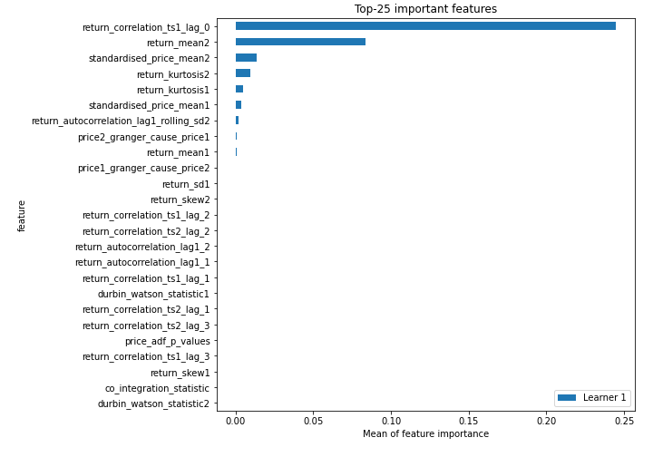
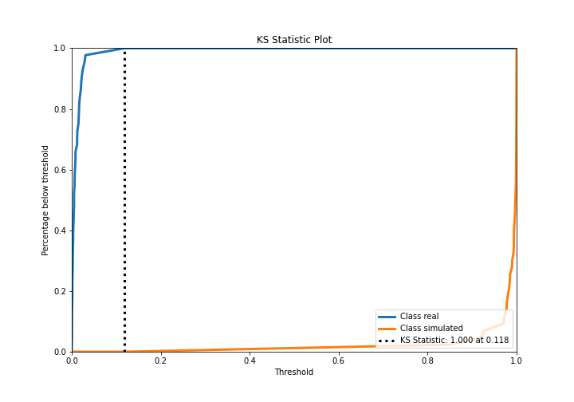
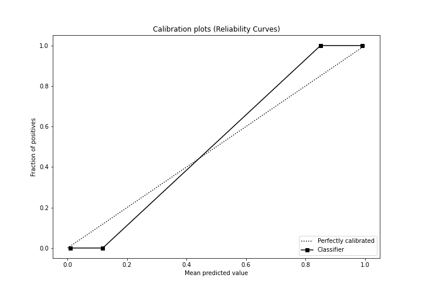
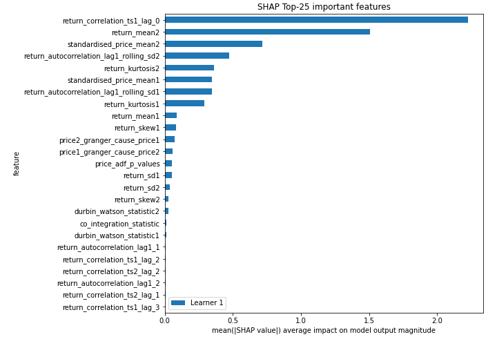
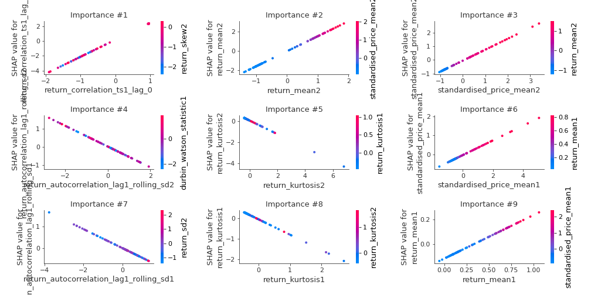
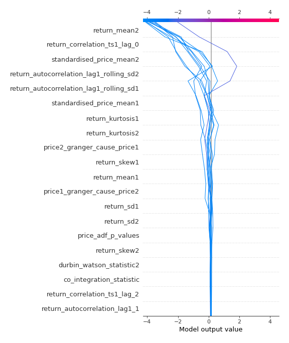
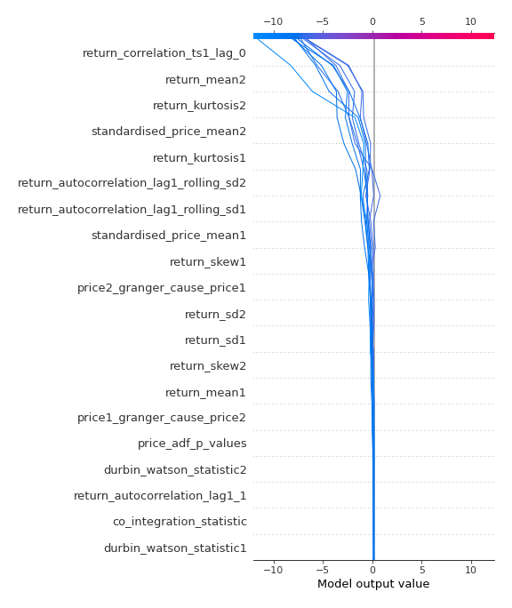
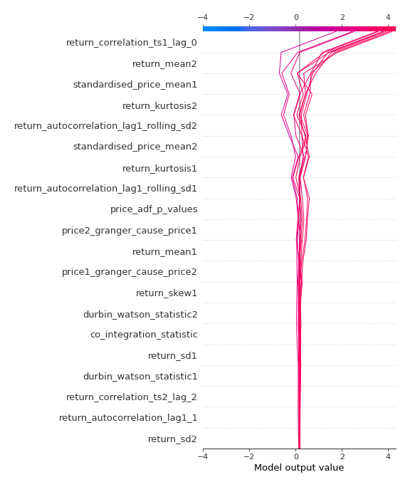
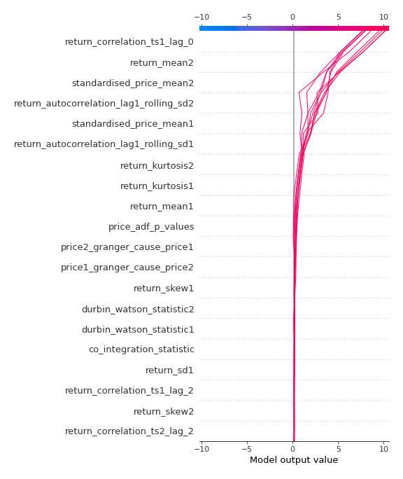

# Summary of 3_Linear

[<< Go back](../README.md)

## Logistic Regression (Linear)
- **n_jobs**: -1
- **explain_level**: 2

## Validation
 - **validation_type**: split
 - **train_ratio**: 0.75
 - **shuffle**: True
 - **stratify**: True

## Optimized metric
accuracy

## Training time

3.2 seconds

## Metric details
|           |    score |     threshold |
|:----------|---------:|--------------:|
| logloss   | 0.012184 | nan           |
| auc       | 1        | nan           |
| f1        | 1        |   0.506987    |
| accuracy  | 1        |   0.506987    |
| precision | 1        |   0.506987    |
| recall    | 1        |   8.73075e-06 |
| mcc       | 1        |   0.506987    |

## Confusion matrix (at threshold=0.506987)
|                      |   Predicted as real |   Predicted as simulated |
|:---------------------|--------------------:|-------------------------:|
| Labeled as real      |                  44 |                        0 |
| Labeled as simulated |                   0 |                       43 |

## Learning curves

## Coefficients
| feature                                 |   Learner_1 |
|:----------------------------------------|------------:|
| return_correlation_ts1_lag_0            |   2.29837   |
| return_mean2                            |   1.5599    |
| standardised_price_mean2                |   0.804128  |
| standardised_price_mean1                |   0.386465  |
| return_mean1                            |   0.356306  |
| return_skew1                            |   0.250344  |
| intercept                               |   0.195751  |
| price_adf_p_values                      |   0.183462  |
| return_correlation_ts2_lag_2            |   0.135751  |
| return_correlation_ts1_lag_2            |   0.134415  |
| return_autocorrelation_lag1_1           |   0.115604  |
| return_autocorrelation_lag1_2           |   0.0841522 |
| return_correlation_ts2_lag_1            |   0.0770105 |
| return_correlation_ts2_lag_3            |   0.073167  |
| return_correlation_ts1_lag_3            |   0.0679527 |
| return_correlation_ts1_lag_1            |   0.0659607 |
| return_skew2                            |   0.0444913 |
| durbin_watson_statistic2                |   0.0311127 |
| co_integration_statistic                |   0.015134  |
| durbin_watson_statistic1                |  -0.0129366 |
| return_sd2                              |  -0.054853  |
| return_sd1                              |  -0.0829572 |
| price1_granger_cause_price2             |  -0.263106  |
| price2_granger_cause_price1             |  -0.280396  |
| return_autocorrelation_lag1_rolling_sd1 |  -0.447479  |
| return_autocorrelation_lag1_rolling_sd2 |  -0.576217  |
| return_kurtosis2                        |  -0.638835  |
| return_kurtosis1                        |  -0.750648  |

## Permutation-based Importance

## Confusion Matrix

## Normalized Confusion Matrix

## ROC Curve

## Kolmogorov-Smirnov Statistic

## Precision-Recall Curve

## Calibration Curve

## Cumulative Gains Curve

## Lift Curve

## SHAP Importance

## SHAP Dependence plots

### Dependence (Fold 1)

## SHAP Decision plots

### Top-10 Worst decisions for class 0 (Fold 1)

### Top-10 Best decisions for class 0 (Fold 1)

### Top-10 Worst decisions for class 1 (Fold 1)

### Top-10 Best decisions for class 1 (Fold 1)

[<< Go back](../README.md)
