# Exploratory Data Analysis

[<< Go back](../README.md)
## Feature : target
- **Feature type** : categorical
- **Missing** : 0.0%
- **Unique** : 2
- **Count** :347
- **Unique** :2
- **Top** :real
- **Freq** :175

## Feature : standardised_price_mean1
- **Feature type** : continous
- **Missing** : 0.0%
- **Unique** : 347
- **Count** :347.0
- **Mean** :155.51114232438388
- **Std** :62.28410755461856
- **Min** :43.818674613537056
- **25%th Percentile** : 117.4576749757274
- **50%th Percentile** : 131.67258233871408
- **75%th Percentile** : 183.11768308208525
- **Max** :482.21235146110797

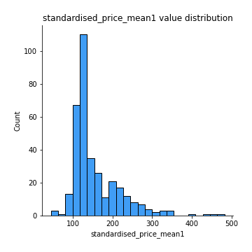
## Feature : standardised_price_mean2
- **Feature type** : continous
- **Missing** : 0.0%
- **Unique** : 347
- **Count** :347.0
- **Mean** :249.68345716344325
- **Std** :168.2207419191725
- **Min** :77.36570036335733
- **25%th Percentile** : 117.51902062844862
- **50%th Percentile** : 146.54713237709515
- **75%th Percentile** : 342.6400833343897
- **Max** :1057.3579960624554

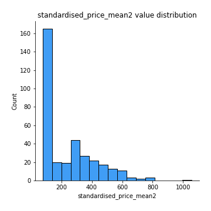
## Feature : return_mean1
- **Feature type** : continous
- **Missing** : 0.0%
- **Unique** : 347
- **Count** :347.0
- **Mean** :0.33189894782094087
- **Std** :0.27270084129012867
- **Min** :-0.31556073795310474
- **25%th Percentile** : 0.1090454963505261
- **50%th Percentile** : 0.22820478333056304
- **75%th Percentile** : 0.5671310271947267
- **Max** :1.0790323531503891

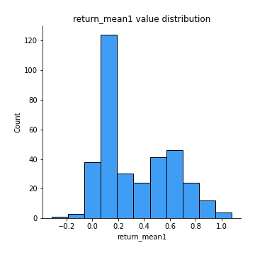
## Feature : return_mean2
- **Feature type** : continous
- **Missing** : 0.0%
- **Unique** : 347
- **Count** :347.0
- **Mean** :0.5223408434370336
- **Std** :0.45479600417917515
- **Min** :-0.24668577454402457
- **25%th Percentile** : 0.10207055339485184
- **50%th Percentile** : 0.25792313943204215
- **75%th Percentile** : 0.9461673160150421
- **Max** :1.493875067872129

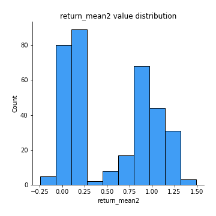
## Feature : return_sd1
- **Feature type** : continous
- **Missing** : 0.0%
- **Unique** : 347
- **Count** :347.0
- **Mean** :1.5175318856199551
- **Std** :0.3203413424017694
- **Min** :0.7917186262639786
- **25%th Percentile** : 1.4059284084008
- **50%th Percentile** : 1.5093778696438118
- **75%th Percentile** : 1.5958089939002373
- **Max** :3.108647443556518

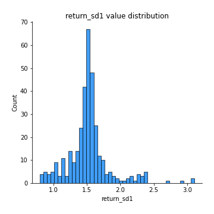
## Feature : return_sd2
- **Feature type** : continous
- **Missing** : 0.0%
- **Unique** : 347
- **Count** :347.0
- **Mean** :1.5891985163875273
- **Std** :0.4053297445911863
- **Min** :0.8184811977504522
- **25%th Percentile** : 1.4472576745584809
- **50%th Percentile** : 1.5671735851130864
- **75%th Percentile** : 1.6497218743309472
- **Max** :4.598857143139886

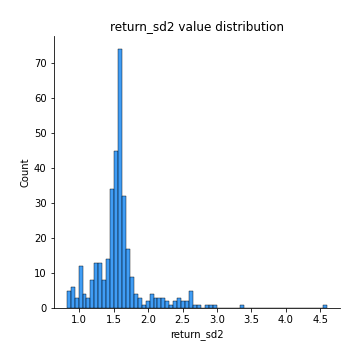
## Feature : return_skew1
- **Feature type** : continous
- **Missing** : 0.0%
- **Unique** : 347
- **Count** :347.0
- **Mean** :-0.1613826358833819
- **Std** :0.7398839440284671
- **Min** :-6.857840543649597
- **25%th Percentile** : -0.3200577019981866
- **50%th Percentile** : -0.07755654576681542
- **75%th Percentile** : 0.07771829586842355
- **Max** :4.140719546467752

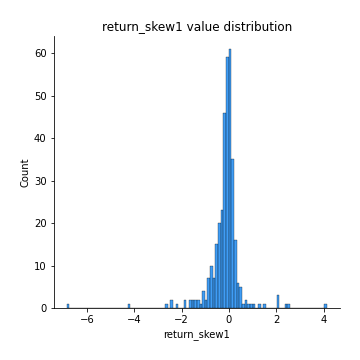
## Feature : return_skew2
- **Feature type** : continous
- **Missing** : 0.0%
- **Unique** : 347
- **Count** :347.0
- **Mean** :-0.23856318821800152
- **Std** :1.1286788466441084
- **Min** :-9.5467599340665
- **25%th Percentile** : -0.3200065412837879
- **50%th Percentile** : -0.05981197738260722
- **75%th Percentile** : 0.10246554945438639
- **Max** :4.289944724188784

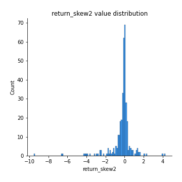
## Feature : return_kurtosis1
- **Feature type** : continous
- **Missing** : 0.0%
- **Unique** : 347
- **Count** :347.0
- **Mean** :2.6040944816556495
- **Std** :6.439495921138194
- **Min** :-0.6359977972701163
- **25%th Percentile** : -0.056702963055747846
- **50%th Percentile** : 0.5121436881088881
- **75%th Percentile** : 2.635932331671523
- **Max** :80.08765409662804

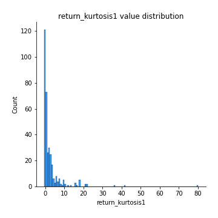
## Feature : return_kurtosis2
- **Feature type** : continous
- **Missing** : 0.0%
- **Unique** : 347
- **Count** :347.0
- **Mean** :4.349734692963439
- **Std** :11.54704603993277
- **Min** :-0.6369509313625361
- **25%th Percentile** : -0.05418284989681643
- **50%th Percentile** : 0.5674529845410814
- **75%th Percentile** : 3.56808253167203
- **Max** :127.80647138658917

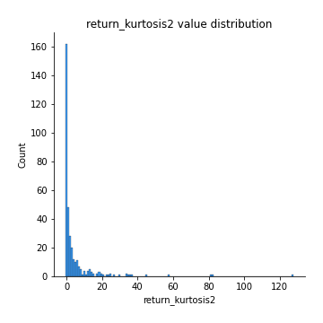
## Feature : return_autocorrelation_lag1_1
- **Feature type** : continous
- **Missing** : 0.0%
- **Unique** : 347
- **Count** :347.0
- **Mean** :0.013151595354619738
- **Std** :0.07598095573239687
- **Min** :-0.21106657115766964
- **25%th Percentile** : -0.04007690863927951
- **50%th Percentile** : 0.015584930220414055
- **75%th Percentile** : 0.06732603660535216
- **Max** :0.23310127090148183

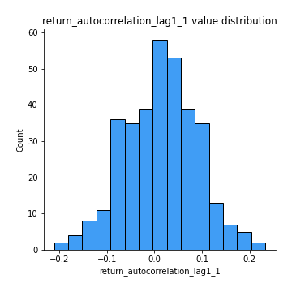
## Feature : return_autocorrelation_lag1_2
- **Feature type** : continous
- **Missing** : 0.0%
- **Unique** : 347
- **Count** :347.0
- **Mean** :0.008509693797813949
- **Std** :0.07235227182536169
- **Min** :-0.23650716165005362
- **25%th Percentile** : -0.037576146959103204
- **50%th Percentile** : 0.010953676232609741
- **75%th Percentile** : 0.06053727746126421
- **Max** :0.20789800390089375

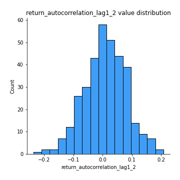
## Feature : return_autocorrelation_lag1_rolling_sd1
- **Feature type** : continous
- **Missing** : 0.0%
- **Unique** : 347
- **Count** :347.0
- **Mean** :0.9458288161952272
- **Std** :0.02026368601964567
- **Min** :0.8706732948271847
- **25%th Percentile** : 0.9340179982500132
- **50%th Percentile** : 0.9493129515849476
- **75%th Percentile** : 0.9602468486827745
- **Max** :0.9817860359018395

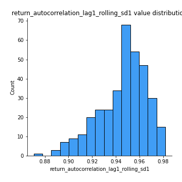
## Feature : return_autocorrelation_lag1_rolling_sd2
- **Feature type** : continous
- **Missing** : 0.0%
- **Unique** : 347
- **Count** :347.0
- **Mean** :0.9445247658877041
- **Std** :0.018835163603251406
- **Min** :0.8865953157516836
- **25%th Percentile** : 0.9334159726313332
- **50%th Percentile** : 0.9478821744018139
- **75%th Percentile** : 0.9576710003777147
- **Max** :0.9816307701771863

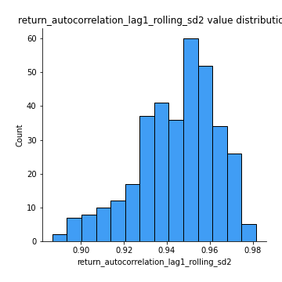
## Feature : price_adf_p_values
- **Feature type** : continous
- **Missing** : 0.0%
- **Unique** : 347
- **Count** :347.0
- **Mean** :0.4026216648535508
- **Std** :0.3527751030508961
- **Min** :5.4676549893335844e-08
- **25%th Percentile** : 0.07585287693981864
- **50%th Percentile** : 0.3041086276594679
- **75%th Percentile** : 0.7145905313630209
- **Max** :0.9990301011719359

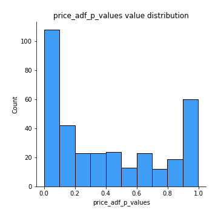
## Feature : return_correlation_ts1_lag_0
- **Feature type** : continous
- **Missing** : 0.0%
- **Unique** : 347
- **Count** :347.0
- **Mean** :0.6394632229024526
- **Std** :0.3753750831347869
- **Min** :-0.12507580812872535
- **25%th Percentile** : 0.2835600168860574
- **50%th Percentile** : 0.7225338229233049
- **75%th Percentile** : 0.9982849986785859
- **Max** :0.9994557154738104

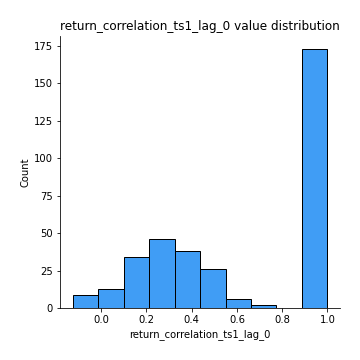
## Feature : return_correlation_ts1_lag_1
- **Feature type** : continous
- **Missing** : 0.0%
- **Unique** : 347
- **Count** :347.0
- **Mean** :0.012125713709369827
- **Std** :0.07028093094678375
- **Min** :-0.18856712556884056
- **25%th Percentile** : -0.03219751496776111
- **50%th Percentile** : 0.011147314564636973
- **75%th Percentile** : 0.058364400954238685
- **Max** :0.2204172275377606

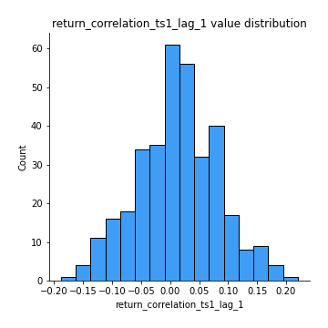
## Feature : return_correlation_ts1_lag_2
- **Feature type** : continous
- **Missing** : 0.0%
- **Unique** : 347
- **Count** :347.0
- **Mean** :0.008743060264498404
- **Std** :0.06557438727385832
- **Min** :-0.17458049302943662
- **25%th Percentile** : -0.0347000271239345
- **50%th Percentile** : 0.0053973402331238705
- **75%th Percentile** : 0.05715545596422597
- **Max** :0.1848360541788846

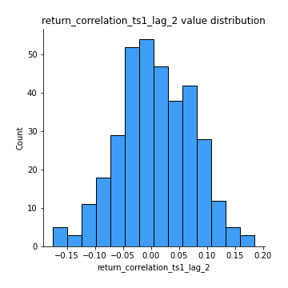
## Feature : return_correlation_ts1_lag_3
- **Feature type** : continous
- **Missing** : 0.0%
- **Unique** : 347
- **Count** :347.0
- **Mean** :0.014110684844163578
- **Std** :0.0694602802454189
- **Min** :-0.21184867865910795
- **25%th Percentile** : -0.02974530248345226
- **50%th Percentile** : 0.016080879666820726
- **75%th Percentile** : 0.060940838083762286
- **Max** :0.23792600845612338

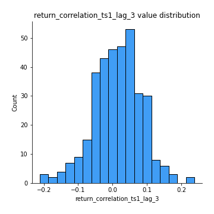
## Feature : return_correlation_ts2_lag_1
- **Feature type** : continous
- **Missing** : 0.0%
- **Unique** : 347
- **Count** :347.0
- **Mean** :0.014806172362017403
- **Std** :0.07070678452263887
- **Min** :-0.20434596106030414
- **25%th Percentile** : -0.03217510036240234
- **50%th Percentile** : 0.018644347231655766
- **75%th Percentile** : 0.06667373323202513
- **Max** :0.2188700459912286

## Feature : return_correlation_ts2_lag_2
- **Feature type** : continous
- **Missing** : 0.0%
- **Unique** : 347
- **Count** :347.0
- **Mean** :0.009673996220906136
- **Std** :0.06557508808322197
- **Min** :-0.1864220921035808
- **25%th Percentile** : -0.031055159149370338
- **50%th Percentile** : 0.007341292180114467
- **75%th Percentile** : 0.05781212046534733
- **Max** :0.18445185333071518

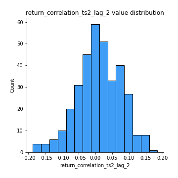
## Feature : return_correlation_ts2_lag_3
- **Feature type** : continous
- **Missing** : 0.0%
- **Unique** : 347
- **Count** :347.0
- **Mean** :0.01444974305938416
- **Std** :0.06271161407469658
- **Min** :-0.1770774021770153
- **25%th Percentile** : -0.026559490103808356
- **50%th Percentile** : 0.011933381324232852
- **75%th Percentile** : 0.057034289578002106
- **Max** :0.17462394534546122

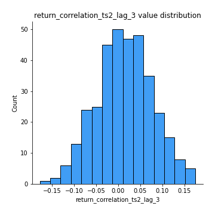
## Feature : durbin_watson_statistic1
- **Feature type** : continous
- **Missing** : 0.0%
- **Unique** : 347
- **Count** :347.0
- **Mean** :1.9863912313703058
- **Std** :0.07385300955220837
- **Min** :1.7347545360512986
- **25%th Percentile** : 1.9621720323582688
- **50%th Percentile** : 1.9891364541773735
- **75%th Percentile** : 2.0123994070636417
- **Max** :2.272831188499587

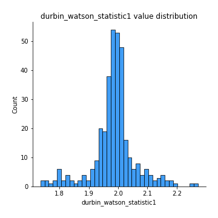
## Feature : durbin_watson_statistic2
- **Feature type** : continous
- **Missing** : 0.0%
- **Unique** : 347
- **Count** :347.0
- **Mean** :1.9841066324779564
- **Std** :0.08351144643635337
- **Min** :1.7004017842255341
- **25%th Percentile** : 1.952563575519133
- **50%th Percentile** : 1.9880584508249637
- **75%th Percentile** : 2.016140924706108
- **Max** :2.324297018949929

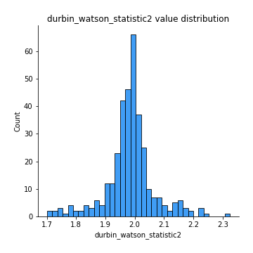
## Feature : co_integration_statistic
- **Feature type** : continous
- **Missing** : 0.0%
- **Unique** : 347
- **Count** :347.0
- **Mean** :0.526135351803748
- **Std** :0.3434223857213816
- **Min** :3.3706511469754662e-06
- **25%th Percentile** : 0.19337026885831088
- **50%th Percentile** : 0.5371686599692711
- **75%th Percentile** : 0.8688686073896947
- **Max** :0.9939092353376776

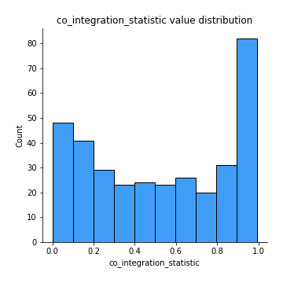
## Feature : price2_granger_cause_price1
- **Feature type** : continous
- **Missing** : 0.0%
- **Unique** : 347
- **Count** :347.0
- **Mean** :0.24887057758704423
- **Std** :0.2946720050932709
- **Min** :2.3655116242603476e-09
- **25%th Percentile** : 0.016874945669815757
- **50%th Percentile** : 0.1162792834260017
- **75%th Percentile** : 0.4303944480243844
- **Max** :0.9879764520831139

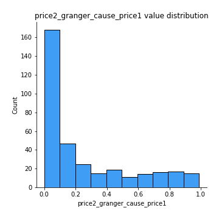
## Feature : price1_granger_cause_price2
- **Feature type** : continous
- **Missing** : 0.0%
- **Unique** : 347
- **Count** :347.0
- **Mean** :0.2986876773890386
- **Std** :0.2933451975493678
- **Min** :1.5793103433115174e-05
- **25%th Percentile** : 0.04187025154529582
- **50%th Percentile** : 0.20065607392812898
- **75%th Percentile** : 0.47568470262879653
- **Max** :0.9872688651119723

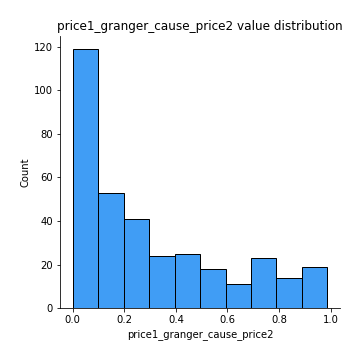

[<< Go back](../README.md)
