# Exploratory Data Analysis

[<< Go back](../README.md)
## Feature : target
- **Feature type** : categorical
- **Missing** : 0.0%
- **Unique** : 2
- **Count** :347
- **Unique** :2
- **Top** :real
- **Freq** :176

## Feature : return_mean1
- **Feature type** : continous
- **Missing** : 0.0%
- **Unique** : 347
- **Count** :347.0
- **Mean** :0.06440125896145853
- **Std** :0.1814187654603993
- **Min** :-0.7712343954770753
- **25%th Percentile** : -0.03830303402887142
- **50%th Percentile** : 0.06695904219479058
- **75%th Percentile** : 0.1598766507638721
- **Max** :0.6514137943917381

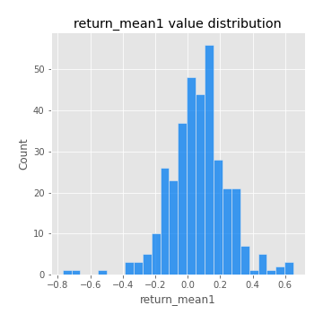
## Feature : return_mean2
- **Feature type** : continous
- **Missing** : 0.0%
- **Unique** : 347
- **Count** :347.0
- **Mean** :-0.048937439300792494
- **Std** :0.18412688591218507
- **Min** :-0.9568250329025223
- **25%th Percentile** : -0.16067798149261492
- **50%th Percentile** : -0.02670016967256435
- **75%th Percentile** : 0.07090223576642699
- **Max** :0.6801605239983173

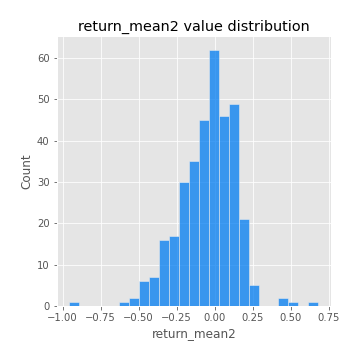
## Feature : return_sd1
- **Feature type** : continous
- **Missing** : 0.0%
- **Unique** : 347
- **Count** :347.0
- **Mean** :1.6109304401269817
- **Std** :0.3704177270642341
- **Min** :0.8733078831717243
- **25%th Percentile** : 1.4619177553734182
- **50%th Percentile** : 1.544558734285752
- **75%th Percentile** : 1.6677724075803662
- **Max** :3.332494027875222

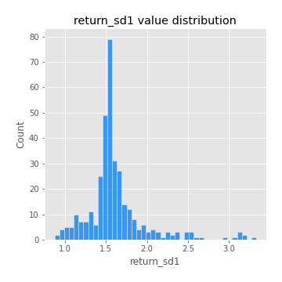
## Feature : return_sd2
- **Feature type** : continous
- **Missing** : 0.0%
- **Unique** : 347
- **Count** :347.0
- **Mean** :1.7128342054321326
- **Std** :0.412326680069836
- **Min** :0.8198779632289204
- **25%th Percentile** : 1.5410889063413498
- **50%th Percentile** : 1.671661581607832
- **75%th Percentile** : 1.7671990959859496
- **Max** :4.59233049161685

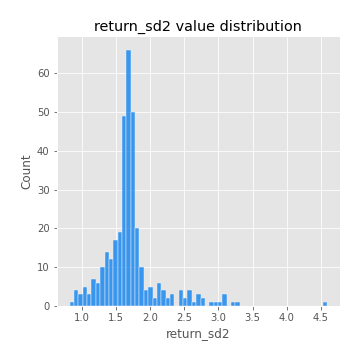
## Feature : return_skew1
- **Feature type** : continous
- **Missing** : 0.0%
- **Unique** : 347
- **Count** :347.0
- **Mean** :-0.16740503515277974
- **Std** :0.6995239735884501
- **Min** :-4.239645236578449
- **25%th Percentile** : -0.32894823080537217
- **50%th Percentile** : -0.0639968438167655
- **75%th Percentile** : 0.09377943900902874
- **Max** :2.1285977762978217

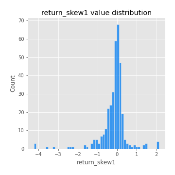
## Feature : return_skew2
- **Feature type** : continous
- **Missing** : 0.0%
- **Unique** : 347
- **Count** :347.0
- **Mean** :-0.23313797412790582
- **Std** :0.9660589022984467
- **Min** :-6.262899561987459
- **25%th Percentile** : -0.29998933191357013
- **50%th Percentile** : -0.05748763915775465
- **75%th Percentile** : 0.12017427453374789
- **Max** :4.0310261345618

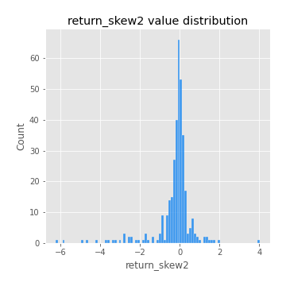
## Feature : return_kurtosis1
- **Feature type** : continous
- **Missing** : 0.0%
- **Unique** : 347
- **Count** :347.0
- **Mean** :2.469418490298136
- **Std** :5.3401949641943585
- **Min** :-0.6882193656351445
- **25%th Percentile** : -0.07058047911923215
- **50%th Percentile** : 0.6396650237769328
- **75%th Percentile** : 2.678812472527533
- **Max** :40.485294874464934

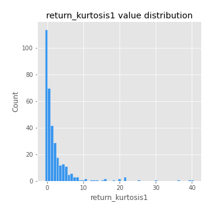
## Feature : return_kurtosis2
- **Feature type** : continous
- **Missing** : 0.0%
- **Unique** : 347
- **Count** :347.0
- **Mean** :3.8911957840705247
- **Std** :8.70361462660241
- **Min** :-0.7552628108326882
- **25%th Percentile** : -0.022245104063948862
- **50%th Percentile** : 0.602729127159503
- **75%th Percentile** : 3.188619372175843
- **Max** :64.99818629655663

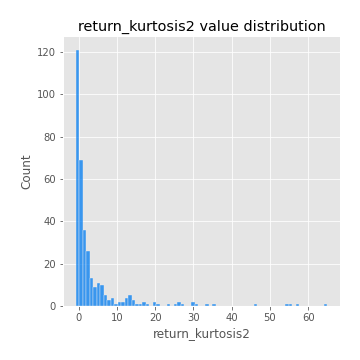
## Feature : return_autocorrelation_lag1_1
- **Feature type** : continous
- **Missing** : 0.0%
- **Unique** : 347
- **Count** :347.0
- **Mean** :0.008177739015539913
- **Std** :0.07424517861314302
- **Min** :-0.2110198016529991
- **25%th Percentile** : -0.039586036389644697
- **50%th Percentile** : 0.007962240316686632
- **75%th Percentile** : 0.059041771025866295
- **Max** :0.2705606004295159

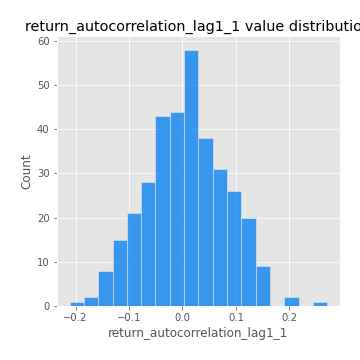
## Feature : return_autocorrelation_lag1_2
- **Feature type** : continous
- **Missing** : 0.0%
- **Unique** : 347
- **Count** :347.0
- **Mean** :0.002909965450911374
- **Std** :0.06476515755348983
- **Min** :-0.17778763204400128
- **25%th Percentile** : -0.038109495696868126
- **50%th Percentile** : 0.0011413670372993176
- **75%th Percentile** : 0.051926109136981646
- **Max** :0.2024676054184499

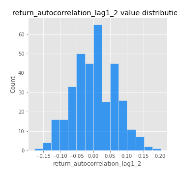
## Feature : return_autocorrelation_lag1_rolling_sd1
- **Feature type** : continous
- **Missing** : 0.0%
- **Unique** : 347
- **Count** :347.0
- **Mean** :0.9474933487823933
- **Std** :0.022870814250940386
- **Min** :0.8468666365946981
- **25%th Percentile** : 0.9371752957027383
- **50%th Percentile** : 0.9510957078698954
- **75%th Percentile** : 0.9637676469036358
- **Max** :0.9870342687296267

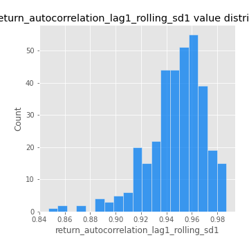
## Feature : return_autocorrelation_lag1_rolling_sd2
- **Feature type** : continous
- **Missing** : 0.0%
- **Unique** : 347
- **Count** :347.0
- **Mean** :0.9454088259325384
- **Std** :0.02112220314308833
- **Min** :0.8713606894008243
- **25%th Percentile** : 0.933986678131049
- **50%th Percentile** : 0.948787732264412
- **75%th Percentile** : 0.9603932459696747
- **Max** :0.9871675952783526

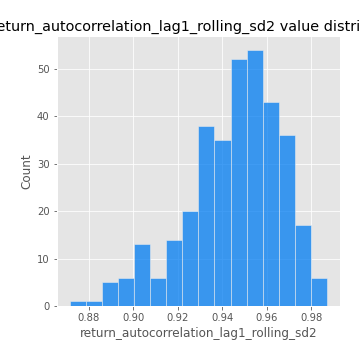
## Feature : return_correlation_ts1_lag_0
- **Feature type** : continous
- **Missing** : 0.0%
- **Unique** : 347
- **Count** :347.0
- **Mean** :0.391190765049494
- **Std** :0.1451917855816346
- **Min** :-0.10256711281206837
- **25%th Percentile** : 0.33503478695443234
- **50%th Percentile** : 0.4292984683306864
- **75%th Percentile** : 0.47788652340111004
- **Max** :0.9937227277077512

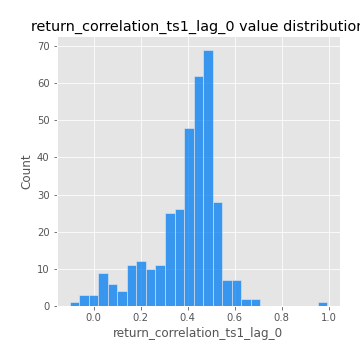
## Feature : return_correlation_ts1_lag_1
- **Feature type** : continous
- **Missing** : 0.0%
- **Unique** : 347
- **Count** :347.0
- **Mean** :0.006643875564346014
- **Std** :0.06426102645408394
- **Min** :-0.18856827637524448
- **25%th Percentile** : -0.040310919244428534
- **50%th Percentile** : 0.007510902549959554
- **75%th Percentile** : 0.05180182199378482
- **Max** :0.183105970167754

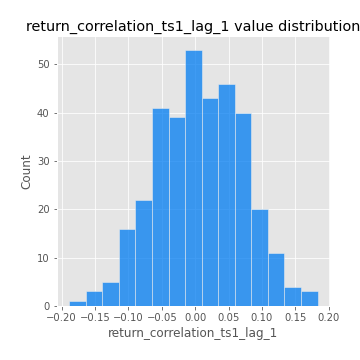
## Feature : return_correlation_ts1_lag_2
- **Feature type** : continous
- **Missing** : 0.0%
- **Unique** : 347
- **Count** :347.0
- **Mean** :0.006047465157310986
- **Std** :0.06655367730969099
- **Min** :-0.16038742223567365
- **25%th Percentile** : -0.03965763554070775
- **50%th Percentile** : 0.006011384284265825
- **75%th Percentile** : 0.04991690829244287
- **Max** :0.22918692198794627

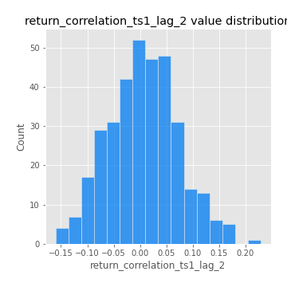
## Feature : return_correlation_ts1_lag_3
- **Feature type** : continous
- **Missing** : 0.0%
- **Unique** : 347
- **Count** :347.0
- **Mean** :0.015971779158882756
- **Std** :0.06936079324597458
- **Min** :-0.21147540839842804
- **25%th Percentile** : -0.03142574829737474
- **50%th Percentile** : 0.01650690842080359
- **75%th Percentile** : 0.0619530713548754
- **Max** :0.23808054096877584

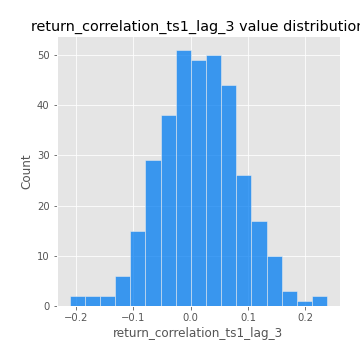
## Feature : return_correlation_ts2_lag_1
- **Feature type** : continous
- **Missing** : 0.0%
- **Unique** : 347
- **Count** :347.0
- **Mean** :0.013822094467972943
- **Std** :0.06943739522321392
- **Min** :-0.17665751184419612
- **25%th Percentile** : -0.035475311940516036
- **50%th Percentile** : 0.01308557649411184
- **75%th Percentile** : 0.06515249002044657
- **Max** :0.3425036902091001

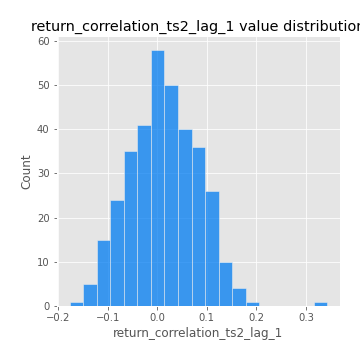
## Feature : return_correlation_ts2_lag_2
- **Feature type** : continous
- **Missing** : 0.0%
- **Unique** : 347
- **Count** :347.0
- **Mean** :0.0032388380478840157
- **Std** :0.06723767835259561
- **Min** :-0.2757460186107768
- **25%th Percentile** : -0.040184321163254384
- **50%th Percentile** : 0.0019114474022656697
- **75%th Percentile** : 0.05101266873087659
- **Max** :0.18810365055288672

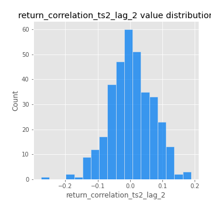
## Feature : return_correlation_ts2_lag_3
- **Feature type** : continous
- **Missing** : 0.0%
- **Unique** : 347
- **Count** :347.0
- **Mean** :0.018222335260896685
- **Std** :0.06406896479624138
- **Min** :-0.1353446055431858
- **25%th Percentile** : -0.027035793245788822
- **50%th Percentile** : 0.017684218647245026
- **75%th Percentile** : 0.06715961855198488
- **Max** :0.18227042221329348

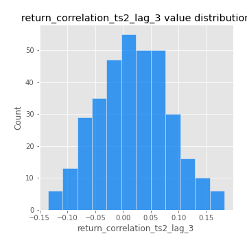
## Feature : price2_granger_cause_price1
- **Feature type** : continous
- **Missing** : 0.0%
- **Unique** : 347
- **Count** :347.0
- **Mean** :0.2510872254144851
- **Std** :0.2859427966043219
- **Min** :2.4312048970873696e-09
- **25%th Percentile** : 0.015795514436139253
- **50%th Percentile** : 0.11859770290586817
- **75%th Percentile** : 0.4251156668453278
- **Max** :0.9898380228448623

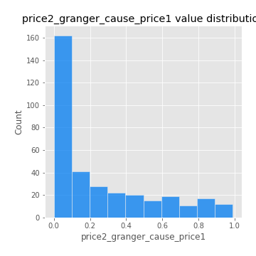
## Feature : price1_granger_cause_price2
- **Feature type** : continous
- **Missing** : 0.0%
- **Unique** : 347
- **Count** :347.0
- **Mean** :0.2774963200976183
- **Std** :0.289478655491827
- **Min** :1.2012269232170316e-11
- **25%th Percentile** : 0.027863393872697255
- **50%th Percentile** : 0.1737233773441523
- **75%th Percentile** : 0.46955778400223813
- **Max** :0.9943544913532145

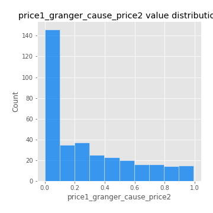

[<< Go back](../README.md)
