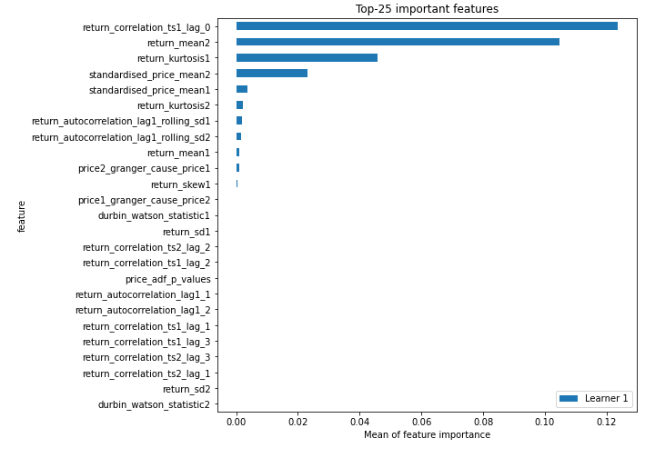
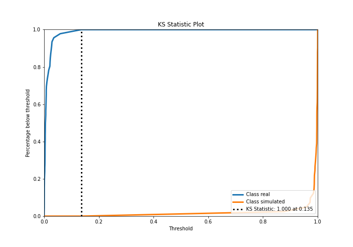
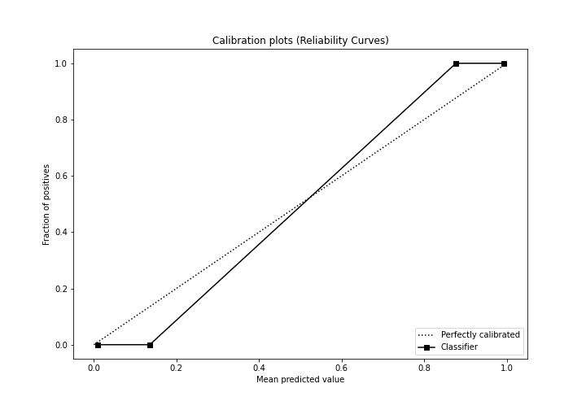
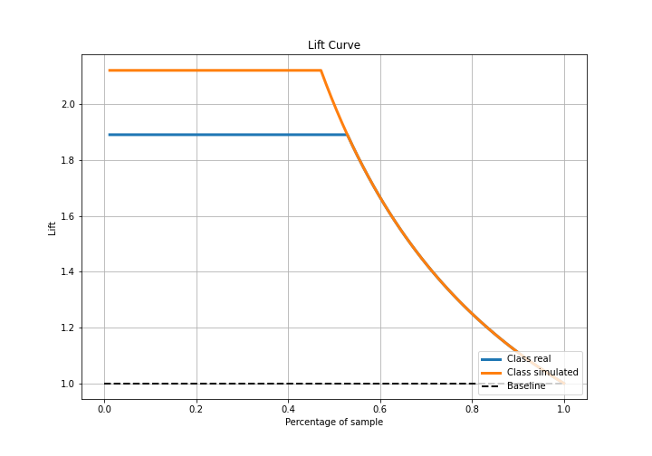
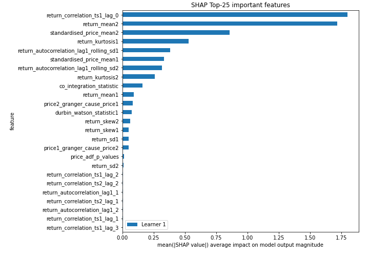
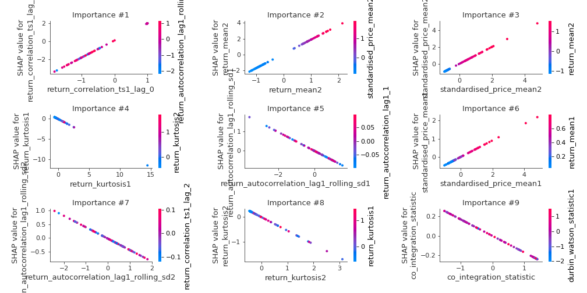
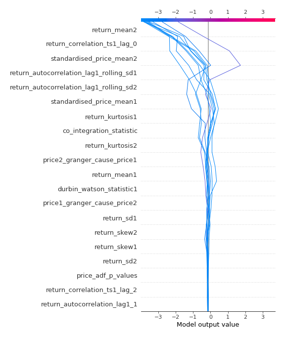
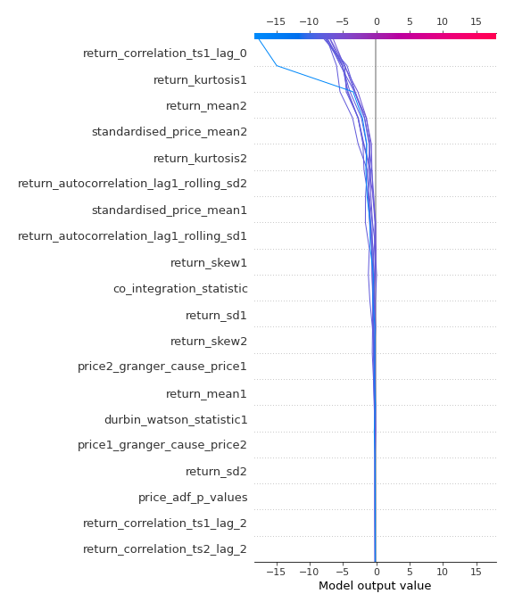
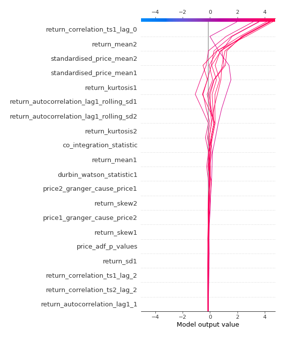
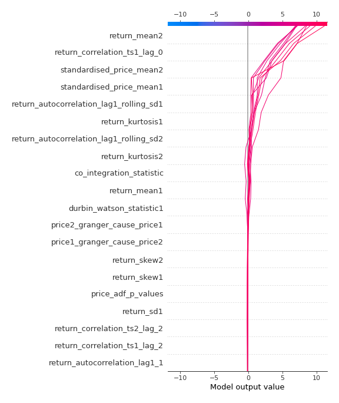

# Summary of 3_Linear

[<< Go back](../README.md)

## Logistic Regression (Linear)
- **n_jobs**: -1
- **explain_level**: 2

## Validation
 - **validation_type**: split
 - **train_ratio**: 0.75
 - **shuffle**: True
 - **stratify**: True

## Optimized metric
accuracy

## Training time

4.2 seconds

## Metric details
|           |     score |   threshold |
|:----------|----------:|------------:|
| logloss   | 0.0111428 | nan         |
| auc       | 1         | nan         |
| f1        | 1         |   0.504893  |
| accuracy  | 1         |   0.504893  |
| precision | 1         |   0.504893  |
| recall    | 1         |   2.093e-08 |
| mcc       | 1         |   0.504893  |

## Confusion matrix (at threshold=0.504893)
|                      |   Predicted as real |   Predicted as simulated |
|:---------------------|--------------------:|-------------------------:|
| Labeled as real      |                  46 |                        0 |
| Labeled as simulated |                   0 |                       41 |

## Learning curves

## Coefficients
| feature                                 |    Learner_1 |
|:----------------------------------------|-------------:|
| return_correlation_ts1_lag_0            |  1.91063     |
| return_mean2                            |  1.80119     |
| standardised_price_mean2                |  0.993846    |
| standardised_price_mean1                |  0.448711    |
| return_mean1                            |  0.36944     |
| return_correlation_ts2_lag_2            |  0.123145    |
| return_correlation_ts1_lag_2            |  0.12309     |
| return_skew1                            |  0.120882    |
| return_autocorrelation_lag1_1           |  0.110719    |
| return_skew2                            |  0.0981831   |
| return_correlation_ts1_lag_1            |  0.0747228   |
| return_correlation_ts2_lag_1            |  0.0741442   |
| return_autocorrelation_lag1_2           |  0.061633    |
| return_correlation_ts1_lag_3            |  0.0453981   |
| return_correlation_ts2_lag_3            |  0.0416773   |
| price_adf_p_values                      |  0.0387103   |
| return_sd2                              |  0.0136495   |
| durbin_watson_statistic2                |  0.000836346 |
| intercept                               | -0.0217258   |
| return_sd1                              | -0.0682871   |
| durbin_watson_statistic1                | -0.115896    |
| co_integration_statistic                | -0.170488    |
| price1_granger_cause_price2             | -0.211082    |
| price2_granger_cause_price1             | -0.334488    |
| return_autocorrelation_lag1_rolling_sd2 | -0.414136    |
| return_autocorrelation_lag1_rolling_sd1 | -0.490815    |
| return_kurtosis2                        | -0.537567    |
| return_kurtosis1                        | -0.787354    |

## Permutation-based Importance

## Confusion Matrix

## Normalized Confusion Matrix

## ROC Curve

## Kolmogorov-Smirnov Statistic

## Precision-Recall Curve

## Calibration Curve

## Cumulative Gains Curve

## Lift Curve

## SHAP Importance

## SHAP Dependence plots

### Dependence (Fold 1)

## SHAP Decision plots

### Top-10 Worst decisions for class 0 (Fold 1)

### Top-10 Best decisions for class 0 (Fold 1)

### Top-10 Worst decisions for class 1 (Fold 1)

### Top-10 Best decisions for class 1 (Fold 1)

[<< Go back](../README.md)
