# Exploratory Data Analysis

[<< Go back](../README.md)
## Feature : target
- **Feature type** : categorical
- **Missing** : 0.0%
- **Unique** : 2
- **Count** :347
- **Unique** :2
- **Top** :real
- **Freq** :183

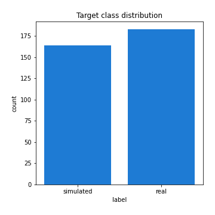
## Feature : standardised_price_mean1
- **Feature type** : continous
- **Missing** : 0.0%
- **Unique** : 347
- **Count** :347.0
- **Mean** :156.6557786831131
- **Std** :69.28280134920034
- **Min** :61.360827735282065
- **25%th Percentile** : 116.73749050283408
- **50%th Percentile** : 129.81373408063817
- **75%th Percentile** : 186.75988127848447
- **Max** :591.3703024125841

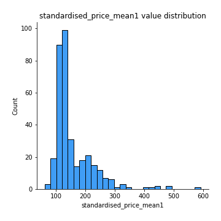
## Feature : standardised_price_mean2
- **Feature type** : continous
- **Missing** : 0.0%
- **Unique** : 347
- **Count** :347.0
- **Mean** :248.81774975203692
- **Std** :172.21863200332027
- **Min** :77.36570036335733
- **25%th Percentile** : 117.36760694204618
- **50%th Percentile** : 140.2593135707705
- **75%th Percentile** : 342.6400833343897
- **Max** :1057.3579960624554

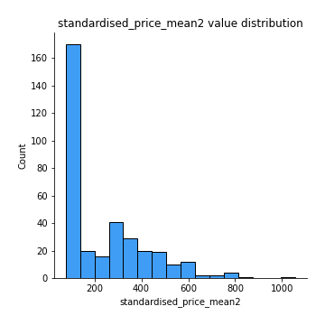
## Feature : return_mean1
- **Feature type** : continous
- **Missing** : 0.0%
- **Unique** : 347
- **Count** :347.0
- **Mean** :0.3283020231341564
- **Std** :0.27975753865741954
- **Min** :-0.14500998642785218
- **25%th Percentile** : 0.10432711242076216
- **50%th Percentile** : 0.19413734709342276
- **75%th Percentile** : 0.5786007264522027
- **Max** :1.2336414655560004

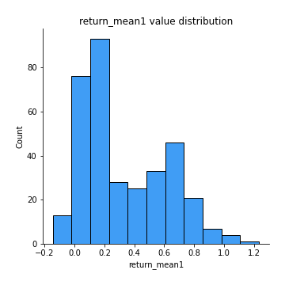
## Feature : return_mean2
- **Feature type** : continous
- **Missing** : 0.0%
- **Unique** : 347
- **Count** :347.0
- **Mean** :0.5131254204275107
- **Std** :0.4590193273955535
- **Min** :-0.24668577454402457
- **25%th Percentile** : 0.10070229880863225
- **50%th Percentile** : 0.21855583650107888
- **75%th Percentile** : 0.9426156464912769
- **Max** :1.493875067872129

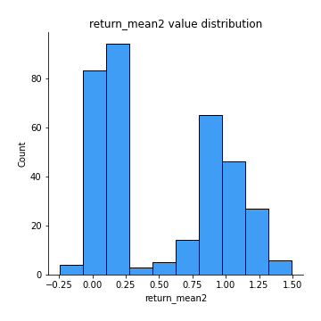
## Feature : return_sd1
- **Feature type** : continous
- **Missing** : 0.0%
- **Unique** : 347
- **Count** :347.0
- **Mean** :1.5269469528947894
- **Std** :0.354951251875272
- **Min** :0.7917186262639786
- **25%th Percentile** : 1.4034382455159475
- **50%th Percentile** : 1.500617966921401
- **75%th Percentile** : 1.5976921258317816
- **Max** :3.3277429018214417

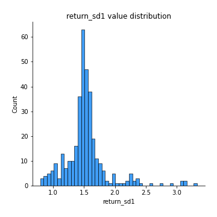
## Feature : return_sd2
- **Feature type** : continous
- **Missing** : 0.0%
- **Unique** : 347
- **Count** :347.0
- **Mean** :1.5977802881399297
- **Std** :0.3996738528399658
- **Min** :0.8184811977504522
- **25%th Percentile** : 1.447466466953634
- **50%th Percentile** : 1.5577991887866989
- **75%th Percentile** : 1.6566023190520538
- **Max** :3.397240761887529

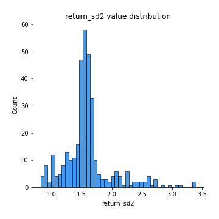
## Feature : return_skew1
- **Feature type** : continous
- **Missing** : 0.0%
- **Unique** : 347
- **Count** :347.0
- **Mean** :-0.1536598698517035
- **Std** :0.6608604575446495
- **Min** :-4.18248396850518
- **25%th Percentile** : -0.3058857433946677
- **50%th Percentile** : -0.07403880391495019
- **75%th Percentile** : 0.09161675145964224
- **Max** :2.4626801359026347

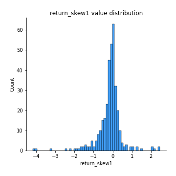
## Feature : return_skew2
- **Feature type** : continous
- **Missing** : 0.0%
- **Unique** : 347
- **Count** :347.0
- **Mean** :-0.20488374106639098
- **Std** :1.0722198944414167
- **Min** :-6.613535067863222
- **25%th Percentile** : -0.33065781596763577
- **50%th Percentile** : -0.05981197738260722
- **75%th Percentile** : 0.11977415742443276
- **Max** :4.289944724188784

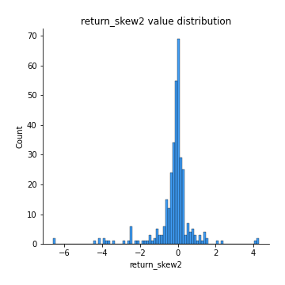
## Feature : return_kurtosis1
- **Feature type** : continous
- **Missing** : 0.0%
- **Unique** : 347
- **Count** :347.0
- **Mean** :2.739028839130516
- **Std** :6.1981978590743925
- **Min** :-0.7516091963598552
- **25%th Percentile** : -0.04511584511902389
- **50%th Percentile** : 0.6644737225600617
- **75%th Percentile** : 2.9076807351363883
- **Max** :76.33625653908426

## Feature : return_kurtosis2
- **Feature type** : continous
- **Missing** : 0.0%
- **Unique** : 347
- **Count** :347.0
- **Mean** :4.319466601744941
- **Std** :9.852258746504518
- **Min** :-0.7491598741876042
- **25%th Percentile** : -0.03233778889111183
- **50%th Percentile** : 0.7404660561218575
- **75%th Percentile** : 3.717003479260121
- **Max** :81.96076596987915

## Feature : return_autocorrelation_lag1_1
- **Feature type** : continous
- **Missing** : 0.0%
- **Unique** : 347
- **Count** :347.0
- **Mean** :0.006857193166888349
- **Std** :0.07644967991943877
- **Min** :-0.1896079279315596
- **25%th Percentile** : -0.050518214446788515
- **50%th Percentile** : 0.007442928722500845
- **75%th Percentile** : 0.0602122896628363
- **Max** :0.23310127090148183

## Feature : return_autocorrelation_lag1_2
- **Feature type** : continous
- **Missing** : 0.0%
- **Unique** : 347
- **Count** :347.0
- **Mean** :0.006108859135347889
- **Std** :0.07108462582636585
- **Min** :-0.23650716165005362
- **25%th Percentile** : -0.03753160235374153
- **50%th Percentile** : 0.008182486671197912
- **75%th Percentile** : 0.057234130426221684
- **Max** :0.20789800390089375

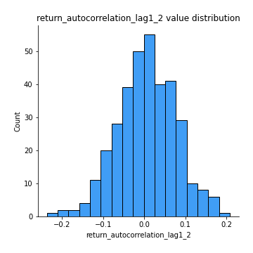
## Feature : return_autocorrelation_lag1_rolling_sd1
- **Feature type** : continous
- **Missing** : 0.0%
- **Unique** : 347
- **Count** :347.0
- **Mean** :0.945430909170271
- **Std** :0.020943850554585645
- **Min** :0.8706732948271847
- **25%th Percentile** : 0.9330886440744259
- **50%th Percentile** : 0.9491223255948068
- **75%th Percentile** : 0.9600225625791292
- **Max** :0.9817860359018395

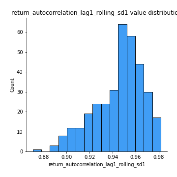
## Feature : return_autocorrelation_lag1_rolling_sd2
- **Feature type** : continous
- **Missing** : 0.0%
- **Unique** : 347
- **Count** :347.0
- **Mean** :0.9443587787315729
- **Std** :0.019241342391217945
- **Min** :0.8865953157516836
- **25%th Percentile** : 0.9320406238033125
- **50%th Percentile** : 0.9477741863682082
- **75%th Percentile** : 0.9581753352954834
- **Max** :0.9807727689740846

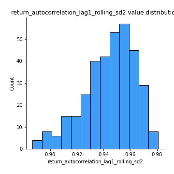
## Feature : price_adf_p_values
- **Feature type** : continous
- **Missing** : 0.0%
- **Unique** : 347
- **Count** :347.0
- **Mean** :0.3943143844516419
- **Std** :0.35096276924044656
- **Min** :5.4676549893335844e-08
- **25%th Percentile** : 0.07670732887280043
- **50%th Percentile** : 0.24938877577466895
- **75%th Percentile** : 0.7112853801457426
- **Max** :0.9978823478151907

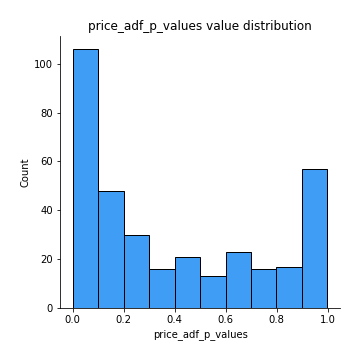
## Feature : return_correlation_ts1_lag_0
- **Feature type** : continous
- **Missing** : 0.0%
- **Unique** : 347
- **Count** :347.0
- **Mean** :0.625196211972981
- **Std** :0.3744248961752126
- **Min** :-0.12507580812872535
- **25%th Percentile** : 0.28215075700917747
- **50%th Percentile** : 0.5653088076021349
- **75%th Percentile** : 0.9978850033552873
- **Max** :0.9994557154738104

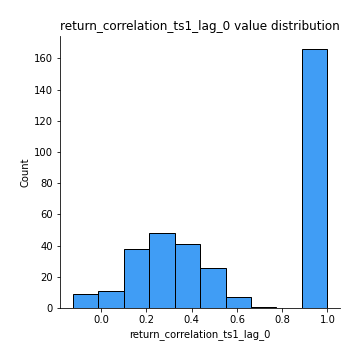
## Feature : return_correlation_ts1_lag_1
- **Feature type** : continous
- **Missing** : 0.0%
- **Unique** : 347
- **Count** :347.0
- **Mean** :0.006846294387602682
- **Std** :0.07086709558891122
- **Min** :-0.18856712556884056
- **25%th Percentile** : -0.03945086743688836
- **50%th Percentile** : 0.006666898372741747
- **75%th Percentile** : 0.05078461567190645
- **Max** :0.2204172275377606

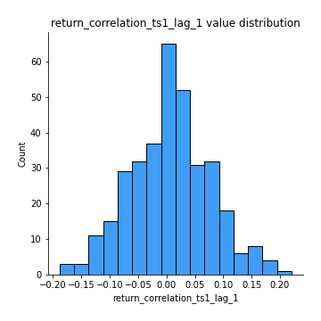
## Feature : return_correlation_ts1_lag_2
- **Feature type** : continous
- **Missing** : 0.0%
- **Unique** : 347
- **Count** :347.0
- **Mean** :0.00681140647285679
- **Std** :0.06717669540035527
- **Min** :-0.17458049302943662
- **25%th Percentile** : -0.036912012854729295
- **50%th Percentile** : 0.004840590910343907
- **75%th Percentile** : 0.054626773431155407
- **Max** :0.16596781200870073

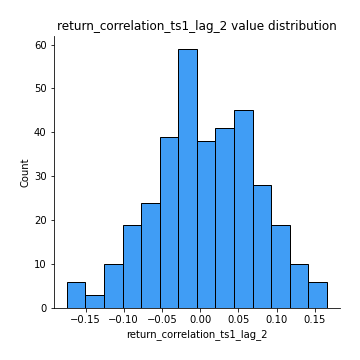
## Feature : return_correlation_ts1_lag_3
- **Feature type** : continous
- **Missing** : 0.0%
- **Unique** : 347
- **Count** :347.0
- **Mean** :0.015655532449483575
- **Std** :0.06971272537922976
- **Min** :-0.19794973933319396
- **25%th Percentile** : -0.03036709515755153
- **50%th Percentile** : 0.01611225231805073
- **75%th Percentile** : 0.06221678782176633
- **Max** :0.23792600845612338

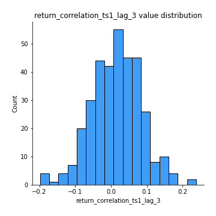
## Feature : return_correlation_ts2_lag_1
- **Feature type** : continous
- **Missing** : 0.0%
- **Unique** : 347
- **Count** :347.0
- **Mean** :0.0076713633759855765
- **Std** :0.07217988836947035
- **Min** :-0.20434596106030414
- **25%th Percentile** : -0.041936342866890575
- **50%th Percentile** : 0.00913298862689143
- **75%th Percentile** : 0.061872357219567964
- **Max** :0.2188700459912286

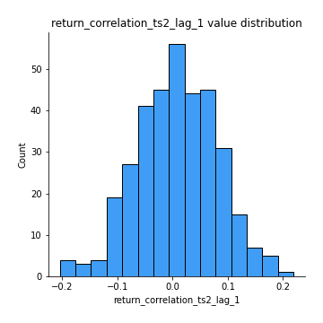
## Feature : return_correlation_ts2_lag_2
- **Feature type** : continous
- **Missing** : 0.0%
- **Unique** : 347
- **Count** :347.0
- **Mean** :0.00876381981523596
- **Std** :0.06545849553266829
- **Min** :-0.2758654278092797
- **25%th Percentile** : -0.02957864241272696
- **50%th Percentile** : 0.0074375591195404624
- **75%th Percentile** : 0.05428195327233461
- **Max** :0.1629007760732384

## Feature : return_correlation_ts2_lag_3
- **Feature type** : continous
- **Missing** : 0.0%
- **Unique** : 347
- **Count** :347.0
- **Mean** :0.017828495365192494
- **Std** :0.06300942167986708
- **Min** :-0.1770774021770153
- **25%th Percentile** : -0.026706926874492897
- **50%th Percentile** : 0.01711372940480231
- **75%th Percentile** : 0.06254539155043456
- **Max** :0.1837556328214464

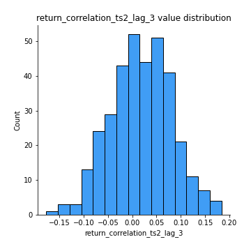
## Feature : durbin_watson_statistic1
- **Feature type** : continous
- **Missing** : 0.0%
- **Unique** : 347
- **Count** :347.0
- **Mean** :1.9928796414764867
- **Std** :0.0776177428561827
- **Min** :1.7347545360512986
- **25%th Percentile** : 1.9621720323582688
- **50%th Percentile** : 1.9917131134168302
- **75%th Percentile** : 2.015440590018396
- **Max** :2.3147835328996527

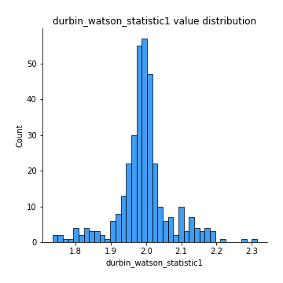
## Feature : durbin_watson_statistic2
- **Feature type** : continous
- **Missing** : 0.0%
- **Unique** : 347
- **Count** :347.0
- **Mean** :1.9862441096769015
- **Std** :0.08434153406412634
- **Min** :1.649823119450525
- **25%th Percentile** : 1.9584533605906405
- **50%th Percentile** : 1.9900545833137588
- **75%th Percentile** : 2.017473971076664
- **Max** :2.334073172550357

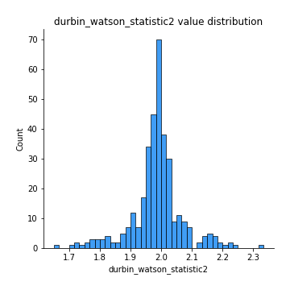
## Feature : co_integration_statistic
- **Feature type** : continous
- **Missing** : 0.0%
- **Unique** : 347
- **Count** :347.0
- **Mean** :0.5114056594328514
- **Std** :0.3424535963267024
- **Min** :1.2500061398339287e-05
- **25%th Percentile** : 0.1892749296278318
- **50%th Percentile** : 0.4789454970058229
- **75%th Percentile** : 0.8582301355512338
- **Max** :0.9929622151853172

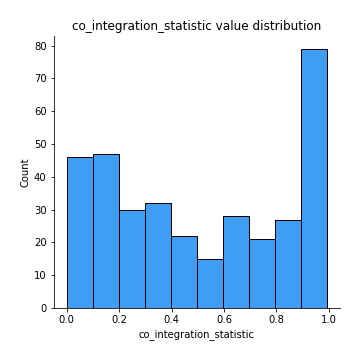
## Feature : price2_granger_cause_price1
- **Feature type** : continous
- **Missing** : 0.0%
- **Unique** : 347
- **Count** :347.0
- **Mean** :0.23123747203343775
- **Std** :0.28459573494447293
- **Min** :2.3655116242603476e-09
- **25%th Percentile** : 0.018278944885464263
- **50%th Percentile** : 0.08902980089384738
- **75%th Percentile** : 0.3699386339162278
- **Max** :0.9879764520831139

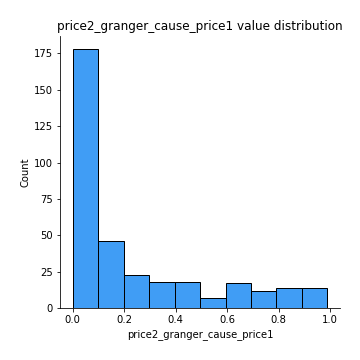
## Feature : price1_granger_cause_price2
- **Feature type** : continous
- **Missing** : 0.0%
- **Unique** : 347
- **Count** :347.0
- **Mean** :0.30517484954107427
- **Std** :0.29607894311070676
- **Min** :1.618799127135896e-05
- **25%th Percentile** : 0.044751500129355554
- **50%th Percentile** : 0.21305527708985142
- **75%th Percentile** : 0.4900902181995698
- **Max** :0.9901374584957848

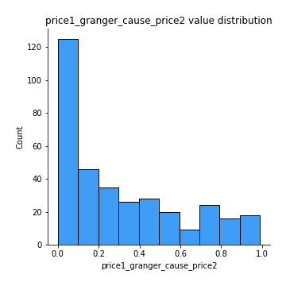

[<< Go back](../README.md)
