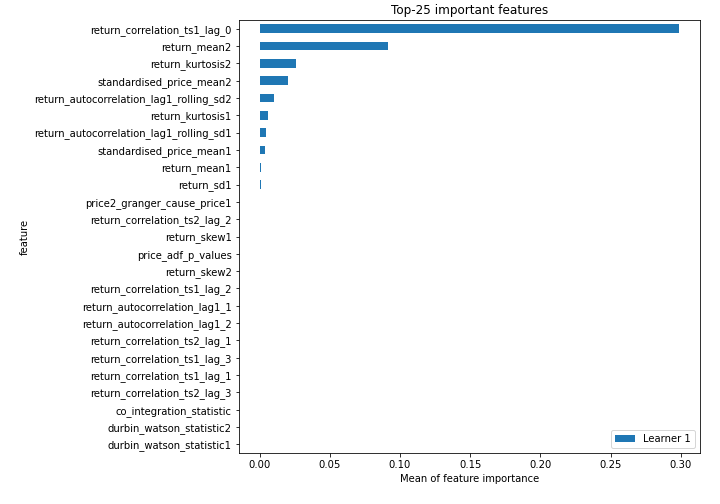
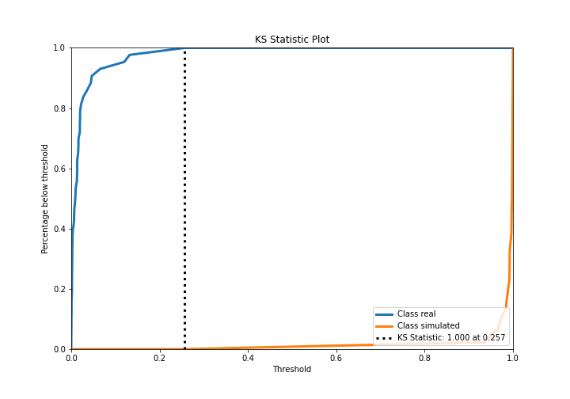
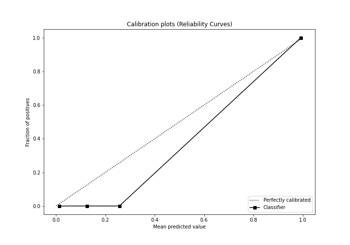
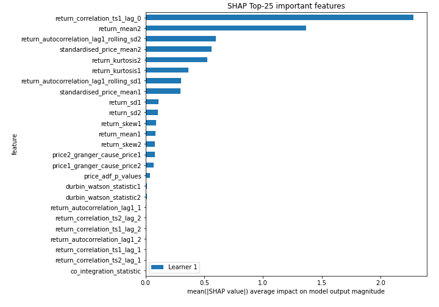
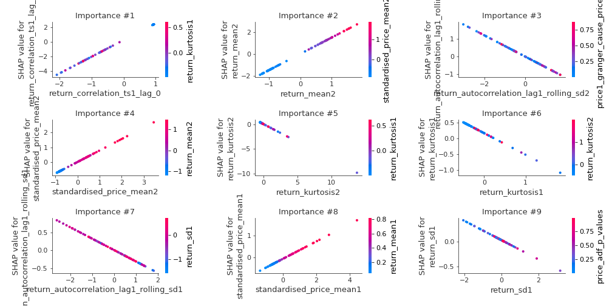
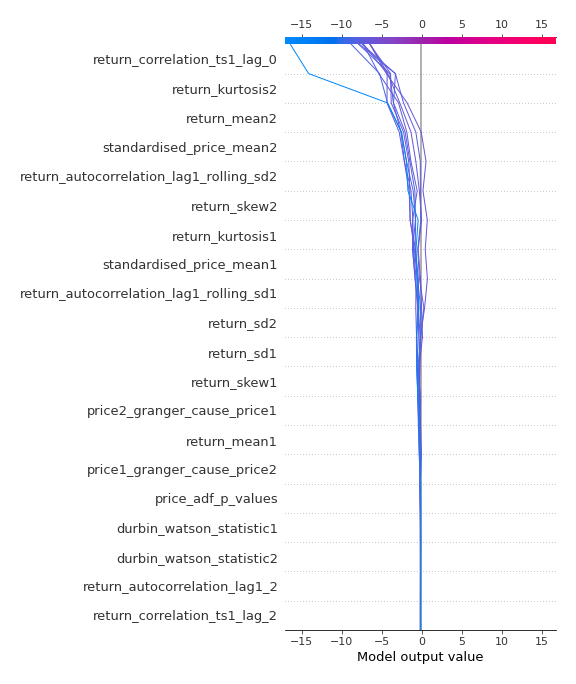
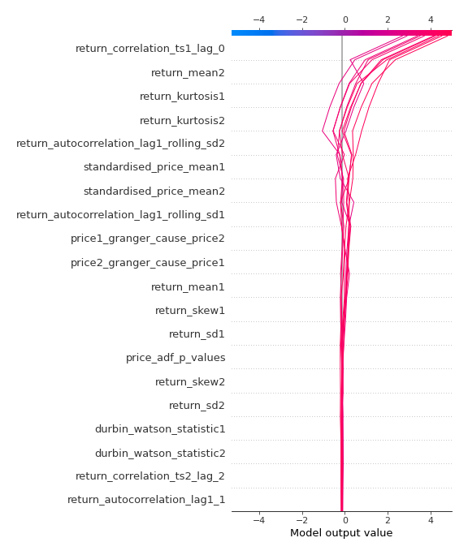
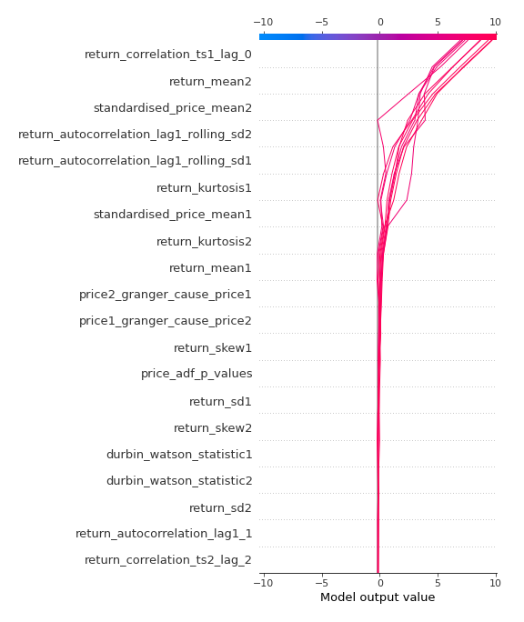

# Summary of 3_Linear

[<< Go back](../README.md)

## Logistic Regression (Linear)
- **n_jobs**: -1
- **explain_level**: 2

## Validation
 - **validation_type**: split
 - **train_ratio**: 0.75
 - **shuffle**: True
 - **stratify**: True

## Optimized metric
accuracy

## Training time

8.0 seconds

## Metric details
|           |     score |     threshold |
|:----------|----------:|--------------:|
| logloss   | 0.0163408 | nan           |
| auc       | 1         | nan           |
| f1        | 1         |   0.513546    |
| accuracy  | 1         |   0.513546    |
| precision | 1         |   0.513546    |
| recall    | 1         |   6.79954e-08 |
| mcc       | 1         |   0.513546    |

## Confusion matrix (at threshold=0.513546)
|                      |   Predicted as real |   Predicted as simulated |
|:---------------------|--------------------:|-------------------------:|
| Labeled as real      |                  43 |                        0 |
| Labeled as simulated |                   0 |                       44 |

## Learning curves

## Coefficients
| feature                                 |   Learner_1 |
|:----------------------------------------|------------:|
| return_correlation_ts1_lag_0            |  2.28753    |
| return_mean2                            |  1.49523    |
| standardised_price_mean2                |  0.775765   |
| intercept                               |  0.460017   |
| standardised_price_mean1                |  0.386378   |
| return_mean1                            |  0.338973   |
| return_skew1                            |  0.259811   |
| return_sd2                              |  0.143388   |
| return_skew2                            |  0.136552   |
| price_adf_p_values                      |  0.123157   |
| return_autocorrelation_lag1_1           |  0.104103   |
| return_correlation_ts2_lag_2            |  0.10346    |
| return_correlation_ts1_lag_2            |  0.0850144  |
| return_correlation_ts1_lag_1            |  0.0818658  |
| return_autocorrelation_lag1_2           |  0.0795931  |
| return_correlation_ts2_lag_1            |  0.0633619  |
| return_correlation_ts1_lag_3            |  0.0487181  |
| return_correlation_ts2_lag_3            |  0.048312   |
| durbin_watson_statistic1                |  0.0217916  |
| durbin_watson_statistic2                |  0.0165412  |
| co_integration_statistic                | -0.00301839 |
| return_sd1                              | -0.194179   |
| return_autocorrelation_lag1_rolling_sd1 | -0.317252   |
| price1_granger_cause_price2             | -0.340275   |
| price2_granger_cause_price1             | -0.360175   |
| return_autocorrelation_lag1_rolling_sd2 | -0.604957   |
| return_kurtosis1                        | -0.677711   |
| return_kurtosis2                        | -0.718127   |

## Permutation-based Importance

## Confusion Matrix

## Normalized Confusion Matrix

## ROC Curve

## Kolmogorov-Smirnov Statistic

## Precision-Recall Curve

## Calibration Curve

## Cumulative Gains Curve

## Lift Curve

## SHAP Importance

## SHAP Dependence plots

### Dependence (Fold 1)

## SHAP Decision plots

### Top-10 Worst decisions for class 0 (Fold 1)

### Top-10 Best decisions for class 0 (Fold 1)

### Top-10 Worst decisions for class 1 (Fold 1)

### Top-10 Best decisions for class 1 (Fold 1)

[<< Go back](../README.md)
