# Exploratory Data Analysis

[<< Go back](../README.md)
## Feature : target
- **Feature type** : categorical
- **Missing** : 0.0%
- **Unique** : 2
- **Count** :347
- **Unique** :2
- **Top** :simulated
- **Freq** :176

## Feature : standardised_price_mean1
- **Feature type** : continous
- **Missing** : 0.0%
- **Unique** : 347
- **Count** :347.0
- **Mean** :160.90645391323145
- **Std** :71.36999584401508
- **Min** :43.818674613537056
- **25%th Percentile** : 116.25476274663507
- **50%th Percentile** : 132.31131964780357
- **75%th Percentile** : 195.5397385687701
- **Max** :591.3703024125841

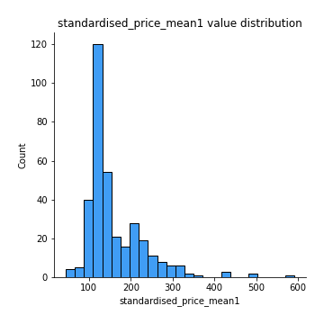
## Feature : standardised_price_mean2
- **Feature type** : continous
- **Missing** : 0.0%
- **Unique** : 347
- **Count** :347.0
- **Mean** :251.41178134345313
- **Std** :170.22820312270935
- **Min** :77.36570036335733
- **25%th Percentile** : 117.66425470678503
- **50%th Percentile** : 157.83505976887267
- **75%th Percentile** : 338.77752042696926
- **Max** :898.2405177829797

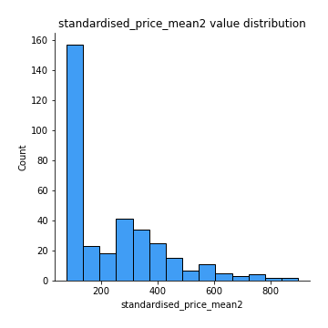
## Feature : return_mean1
- **Feature type** : continous
- **Missing** : 0.0%
- **Unique** : 347
- **Count** :347.0
- **Mean** :0.34735448067496405
- **Std** :0.2887731552387144
- **Min** :-0.31556073795310474
- **25%th Percentile** : 0.11080379761007438
- **50%th Percentile** : 0.21863110544327682
- **75%th Percentile** : 0.6096498540004301
- **Max** :1.2336414655560004

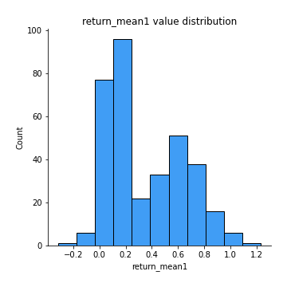
## Feature : return_mean2
- **Feature type** : continous
- **Missing** : 0.0%
- **Unique** : 347
- **Count** :347.0
- **Mean** :0.5288874730634661
- **Std** :0.4546711559889045
- **Min** :-0.15156023638923194
- **25%th Percentile** : 0.10106457811791733
- **50%th Percentile** : 0.515614140933794
- **75%th Percentile** : 0.9275173183300088
- **Max** :1.443998569905044

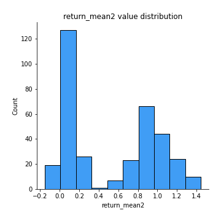
## Feature : return_sd1
- **Feature type** : continous
- **Missing** : 0.0%
- **Unique** : 347
- **Count** :347.0
- **Mean** :1.539688033950076
- **Std** :0.3377998538382662
- **Min** :0.8247986145536357
- **25%th Percentile** : 1.4317700122507953
- **50%th Percentile** : 1.5153845738355813
- **75%th Percentile** : 1.5994374989709264
- **Max** :3.3277429018214417

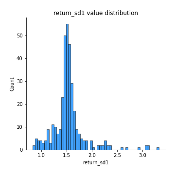
## Feature : return_sd2
- **Feature type** : continous
- **Missing** : 0.0%
- **Unique** : 347
- **Count** :347.0
- **Mean** :1.6017807429316244
- **Std** :0.3944228035101792
- **Min** :0.8184811977504522
- **25%th Percentile** : 1.4632500905989518
- **50%th Percentile** : 1.568609983631658
- **75%th Percentile** : 1.6577507835568688
- **Max** :4.598857143139886

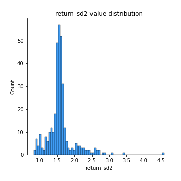
## Feature : return_skew1
- **Feature type** : continous
- **Missing** : 0.0%
- **Unique** : 347
- **Count** :347.0
- **Mean** :-0.11830415265403786
- **Std** :0.6628077412251641
- **Min** :-4.050420980665407
- **25%th Percentile** : -0.2973142131820409
- **50%th Percentile** : -0.055552767002931706
- **75%th Percentile** : 0.0934938055758619
- **Max** :4.140719546467752

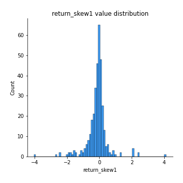
## Feature : return_skew2
- **Feature type** : continous
- **Missing** : 0.0%
- **Unique** : 347
- **Count** :347.0
- **Mean** :-0.25606003777659314
- **Std** :1.0798722020008311
- **Min** :-9.5467599340665
- **25%th Percentile** : -0.31240607939249165
- **50%th Percentile** : -0.0657805922116794
- **75%th Percentile** : 0.10096211250214453
- **Max** :4.2016980529447885

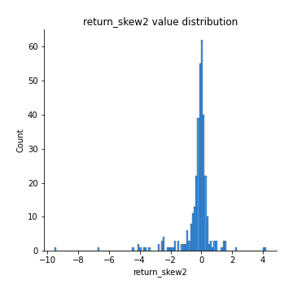
## Feature : return_kurtosis1
- **Feature type** : continous
- **Missing** : 0.0%
- **Unique** : 347
- **Count** :347.0
- **Mean** :2.5832029927135283
- **Std** :6.15534665832717
- **Min** :-0.7516091963598552
- **25%th Percentile** : -0.04511584511902389
- **50%th Percentile** : 0.5553676309883402
- **75%th Percentile** : 2.629878099074958
- **Max** :76.33625653908426

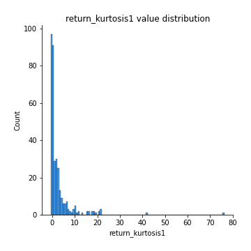
## Feature : return_kurtosis2
- **Feature type** : continous
- **Missing** : 0.0%
- **Unique** : 347
- **Count** :347.0
- **Mean** :4.146318605379158
- **Std** :10.89447821058683
- **Min** :-0.7491598741876042
- **25%th Percentile** : -0.03360074241196309
- **50%th Percentile** : 0.5674529845410814
- **75%th Percentile** : 3.082448372146084
- **Max** :127.80647138658917

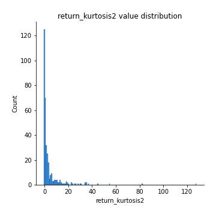
## Feature : return_autocorrelation_lag1_1
- **Feature type** : continous
- **Missing** : 0.0%
- **Unique** : 347
- **Count** :347.0
- **Mean** :0.00876508367423442
- **Std** :0.07607260456209511
- **Min** :-0.21106657115766964
- **25%th Percentile** : -0.040489695786168955
- **50%th Percentile** : 0.009917045791118248
- **75%th Percentile** : 0.05769675352798809
- **Max** :0.23310127090148183

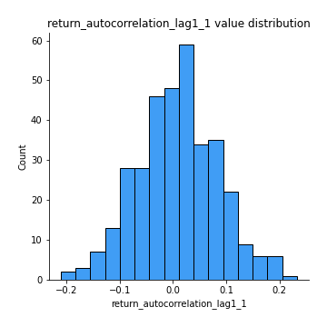
## Feature : return_autocorrelation_lag1_2
- **Feature type** : continous
- **Missing** : 0.0%
- **Unique** : 347
- **Count** :347.0
- **Mean** :0.005448692637745767
- **Std** :0.07340239196824051
- **Min** :-0.23650716165005362
- **25%th Percentile** : -0.0390826514502502
- **50%th Percentile** : 0.008922806551414562
- **75%th Percentile** : 0.054883582033938935
- **Max** :0.20789800390089375

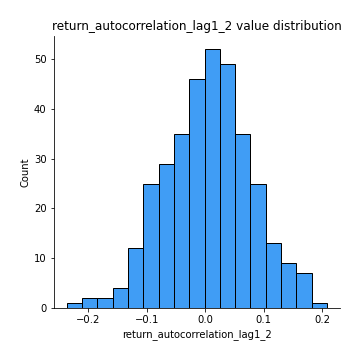
## Feature : return_autocorrelation_lag1_rolling_sd1
- **Feature type** : continous
- **Missing** : 0.0%
- **Unique** : 347
- **Count** :347.0
- **Mean** :0.9448296758397364
- **Std** :0.02048077918004786
- **Min** :0.8706732948271847
- **25%th Percentile** : 0.9324881270850779
- **50%th Percentile** : 0.9481113664831946
- **75%th Percentile** : 0.9591660343863411
- **Max** :0.9817860359018395

## Feature : return_autocorrelation_lag1_rolling_sd2
- **Feature type** : continous
- **Missing** : 0.0%
- **Unique** : 347
- **Count** :347.0
- **Mean** :0.9440805916618827
- **Std** :0.019305695422205508
- **Min** :0.8865953157516836
- **25%th Percentile** : 0.9322972595304602
- **50%th Percentile** : 0.9473065890289653
- **75%th Percentile** : 0.9584006293841978
- **Max** :0.9816307701771863

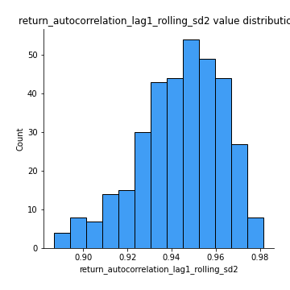
## Feature : price_adf_p_values
- **Feature type** : continous
- **Missing** : 0.0%
- **Unique** : 347
- **Count** :347.0
- **Mean** :0.41006650797741995
- **Std** :0.35504252333985364
- **Min** :4.24204332590779e-07
- **25%th Percentile** : 0.07905369554560743
- **50%th Percentile** : 0.29854316652216
- **75%th Percentile** : 0.7482371276745867
- **Max** :0.9990301011719359

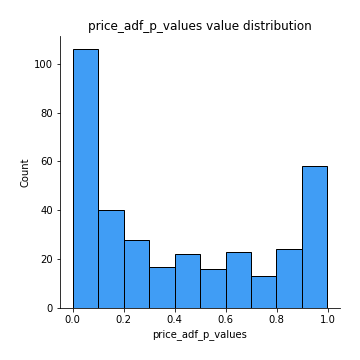
## Feature : return_correlation_ts1_lag_0
- **Feature type** : continous
- **Missing** : 0.0%
- **Unique** : 347
- **Count** :347.0
- **Mean** :0.6501882495743324
- **Std** :0.3732910633186721
- **Min** :-0.12507580812872535
- **25%th Percentile** : 0.3050687154561338
- **50%th Percentile** : 0.9892681359765315
- **75%th Percentile** : 0.9983712556860928
- **Max** :0.9994557154738104

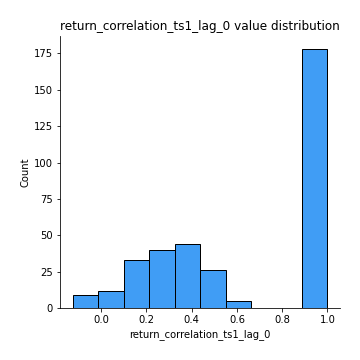
## Feature : return_correlation_ts1_lag_1
- **Feature type** : continous
- **Missing** : 0.0%
- **Unique** : 347
- **Count** :347.0
- **Mean** :0.010280894898463705
- **Std** :0.07133200211559813
- **Min** :-0.18225999016348968
- **25%th Percentile** : -0.037316862821863
- **50%th Percentile** : 0.009302544538209969
- **75%th Percentile** : 0.057871669163080314
- **Max** :0.2204172275377606

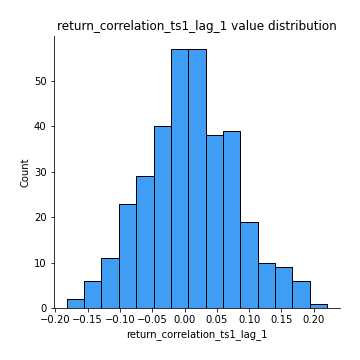
## Feature : return_correlation_ts1_lag_2
- **Feature type** : continous
- **Missing** : 0.0%
- **Unique** : 347
- **Count** :347.0
- **Mean** :0.004122783229341642
- **Std** :0.06667407411290363
- **Min** :-0.17458049302943662
- **25%th Percentile** : -0.043150099308936055
- **50%th Percentile** : 0.000149153230219825
- **75%th Percentile** : 0.05290251901748516
- **Max** :0.16596781200870073

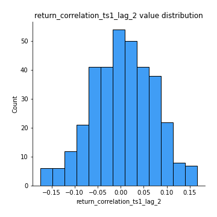
## Feature : return_correlation_ts1_lag_3
- **Feature type** : continous
- **Missing** : 0.0%
- **Unique** : 347
- **Count** :347.0
- **Mean** :0.012295098491174128
- **Std** :0.07025513937218802
- **Min** :-0.21184867865910795
- **25%th Percentile** : -0.030209662364790304
- **50%th Percentile** : 0.012516059940532058
- **75%th Percentile** : 0.058422322733036255
- **Max** :0.23792600845612338

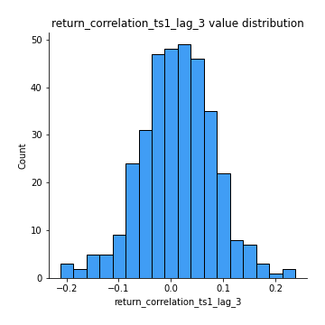
## Feature : return_correlation_ts2_lag_1
- **Feature type** : continous
- **Missing** : 0.0%
- **Unique** : 347
- **Count** :347.0
- **Mean** :0.011630031610701213
- **Std** :0.07145683045059482
- **Min** :-0.19886587877143053
- **25%th Percentile** : -0.038043088300585504
- **50%th Percentile** : 0.011342207934613074
- **75%th Percentile** : 0.06194464779477826
- **Max** :0.2188700459912286

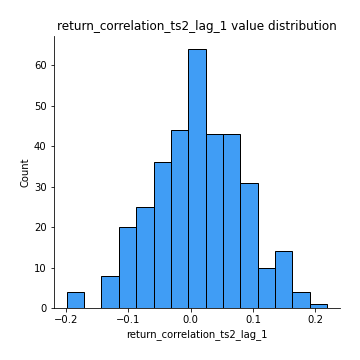
## Feature : return_correlation_ts2_lag_2
- **Feature type** : continous
- **Missing** : 0.0%
- **Unique** : 347
- **Count** :347.0
- **Mean** :0.005498275948503883
- **Std** :0.06743906639524566
- **Min** :-0.2758654278092797
- **25%th Percentile** : -0.03747838923245998
- **50%th Percentile** : 0.0048940363300973054
- **75%th Percentile** : 0.05428195327233461
- **Max** :0.1629007760732384

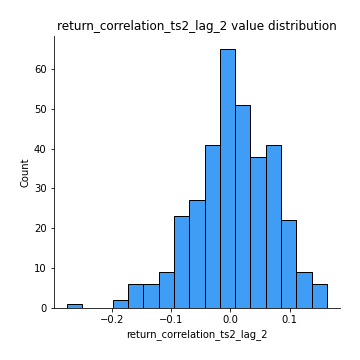
## Feature : return_correlation_ts2_lag_3
- **Feature type** : continous
- **Missing** : 0.0%
- **Unique** : 347
- **Count** :347.0
- **Mean** :0.015510098232946953
- **Std** :0.06244611164842038
- **Min** :-0.1770774021770153
- **25%th Percentile** : -0.0265177879388173
- **50%th Percentile** : 0.012125416804163852
- **75%th Percentile** : 0.05634969572189702
- **Max** :0.1931758318086702

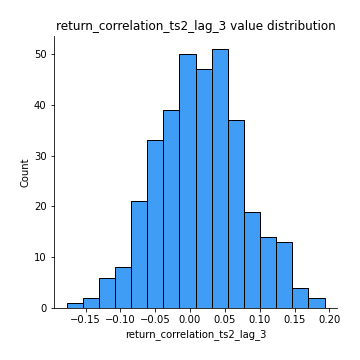
## Feature : durbin_watson_statistic1
- **Feature type** : continous
- **Missing** : 0.0%
- **Unique** : 347
- **Count** :347.0
- **Mean** :1.9914349406770813
- **Std** :0.07661628859827979
- **Min** :1.7347545360512986
- **25%th Percentile** : 1.962074325241193
- **50%th Percentile** : 1.991054041649309
- **75%th Percentile** : 2.013031777852686
- **Max** :2.3147835328996527

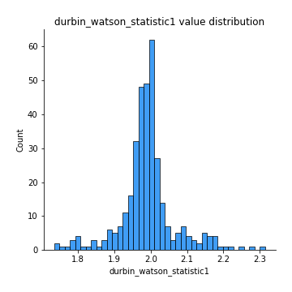
## Feature : durbin_watson_statistic2
- **Feature type** : continous
- **Missing** : 0.0%
- **Unique** : 347
- **Count** :347.0
- **Mean** :1.9889894903414327
- **Std** :0.08625530771194392
- **Min** :1.7004017842255341
- **25%th Percentile** : 1.9565127006826653
- **50%th Percentile** : 1.9883978696622795
- **75%th Percentile** : 2.017640474981808
- **Max** :2.334073172550357

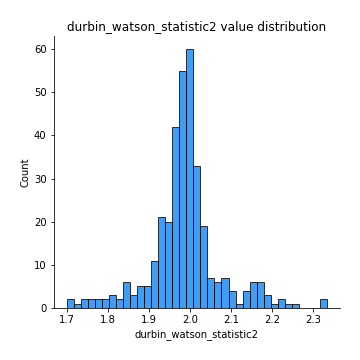
## Feature : co_integration_statistic
- **Feature type** : continous
- **Missing** : 0.0%
- **Unique** : 347
- **Count** :347.0
- **Mean** :0.5324502021562663
- **Std** :0.34557131130467206
- **Min** :3.3706511469754662e-06
- **25%th Percentile** : 0.19514261640540317
- **50%th Percentile** : 0.537691942509865
- **75%th Percentile** : 0.8889458040816189
- **Max** :0.9939092353376776

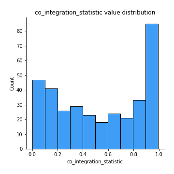
## Feature : price2_granger_cause_price1
- **Feature type** : continous
- **Missing** : 0.0%
- **Unique** : 347
- **Count** :347.0
- **Mean** :0.22826857594363134
- **Std** :0.2753270968531627
- **Min** :2.4523503187491247e-07
- **25%th Percentile** : 0.01552591867121596
- **50%th Percentile** : 0.091354694506757
- **75%th Percentile** : 0.3705085387621444
- **Max** :0.9484735133708666

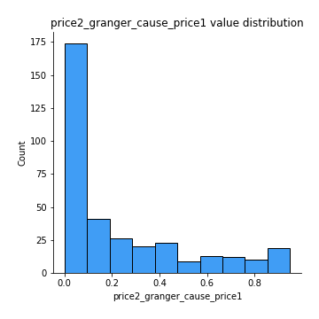
## Feature : price1_granger_cause_price2
- **Feature type** : continous
- **Missing** : 0.0%
- **Unique** : 347
- **Count** :347.0
- **Mean** :0.3007599274724134
- **Std** :0.29077310049197885
- **Min** :6.607726210169445e-06
- **25%th Percentile** : 0.04703517376611785
- **50%th Percentile** : 0.21896975325177076
- **75%th Percentile** : 0.46842578933155193
- **Max** :0.9872688651119723

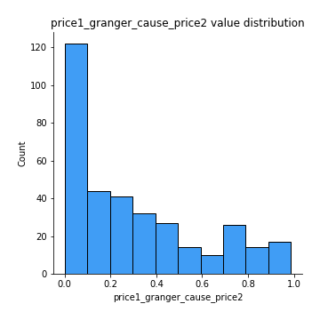

[<< Go back](../README.md)
