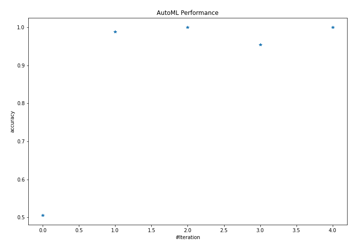
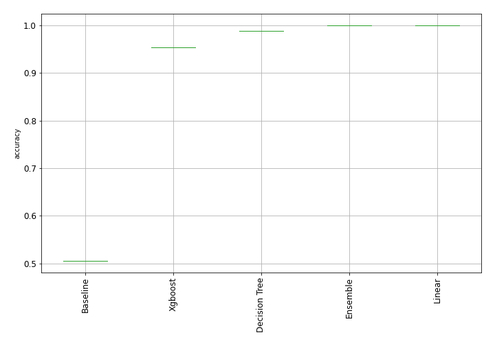
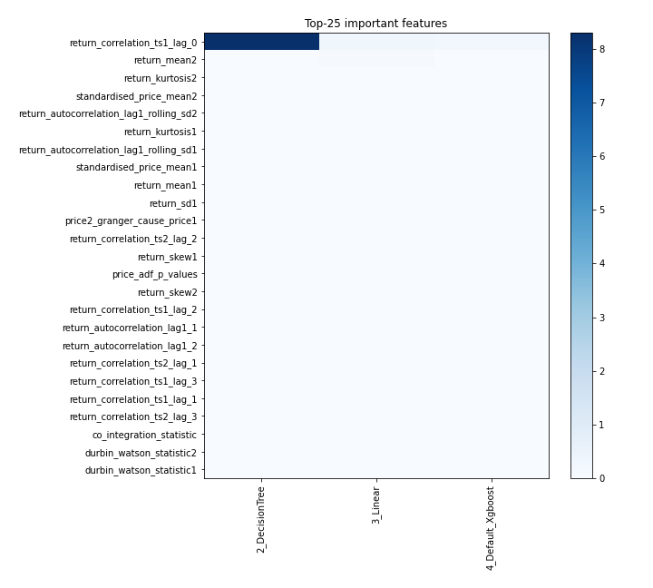
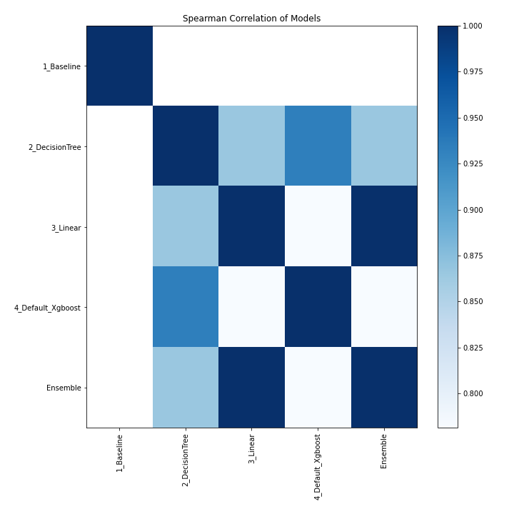

# AutoML Leaderboard

| Best model   | name                                             | model_type    | metric_type   |   metric_value |   train_time |
|:-------------|:-------------------------------------------------|:--------------|:--------------|---------------:|-------------:|
|              | [1_Baseline](1_Baseline/README.md)               | Baseline      | accuracy      |       0.505747 |         1.18 |
|              | [2_DecisionTree](2_DecisionTree/README.md)       | Decision Tree | accuracy      |       0.988506 |      1028.41 |
| **the best** | [3_Linear](3_Linear/README.md)                   | Linear        | accuracy      |       1        |         8.56 |
|              | [4_Default_Xgboost](4_Default_Xgboost/README.md) | Xgboost       | accuracy      |       0.954023 |      2718.42 |
|              | [Ensemble](Ensemble/README.md)                   | Ensemble      | accuracy      |       1        |         0.41 |

### AutoML Performance

### AutoML Performance Boxplot

### Features Importance

### Spearman Correlation of Models

