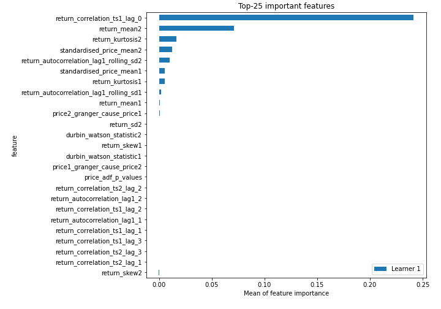
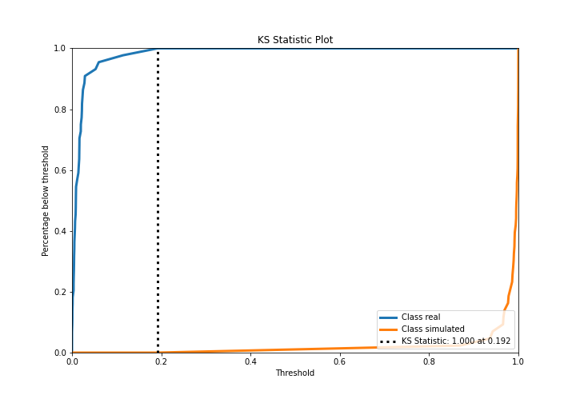
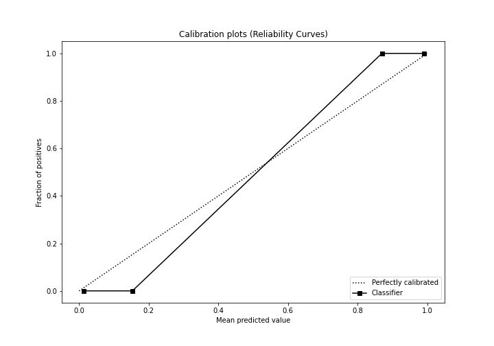
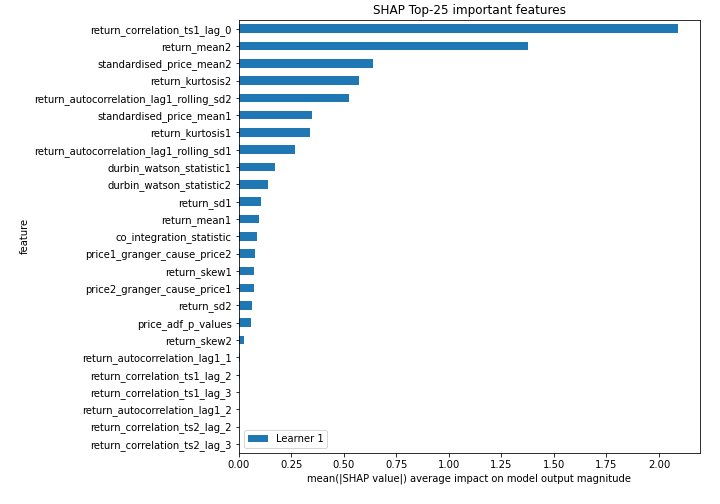
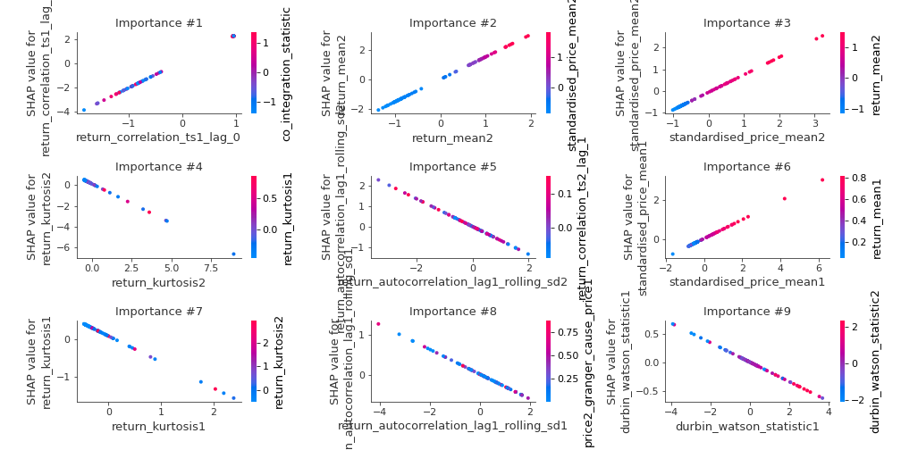
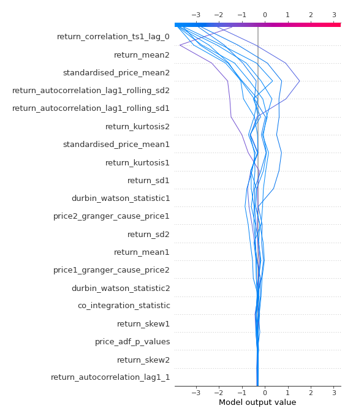
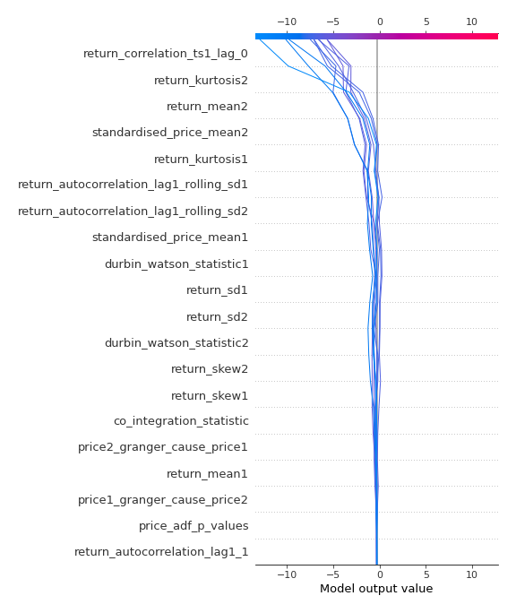
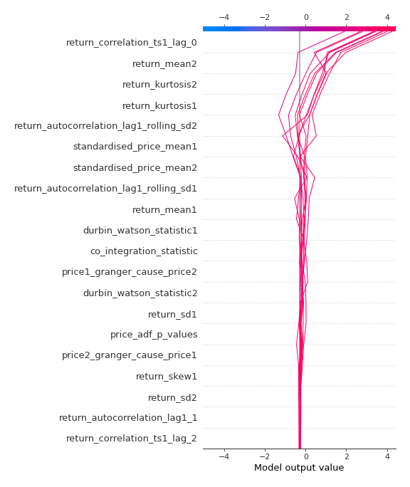
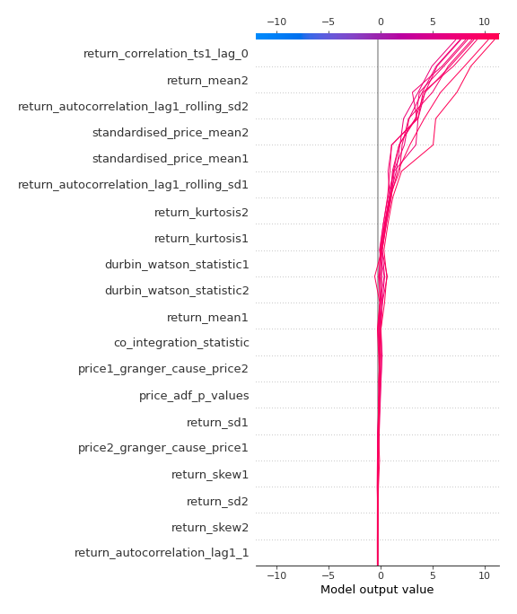

# Summary of 3_Linear

[<< Go back](../README.md)

## Logistic Regression (Linear)
- **n_jobs**: -1
- **explain_level**: 2

## Validation
 - **validation_type**: split
 - **train_ratio**: 0.75
 - **shuffle**: True
 - **stratify**: True

## Optimized metric
accuracy

## Training time

866.3 seconds

## Metric details
|           |     score |    threshold |
|:----------|----------:|-------------:|
| logloss   | 0.0165235 | nan          |
| auc       | 1         | nan          |
| f1        | 1         |   0.499783   |
| accuracy  | 1         |   0.499783   |
| precision | 1         |   0.499783   |
| recall    | 1         |   2.2434e-06 |
| mcc       | 1         |   0.499783   |

## Confusion matrix (at threshold=0.499783)
|                      |   Predicted as real |   Predicted as simulated |
|:---------------------|--------------------:|-------------------------:|
| Labeled as real      |                  44 |                        0 |
| Labeled as simulated |                   0 |                       43 |

## Learning curves

## Coefficients
| feature                                 |   Learner_1 |
|:----------------------------------------|------------:|
| return_correlation_ts1_lag_0            |   2.20193   |
| return_mean2                            |   1.51328   |
| standardised_price_mean2                |   0.806672  |
| standardised_price_mean1                |   0.484319  |
| return_mean1                            |   0.376206  |
| return_skew1                            |   0.222843  |
| intercept                               |   0.183674  |
| price_adf_p_values                      |   0.180884  |
| durbin_watson_statistic2                |   0.157881  |
| return_correlation_ts1_lag_2            |   0.0960404 |
| return_autocorrelation_lag1_1           |   0.0918696 |
| return_sd2                              |   0.0896815 |
| return_correlation_ts2_lag_2            |   0.0773232 |
| return_correlation_ts2_lag_3            |   0.0738114 |
| return_correlation_ts1_lag_3            |   0.07265   |
| return_autocorrelation_lag1_2           |   0.0618115 |
| return_correlation_ts1_lag_1            |   0.0613812 |
| return_correlation_ts2_lag_1            |   0.0453174 |
| return_skew2                            |   0.0445132 |
| co_integration_statistic                |  -0.094764  |
| durbin_watson_statistic1                |  -0.169754  |
| return_sd1                              |  -0.189363  |
| price2_granger_cause_price1             |  -0.283894  |
| return_autocorrelation_lag1_rolling_sd1 |  -0.304569  |
| price1_granger_cause_price2             |  -0.315316  |
| return_autocorrelation_lag1_rolling_sd2 |  -0.679957  |
| return_kurtosis1                        |  -0.700454  |
| return_kurtosis2                        |  -0.752541  |

## Permutation-based Importance

## Confusion Matrix

## Normalized Confusion Matrix

## ROC Curve

## Kolmogorov-Smirnov Statistic

## Precision-Recall Curve

## Calibration Curve

## Cumulative Gains Curve

## Lift Curve

## SHAP Importance

## SHAP Dependence plots

### Dependence (Fold 1)

## SHAP Decision plots

### Top-10 Worst decisions for class 0 (Fold 1)

### Top-10 Best decisions for class 0 (Fold 1)

### Top-10 Worst decisions for class 1 (Fold 1)

### Top-10 Best decisions for class 1 (Fold 1)

[<< Go back](../README.md)
