# Exploratory Data Analysis

[<< Go back](../README.md)
## Feature : target
- **Feature type** : categorical
- **Missing** : 0.0%
- **Unique** : 2
- **Count** :347
- **Unique** :2
- **Top** :real
- **Freq** :176

## Feature : standardised_price_mean1
- **Feature type** : continous
- **Missing** : 0.0%
- **Unique** : 347
- **Count** :347.0
- **Mean** :159.26839185949038
- **Std** :71.83269935502761
- **Min** :43.818674613537056
- **25%th Percentile** : 116.31056612452079
- **50%th Percentile** : 130.81446358406455
- **75%th Percentile** : 186.06418536277897
- **Max** :591.3703024125841

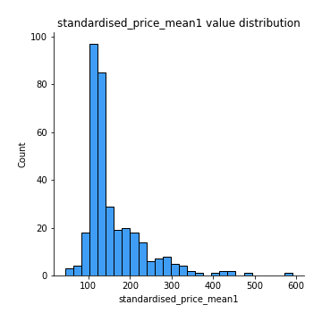
## Feature : standardised_price_mean2
- **Feature type** : continous
- **Missing** : 0.0%
- **Unique** : 347
- **Count** :347.0
- **Mean** :246.14729132736682
- **Std** :167.13080266111405
- **Min** :77.36570036335733
- **25%th Percentile** : 117.36760694204618
- **50%th Percentile** : 140.46573855483464
- **75%th Percentile** : 336.3631541876015
- **Max** :1057.3579960624554

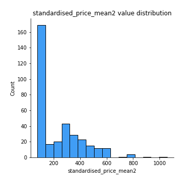
## Feature : return_mean1
- **Feature type** : continous
- **Missing** : 0.0%
- **Unique** : 347
- **Count** :347.0
- **Mean** :0.33986316943535105
- **Std** :0.28881049267085457
- **Min** :-0.31556073795310474
- **25%th Percentile** : 0.10646745462896424
- **50%th Percentile** : 0.2080641180573716
- **75%th Percentile** : 0.5890734147603582
- **Max** :1.2336414655560004

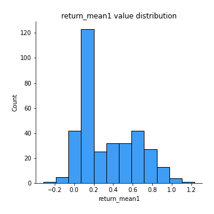
## Feature : return_mean2
- **Feature type** : continous
- **Missing** : 0.0%
- **Unique** : 347
- **Count** :347.0
- **Mean** :0.5177075433048519
- **Std** :0.4539865225306522
- **Min** :-0.1419790023072835
- **25%th Percentile** : 0.09983685584623408
- **50%th Percentile** : 0.23415320086583186
- **75%th Percentile** : 0.9426156464912769
- **Max** :1.493875067872129

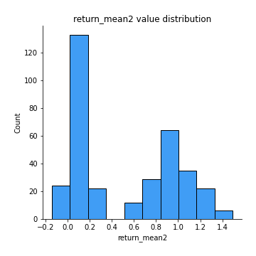
## Feature : return_sd1
- **Feature type** : continous
- **Missing** : 0.0%
- **Unique** : 347
- **Count** :347.0
- **Mean** :1.5379969478089035
- **Std** :0.35049087603657103
- **Min** :0.8247986145536357
- **25%th Percentile** : 1.4214097152583047
- **50%th Percentile** : 1.5127607833112897
- **75%th Percentile** : 1.604439151017437
- **Max** :3.3277429018214417

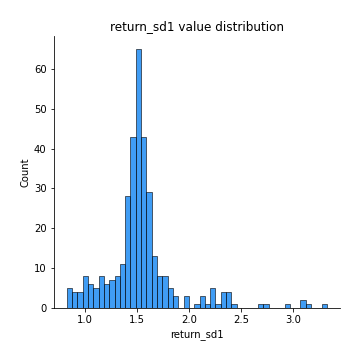
## Feature : return_sd2
- **Feature type** : continous
- **Missing** : 0.0%
- **Unique** : 347
- **Count** :347.0
- **Mean** :1.5851295194217714
- **Std** :0.363320533213424
- **Min** :0.8243843596443498
- **25%th Percentile** : 1.447246709113693
- **50%th Percentile** : 1.5669178133048782
- **75%th Percentile** : 1.6609295894894305
- **Max** :3.1116798746969656

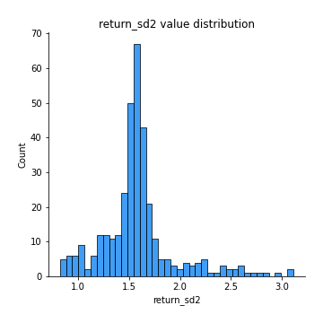
## Feature : return_skew1
- **Feature type** : continous
- **Missing** : 0.0%
- **Unique** : 347
- **Count** :347.0
- **Mean** :-0.1371439969454344
- **Std** :0.7930588932239706
- **Min** :-6.857840543649597
- **25%th Percentile** : -0.26635184476168616
- **50%th Percentile** : -0.048240067569067374
- **75%th Percentile** : 0.1003572914768585
- **Max** :4.140719546467752

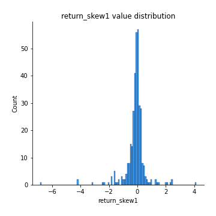
## Feature : return_skew2
- **Feature type** : continous
- **Missing** : 0.0%
- **Unique** : 347
- **Count** :347.0
- **Mean** :-0.22587646766598687
- **Std** :1.0306527058605528
- **Min** :-6.613535067863222
- **25%th Percentile** : -0.31240607939249165
- **50%th Percentile** : -0.061964634275119335
- **75%th Percentile** : 0.10170114307573158
- **Max** :4.289944724188784

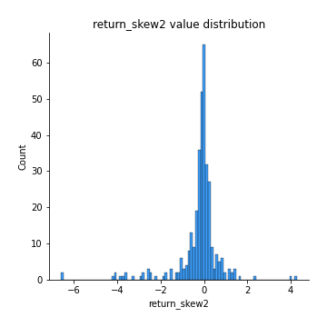
## Feature : return_kurtosis1
- **Feature type** : continous
- **Missing** : 0.0%
- **Unique** : 347
- **Count** :347.0
- **Mean** :2.835582666365636
- **Std** :6.869888783749049
- **Min** :-0.7516091963598552
- **25%th Percentile** : -0.032301814789906125
- **50%th Percentile** : 0.559260342435675
- **75%th Percentile** : 2.629878099074958
- **Max** :80.08765409662804

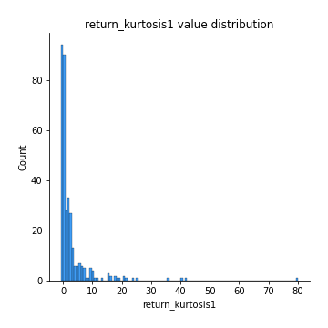
## Feature : return_kurtosis2
- **Feature type** : continous
- **Missing** : 0.0%
- **Unique** : 347
- **Count** :347.0
- **Mean** :4.051813509066897
- **Std** :9.723144651869976
- **Min** :-0.7491598741876042
- **25%th Percentile** : -0.02296389340253646
- **50%th Percentile** : 0.6363051729984983
- **75%th Percentile** : 3.2665831135519814
- **Max** :81.96076596987915

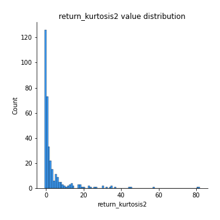
## Feature : return_autocorrelation_lag1_1
- **Feature type** : continous
- **Missing** : 0.0%
- **Unique** : 347
- **Count** :347.0
- **Mean** :0.009940872997544188
- **Std** :0.07671056730200221
- **Min** :-0.21106657115766964
- **25%th Percentile** : -0.04435647100386442
- **50%th Percentile** : 0.009917045791118248
- **75%th Percentile** : 0.06054516888909351
- **Max** :0.23310127090148183

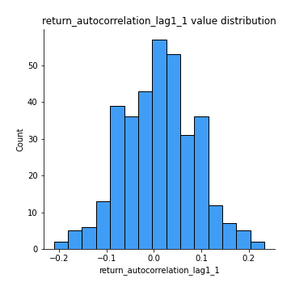
## Feature : return_autocorrelation_lag1_2
- **Feature type** : continous
- **Missing** : 0.0%
- **Unique** : 347
- **Count** :347.0
- **Mean** :0.008327585592082609
- **Std** :0.07089824711761462
- **Min** :-0.23650716165005362
- **25%th Percentile** : -0.03458060610464902
- **50%th Percentile** : 0.012320628459435249
- **75%th Percentile** : 0.05812858326329083
- **Max** :0.20789800390089375

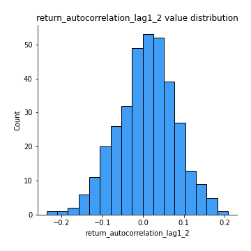
## Feature : return_autocorrelation_lag1_rolling_sd1
- **Feature type** : continous
- **Missing** : 0.0%
- **Unique** : 347
- **Count** :347.0
- **Mean** :0.9462910108523316
- **Std** :0.019540064755067945
- **Min** :0.8706732948271847
- **25%th Percentile** : 0.9347738746646006
- **50%th Percentile** : 0.9492021536241007
- **75%th Percentile** : 0.9599571220225771
- **Max** :0.9817860359018395

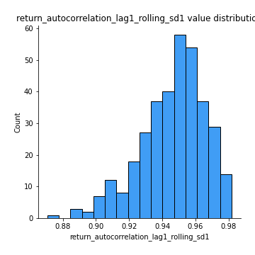
## Feature : return_autocorrelation_lag1_rolling_sd2
- **Feature type** : continous
- **Missing** : 0.0%
- **Unique** : 347
- **Count** :347.0
- **Mean** :0.9453403191486351
- **Std** :0.018059130469089378
- **Min** :0.8865953157516836
- **25%th Percentile** : 0.9346294437705174
- **50%th Percentile** : 0.9477741863682082
- **75%th Percentile** : 0.9580512664289729
- **Max** :0.9816307701771863

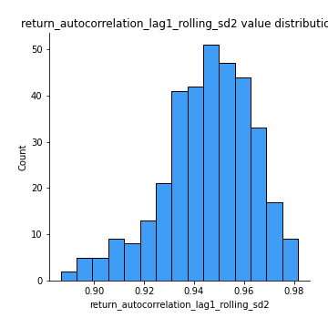
## Feature : price_adf_p_values
- **Feature type** : continous
- **Missing** : 0.0%
- **Unique** : 347
- **Count** :347.0
- **Mean** :0.39889502486139217
- **Std** :0.3531248942822088
- **Min** :4.494338767447814e-07
- **25%th Percentile** : 0.07325221518075187
- **50%th Percentile** : 0.28504597633925177
- **75%th Percentile** : 0.7056326580022627
- **Max** :0.9990301011719359

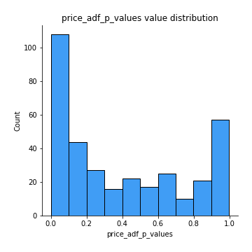
## Feature : return_correlation_ts1_lag_0
- **Feature type** : continous
- **Missing** : 0.0%
- **Unique** : 347
- **Count** :347.0
- **Mean** :0.6354767343764294
- **Std** :0.38021290429220295
- **Min** :-0.11676370662383395
- **25%th Percentile** : 0.29198020815321224
- **50%th Percentile** : 0.68699343587488
- **75%th Percentile** : 0.9983435981543292
- **Max** :0.9994557154738104

## Feature : return_correlation_ts1_lag_1
- **Feature type** : continous
- **Missing** : 0.0%
- **Unique** : 347
- **Count** :347.0
- **Mean** :0.010573872181028359
- **Std** :0.06976916017630379
- **Min** :-0.18856712556884056
- **25%th Percentile** : -0.03133787590810555
- **50%th Percentile** : 0.010912405749532093
- **75%th Percentile** : 0.05585670884273341
- **Max** :0.2204172275377606

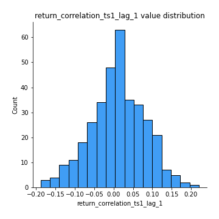
## Feature : return_correlation_ts1_lag_2
- **Feature type** : continous
- **Missing** : 0.0%
- **Unique** : 347
- **Count** :347.0
- **Mean** :0.004990499467985535
- **Std** :0.06392233172821074
- **Min** :-0.17458049302943662
- **25%th Percentile** : -0.03458419426736657
- **50%th Percentile** : 0.004275904989376408
- **75%th Percentile** : 0.049234439164485805
- **Max** :0.16596781200870073

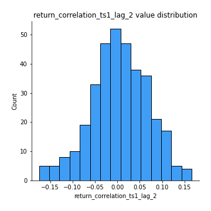
## Feature : return_correlation_ts1_lag_3
- **Feature type** : continous
- **Missing** : 0.0%
- **Unique** : 347
- **Count** :347.0
- **Mean** :0.011242888447509383
- **Std** :0.06867676194534947
- **Min** :-0.21184867865910795
- **25%th Percentile** : -0.03047362418281831
- **50%th Percentile** : 0.012009272401982957
- **75%th Percentile** : 0.05894307260144747
- **Max** :0.1827628752673471

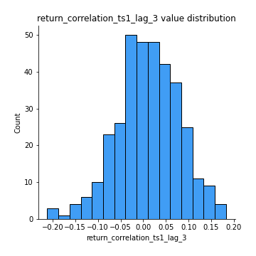
## Feature : return_correlation_ts2_lag_1
- **Feature type** : continous
- **Missing** : 0.0%
- **Unique** : 347
- **Count** :347.0
- **Mean** :0.013920474898349994
- **Std** :0.06981147170641994
- **Min** :-0.19886587877143053
- **25%th Percentile** : -0.031547959748367375
- **50%th Percentile** : 0.01624174056521273
- **75%th Percentile** : 0.06250675846798334
- **Max** :0.2188700459912286

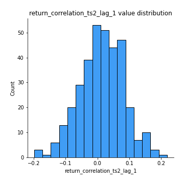
## Feature : return_correlation_ts2_lag_2
- **Feature type** : continous
- **Missing** : 0.0%
- **Unique** : 347
- **Count** :347.0
- **Mean** :0.006483759005353264
- **Std** :0.06558044251088949
- **Min** :-0.2758654278092797
- **25%th Percentile** : -0.03488402471244216
- **50%th Percentile** : 0.004626224173544651
- **75%th Percentile** : 0.05340754708720283
- **Max** :0.1629007760732384

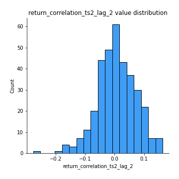
## Feature : return_correlation_ts2_lag_3
- **Feature type** : continous
- **Missing** : 0.0%
- **Unique** : 347
- **Count** :347.0
- **Mean** :0.015790261191043473
- **Std** :0.06355475303988573
- **Min** :-0.1770774021770153
- **25%th Percentile** : -0.02629900118399833
- **50%th Percentile** : 0.012125416804163852
- **75%th Percentile** : 0.056542236760979435
- **Max** :0.1837556328214464

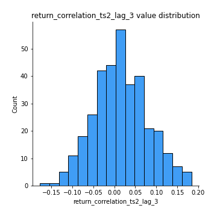
## Feature : durbin_watson_statistic1
- **Feature type** : continous
- **Missing** : 0.0%
- **Unique** : 347
- **Count** :347.0
- **Mean** :1.9882314022251895
- **Std** :0.07261531562156542
- **Min** :1.7347545360512986
- **25%th Percentile** : 1.9627246484356742
- **50%th Percentile** : 1.9891411561685215
- **75%th Percentile** : 2.013506351820189
- **Max** :2.2220448156450057

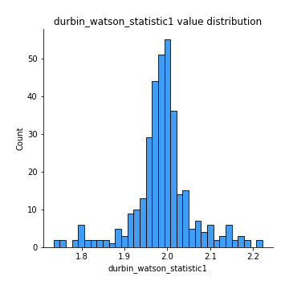
## Feature : durbin_watson_statistic2
- **Feature type** : continous
- **Missing** : 0.0%
- **Unique** : 347
- **Count** :347.0
- **Mean** :1.9821659967536176
- **Std** :0.07981790031827013
- **Min** :1.649823119450525
- **25%th Percentile** : 1.953706188099786
- **50%th Percentile** : 1.985317399648337
- **75%th Percentile** : 2.0135191899719502
- **Max** :2.238967037429454

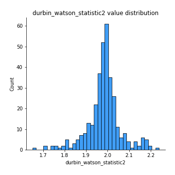
## Feature : co_integration_statistic
- **Feature type** : continous
- **Missing** : 0.0%
- **Unique** : 347
- **Count** :347.0
- **Mean** :0.5156261577840595
- **Std** :0.34522489422332214
- **Min** :3.3706511469754662e-06
- **25%th Percentile** : 0.19332490094708785
- **50%th Percentile** : 0.5125246011289827
- **75%th Percentile** : 0.8650117234536294
- **Max** :0.9939092353376776

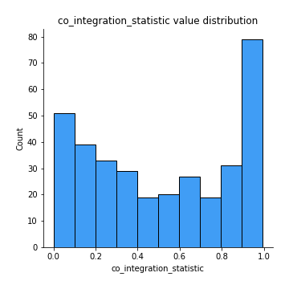
## Feature : price2_granger_cause_price1
- **Feature type** : continous
- **Missing** : 0.0%
- **Unique** : 347
- **Count** :347.0
- **Mean** :0.22946667263394577
- **Std** :0.27452307285639915
- **Min** :2.3655116242603476e-09
- **25%th Percentile** : 0.020498090324545117
- **50%th Percentile** : 0.09955945963533974
- **75%th Percentile** : 0.35341120135747967
- **Max** :0.9879764520831139

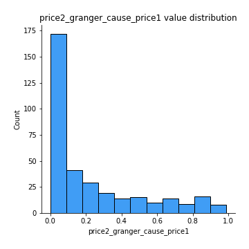
## Feature : price1_granger_cause_price2
- **Feature type** : continous
- **Missing** : 0.0%
- **Unique** : 347
- **Count** :347.0
- **Mean** :0.28997573186469455
- **Std** :0.2850159287237037
- **Min** :6.607726210169445e-06
- **25%th Percentile** : 0.04547995781428313
- **50%th Percentile** : 0.20256960894685927
- **75%th Percentile** : 0.45826371117193454
- **Max** :0.9912763272907406

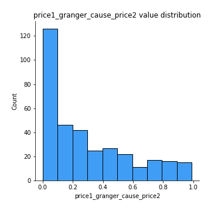

[<< Go back](../README.md)
