# Summary of 3_Linear

[<< Go back](../README.md)

## Logistic Regression (Linear)
- **n_jobs**: -1
- **explain_level**: 2

## Validation
 - **validation_type**: split
 - **train_ratio**: 0.75
 - **shuffle**: True
 - **stratify**: True

## Optimized metric
accuracy

## Training time

26.4 seconds

## Metric details
|           |     score |     threshold |
|:----------|----------:|--------------:|
| logloss   | 0.0211843 | nan           |
| auc       | 1         | nan           |
| f1        | 1         |   0.490772    |
| accuracy  | 1         |   0.490772    |
| precision | 1         |   0.490772    |
| recall    | 1         |   0.000178934 |
| mcc       | 1         |   0.490772    |

## Confusion matrix (at threshold=0.490772)
|                      |   Predicted as real |   Predicted as simulated |
|:---------------------|--------------------:|-------------------------:|
| Labeled as real      |                  42 |                        0 |
| Labeled as simulated |                   0 |                       45 |

## Learning curves

## Coefficients
| feature                                 |   Learner_1 |
|:----------------------------------------|------------:|
| return_correlation_ts1_lag_0            |   1.99097   |
| return_mean2                            |   1.64      |
| standardised_price_mean2                |   0.841702  |
| standardised_price_mean1                |   0.507298  |
| intercept                               |   0.39244   |
| return_mean1                            |   0.341019  |
| price_adf_p_values                      |   0.28405   |
| return_skew1                            |   0.222342  |
| return_autocorrelation_lag1_1           |   0.100336  |
| return_correlation_ts2_lag_2            |   0.0942023 |
| return_correlation_ts1_lag_1            |   0.0903944 |
| return_sd1                              |   0.0889184 |
| return_autocorrelation_lag1_2           |   0.0862077 |
| return_correlation_ts1_lag_3            |   0.0836997 |
| return_correlation_ts2_lag_3            |   0.0821413 |
| return_correlation_ts2_lag_1            |   0.0788939 |
| return_correlation_ts1_lag_2            |   0.0750756 |
| return_skew2                            |   0.0642483 |
| durbin_watson_statistic1                |   0.0180684 |
| durbin_watson_statistic2                |  -0.0347792 |
| return_sd2                              |  -0.0620749 |
| co_integration_statistic                |  -0.101493  |
| price1_granger_cause_price2             |  -0.220864  |
| price2_granger_cause_price1             |  -0.353996  |
| return_autocorrelation_lag1_rolling_sd1 |  -0.372309  |
| return_autocorrelation_lag1_rolling_sd2 |  -0.501407  |
| return_kurtosis2                        |  -0.578638  |
| return_kurtosis1                        |  -0.907527  |

## Permutation-based Importance
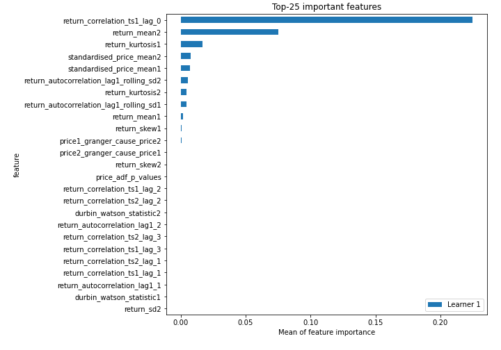
## Confusion Matrix

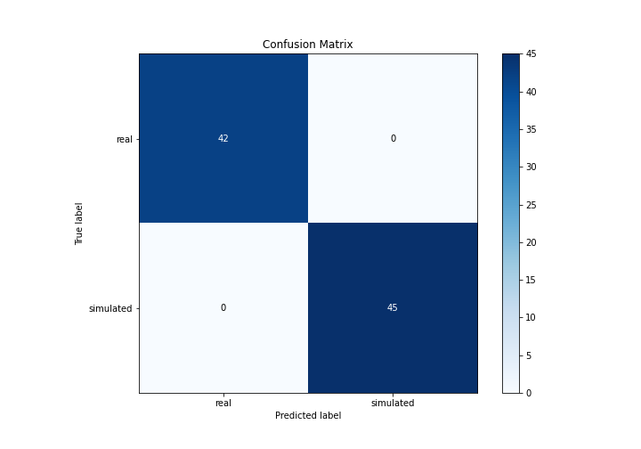

## Normalized Confusion Matrix

## ROC Curve

## Kolmogorov-Smirnov Statistic

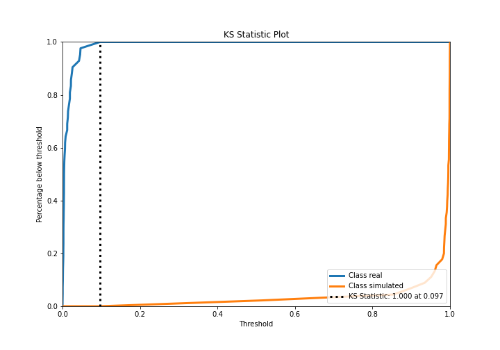

## Precision-Recall Curve

## Calibration Curve

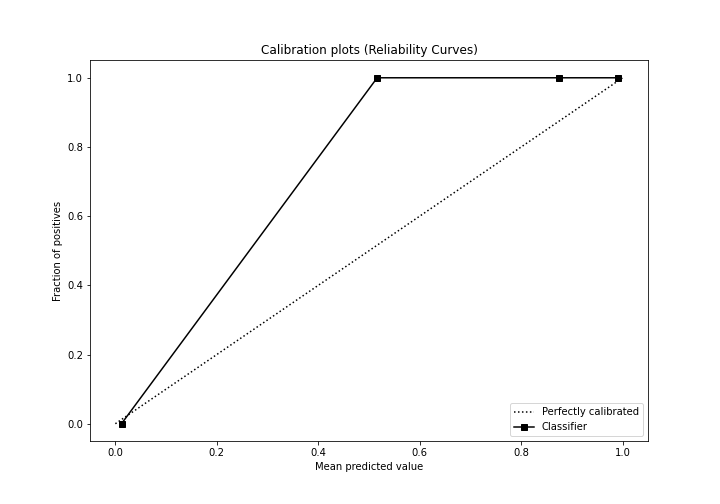

## Cumulative Gains Curve

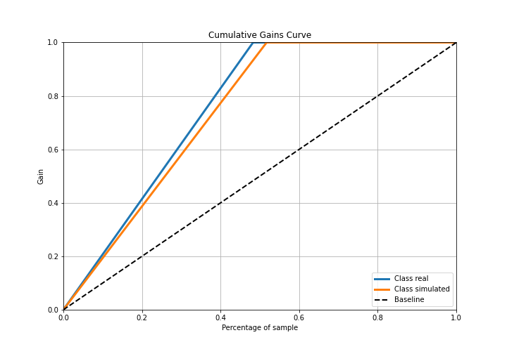

## Lift Curve

## SHAP Importance
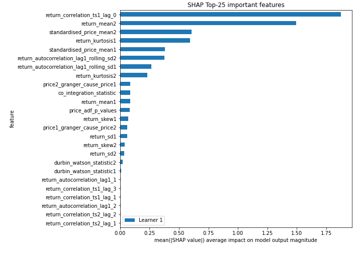

## SHAP Dependence plots

### Dependence (Fold 1)
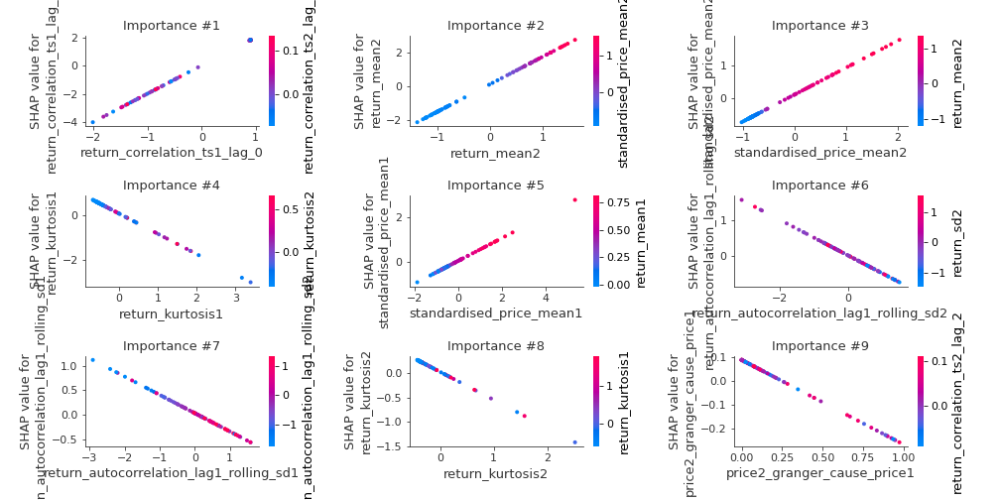

## SHAP Decision plots

### Top-10 Worst decisions for class 0 (Fold 1)
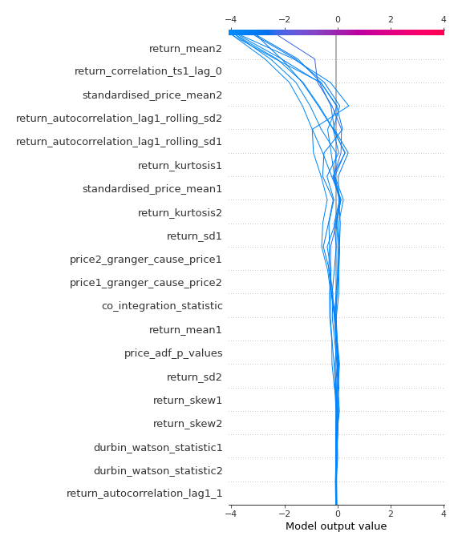
### Top-10 Best decisions for class 0 (Fold 1)
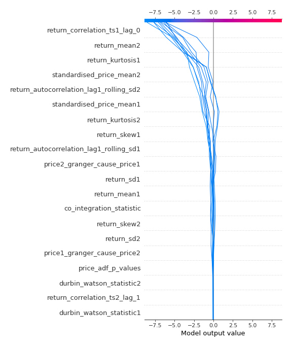
### Top-10 Worst decisions for class 1 (Fold 1)
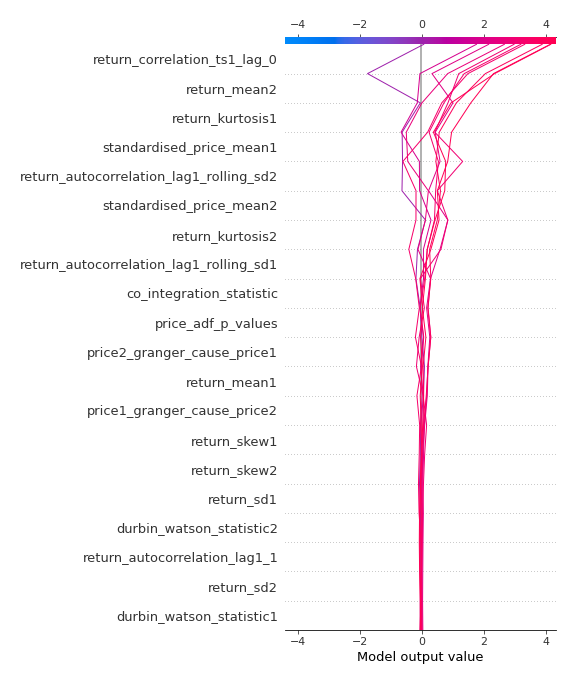
### Top-10 Best decisions for class 1 (Fold 1)
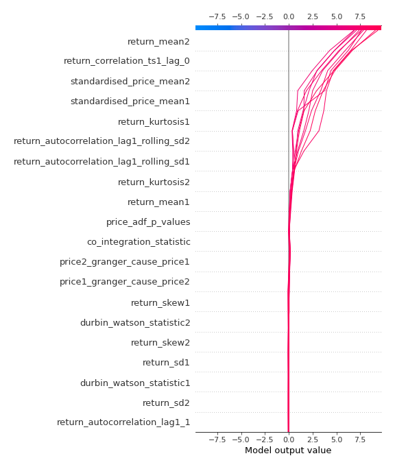

[<< Go back](../README.md)
