# Exploratory Data Analysis

[<< Go back](../README.md)
## Feature : target
- **Feature type** : categorical
- **Missing** : 0.0%
- **Unique** : 2
- **Count** :347
- **Unique** :2
- **Top** :simulated
- **Freq** :181

## Feature : standardised_price_mean1
- **Feature type** : continous
- **Missing** : 0.0%
- **Unique** : 347
- **Count** :347.0
- **Mean** :158.25046045244426
- **Std** :62.14087847807878
- **Min** :43.818674613537056
- **25%th Percentile** : 118.67169168657372
- **50%th Percentile** : 132.17763421014027
- **75%th Percentile** : 190.9987787776103
- **Max** :487.57094927614696

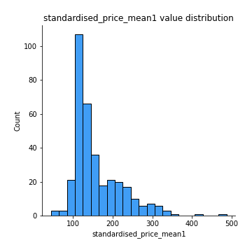
## Feature : standardised_price_mean2
- **Feature type** : continous
- **Missing** : 0.0%
- **Unique** : 347
- **Count** :347.0
- **Mean** :254.968027088653
- **Std** :169.7771383483851
- **Min** :81.42920075007345
- **25%th Percentile** : 118.21901483432008
- **50%th Percentile** : 177.19091829113816
- **75%th Percentile** : 360.0123673788835
- **Max** :1057.3579960624554

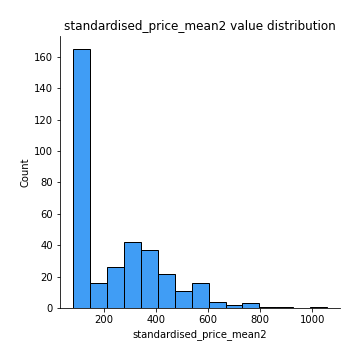
## Feature : return_mean1
- **Feature type** : continous
- **Missing** : 0.0%
- **Unique** : 347
- **Count** :347.0
- **Mean** :0.3482059272463598
- **Std** :0.277433786451948
- **Min** :-0.31556073795310474
- **25%th Percentile** : 0.11476507569047191
- **50%th Percentile** : 0.25373212109086923
- **75%th Percentile** : 0.5942562921261074
- **Max** :1.0260328716607146

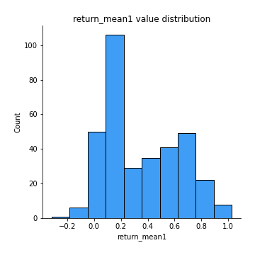
## Feature : return_mean2
- **Feature type** : continous
- **Missing** : 0.0%
- **Unique** : 347
- **Count** :347.0
- **Mean** :0.5422513184841582
- **Std** :0.45493815630770496
- **Min** :-0.15156023638923194
- **25%th Percentile** : 0.10170827408556676
- **50%th Percentile** : 0.5839050562481559
- **75%th Percentile** : 0.9676409872609311
- **Max** :1.493875067872129

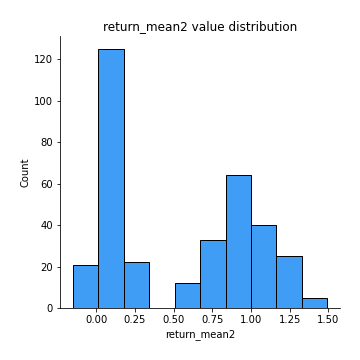
## Feature : return_sd1
- **Feature type** : continous
- **Missing** : 0.0%
- **Unique** : 347
- **Count** :347.0
- **Mean** :1.5173390479392364
- **Std** :0.34163386077066504
- **Min** :0.8086152458349032
- **25%th Percentile** : 1.420903886360089
- **50%th Percentile** : 1.500395524944083
- **75%th Percentile** : 1.5931285346864321
- **Max** :3.3277429018214417

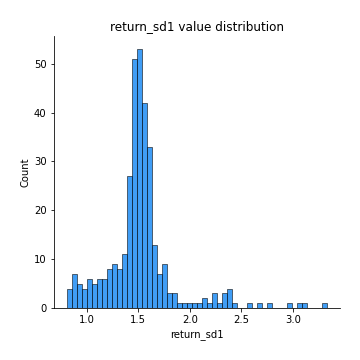
## Feature : return_sd2
- **Feature type** : continous
- **Missing** : 0.0%
- **Unique** : 347
- **Count** :347.0
- **Mean** :1.6032042701703686
- **Std** :0.4081985107573858
- **Min** :0.8184811977504522
- **25%th Percentile** : 1.4618781932671983
- **50%th Percentile** : 1.5647437546389773
- **75%th Percentile** : 1.6577507835568688
- **Max** :4.598857143139886

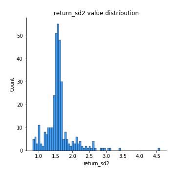
## Feature : return_skew1
- **Feature type** : continous
- **Missing** : 0.0%
- **Unique** : 347
- **Count** :347.0
- **Mean** :-0.10719531348414614
- **Std** :0.5427349014905619
- **Min** :-2.3926172693088956
- **25%th Percentile** : -0.25421746359807845
- **50%th Percentile** : -0.06497926781524938
- **75%th Percentile** : 0.08708452221780738
- **Max** :2.392176654031437

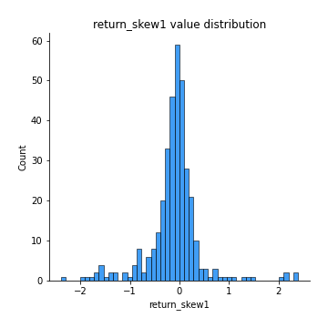
## Feature : return_skew2
- **Feature type** : continous
- **Missing** : 0.0%
- **Unique** : 347
- **Count** :347.0
- **Mean** :-0.23201695571708872
- **Std** :1.1260665929056497
- **Min** :-9.5467599340665
- **25%th Percentile** : -0.2853186093671556
- **50%th Percentile** : -0.06274982701059352
- **75%th Percentile** : 0.10343021097082034
- **Max** :4.289944724188784

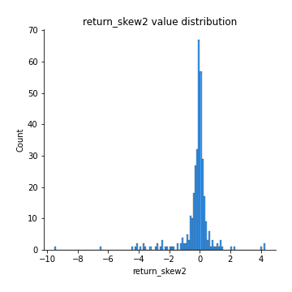
## Feature : return_kurtosis1
- **Feature type** : continous
- **Missing** : 0.0%
- **Unique** : 347
- **Count** :347.0
- **Mean** :2.1320956665397817
- **Std** :4.014594510558101
- **Min** :-0.7516091963598552
- **25%th Percentile** : -0.07741940379500933
- **50%th Percentile** : 0.4745425641866112
- **75%th Percentile** : 2.328965600218053
- **Max** :23.71392113209094

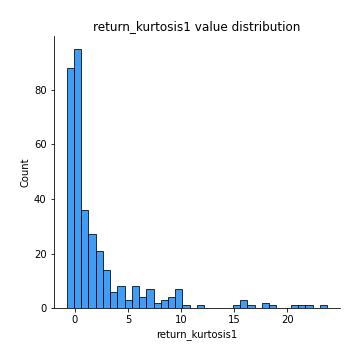
## Feature : return_kurtosis2
- **Feature type** : continous
- **Missing** : 0.0%
- **Unique** : 347
- **Count** :347.0
- **Mean** :4.336579057629738
- **Std** :11.520631271365959
- **Min** :-0.7491598741876042
- **25%th Percentile** : -0.08285671804397121
- **50%th Percentile** : 0.48285284341979207
- **75%th Percentile** : 3.1173078278932764
- **Max** :127.80647138658917

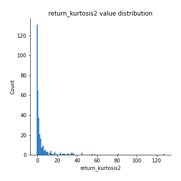
## Feature : return_autocorrelation_lag1_1
- **Feature type** : continous
- **Missing** : 0.0%
- **Unique** : 347
- **Count** :347.0
- **Mean** :0.008267588538924455
- **Std** :0.07673933610786038
- **Min** :-0.21106657115766964
- **25%th Percentile** : -0.04404080090942604
- **50%th Percentile** : 0.007442928722500845
- **75%th Percentile** : 0.06128359081094782
- **Max** :0.23310127090148183

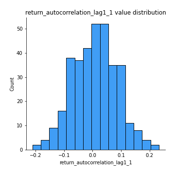
## Feature : return_autocorrelation_lag1_2
- **Feature type** : continous
- **Missing** : 0.0%
- **Unique** : 347
- **Count** :347.0
- **Mean** :0.006630159227398259
- **Std** :0.06958207480650465
- **Min** :-0.18714240435511845
- **25%th Percentile** : -0.0390826514502502
- **50%th Percentile** : 0.010712644299350682
- **75%th Percentile** : 0.056939278798637784
- **Max** :0.20789800390089375

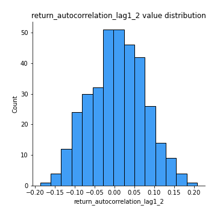
## Feature : return_autocorrelation_lag1_rolling_sd1
- **Feature type** : continous
- **Missing** : 0.0%
- **Unique** : 347
- **Count** :347.0
- **Mean** :0.9458266411139037
- **Std** :0.0203714931199036
- **Min** :0.8706732948271847
- **25%th Percentile** : 0.9334038050559827
- **50%th Percentile** : 0.9492244955601706
- **75%th Percentile** : 0.9601445097028498
- **Max** :0.9817860359018395

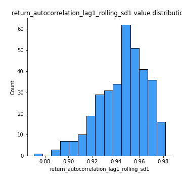
## Feature : return_autocorrelation_lag1_rolling_sd2
- **Feature type** : continous
- **Missing** : 0.0%
- **Unique** : 347
- **Count** :347.0
- **Mean** :0.944235020530646
- **Std** :0.01855835328330439
- **Min** :0.8865953157516836
- **25%th Percentile** : 0.9330821405313983
- **50%th Percentile** : 0.9454162977072026
- **75%th Percentile** : 0.9578207924552493
- **Max** :0.9816307701771863

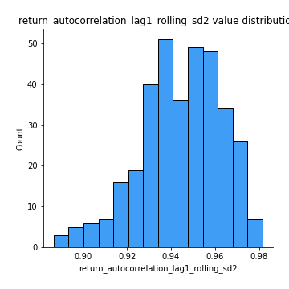
## Feature : price_adf_p_values
- **Feature type** : continous
- **Missing** : 0.0%
- **Unique** : 347
- **Count** :347.0
- **Mean** :0.42593613473144354
- **Std** :0.3614870799073715
- **Min** :4.24204332590779e-07
- **25%th Percentile** : 0.08746888471131761
- **50%th Percentile** : 0.30752634843973814
- **75%th Percentile** : 0.8182061116802415
- **Max** :0.9990301011719359

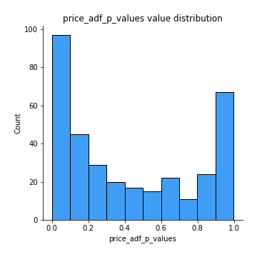
## Feature : return_correlation_ts1_lag_0
- **Feature type** : continous
- **Missing** : 0.0%
- **Unique** : 347
- **Count** :347.0
- **Mean** :0.656696302861528
- **Std** :0.37680394349709495
- **Min** :-0.11676370662383395
- **25%th Percentile** : 0.310823606255354
- **50%th Percentile** : 0.9921380214779217
- **75%th Percentile** : 0.9985829653861498
- **Max** :0.9994557154738104

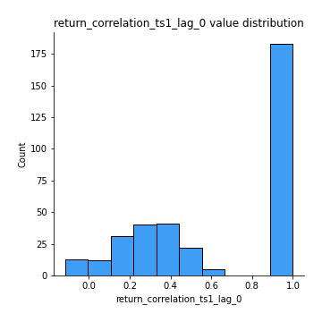
## Feature : return_correlation_ts1_lag_1
- **Feature type** : continous
- **Missing** : 0.0%
- **Unique** : 347
- **Count** :347.0
- **Mean** :0.0058239574029754475
- **Std** :0.07142140129693193
- **Min** :-0.18856712556884056
- **25%th Percentile** : -0.04472485820274228
- **50%th Percentile** : 0.006367416301311528
- **75%th Percentile** : 0.05585670884273341
- **Max** :0.2204172275377606

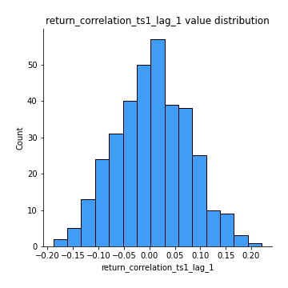
## Feature : return_correlation_ts1_lag_2
- **Feature type** : continous
- **Missing** : 0.0%
- **Unique** : 347
- **Count** :347.0
- **Mean** :0.006709288266554621
- **Std** :0.06461211805538236
- **Min** :-0.16995796655467021
- **25%th Percentile** : -0.03477491447016692
- **50%th Percentile** : 0.00471919895256748
- **75%th Percentile** : 0.053100682803162796
- **Max** :0.16596781200870073

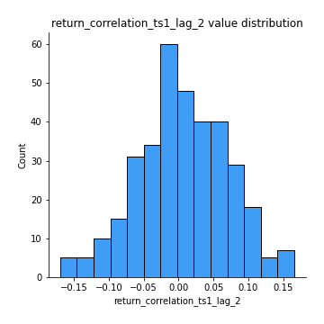
## Feature : return_correlation_ts1_lag_3
- **Feature type** : continous
- **Missing** : 0.0%
- **Unique** : 347
- **Count** :347.0
- **Mean** :0.013401412777175313
- **Std** :0.07128693270858162
- **Min** :-0.21184867865910795
- **25%th Percentile** : -0.03105986634099736
- **50%th Percentile** : 0.013850640066476546
- **75%th Percentile** : 0.058132308260063804
- **Max** :0.22601984756836344

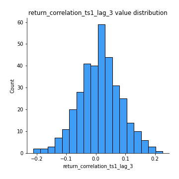
## Feature : return_correlation_ts2_lag_1
- **Feature type** : continous
- **Missing** : 0.0%
- **Unique** : 347
- **Count** :347.0
- **Mean** :0.008233869893041224
- **Std** :0.07134586223181118
- **Min** :-0.19886587877143053
- **25%th Percentile** : -0.04263641932671224
- **50%th Percentile** : 0.0072641360097977494
- **75%th Percentile** : 0.059245663421980475
- **Max** :0.2188700459912286

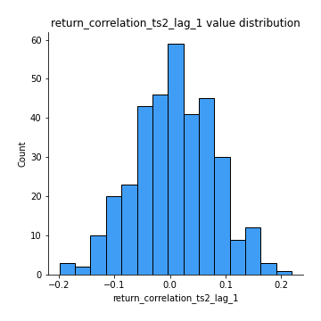
## Feature : return_correlation_ts2_lag_2
- **Feature type** : continous
- **Missing** : 0.0%
- **Unique** : 347
- **Count** :347.0
- **Mean** :0.006737260947577784
- **Std** :0.06717509465213108
- **Min** :-0.2758654278092797
- **25%th Percentile** : -0.03402473907975522
- **50%th Percentile** : 0.004626224173544651
- **75%th Percentile** : 0.05630688971388405
- **Max** :0.1629007760732384

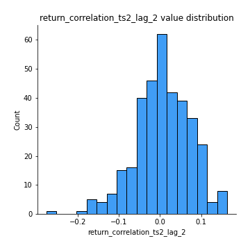
## Feature : return_correlation_ts2_lag_3
- **Feature type** : continous
- **Missing** : 0.0%
- **Unique** : 347
- **Count** :347.0
- **Mean** :0.01580812060596715
- **Std** :0.06687203695163677
- **Min** :-0.1770774021770153
- **25%th Percentile** : -0.02775021586254363
- **50%th Percentile** : 0.015113753388322144
- **75%th Percentile** : 0.05679143776290799
- **Max** :0.1931758318086702

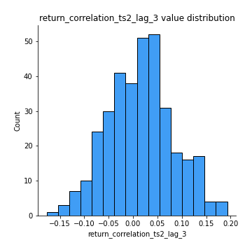
## Feature : durbin_watson_statistic1
- **Feature type** : continous
- **Missing** : 0.0%
- **Unique** : 347
- **Count** :347.0
- **Mean** :1.9919372624256622
- **Std** :0.07922930761867839
- **Min** :1.7347545360512986
- **25%th Percentile** : 1.9611860579705176
- **50%th Percentile** : 1.989434036198407
- **75%th Percentile** : 2.013964456858929
- **Max** :2.3147835328996527

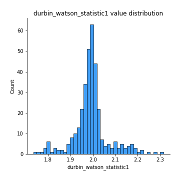
## Feature : durbin_watson_statistic2
- **Feature type** : continous
- **Missing** : 0.0%
- **Unique** : 347
- **Count** :347.0
- **Mean** :1.9861278345732412
- **Std** :0.08724039074898139
- **Min** :1.7004017842255341
- **25%th Percentile** : 1.956068715884931
- **50%th Percentile** : 1.987563105178198
- **75%th Percentile** : 2.015066303653456
- **Max** :2.334073172550357

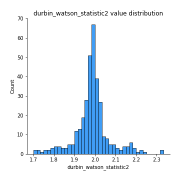
## Feature : co_integration_statistic
- **Feature type** : continous
- **Missing** : 0.0%
- **Unique** : 347
- **Count** :347.0
- **Mean** :0.5446902176002764
- **Std** :0.34552698974086854
- **Min** :3.3706511469754662e-06
- **25%th Percentile** : 0.21448806972670845
- **50%th Percentile** : 0.5656165283424457
- **75%th Percentile** : 0.9038364854914845
- **Max** :0.9939092353376776

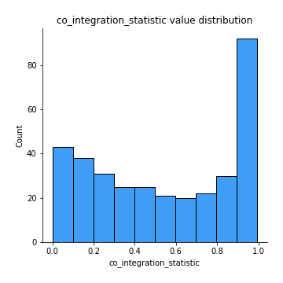
## Feature : price2_granger_cause_price1
- **Feature type** : continous
- **Missing** : 0.0%
- **Unique** : 347
- **Count** :347.0
- **Mean** :0.23993452450610994
- **Std** :0.28897250024839977
- **Min** :2.655111913389789e-07
- **25%th Percentile** : 0.015867773793295938
- **50%th Percentile** : 0.10553023161862368
- **75%th Percentile** : 0.4088368074824895
- **Max** :0.9879764520831139

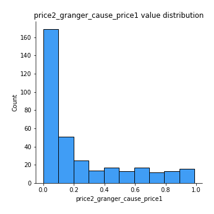
## Feature : price1_granger_cause_price2
- **Feature type** : continous
- **Missing** : 0.0%
- **Unique** : 347
- **Count** :347.0
- **Mean** :0.30536762907080023
- **Std** :0.29557999498097554
- **Min** :6.607726210169445e-06
- **25%th Percentile** : 0.04262065925473188
- **50%th Percentile** : 0.2150920494045606
- **75%th Percentile** : 0.5073928961356534
- **Max** :0.9912763272907406

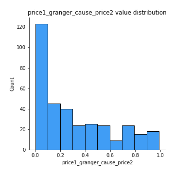

[<< Go back](../README.md)
