# Exploratory Data Analysis

[<< Go back](../README.md)
## Feature : target
- **Feature type** : categorical
- **Missing** : 0.0%
- **Unique** : 2
- **Count** :347
- **Unique** :2
- **Top** :real
- **Freq** :178

## Feature : standardised_price_mean1
- **Feature type** : continous
- **Missing** : 0.0%
- **Unique** : 347
- **Count** :347.0
- **Mean** :158.25950466146196
- **Std** :69.22306336302321
- **Min** :43.818674613537056
- **25%th Percentile** : 117.73587392283952
- **50%th Percentile** : 130.81446358406455
- **75%th Percentile** : 186.75988127848447
- **Max** :591.3703024125841

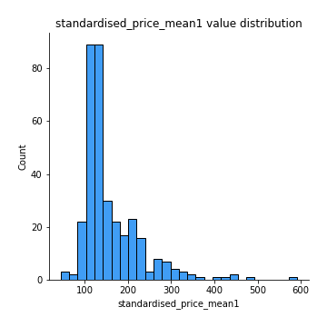
## Feature : standardised_price_mean2
- **Feature type** : continous
- **Missing** : 0.0%
- **Unique** : 347
- **Count** :347.0
- **Mean** :250.1246016019509
- **Std** :170.2499886046093
- **Min** :77.36570036335733
- **25%th Percentile** : 117.20525728952336
- **50%th Percentile** : 141.19131270721866
- **75%th Percentile** : 343.1896374628402
- **Max** :812.0269775810951

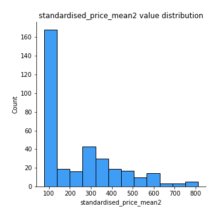
## Feature : return_mean1
- **Feature type** : continous
- **Missing** : 0.0%
- **Unique** : 347
- **Count** :347.0
- **Mean** :0.33637790792631456
- **Std** :0.2824062180648757
- **Min** :-0.31556073795310474
- **25%th Percentile** : 0.11080379761007438
- **50%th Percentile** : 0.19602875894795804
- **75%th Percentile** : 0.5793422967469737
- **Max** :1.2336414655560004

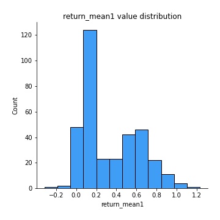
## Feature : return_mean2
- **Feature type** : continous
- **Missing** : 0.0%
- **Unique** : 347
- **Count** :347.0
- **Mean** :0.5195318940307251
- **Std** :0.45978295957981596
- **Min** :-0.24668577454402457
- **25%th Percentile** : 0.10070229880863225
- **50%th Percentile** : 0.24670708206276123
- **75%th Percentile** : 0.9476966760025454
- **Max** :1.4063289625557183

## Feature : return_sd1
- **Feature type** : continous
- **Missing** : 0.0%
- **Unique** : 347
- **Count** :347.0
- **Mean** :1.5235316525001845
- **Std** :0.3458325067990194
- **Min** :0.7917186262639786
- **25%th Percentile** : 1.4110857538619825
- **50%th Percentile** : 1.5061762394482716
- **75%th Percentile** : 1.5931285346864321
- **Max** :3.3277429018214417

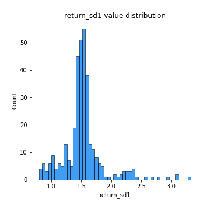
## Feature : return_sd2
- **Feature type** : continous
- **Missing** : 0.0%
- **Unique** : 347
- **Count** :347.0
- **Mean** :1.5975661081339452
- **Std** :0.41161254361937555
- **Min** :0.8243843596443498
- **25%th Percentile** : 1.452762637607305
- **50%th Percentile** : 1.5645850876606682
- **75%th Percentile** : 1.6540099688307526
- **Max** :4.598857143139886

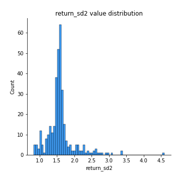
## Feature : return_skew1
- **Feature type** : continous
- **Missing** : 0.0%
- **Unique** : 347
- **Count** :347.0
- **Mean** :-0.16756674784454023
- **Std** :0.7307824214432919
- **Min** :-6.857840543649597
- **25%th Percentile** : -0.2976120578086641
- **50%th Percentile** : -0.06497926781524938
- **75%th Percentile** : 0.09189572111314678
- **Max** :2.4626801359026347

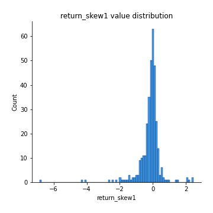
## Feature : return_skew2
- **Feature type** : continous
- **Missing** : 0.0%
- **Unique** : 347
- **Count** :347.0
- **Mean** :-0.26270024059534586
- **Std** :1.0880146872351715
- **Min** :-9.5467599340665
- **25%th Percentile** : -0.3266593985267834
- **50%th Percentile** : -0.07032509820142054
- **75%th Percentile** : 0.09812185251970526
- **Max** :2.297117870159023

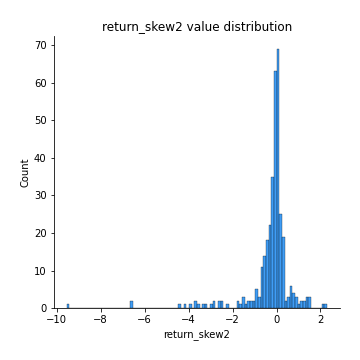
## Feature : return_kurtosis1
- **Feature type** : continous
- **Missing** : 0.0%
- **Unique** : 347
- **Count** :347.0
- **Mean** :2.670287733106109
- **Std** :7.27885288273482
- **Min** :-0.7516091963598552
- **25%th Percentile** : -0.05762440914915401
- **50%th Percentile** : 0.6644737225600617
- **75%th Percentile** : 2.5154803264694197
- **Max** :80.08765409662804

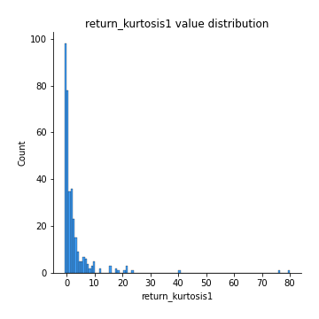
## Feature : return_kurtosis2
- **Feature type** : continous
- **Missing** : 0.0%
- **Unique** : 347
- **Count** :347.0
- **Mean** :4.2570046996304285
- **Std** :11.529737950865817
- **Min** :-0.7491598741876042
- **25%th Percentile** : -0.06069489646433901
- **50%th Percentile** : 0.6459192094838904
- **75%th Percentile** : 3.2665831135519814
- **Max** :127.80647138658917

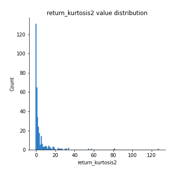
## Feature : return_autocorrelation_lag1_1
- **Feature type** : continous
- **Missing** : 0.0%
- **Unique** : 347
- **Count** :347.0
- **Mean** :0.008113159192449851
- **Std** :0.07682629357465094
- **Min** :-0.21106657115766964
- **25%th Percentile** : -0.043145859929567695
- **50%th Percentile** : 0.0049747884286011875
- **75%th Percentile** : 0.06128359081094782
- **Max** :0.23310127090148183

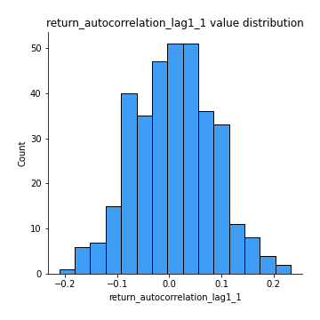
## Feature : return_autocorrelation_lag1_2
- **Feature type** : continous
- **Missing** : 0.0%
- **Unique** : 347
- **Count** :347.0
- **Mean** :0.004488287829189015
- **Std** :0.07213320869084293
- **Min** :-0.23650716165005362
- **25%th Percentile** : -0.04275027264311537
- **50%th Percentile** : 0.008068258892917167
- **75%th Percentile** : 0.05684153618173349
- **Max** :0.20789800390089375

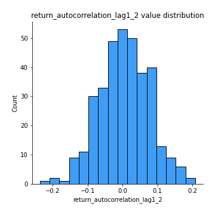
## Feature : return_autocorrelation_lag1_rolling_sd1
- **Feature type** : continous
- **Missing** : 0.0%
- **Unique** : 347
- **Count** :347.0
- **Mean** :0.946152125853822
- **Std** :0.02005391513248199
- **Min** :0.8860935245309839
- **25%th Percentile** : 0.9340179982500132
- **50%th Percentile** : 0.949267426164527
- **75%th Percentile** : 0.96036419271544
- **Max** :0.9817860359018395

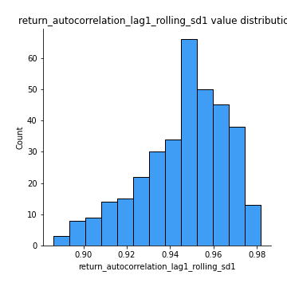
## Feature : return_autocorrelation_lag1_rolling_sd2
- **Feature type** : continous
- **Missing** : 0.0%
- **Unique** : 347
- **Count** :347.0
- **Mean** :0.9452208483706513
- **Std** :0.01896308242403277
- **Min** :0.8865953157516836
- **25%th Percentile** : 0.9338663441762883
- **50%th Percentile** : 0.9480965377949048
- **75%th Percentile** : 0.9582968565719681
- **Max** :0.9816307701771863

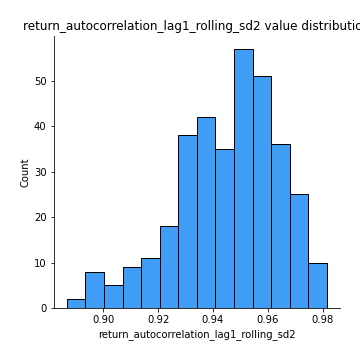
## Feature : price_adf_p_values
- **Feature type** : continous
- **Missing** : 0.0%
- **Unique** : 347
- **Count** :347.0
- **Mean** :0.4142886163229005
- **Std** :0.3530155276101524
- **Min** :5.4676549893335844e-08
- **25%th Percentile** : 0.08946294747505501
- **50%th Percentile** : 0.29854316652216
- **75%th Percentile** : 0.751667445502565
- **Max** :0.9990301011719359

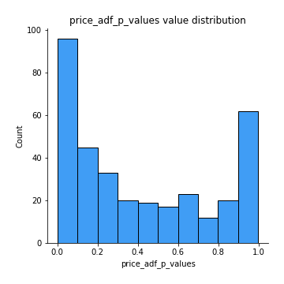
## Feature : return_correlation_ts1_lag_0
- **Feature type** : continous
- **Missing** : 0.0%
- **Unique** : 347
- **Count** :347.0
- **Mean** :0.6355329904263827
- **Std** :0.3767325000858067
- **Min** :-0.12507580812872535
- **25%th Percentile** : 0.2941620635351555
- **50%th Percentile** : 0.6318874706960558
- **75%th Percentile** : 0.9981639978012431
- **Max** :0.9994557154738104

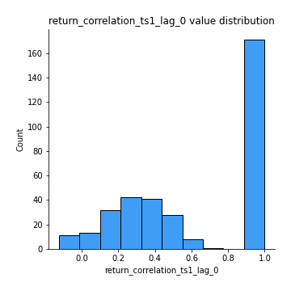
## Feature : return_correlation_ts1_lag_1
- **Feature type** : continous
- **Missing** : 0.0%
- **Unique** : 347
- **Count** :347.0
- **Mean** :0.009896390936750047
- **Std** :0.0696249488029237
- **Min** :-0.17454778873631147
- **25%th Percentile** : -0.033701726134749435
- **50%th Percentile** : 0.008578787211777125
- **75%th Percentile** : 0.0569436130443141
- **Max** :0.2204172275377606

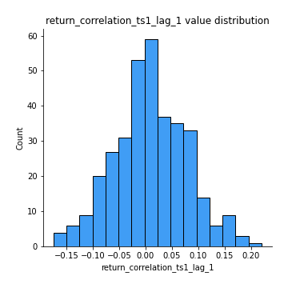
## Feature : return_correlation_ts1_lag_2
- **Feature type** : continous
- **Missing** : 0.0%
- **Unique** : 347
- **Count** :347.0
- **Mean** :0.006540567751596087
- **Std** :0.06714323330578256
- **Min** :-0.17458049302943662
- **25%th Percentile** : -0.03348846907689427
- **50%th Percentile** : 0.0053973402331238705
- **75%th Percentile** : 0.05268048645138981
- **Max** :0.1848360541788846

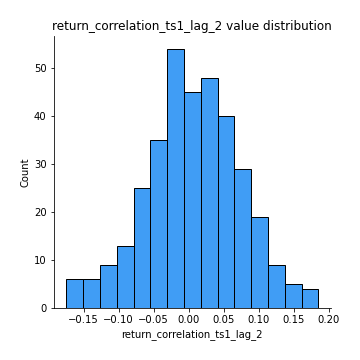
## Feature : return_correlation_ts1_lag_3
- **Feature type** : continous
- **Missing** : 0.0%
- **Unique** : 347
- **Count** :347.0
- **Mean** :0.011275128317053398
- **Std** :0.06747427299760901
- **Min** :-0.19794973933319396
- **25%th Percentile** : -0.03226410490140443
- **50%th Percentile** : 0.013312202968521276
- **75%th Percentile** : 0.0557356501233057
- **Max** :0.19058370321993867

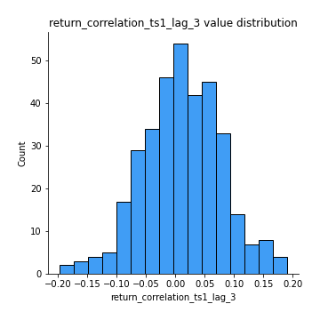
## Feature : return_correlation_ts2_lag_1
- **Feature type** : continous
- **Missing** : 0.0%
- **Unique** : 347
- **Count** :347.0
- **Mean** :0.009862303685045938
- **Std** :0.0723840992361819
- **Min** :-0.20434596106030414
- **25%th Percentile** : -0.04263641932671224
- **50%th Percentile** : 0.010660561960849446
- **75%th Percentile** : 0.06299600753400406
- **Max** :0.2188700459912286

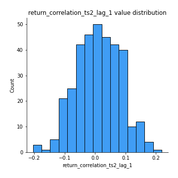
## Feature : return_correlation_ts2_lag_2
- **Feature type** : continous
- **Missing** : 0.0%
- **Unique** : 347
- **Count** :347.0
- **Mean** :0.006574240494437648
- **Std** :0.06839939164409506
- **Min** :-0.2758654278092797
- **25%th Percentile** : -0.03198813326023117
- **50%th Percentile** : 0.006322215940213443
- **75%th Percentile** : 0.05589696169790245
- **Max** :0.18445185333071518

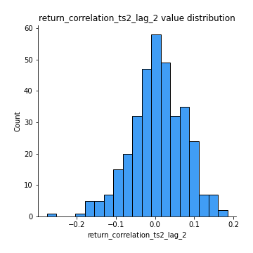
## Feature : return_correlation_ts2_lag_3
- **Feature type** : continous
- **Missing** : 0.0%
- **Unique** : 347
- **Count** :347.0
- **Mean** :0.013322423031492605
- **Std** :0.06296432974732548
- **Min** :-0.1770774021770153
- **25%th Percentile** : -0.028890131379294887
- **50%th Percentile** : 0.012834342247881294
- **75%th Percentile** : 0.05140186744686232
- **Max** :0.1931758318086702

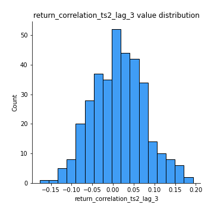
## Feature : durbin_watson_statistic1
- **Feature type** : continous
- **Missing** : 0.0%
- **Unique** : 347
- **Count** :347.0
- **Mean** :1.9916213258198576
- **Std** :0.08169475980767539
- **Min** :1.7347545360512986
- **25%th Percentile** : 1.962446864576032
- **50%th Percentile** : 1.9894136900554447
- **75%th Percentile** : 2.0169895067243813
- **Max** :2.3147835328996527

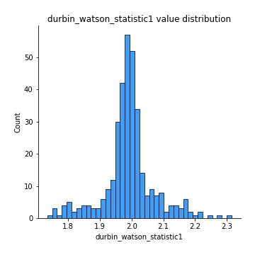
## Feature : durbin_watson_statistic2
- **Feature type** : continous
- **Missing** : 0.0%
- **Unique** : 347
- **Count** :347.0
- **Mean** :1.9843207273648293
- **Std** :0.09055487948366187
- **Min** :1.649823119450525
- **25%th Percentile** : 1.9511859366916968
- **50%th Percentile** : 1.9875776755315073
- **75%th Percentile** : 2.0149407961639776
- **Max** :2.334073172550357

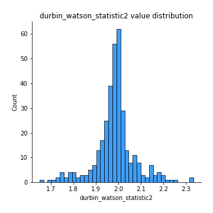
## Feature : co_integration_statistic
- **Feature type** : continous
- **Missing** : 0.0%
- **Unique** : 347
- **Count** :347.0
- **Mean** :0.5237271884123248
- **Std** :0.3448938562848586
- **Min** :3.3706511469754662e-06
- **25%th Percentile** : 0.18981080908259895
- **50%th Percentile** : 0.4927744191669346
- **75%th Percentile** : 0.8860923825115631
- **Max** :0.9939092353376776

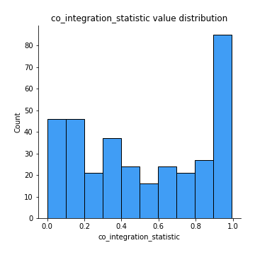
## Feature : price2_granger_cause_price1
- **Feature type** : continous
- **Missing** : 0.0%
- **Unique** : 347
- **Count** :347.0
- **Mean** :0.2595508801456724
- **Std** :0.2946362055373965
- **Min** :2.3655116242603476e-09
- **25%th Percentile** : 0.020498090324545117
- **50%th Percentile** : 0.1174759503428934
- **75%th Percentile** : 0.4519978885500746
- **Max** :0.9594994939124739

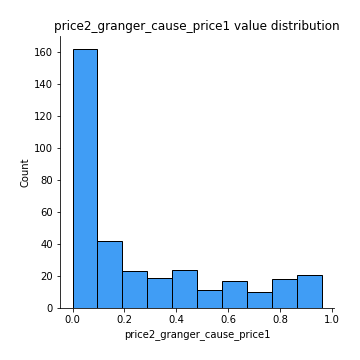
## Feature : price1_granger_cause_price2
- **Feature type** : continous
- **Missing** : 0.0%
- **Unique** : 347
- **Count** :347.0
- **Mean** :0.31774876362287174
- **Std** :0.2969574423613469
- **Min** :6.607726210169445e-06
- **25%th Percentile** : 0.047950305057614113
- **50%th Percentile** : 0.22226106012663846
- **75%th Percentile** : 0.5364036005397599
- **Max** :0.9912763272907406

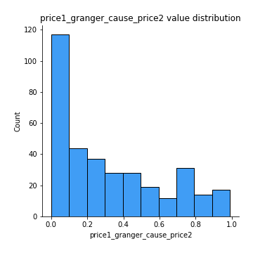

[<< Go back](../README.md)
