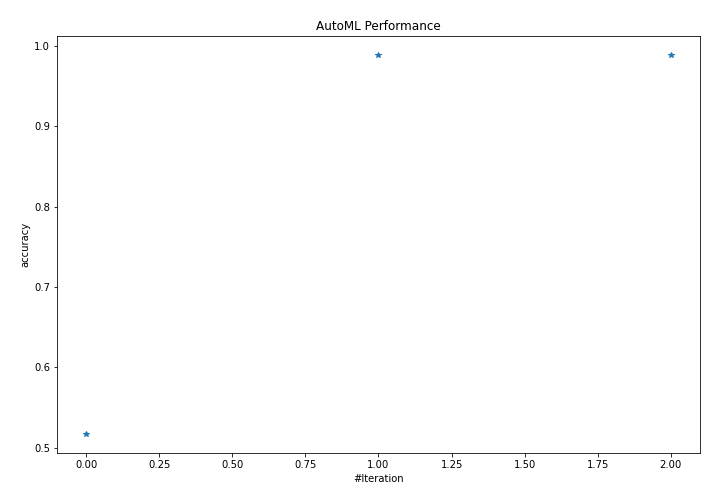
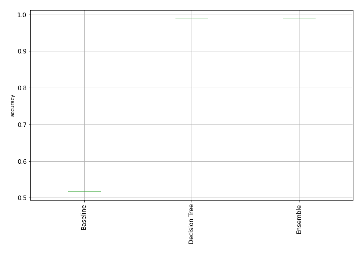
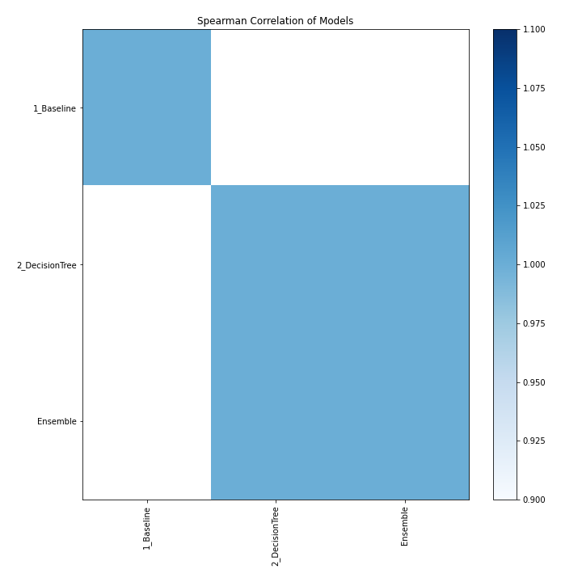

# AutoML Leaderboard

| Best model   | name                                       | model_type    | metric_type   |   metric_value |   train_time |
|:-------------|:-------------------------------------------|:--------------|:--------------|---------------:|-------------:|
|              | [1_Baseline](1_Baseline/README.md)         | Baseline      | accuracy      |       0.517241 |         3.38 |
| **the best** | [2_DecisionTree](2_DecisionTree/README.md) | Decision Tree | accuracy      |       0.988506 |      6732.71 |
|              | [Ensemble](Ensemble/README.md)             | Ensemble      | accuracy      |       0.988506 |         0.14 |

### AutoML Performance

### AutoML Performance Boxplot

### Spearman Correlation of Models

