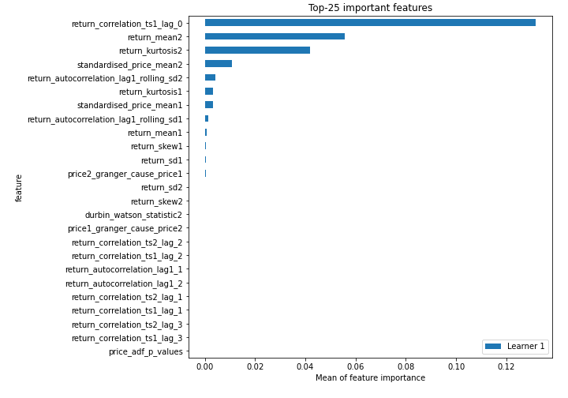
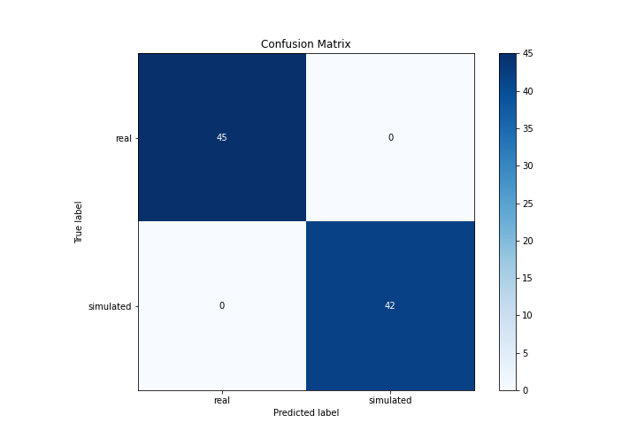
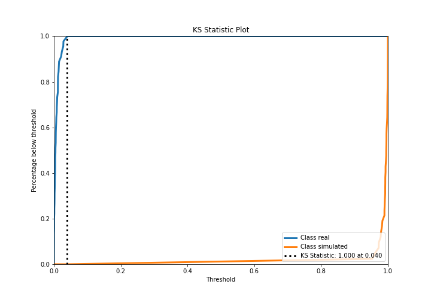
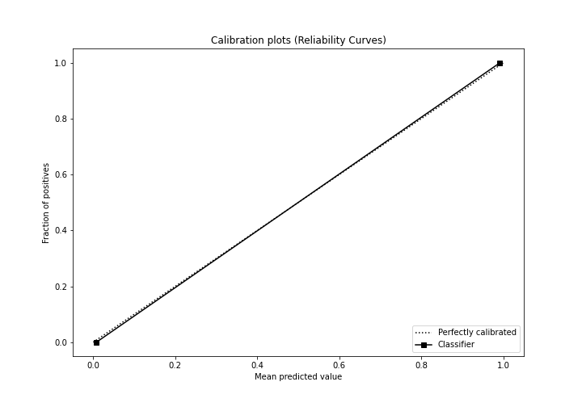
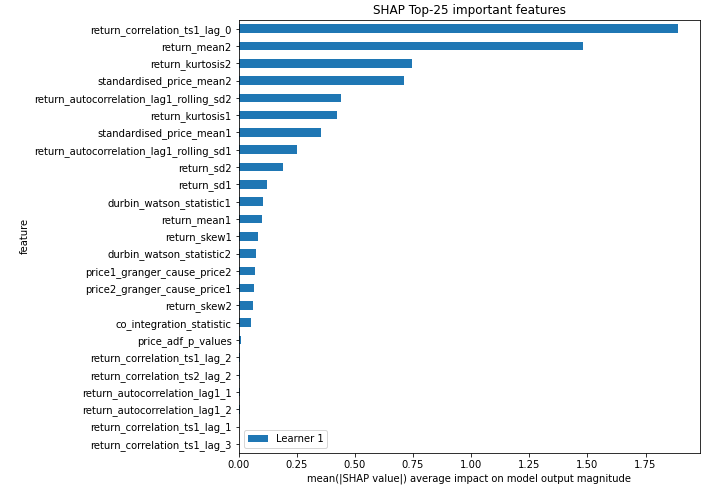
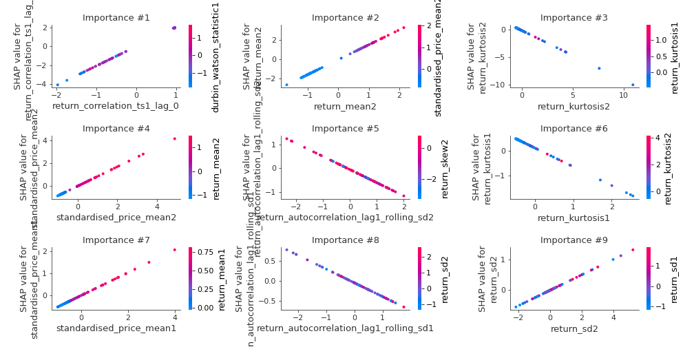
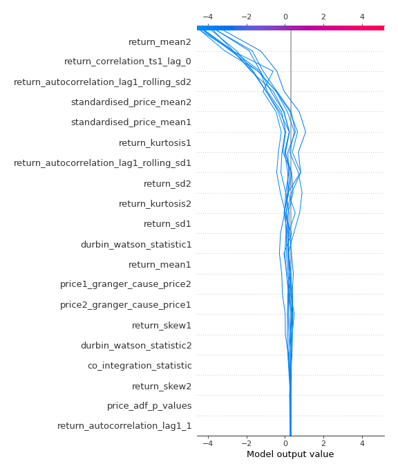
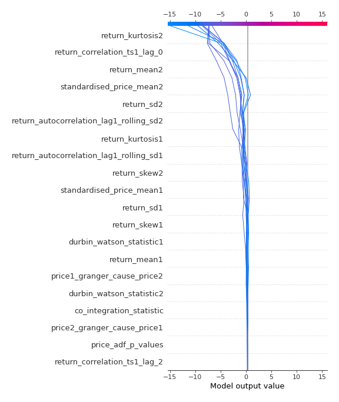
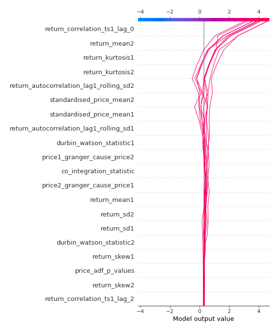
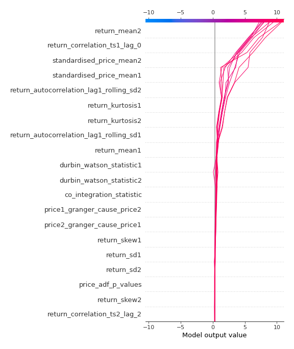

# Summary of 3_Linear

[<< Go back](../README.md)

## Logistic Regression (Linear)
- **n_jobs**: -1
- **explain_level**: 2

## Validation
 - **validation_type**: split
 - **train_ratio**: 0.75
 - **shuffle**: True
 - **stratify**: True

## Optimized metric
accuracy

## Training time

7.8 seconds

## Metric details
|           |      score |     threshold |
|:----------|-----------:|--------------:|
| logloss   | 0.00818934 | nan           |
| auc       | 1          | nan           |
| f1        | 1          |   0.499276    |
| accuracy  | 1          |   0.499276    |
| precision | 1          |   0.499276    |
| recall    | 1          |   3.29417e-07 |
| mcc       | 1          |   0.499276    |

## Confusion matrix (at threshold=0.499276)
|                      |   Predicted as real |   Predicted as simulated |
|:---------------------|--------------------:|-------------------------:|
| Labeled as real      |                  45 |                        0 |
| Labeled as simulated |                   0 |                       42 |

## Learning curves

## Coefficients
| feature                                 |   Learner_1 |
|:----------------------------------------|------------:|
| return_correlation_ts1_lag_0            |   2.06104   |
| return_mean2                            |   1.53444   |
| standardised_price_mean2                |   0.846841  |
| standardised_price_mean1                |   0.52168   |
| return_mean1                            |   0.411174  |
| return_sd2                              |   0.253841  |
| return_skew1                            |   0.200677  |
| durbin_watson_statistic2                |   0.121807  |
| intercept                               |   0.121805  |
| return_correlation_ts1_lag_2            |   0.108948  |
| return_correlation_ts2_lag_2            |   0.10705   |
| return_skew2                            |   0.0949905 |
| return_autocorrelation_lag1_1           |   0.0807554 |
| return_autocorrelation_lag1_2           |   0.0739605 |
| co_integration_statistic                |   0.0673387 |
| return_correlation_ts1_lag_1            |   0.05683   |
| return_correlation_ts1_lag_3            |   0.0539566 |
| return_correlation_ts2_lag_3            |   0.0484386 |
| price_adf_p_values                      |   0.0443818 |
| return_correlation_ts2_lag_1            |   0.0321324 |
| durbin_watson_statistic1                |  -0.167035  |
| return_sd1                              |  -0.173265  |
| price1_granger_cause_price2             |  -0.27714   |
| price2_granger_cause_price1             |  -0.299836  |
| return_autocorrelation_lag1_rolling_sd1 |  -0.348305  |
| return_autocorrelation_lag1_rolling_sd2 |  -0.54966   |
| return_kurtosis1                        |  -0.760089  |
| return_kurtosis2                        |  -0.903568  |

## Permutation-based Importance

## Confusion Matrix

## Normalized Confusion Matrix

## ROC Curve

## Kolmogorov-Smirnov Statistic

## Precision-Recall Curve

## Calibration Curve

## Cumulative Gains Curve

## Lift Curve

## SHAP Importance

## SHAP Dependence plots

### Dependence (Fold 1)

## SHAP Decision plots

### Top-10 Worst decisions for class 0 (Fold 1)

### Top-10 Best decisions for class 0 (Fold 1)

### Top-10 Worst decisions for class 1 (Fold 1)

### Top-10 Best decisions for class 1 (Fold 1)

[<< Go back](../README.md)
