# Exploratory Data Analysis

[<< Go back](../README.md)
## Feature : target
- **Feature type** : categorical
- **Missing** : 0.0%
- **Unique** : 2
- **Count** :347
- **Unique** :2
- **Top** :real
- **Freq** :178

## Feature : standardised_price_mean1
- **Feature type** : continous
- **Missing** : 0.0%
- **Unique** : 347
- **Count** :347.0
- **Mean** :156.07943624968658
- **Std** :68.83261685016942
- **Min** :43.818674613537056
- **25%th Percentile** : 117.08221346014616
- **50%th Percentile** : 131.39589663476548
- **75%th Percentile** : 173.85351615934852
- **Max** :591.3703024125841

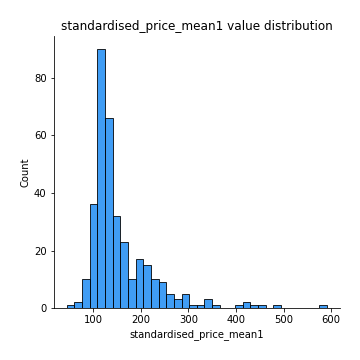
## Feature : standardised_price_mean2
- **Feature type** : continous
- **Missing** : 0.0%
- **Unique** : 347
- **Count** :347.0
- **Mean** :247.769609817982
- **Std** :170.451170426931
- **Min** :80.35718998347672
- **25%th Percentile** : 117.75554727219323
- **50%th Percentile** : 141.19131270721866
- **75%th Percentile** : 334.1047910700986
- **Max** :1057.3579960624554

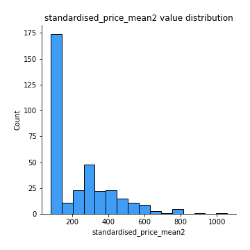
## Feature : return_mean1
- **Feature type** : continous
- **Missing** : 0.0%
- **Unique** : 347
- **Count** :347.0
- **Mean** :0.33013857462420393
- **Std** :0.2798530911770672
- **Min** :-0.31556073795310474
- **25%th Percentile** : 0.10690115196220096
- **50%th Percentile** : 0.21863110544327682
- **75%th Percentile** : 0.5540147175424501
- **Max** :1.2336414655560004

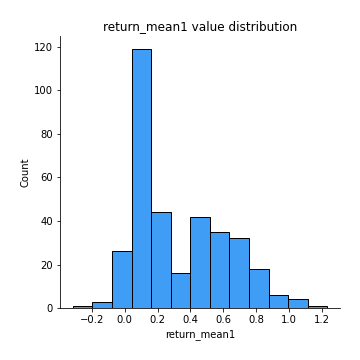
## Feature : return_mean2
- **Feature type** : continous
- **Missing** : 0.0%
- **Unique** : 347
- **Count** :347.0
- **Mean** :0.5174579561906172
- **Std** :0.4566515721695063
- **Min** :-0.24668577454402457
- **25%th Percentile** : 0.10170827408556676
- **50%th Percentile** : 0.22100634701378732
- **75%th Percentile** : 0.91870749592482
- **Max** :1.493875067872129

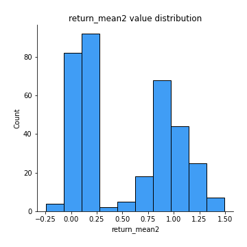
## Feature : return_sd1
- **Feature type** : continous
- **Missing** : 0.0%
- **Unique** : 347
- **Count** :347.0
- **Mean** :1.5475386839376113
- **Std** :0.35965900543253954
- **Min** :0.7917186262639786
- **25%th Percentile** : 1.413891321205654
- **50%th Percentile** : 1.5087779247933364
- **75%th Percentile** : 1.6051879272658311
- **Max** :3.3277429018214417

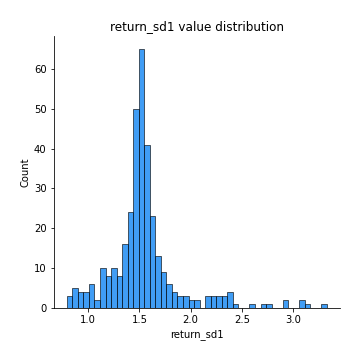
## Feature : return_sd2
- **Feature type** : continous
- **Missing** : 0.0%
- **Unique** : 347
- **Count** :347.0
- **Mean** :1.586074956746835
- **Std** :0.37184138011239126
- **Min** :0.8184811977504522
- **25%th Percentile** : 1.447466466953634
- **50%th Percentile** : 1.5602857375062145
- **75%th Percentile** : 1.6468836895253938
- **Max** :3.375457919798117

## Feature : return_skew1
- **Feature type** : continous
- **Missing** : 0.0%
- **Unique** : 347
- **Count** :347.0
- **Mean** :-0.17303420880092188
- **Std** :0.7902729523112388
- **Min** :-6.857840543649597
- **25%th Percentile** : -0.3169402809157079
- **50%th Percentile** : -0.07108378738708343
- **75%th Percentile** : 0.09295467092417405
- **Max** :2.4626801359026347

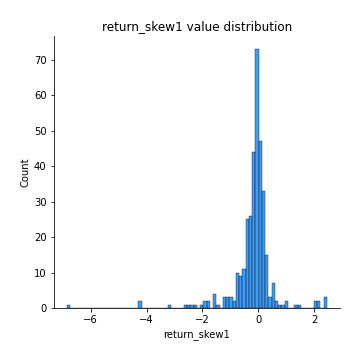
## Feature : return_skew2
- **Feature type** : continous
- **Missing** : 0.0%
- **Unique** : 347
- **Count** :347.0
- **Mean** :-0.22301524541941434
- **Std** :1.0069023726105155
- **Min** :-6.552294752366114
- **25%th Percentile** : -0.36093626522220745
- **50%th Percentile** : -0.06763912396436272
- **75%th Percentile** : 0.10942844897014051
- **Max** :4.289944724188784

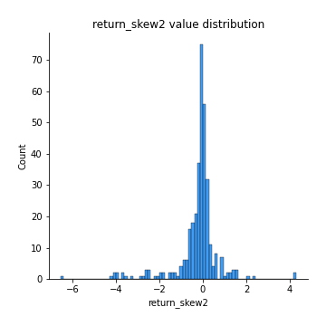
## Feature : return_kurtosis1
- **Feature type** : continous
- **Missing** : 0.0%
- **Unique** : 347
- **Count** :347.0
- **Mean** :2.929486321076952
- **Std** :6.793075071153327
- **Min** :-0.7516091963598552
- **25%th Percentile** : -0.02433311169482688
- **50%th Percentile** : 0.5827133915422231
- **75%th Percentile** : 2.7450987166578815
- **Max** :80.08765409662804

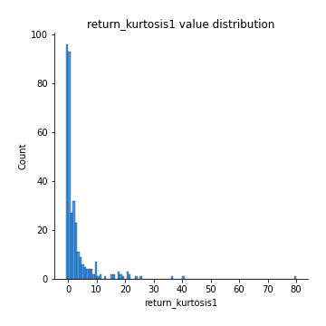
## Feature : return_kurtosis2
- **Feature type** : continous
- **Missing** : 0.0%
- **Unique** : 347
- **Count** :347.0
- **Mean** :4.0681165103830965
- **Std** :8.908299287300329
- **Min** :-0.7491598741876042
- **25%th Percentile** : -0.018588727822329787
- **50%th Percentile** : 0.6187834340663119
- **75%th Percentile** : 4.037986910944524
- **Max** :81.00995910449723

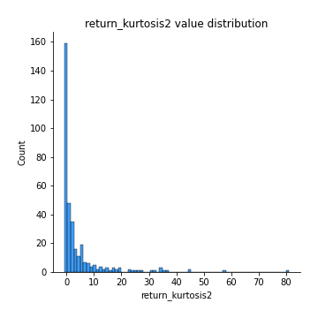
## Feature : return_autocorrelation_lag1_1
- **Feature type** : continous
- **Missing** : 0.0%
- **Unique** : 347
- **Count** :347.0
- **Mean** :0.01174054928650407
- **Std** :0.07633284989619873
- **Min** :-0.21106657115766964
- **25%th Percentile** : -0.040489695786168955
- **50%th Percentile** : 0.011725186091368807
- **75%th Percentile** : 0.0633720074092413
- **Max** :0.23310127090148183

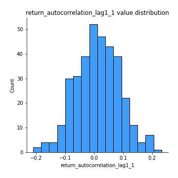
## Feature : return_autocorrelation_lag1_2
- **Feature type** : continous
- **Missing** : 0.0%
- **Unique** : 347
- **Count** :347.0
- **Mean** :0.005872161311733694
- **Std** :0.07307807334084435
- **Min** :-0.23650716165005362
- **25%th Percentile** : -0.03709503919531188
- **50%th Percentile** : 0.009030942422839238
- **75%th Percentile** : 0.05813086297675539
- **Max** :0.20789800390089375

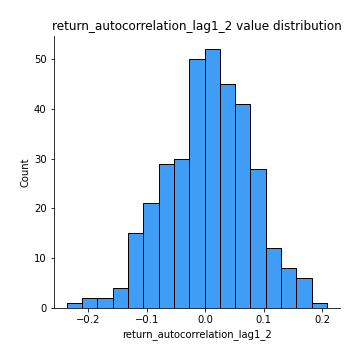
## Feature : return_autocorrelation_lag1_rolling_sd1
- **Feature type** : continous
- **Missing** : 0.0%
- **Unique** : 347
- **Count** :347.0
- **Mean** :0.9451317582610462
- **Std** :0.02055333063124787
- **Min** :0.8706732948271847
- **25%th Percentile** : 0.9333740508101658
- **50%th Percentile** : 0.9483565605300434
- **75%th Percentile** : 0.9599571220225771
- **Max** :0.9817860359018395

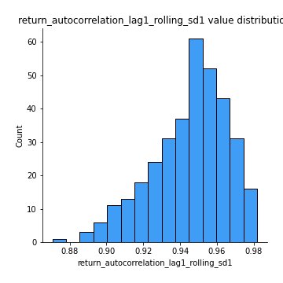
## Feature : return_autocorrelation_lag1_rolling_sd2
- **Feature type** : continous
- **Missing** : 0.0%
- **Unique** : 347
- **Count** :347.0
- **Mean** :0.9437371876526901
- **Std** :0.01914930694353141
- **Min** :0.8865953157516836
- **25%th Percentile** : 0.9323097168550442
- **50%th Percentile** : 0.9462267923544848
- **75%th Percentile** : 0.9575536963159194
- **Max** :0.9816307701771863

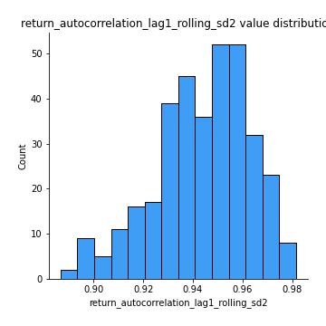
## Feature : price_adf_p_values
- **Feature type** : continous
- **Missing** : 0.0%
- **Unique** : 347
- **Count** :347.0
- **Mean** :0.3843440371766927
- **Std** :0.34412747620859707
- **Min** :4.494338767447814e-07
- **25%th Percentile** : 0.07585287693981864
- **50%th Percentile** : 0.24938877577466895
- **75%th Percentile** : 0.6787679462345679
- **Max** :0.9990301011719359

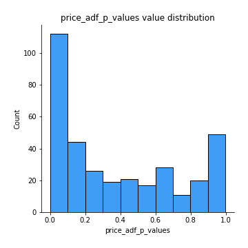
## Feature : return_correlation_ts1_lag_0
- **Feature type** : continous
- **Missing** : 0.0%
- **Unique** : 347
- **Count** :347.0
- **Mean** :0.6328544746234945
- **Std** :0.37764554516849963
- **Min** :-0.12507580812872535
- **25%th Percentile** : 0.28367260195849153
- **50%th Percentile** : 0.6270332953624083
- **75%th Percentile** : 0.9979826593522142
- **Max** :0.9993680821657569

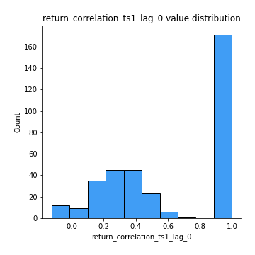
## Feature : return_correlation_ts1_lag_1
- **Feature type** : continous
- **Missing** : 0.0%
- **Unique** : 347
- **Count** :347.0
- **Mean** :0.009545138715758206
- **Std** :0.07028708296169923
- **Min** :-0.18856712556884056
- **25%th Percentile** : -0.03513089513658875
- **50%th Percentile** : 0.008490320949460008
- **75%th Percentile** : 0.054785535695148366
- **Max** :0.2204172275377606

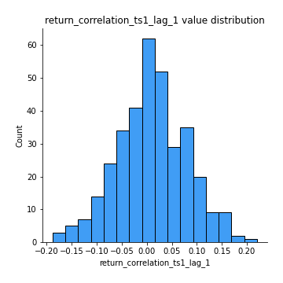
## Feature : return_correlation_ts1_lag_2
- **Feature type** : continous
- **Missing** : 0.0%
- **Unique** : 347
- **Count** :347.0
- **Mean** :0.005752939694944768
- **Std** :0.06748163960780128
- **Min** :-0.17458049302943662
- **25%th Percentile** : -0.040504164774429904
- **50%th Percentile** : -0.00025688225053842415
- **75%th Percentile** : 0.05360145193995876
- **Max** :0.1848360541788846

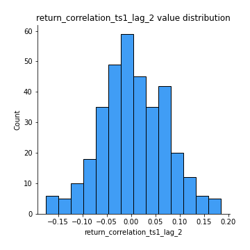
## Feature : return_correlation_ts1_lag_3
- **Feature type** : continous
- **Missing** : 0.0%
- **Unique** : 347
- **Count** :347.0
- **Mean** :0.012244988013870872
- **Std** :0.06794923603552397
- **Min** :-0.19715334282525432
- **25%th Percentile** : -0.03292948227778843
- **50%th Percentile** : 0.013396936110376356
- **75%th Percentile** : 0.058132308260063804
- **Max** :0.22601984756836344

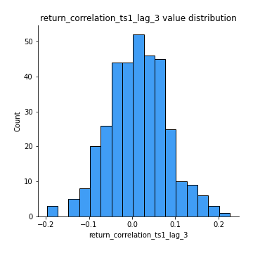
## Feature : return_correlation_ts2_lag_1
- **Feature type** : continous
- **Missing** : 0.0%
- **Unique** : 347
- **Count** :347.0
- **Mean** :0.010779680885413001
- **Std** :0.07240507947985095
- **Min** :-0.20434596106030414
- **25%th Percentile** : -0.03217510036240234
- **50%th Percentile** : 0.012671862271073532
- **75%th Percentile** : 0.06253406974825905
- **Max** :0.2188700459912286

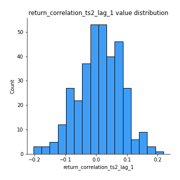
## Feature : return_correlation_ts2_lag_2
- **Feature type** : continous
- **Missing** : 0.0%
- **Unique** : 347
- **Count** :347.0
- **Mean** :0.00770588104244065
- **Std** :0.06710238405754253
- **Min** :-0.2758654278092797
- **25%th Percentile** : -0.03405670163157448
- **50%th Percentile** : 0.004344423069698389
- **75%th Percentile** : 0.05540755309766218
- **Max** :0.18445185333071518

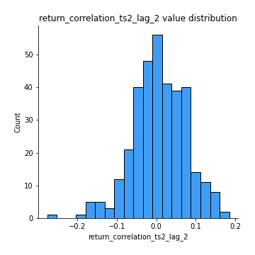
## Feature : return_correlation_ts2_lag_3
- **Feature type** : continous
- **Missing** : 0.0%
- **Unique** : 347
- **Count** :347.0
- **Mean** :0.016903041078459895
- **Std** :0.06398774642819641
- **Min** :-0.1770774021770153
- **25%th Percentile** : -0.026976725865756314
- **50%th Percentile** : 0.013657453904957241
- **75%th Percentile** : 0.05735249658458186
- **Max** :0.1931758318086702

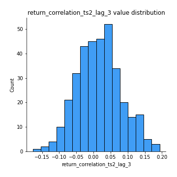
## Feature : durbin_watson_statistic1
- **Feature type** : continous
- **Missing** : 0.0%
- **Unique** : 347
- **Count** :347.0
- **Mean** :1.9902097974719462
- **Std** :0.0755858575626816
- **Min** :1.7530495131220656
- **25%th Percentile** : 1.9606039789540304
- **50%th Percentile** : 1.9912940623445525
- **75%th Percentile** : 2.016033741334576
- **Max** :2.3147835328996527

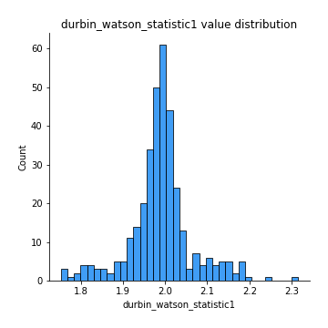
## Feature : durbin_watson_statistic2
- **Feature type** : continous
- **Missing** : 0.0%
- **Unique** : 347
- **Count** :347.0
- **Mean** :1.9835944354490789
- **Std** :0.0880601589826019
- **Min** :1.649823119450525
- **25%th Percentile** : 1.9506065665873884
- **50%th Percentile** : 1.9847016005153442
- **75%th Percentile** : 2.0160394208053214
- **Max** :2.334073172550357

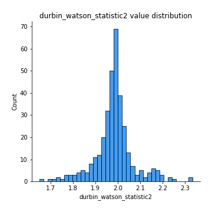
## Feature : co_integration_statistic
- **Feature type** : continous
- **Missing** : 0.0%
- **Unique** : 347
- **Count** :347.0
- **Mean** :0.5128461199632329
- **Std** :0.34053159669347005
- **Min** :0.000760628922538227
- **25%th Percentile** : 0.19180256771714277
- **50%th Percentile** : 0.5089407664726197
- **75%th Percentile** : 0.8458362216487743
- **Max** :0.9937487523104221

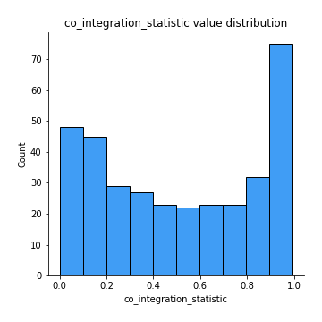
## Feature : price2_granger_cause_price1
- **Feature type** : continous
- **Missing** : 0.0%
- **Unique** : 347
- **Count** :347.0
- **Mean** :0.24091381999854508
- **Std** :0.28244791102313355
- **Min** :2.3655116242603476e-09
- **25%th Percentile** : 0.01889476274722721
- **50%th Percentile** : 0.11484158821009623
- **75%th Percentile** : 0.3921534348486111
- **Max** :0.9879764520831139

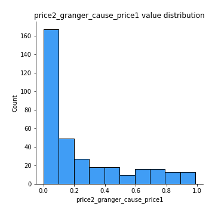
## Feature : price1_granger_cause_price2
- **Feature type** : continous
- **Missing** : 0.0%
- **Unique** : 347
- **Count** :347.0
- **Mean** :0.3152723560540409
- **Std** :0.29293508226145165
- **Min** :1.5793103433115174e-05
- **25%th Percentile** : 0.0491180011137601
- **50%th Percentile** : 0.22527096306285066
- **75%th Percentile** : 0.5107068543236156
- **Max** :0.9912763272907406

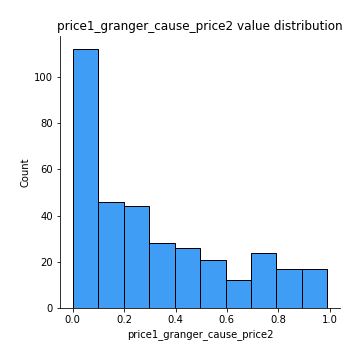

[<< Go back](../README.md)
