# Summary of 3_Linear

[<< Go back](../README.md)

## Logistic Regression (Linear)
- **n_jobs**: -1
- **explain_level**: 2

## Validation
 - **validation_type**: split
 - **train_ratio**: 0.75
 - **shuffle**: True
 - **stratify**: True

## Optimized metric
accuracy

## Training time

9.1 seconds

## Metric details
|           |      score |     threshold |
|:----------|-----------:|--------------:|
| logloss   | 0.00981454 | nan           |
| auc       | 1          | nan           |
| f1        | 1          |   0.501634    |
| accuracy  | 1          |   0.501634    |
| precision | 1          |   0.501634    |
| recall    | 1          |   2.57277e-10 |
| mcc       | 1          |   0.501634    |

## Confusion matrix (at threshold=0.501634)
|                      |   Predicted as real |   Predicted as simulated |
|:---------------------|--------------------:|-------------------------:|
| Labeled as real      |                  40 |                        0 |
| Labeled as simulated |                   0 |                       47 |

## Learning curves

## Coefficients
| feature                                 |   Learner_1 |
|:----------------------------------------|------------:|
| return_correlation_ts1_lag_0            |  2.07298    |
| return_mean2                            |  1.57513    |
| standardised_price_mean2                |  0.853331   |
| intercept                               |  0.679273   |
| standardised_price_mean1                |  0.538566   |
| return_mean1                            |  0.425422   |
| return_skew1                            |  0.183821   |
| co_integration_statistic                |  0.131365   |
| return_correlation_ts2_lag_2            |  0.122606   |
| return_correlation_ts1_lag_2            |  0.122162   |
| return_skew2                            |  0.0983476  |
| return_autocorrelation_lag1_1           |  0.0822828  |
| return_autocorrelation_lag1_2           |  0.0718749  |
| return_correlation_ts1_lag_1            |  0.064765   |
| durbin_watson_statistic2                |  0.0523697  |
| return_correlation_ts2_lag_1            |  0.0472607  |
| return_correlation_ts1_lag_3            |  0.0413368  |
| return_correlation_ts2_lag_3            |  0.0286958  |
| price_adf_p_values                      |  0.0104776  |
| durbin_watson_statistic1                |  0.00543285 |
| return_sd2                              | -0.0343507  |
| return_sd1                              | -0.141501   |
| price1_granger_cause_price2             | -0.228077   |
| price2_granger_cause_price1             | -0.232795   |
| return_autocorrelation_lag1_rolling_sd1 | -0.401289   |
| return_autocorrelation_lag1_rolling_sd2 | -0.504047   |
| return_kurtosis2                        | -0.661879   |
| return_kurtosis1                        | -0.844486   |

## Permutation-based Importance
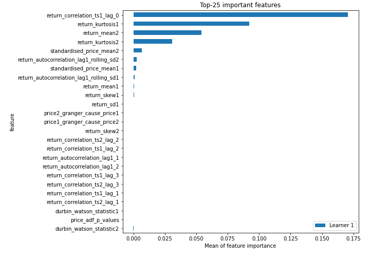
## Confusion Matrix

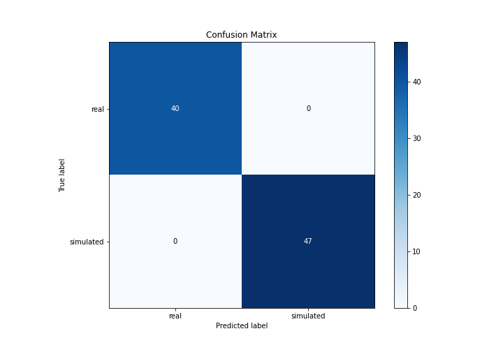

## Normalized Confusion Matrix

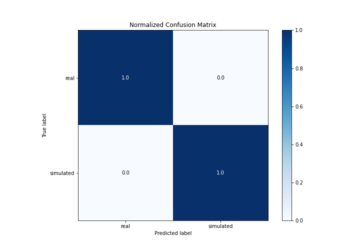

## ROC Curve

## Kolmogorov-Smirnov Statistic

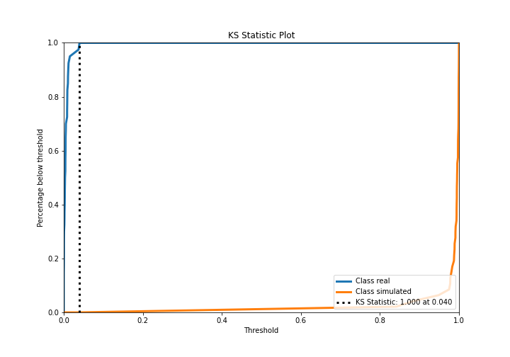

## Precision-Recall Curve

## Calibration Curve

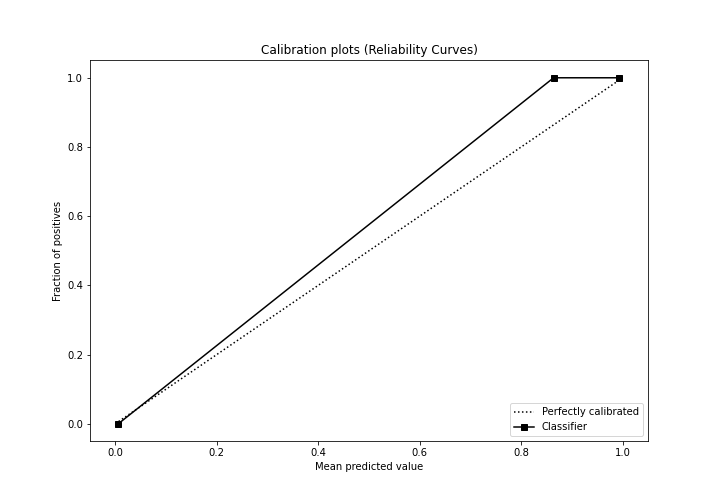

## Cumulative Gains Curve

## Lift Curve

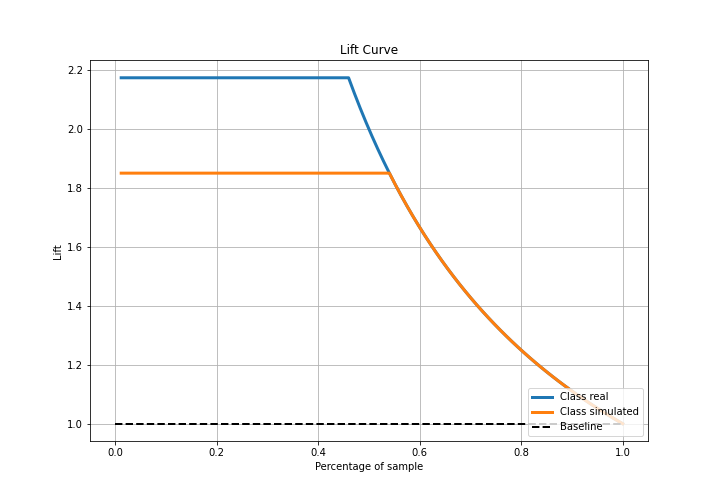

## SHAP Importance
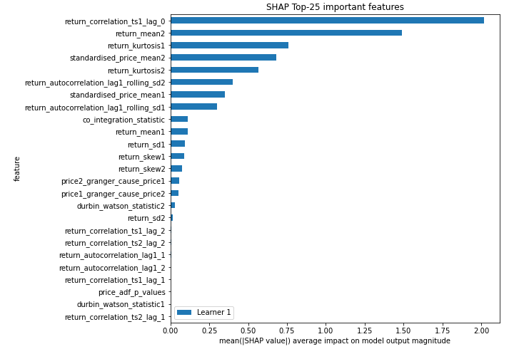

## SHAP Dependence plots

### Dependence (Fold 1)
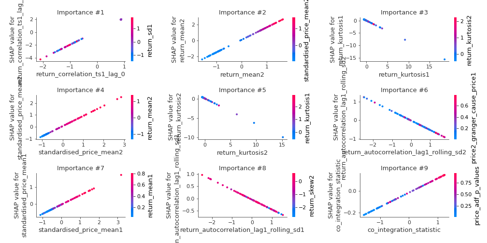

## SHAP Decision plots

### Top-10 Worst decisions for class 0 (Fold 1)
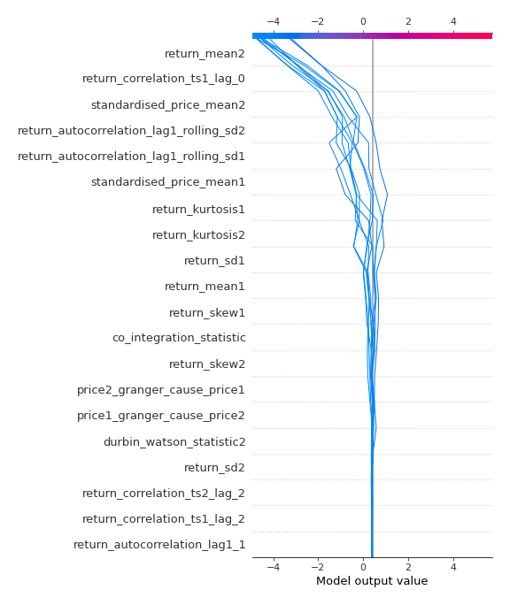
### Top-10 Best decisions for class 0 (Fold 1)
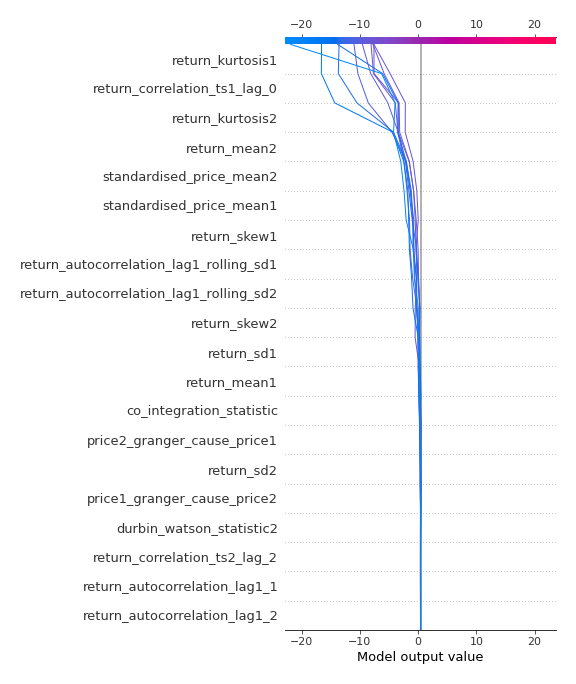
### Top-10 Worst decisions for class 1 (Fold 1)

### Top-10 Best decisions for class 1 (Fold 1)
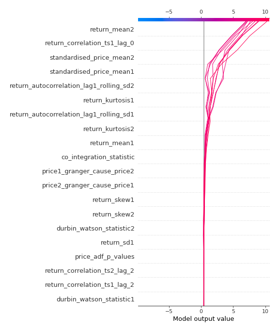

[<< Go back](../README.md)
