# Exploratory Data Analysis

[<< Go back](../README.md)
## Feature : target
- **Feature type** : categorical
- **Missing** : 0.0%
- **Unique** : 2
- **Count** :347
- **Unique** :2
- **Top** :simulated
- **Freq** :186

## Feature : standardised_price_mean1
- **Feature type** : continous
- **Missing** : 0.0%
- **Unique** : 347
- **Count** :347.0
- **Mean** :165.16855509205982
- **Std** :72.70241491359273
- **Min** :43.818674613537056
- **25%th Percentile** : 118.87160885686029
- **50%th Percentile** : 133.99657163248153
- **75%th Percentile** : 200.44980364375266
- **Max** :591.3703024125841

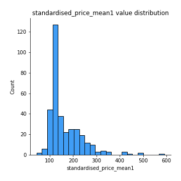
## Feature : standardised_price_mean2
- **Feature type** : continous
- **Missing** : 0.0%
- **Unique** : 347
- **Count** :347.0
- **Mean** :263.57619738411745
- **Std** :172.31743015528707
- **Min** :77.36570036335733
- **25%th Percentile** : 118.30731615633519
- **50%th Percentile** : 219.77768890389675
- **75%th Percentile** : 371.63235632186155
- **Max** :1057.3579960624554

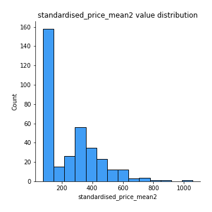
## Feature : return_mean1
- **Feature type** : continous
- **Missing** : 0.0%
- **Unique** : 347
- **Count** :347.0
- **Mean** :0.36883089041900496
- **Std** :0.2904198159554768
- **Min** :-0.31556073795310474
- **25%th Percentile** : 0.11674999690553478
- **50%th Percentile** : 0.2723845952768418
- **75%th Percentile** : 0.6294275084756259
- **Max** :1.2336414655560004

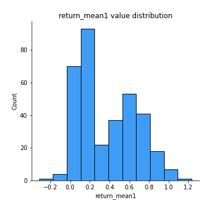
## Feature : return_mean2
- **Feature type** : continous
- **Missing** : 0.0%
- **Unique** : 347
- **Count** :347.0
- **Mean** :0.5633336734092418
- **Std** :0.46041813091545036
- **Min** :-0.24668577454402457
- **25%th Percentile** : 0.10605976322362459
- **50%th Percentile** : 0.6821776989254392
- **75%th Percentile** : 0.9771643582128777
- **Max** :1.493875067872129

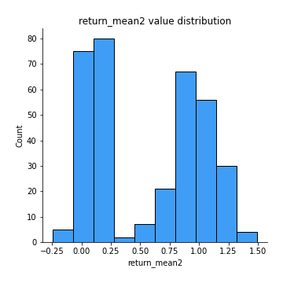
## Feature : return_sd1
- **Feature type** : continous
- **Missing** : 0.0%
- **Unique** : 347
- **Count** :347.0
- **Mean** :1.5120883884898695
- **Std** :0.2974969796228881
- **Min** :0.7917186262639786
- **25%th Percentile** : 1.4275046745379403
- **50%th Percentile** : 1.5061762394482716
- **75%th Percentile** : 1.5917422654729527
- **Max** :3.3277429018214417

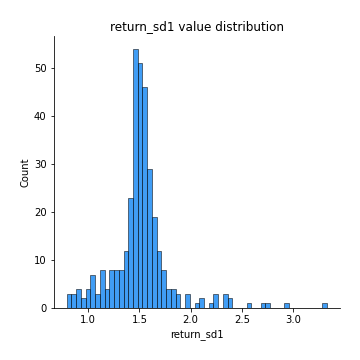
## Feature : return_sd2
- **Feature type** : continous
- **Missing** : 0.0%
- **Unique** : 347
- **Count** :347.0
- **Mean** :1.5960064313747306
- **Std** :0.3911345211533535
- **Min** :0.8184811977504522
- **25%th Percentile** : 1.4759051373946057
- **50%th Percentile** : 1.5671735851130864
- **75%th Percentile** : 1.6534318953653027
- **Max** :4.598857143139886

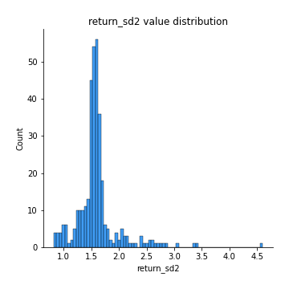
## Feature : return_skew1
- **Feature type** : continous
- **Missing** : 0.0%
- **Unique** : 347
- **Count** :347.0
- **Mean** :-0.13149934604032484
- **Std** :0.6951276762819999
- **Min** :-6.857840543649597
- **25%th Percentile** : -0.24927293264503264
- **50%th Percentile** : -0.04759582960599063
- **75%th Percentile** : 0.09189572111314678
- **Max** :2.4626801359026347

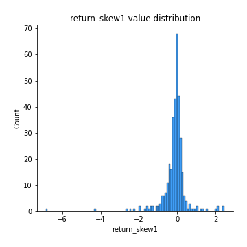
## Feature : return_skew2
- **Feature type** : continous
- **Missing** : 0.0%
- **Unique** : 347
- **Count** :347.0
- **Mean** :-0.26776932259307323
- **Std** :1.089048759323206
- **Min** :-9.5467599340665
- **25%th Percentile** : -0.3009067562369486
- **50%th Percentile** : -0.04679987272645874
- **75%th Percentile** : 0.1006990107585555
- **Max** :4.289944724188784

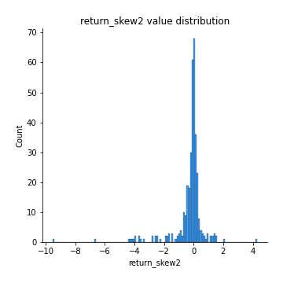
## Feature : return_kurtosis1
- **Feature type** : continous
- **Missing** : 0.0%
- **Unique** : 347
- **Count** :347.0
- **Mean** :2.4046320880188636
- **Std** :6.19713704227469
- **Min** :-0.7516091963598552
- **25%th Percentile** : -0.07569930892997467
- **50%th Percentile** : 0.4429468050278289
- **75%th Percentile** : 2.351896337512315
- **Max** :80.08765409662804

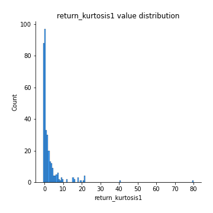
## Feature : return_kurtosis2
- **Feature type** : continous
- **Missing** : 0.0%
- **Unique** : 347
- **Count** :347.0
- **Mean** :4.063505927007601
- **Std** :11.28197186358384
- **Min** :-0.7491598741876042
- **25%th Percentile** : -0.08285671804397121
- **50%th Percentile** : 0.40928187046025766
- **75%th Percentile** : 2.8830272499812155
- **Max** :127.80647138658917

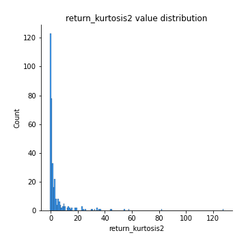
## Feature : return_autocorrelation_lag1_1
- **Feature type** : continous
- **Missing** : 0.0%
- **Unique** : 347
- **Count** :347.0
- **Mean** :0.009758107521097169
- **Std** :0.07671764653244478
- **Min** :-0.21106657115766964
- **25%th Percentile** : -0.04237886045191635
- **50%th Percentile** : 0.005532692258828969
- **75%th Percentile** : 0.06297085947582504
- **Max** :0.20530588017375476

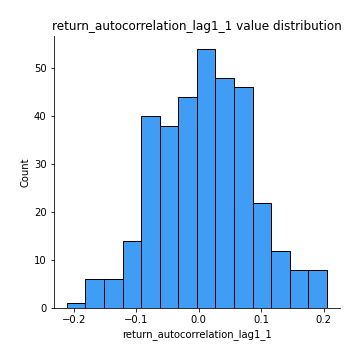
## Feature : return_autocorrelation_lag1_2
- **Feature type** : continous
- **Missing** : 0.0%
- **Unique** : 347
- **Count** :347.0
- **Mean** :0.008882518621048517
- **Std** :0.06900752440388137
- **Min** :-0.23650716165005362
- **25%th Percentile** : -0.03504758888908491
- **50%th Percentile** : 0.010940992613968201
- **75%th Percentile** : 0.0560478309764723
- **Max** :0.18060695479555924

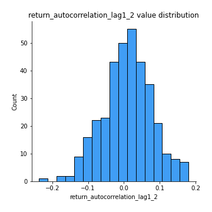
## Feature : return_autocorrelation_lag1_rolling_sd1
- **Feature type** : continous
- **Missing** : 0.0%
- **Unique** : 347
- **Count** :347.0
- **Mean** :0.9445509104716955
- **Std** :0.020840538759699694
- **Min** :0.8706732948271847
- **25%th Percentile** : 0.9321889324246618
- **50%th Percentile** : 0.9492021536241007
- **75%th Percentile** : 0.9598468965561815
- **Max** :0.9817860359018395

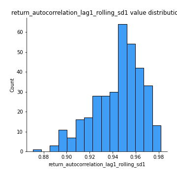
## Feature : return_autocorrelation_lag1_rolling_sd2
- **Feature type** : continous
- **Missing** : 0.0%
- **Unique** : 347
- **Count** :347.0
- **Mean** :0.9431022584181271
- **Std** :0.019301274452113257
- **Min** :0.8865953157516836
- **25%th Percentile** : 0.9317968484889652
- **50%th Percentile** : 0.947241829761472
- **75%th Percentile** : 0.9572842667590764
- **Max** :0.9807727689740846

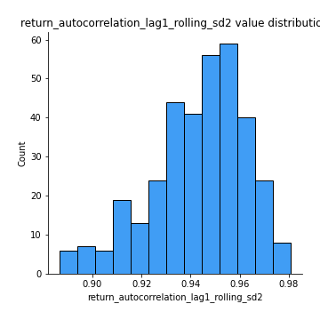
## Feature : price_adf_p_values
- **Feature type** : continous
- **Missing** : 0.0%
- **Unique** : 347
- **Count** :347.0
- **Mean** :0.4369911860300361
- **Std** :0.36012046550680366
- **Min** :4.24204332590779e-07
- **25%th Percentile** : 0.08740117617717977
- **50%th Percentile** : 0.3581658126728595
- **75%th Percentile** : 0.8375379578269727
- **Max** :0.9990301011719359

## Feature : return_correlation_ts1_lag_0
- **Feature type** : continous
- **Missing** : 0.0%
- **Unique** : 347
- **Count** :347.0
- **Mean** :0.6706352432849668
- **Std** :0.37055717866438176
- **Min** :-0.1027361091654343
- **25%th Percentile** : 0.30439238620427156
- **50%th Percentile** : 0.9934376483211339
- **75%th Percentile** : 0.9985380121641799
- **Max** :0.9994557154738104

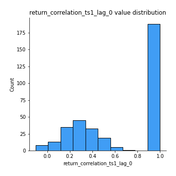
## Feature : return_correlation_ts1_lag_1
- **Feature type** : continous
- **Missing** : 0.0%
- **Unique** : 347
- **Count** :347.0
- **Mean** :0.012603630546656384
- **Std** :0.0698120847492689
- **Min** :-0.18856712556884056
- **25%th Percentile** : -0.03297621942220415
- **50%th Percentile** : 0.009368501482039323
- **75%th Percentile** : 0.05951437466114064
- **Max** :0.1851924881092877

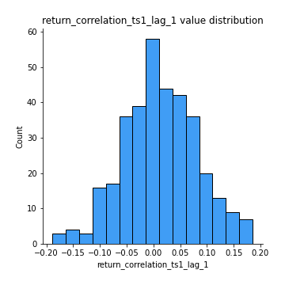
## Feature : return_correlation_ts1_lag_2
- **Feature type** : continous
- **Missing** : 0.0%
- **Unique** : 347
- **Count** :347.0
- **Mean** :0.0078008684765123
- **Std** :0.06327659586664655
- **Min** :-0.17301760826170318
- **25%th Percentile** : -0.034050286338822844
- **50%th Percentile** : 0.005289895084785701
- **75%th Percentile** : 0.05281200668305565
- **Max** :0.16596781200870073

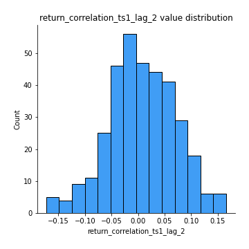
## Feature : return_correlation_ts1_lag_3
- **Feature type** : continous
- **Missing** : 0.0%
- **Unique** : 347
- **Count** :347.0
- **Mean** :0.013406309376675465
- **Std** :0.06794253791277409
- **Min** :-0.21184867865910795
- **25%th Percentile** : -0.03082381510001613
- **50%th Percentile** : 0.014329504713239322
- **75%th Percentile** : 0.058422322733036255
- **Max** :0.22601984756836344

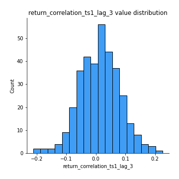
## Feature : return_correlation_ts2_lag_1
- **Feature type** : continous
- **Missing** : 0.0%
- **Unique** : 347
- **Count** :347.0
- **Mean** :0.012133792228215845
- **Std** :0.07230780322220753
- **Min** :-0.20434596106030414
- **25%th Percentile** : -0.04114022108711507
- **50%th Percentile** : 0.014507002319635299
- **75%th Percentile** : 0.06667373323202513
- **Max** :0.18910892313518007

## Feature : return_correlation_ts2_lag_2
- **Feature type** : continous
- **Missing** : 0.0%
- **Unique** : 347
- **Count** :347.0
- **Mean** :0.008422035914676615
- **Std** :0.06397142407445326
- **Min** :-0.2758654278092797
- **25%th Percentile** : -0.031146306222506852
- **50%th Percentile** : 0.0074375591195404624
- **75%th Percentile** : 0.05340754708720283
- **Max** :0.1629007760732384

## Feature : return_correlation_ts2_lag_3
- **Feature type** : continous
- **Missing** : 0.0%
- **Unique** : 347
- **Count** :347.0
- **Mean** :0.014140017135086587
- **Std** :0.06284939463117308
- **Min** :-0.1770774021770153
- **25%th Percentile** : -0.027488293192469336
- **50%th Percentile** : 0.013644944610886696
- **75%th Percentile** : 0.05548387343693717
- **Max** :0.1931758318086702

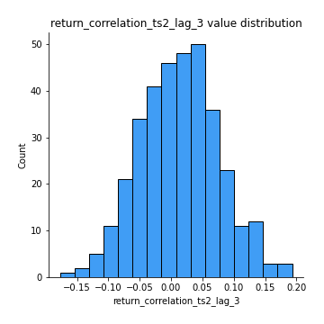
## Feature : durbin_watson_statistic1
- **Feature type** : continous
- **Missing** : 0.0%
- **Unique** : 347
- **Count** :347.0
- **Mean** :1.9919279837301287
- **Std** :0.07916277374040696
- **Min** :1.7347545360512986
- **25%th Percentile** : 1.9634176665136205
- **50%th Percentile** : 1.991216260174839
- **75%th Percentile** : 2.0158548441657613
- **Max** :2.3147835328996527

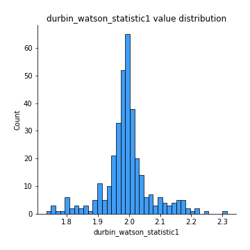
## Feature : durbin_watson_statistic2
- **Feature type** : continous
- **Missing** : 0.0%
- **Unique** : 347
- **Count** :347.0
- **Mean** :1.9860559393835369
- **Std** :0.0890197386146296
- **Min** :1.649823119450525
- **25%th Percentile** : 1.9577484160616727
- **50%th Percentile** : 1.9885955670515807
- **75%th Percentile** : 2.0163186892592497
- **Max** :2.334073172550357

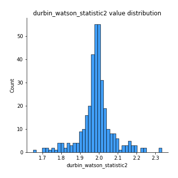
## Feature : co_integration_statistic
- **Feature type** : continous
- **Missing** : 0.0%
- **Unique** : 347
- **Count** :347.0
- **Mean** :0.5495012448736102
- **Std** :0.3500790303884609
- **Min** :6.806906285087319e-05
- **25%th Percentile** : 0.20281662019253308
- **50%th Percentile** : 0.595075785998288
- **75%th Percentile** : 0.9281589489064593
- **Max** :0.9937487523104221

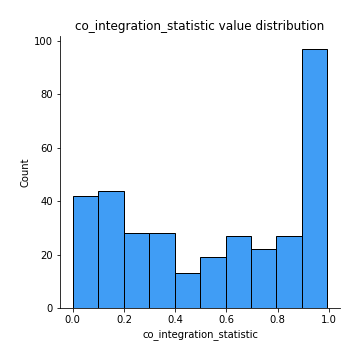
## Feature : price2_granger_cause_price1
- **Feature type** : continous
- **Missing** : 0.0%
- **Unique** : 347
- **Count** :347.0
- **Mean** :0.2360125384255774
- **Std** :0.28372752277045615
- **Min** :2.3655116242603476e-09
- **25%th Percentile** : 0.01671249653725622
- **50%th Percentile** : 0.09353989746423069
- **75%th Percentile** : 0.38998388267041495
- **Max** :0.9594994939124739

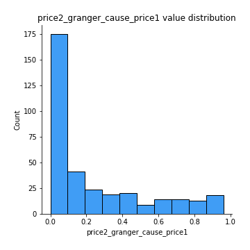
## Feature : price1_granger_cause_price2
- **Feature type** : continous
- **Missing** : 0.0%
- **Unique** : 347
- **Count** :347.0
- **Mean** :0.28228477000191426
- **Std** :0.2788340477279322
- **Min** :1.5793103433115174e-05
- **25%th Percentile** : 0.040000312182519954
- **50%th Percentile** : 0.19478424740100192
- **75%th Percentile** : 0.4532450519439717
- **Max** :0.9912763272907406

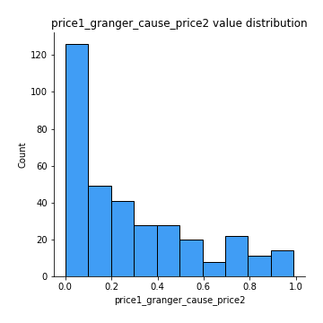

[<< Go back](../README.md)
