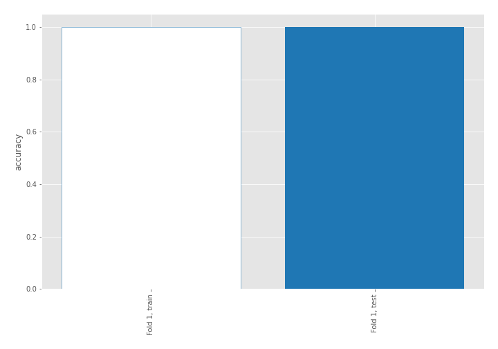
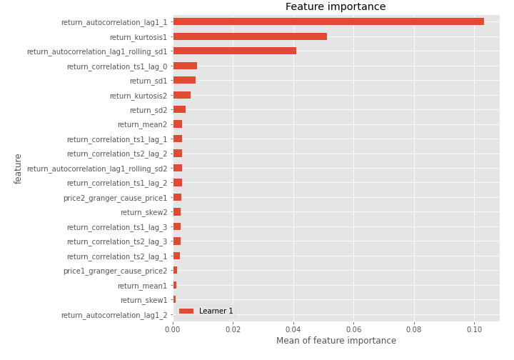
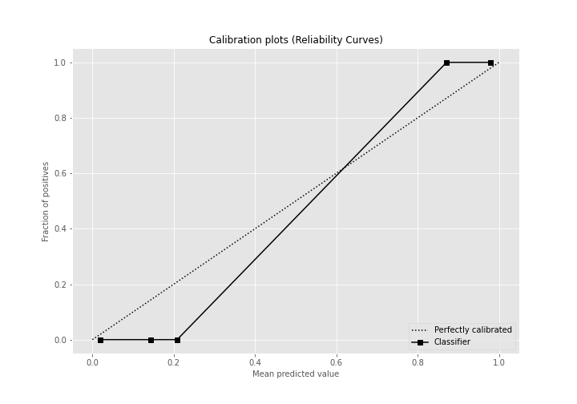
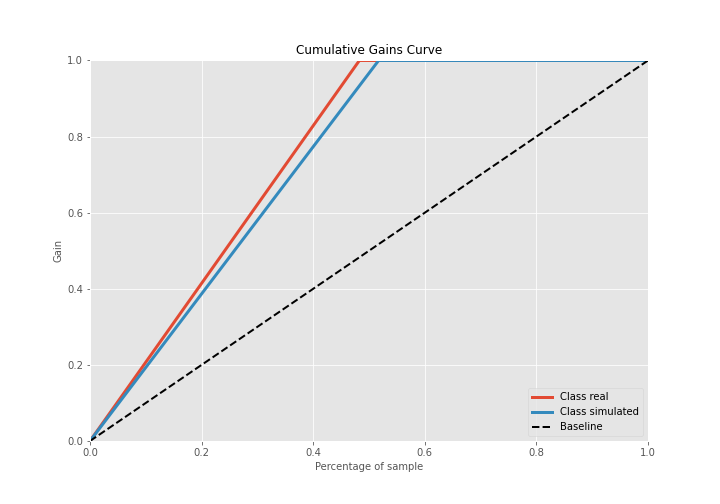
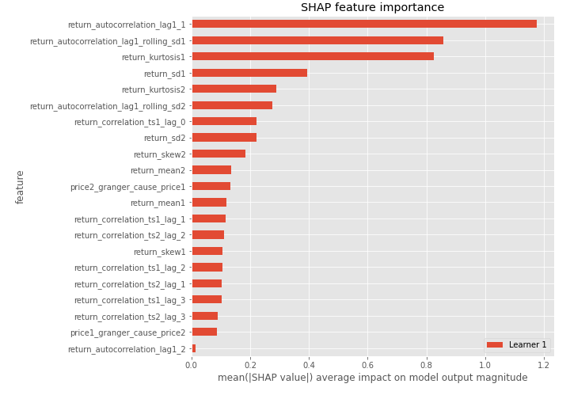
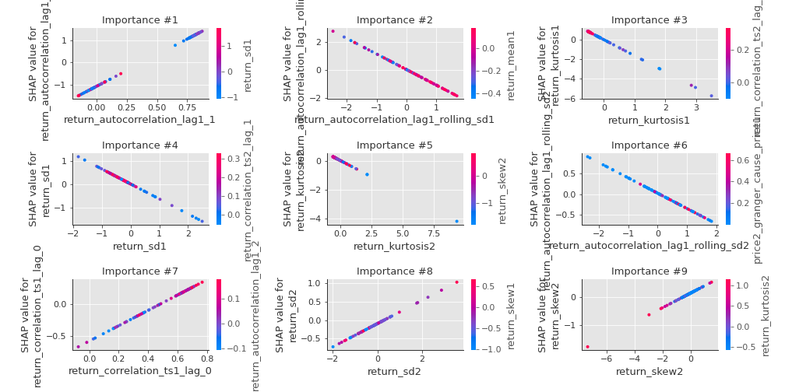
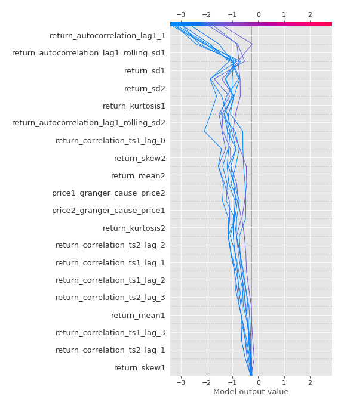
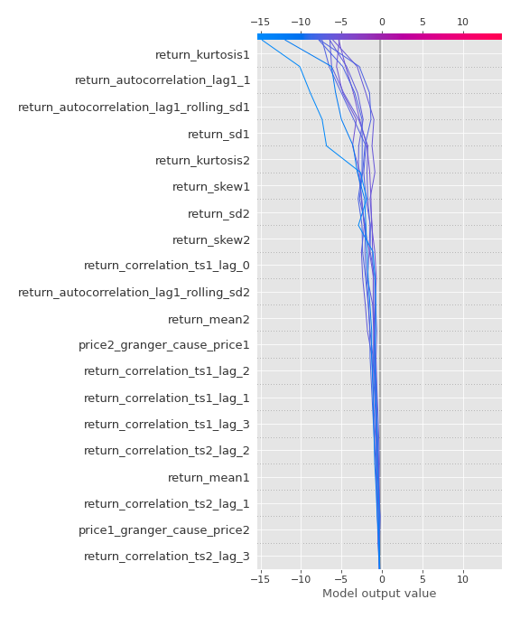
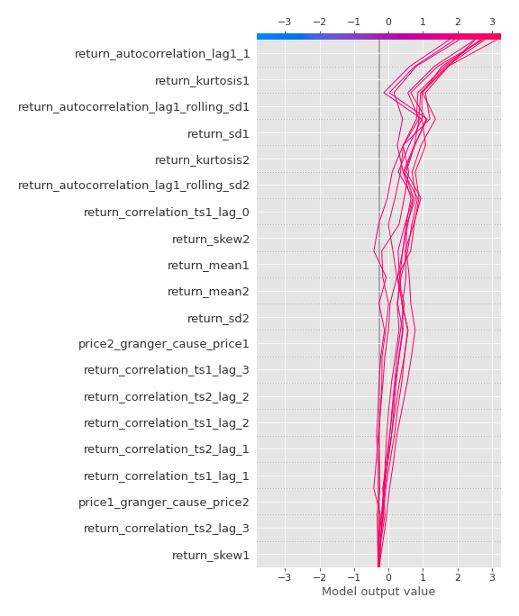
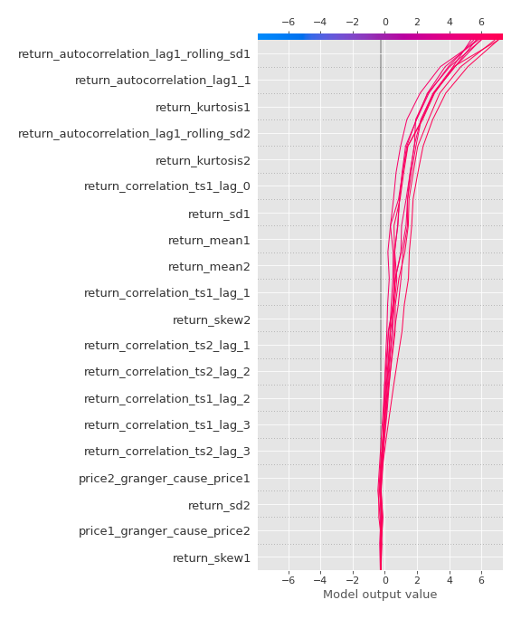

# Summary of 3_Linear

[<< Go back](../README.md)

## Logistic Regression (Linear)
- **n_jobs**: -1
- **explain_level**: 2

## Validation
 - **validation_type**: split
 - **train_ratio**: 0.75
 - **shuffle**: True
 - **stratify**: True

## Optimized metric
accuracy

## Training time

2.9 seconds

## Metric details
|           |     score |     threshold |
|:----------|----------:|--------------:|
| logloss   | 0.0309734 | nan           |
| auc       | 1         | nan           |
| f1        | 1         |   0.49579     |
| accuracy  | 1         |   0.49579     |
| precision | 1         |   0.987437    |
| recall    | 1         |   3.35721e-07 |
| mcc       | 1         |   0.49579     |

## Confusion matrix (at threshold=0.49579)
|                      |   Predicted as real |   Predicted as simulated |
|:---------------------|--------------------:|-------------------------:|
| Labeled as real      |                  42 |                        0 |
| Labeled as simulated |                   0 |                       45 |

## Learning curves

## Coefficients
| feature                                 |   Learner_1 |
|:----------------------------------------|------------:|
| return_autocorrelation_lag1_1           |    2.84517  |
| return_correlation_ts1_lag_0            |    1.20124  |
| return_correlation_ts1_lag_1            |    0.889289 |
| return_correlation_ts2_lag_1            |    0.854466 |
| return_correlation_ts2_lag_2            |    0.824589 |
| return_correlation_ts1_lag_3            |    0.806065 |
| return_correlation_ts1_lag_2            |    0.801413 |
| return_correlation_ts2_lag_3            |    0.789304 |
| return_sd2                              |    0.316537 |
| return_skew2                            |    0.261969 |
| return_autocorrelation_lag1_2           |    0.221864 |
| return_skew1                            |   -0.326549 |
| return_autocorrelation_lag1_rolling_sd2 |   -0.372553 |
| price1_granger_cause_price2             |   -0.404966 |
| return_kurtosis2                        |   -0.453392 |
| return_sd1                              |   -0.641447 |
| return_mean1                            |   -0.688948 |
| price2_granger_cause_price1             |   -0.729357 |
| return_mean2                            |   -0.881942 |
| return_autocorrelation_lag1_rolling_sd1 |   -1.10934  |
| return_kurtosis1                        |   -1.62452  |
| intercept                               |   -2.51677  |

## Permutation-based Importance

## Confusion Matrix

## Normalized Confusion Matrix

## ROC Curve

## Kolmogorov-Smirnov Statistic

## Precision-Recall Curve

## Calibration Curve

## Cumulative Gains Curve

## Lift Curve

## SHAP Importance

## SHAP Dependence plots

### Dependence (Fold 1)

## SHAP Decision plots

### Top-10 Worst decisions for class 0 (Fold 1)

### Top-10 Best decisions for class 0 (Fold 1)

### Top-10 Worst decisions for class 1 (Fold 1)

### Top-10 Best decisions for class 1 (Fold 1)

[<< Go back](../README.md)
