# Exploratory Data Analysis

[<< Go back](../README.md)
## Feature : target
- **Feature type** : categorical
- **Missing** : 0.0%
- **Unique** : 2
- **Count** :347
- **Unique** :2
- **Top** :simulated
- **Freq** :178

## Feature : return_mean1
- **Feature type** : continous
- **Missing** : 0.0%
- **Unique** : 347
- **Count** :347.0
- **Mean** :-0.07113216712693247
- **Std** :0.24097439706953433
- **Min** :-1.434746668962755
- **25%th Percentile** : -0.19389049471675585
- **50%th Percentile** : -0.024966329138002494
- **75%th Percentile** : 0.10568123420434974
- **Max** :0.5271212600449412

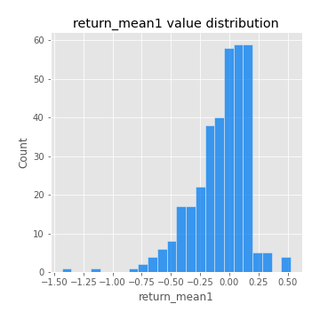
## Feature : return_mean2
- **Feature type** : continous
- **Missing** : 0.0%
- **Unique** : 347
- **Count** :347.0
- **Mean** :-0.11645392011633673
- **Std** :0.2001221018264085
- **Min** :-0.8146461593784058
- **25%th Percentile** : -0.2619638305720013
- **50%th Percentile** : -0.0907567225999469
- **75%th Percentile** : 0.04073108079430886
- **Max** :0.6801605239983173

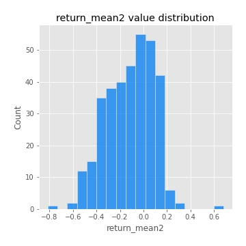
## Feature : return_sd1
- **Feature type** : continous
- **Missing** : 0.0%
- **Unique** : 347
- **Count** :347.0
- **Mean** :1.5162214694968161
- **Std** :0.37870484687224437
- **Min** :0.8102430347636637
- **25%th Percentile** : 1.3025766136972934
- **50%th Percentile** : 1.4222997099180044
- **75%th Percentile** : 1.5979367285457737
- **Max** :3.332494027875222

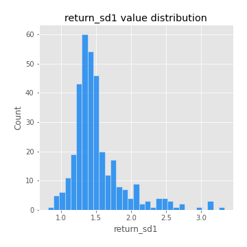
## Feature : return_sd2
- **Feature type** : continous
- **Missing** : 0.0%
- **Unique** : 347
- **Count** :347.0
- **Mean** :1.7353734447872429
- **Std** :0.40811682100948776
- **Min** :0.9060171249911689
- **25%th Percentile** : 1.5339838283209464
- **50%th Percentile** : 1.7249211803731064
- **75%th Percentile** : 1.8576238015576898
- **Max** :4.59233049161685

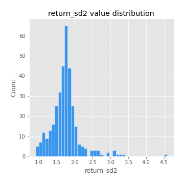
## Feature : return_skew1
- **Feature type** : continous
- **Missing** : 0.0%
- **Unique** : 347
- **Count** :347.0
- **Mean** :-0.3837819781357468
- **Std** :0.6982012456645563
- **Min** :-4.239645236578449
- **25%th Percentile** : -0.4984230195328022
- **50%th Percentile** : -0.41239232665685877
- **75%th Percentile** : -0.2667699095798639
- **Max** :2.351757728252051

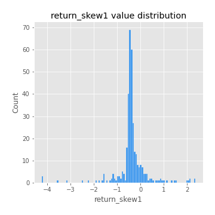
## Feature : return_skew2
- **Feature type** : continous
- **Missing** : 0.0%
- **Unique** : 347
- **Count** :347.0
- **Mean** :-0.3132315074544849
- **Std** :1.117622498506797
- **Min** :-7.3762354994385335
- **25%th Percentile** : -0.5220556208129041
- **50%th Percentile** : -0.1307954318173158
- **75%th Percentile** : 0.16784210039643244
- **Max** :4.1920266082732045

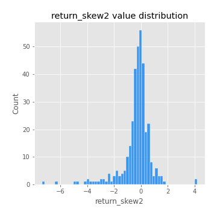
## Feature : return_kurtosis1
- **Feature type** : continous
- **Missing** : 0.0%
- **Unique** : 347
- **Count** :347.0
- **Mean** :2.3352410829412875
- **Std** :5.754814899852795
- **Min** :-0.8383731802449228
- **25%th Percentile** : -0.5471091839061046
- **50%th Percentile** : 0.0183675549034108
- **75%th Percentile** : 2.373444226909248
- **Max** :40.485294874464934

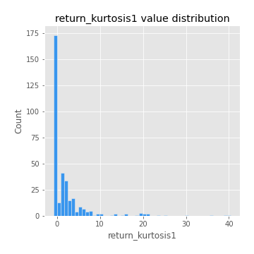
## Feature : return_kurtosis2
- **Feature type** : continous
- **Missing** : 0.0%
- **Unique** : 347
- **Count** :347.0
- **Mean** :5.3346920840194585
- **Std** :9.861258487517247
- **Min** :-0.45232252885897895
- **25%th Percentile** : 0.914954108424658
- **50%th Percentile** : 1.9635135292687433
- **75%th Percentile** : 5.249744695113649
- **Max** :94.01659180149953

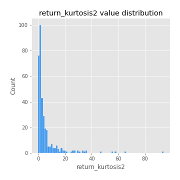
## Feature : return_autocorrelation_lag1_1
- **Feature type** : continous
- **Missing** : 0.0%
- **Unique** : 347
- **Count** :347.0
- **Mean** :0.4058275084160247
- **Std** :0.41789950366467893
- **Min** :-0.2110198016529991
- **25%th Percentile** : -0.019592986572728118
- **50%th Percentile** : 0.7224557718812538
- **75%th Percentile** : 0.8146453418199342
- **Max** :0.8972189598044505

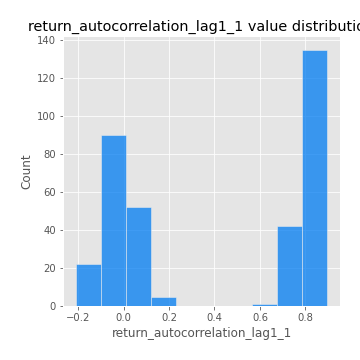
## Feature : return_autocorrelation_lag1_2
- **Feature type** : continous
- **Missing** : 0.0%
- **Unique** : 347
- **Count** :347.0
- **Mean** :0.04151320410119725
- **Std** :0.07920634630968142
- **Min** :-0.15425534446794
- **25%th Percentile** : -0.01429053579868432
- **50%th Percentile** : 0.046229687790779884
- **75%th Percentile** : 0.09749152515924428
- **Max** :0.23416364492249164

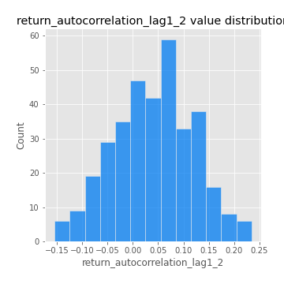
## Feature : return_autocorrelation_lag1_rolling_sd1
- **Feature type** : continous
- **Missing** : 0.0%
- **Unique** : 347
- **Count** :347.0
- **Mean** :0.9448686675170409
- **Std** :0.022902385677021124
- **Min** :0.8406218895576182
- **25%th Percentile** : 0.9314516126021457
- **50%th Percentile** : 0.9465941450163364
- **75%th Percentile** : 0.9621289263115369
- **Max** :0.9853323132723477

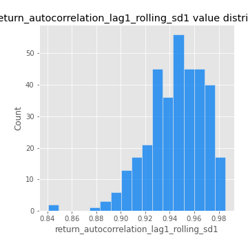
## Feature : return_autocorrelation_lag1_rolling_sd2
- **Feature type** : continous
- **Missing** : 0.0%
- **Unique** : 347
- **Count** :347.0
- **Mean** :0.9449138959941472
- **Std** :0.01977175887056325
- **Min** :0.8851916941668628
- **25%th Percentile** : 0.9347478875136327
- **50%th Percentile** : 0.9462344843646889
- **75%th Percentile** : 0.9590079878909752
- **Max** :0.983940118474517

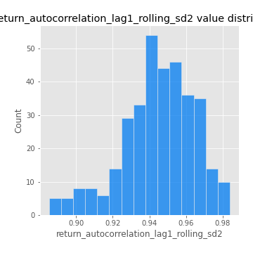
## Feature : return_correlation_ts1_lag_0
- **Feature type** : continous
- **Missing** : 0.0%
- **Unique** : 347
- **Count** :347.0
- **Mean** :0.4956197831592836
- **Std** :0.212795880787243
- **Min** :-0.10256711281206837
- **25%th Percentile** : 0.33593985726953524
- **50%th Percentile** : 0.5901562396346054
- **75%th Percentile** : 0.6684154594486387
- **Max** :0.9937227277077512

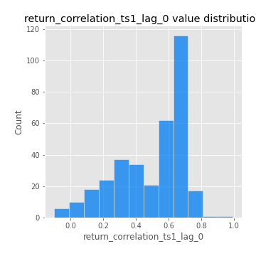
## Feature : return_correlation_ts1_lag_1
- **Feature type** : continous
- **Missing** : 0.0%
- **Unique** : 347
- **Count** :347.0
- **Mean** :0.1281368367942815
- **Std** :0.1462780701351277
- **Min** :-0.18856827637524448
- **25%th Percentile** : -0.002498041869026639
- **50%th Percentile** : 0.13313211236757302
- **75%th Percentile** : 0.26251311879424344
- **Max** :0.41274667115178476

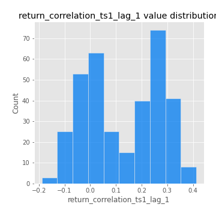
## Feature : return_correlation_ts1_lag_2
- **Feature type** : continous
- **Missing** : 0.0%
- **Unique** : 347
- **Count** :347.0
- **Mean** :0.1252300320008393
- **Std** :0.14461516329169105
- **Min** :-0.14326176299733834
- **25%th Percentile** : -0.01158936220729856
- **50%th Percentile** : 0.13729360027739135
- **75%th Percentile** : 0.25460488728673886
- **Max** :0.41609437324034637

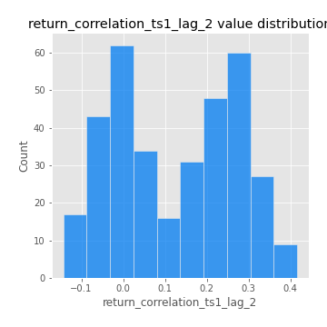
## Feature : return_correlation_ts1_lag_3
- **Feature type** : continous
- **Missing** : 0.0%
- **Unique** : 347
- **Count** :347.0
- **Mean** :0.13265314634754397
- **Std** :0.1402297520821517
- **Min** :-0.21147540839842804
- **25%th Percentile** : 0.01366276119778393
- **50%th Percentile** : 0.13529919942031615
- **75%th Percentile** : 0.2607906856132273
- **Max** :0.4044264611682152

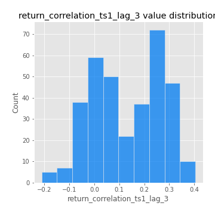
## Feature : return_correlation_ts2_lag_1
- **Feature type** : continous
- **Missing** : 0.0%
- **Unique** : 347
- **Count** :347.0
- **Mean** :0.13430363907147905
- **Std** :0.14421127456552868
- **Min** :-0.1363859619205903
- **25%th Percentile** : 0.0012241271931291574
- **50%th Percentile** : 0.13992218366103334
- **75%th Percentile** : 0.263411885515478
- **Max** :0.4265378870778371

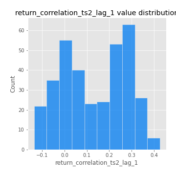
## Feature : return_correlation_ts2_lag_2
- **Feature type** : continous
- **Missing** : 0.0%
- **Unique** : 347
- **Count** :347.0
- **Mean** :0.12636255885077466
- **Std** :0.14638076189250826
- **Min** :-0.18381967289455395
- **25%th Percentile** : -0.0013906760117673859
- **50%th Percentile** : 0.1385050928746377
- **75%th Percentile** : 0.2591945657072625
- **Max** :0.42581755695474155

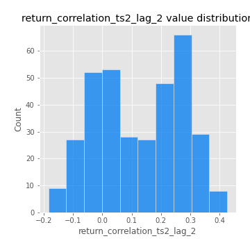
## Feature : return_correlation_ts2_lag_3
- **Feature type** : continous
- **Missing** : 0.0%
- **Unique** : 347
- **Count** :347.0
- **Mean** :0.13699327135652722
- **Std** :0.1344344293314894
- **Min** :-0.13344359675322365
- **25%th Percentile** : 0.014434113281906465
- **50%th Percentile** : 0.13078492878165154
- **75%th Percentile** : 0.2621257752712304
- **Max** :0.4133150308957178

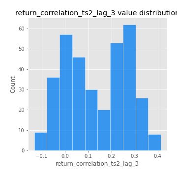
## Feature : price2_granger_cause_price1
- **Feature type** : continous
- **Missing** : 0.0%
- **Unique** : 347
- **Count** :347.0
- **Mean** :0.13603912909558727
- **Std** :0.2422420357786534
- **Min** :1.3971190789099587e-26
- **25%th Percentile** : 5.736068230575925e-06
- **50%th Percentile** : 0.0020160915501513115
- **75%th Percentile** : 0.1739346206783163
- **Max** :0.9898380228448623

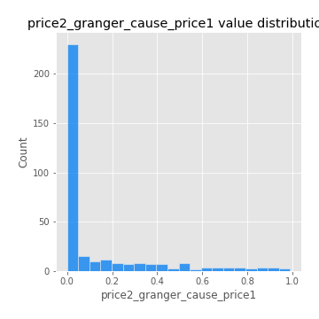
## Feature : price1_granger_cause_price2
- **Feature type** : continous
- **Missing** : 0.0%
- **Unique** : 347
- **Count** :347.0
- **Mean** :0.2033354606318343
- **Std** :0.2591955186575307
- **Min** :1.2014377315159162e-12
- **25%th Percentile** : 0.008264585188480583
- **50%th Percentile** : 0.08297032721066479
- **75%th Percentile** : 0.31406591032963926
- **Max** :0.9871292066441198

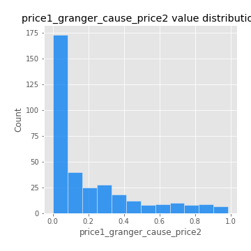

[<< Go back](../README.md)
