# Exploratory Data Analysis

[<< Go back](../README.md)
## Feature : target
- **Feature type** : categorical
- **Missing** : 0.0%
- **Unique** : 2
- **Count** :347
- **Unique** :2
- **Top** :real
- **Freq** :175

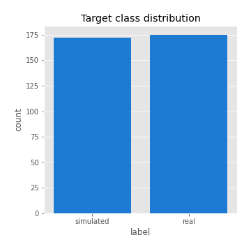
## Feature : return_mean1
- **Feature type** : continous
- **Missing** : 0.0%
- **Unique** : 347
- **Count** :347.0
- **Mean** :-0.06347495265766291
- **Std** :0.2134045608390301
- **Min** :-0.8399573385299454
- **25%th Percentile** : -0.19055606785064005
- **50%th Percentile** : -0.013968078686425491
- **75%th Percentile** : 0.09147183654625096
- **Max** :0.5288464548438871

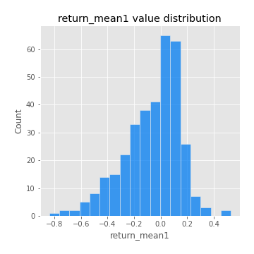
## Feature : return_mean2
- **Feature type** : continous
- **Missing** : 0.0%
- **Unique** : 347
- **Count** :347.0
- **Mean** :-0.12230938463714916
- **Std** :0.21377162586923232
- **Min** :-0.8573510273774438
- **25%th Percentile** : -0.2882892371687422
- **50%th Percentile** : -0.08915248357875465
- **75%th Percentile** : 0.04073108079430886
- **Max** :0.6801605239983173

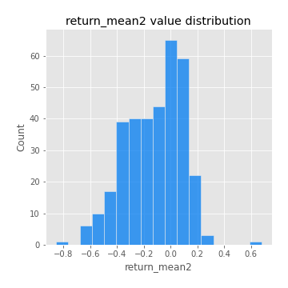
## Feature : return_sd1
- **Feature type** : continous
- **Missing** : 0.0%
- **Unique** : 347
- **Count** :347.0
- **Mean** :1.5177321643798753
- **Std** :0.3849041225741262
- **Min** :0.8102430347636637
- **25%th Percentile** : 1.31084344026323
- **50%th Percentile** : 1.4238670642342932
- **75%th Percentile** : 1.5940638923531525
- **Max** :3.332494027875222

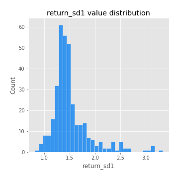
## Feature : return_sd2
- **Feature type** : continous
- **Missing** : 0.0%
- **Unique** : 347
- **Count** :347.0
- **Mean** :1.7538062538445252
- **Std** :0.419167598246908
- **Min** :0.8198779632289204
- **25%th Percentile** : 1.549225384576296
- **50%th Percentile** : 1.7403810968120366
- **75%th Percentile** : 1.8700958413568949
- **Max** :4.59233049161685

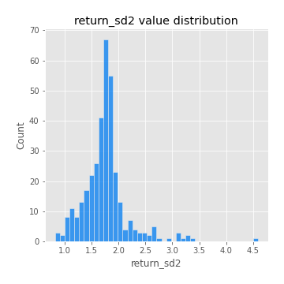
## Feature : return_skew1
- **Feature type** : continous
- **Missing** : 0.0%
- **Unique** : 347
- **Count** :347.0
- **Mean** :-0.3865425933986685
- **Std** :0.6974171643882685
- **Min** :-4.239645236578449
- **25%th Percentile** : -0.4926910891519223
- **50%th Percentile** : -0.40041775337936825
- **75%th Percentile** : -0.2661703696347535
- **Max** :2.3044235031125564

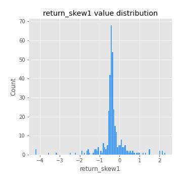
## Feature : return_skew2
- **Feature type** : continous
- **Missing** : 0.0%
- **Unique** : 347
- **Count** :347.0
- **Mean** :-0.309851825091539
- **Std** :1.1069331596879795
- **Min** :-7.3762354994385335
- **25%th Percentile** : -0.5031468010758862
- **50%th Percentile** : -0.11894632223618078
- **75%th Percentile** : 0.20935254543390452
- **Max** :4.0310261345618

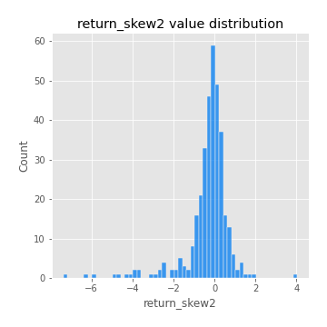
## Feature : return_kurtosis1
- **Feature type** : continous
- **Missing** : 0.0%
- **Unique** : 347
- **Count** :347.0
- **Mean** :2.429427328808363
- **Std** :5.724506898198698
- **Min** :-0.9487502955838365
- **25%th Percentile** : -0.538302378947725
- **50%th Percentile** : 0.46130986633189686
- **75%th Percentile** : 2.627323675085121
- **Max** :40.485294874464934

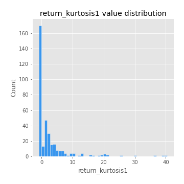
## Feature : return_kurtosis2
- **Feature type** : continous
- **Missing** : 0.0%
- **Unique** : 347
- **Count** :347.0
- **Mean** :5.010104915626188
- **Std** :9.873713168350271
- **Min** :-0.5153617826118722
- **25%th Percentile** : 1.000604014236327
- **50%th Percentile** : 1.8190527666631264
- **75%th Percentile** : 4.805246554982855
- **Max** :94.01659180149953

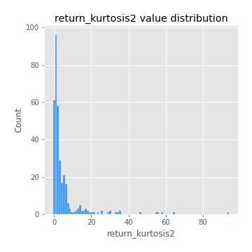
## Feature : return_autocorrelation_lag1_1
- **Feature type** : continous
- **Missing** : 0.0%
- **Unique** : 347
- **Count** :347.0
- **Mean** :0.3910001001516786
- **Std** :0.41274095223206314
- **Min** :-0.2110198016529991
- **25%th Percentile** : -0.017833684840567243
- **50%th Percentile** : 0.1394351594358992
- **75%th Percentile** : 0.8069877104845633
- **Max** :0.8677832787169262

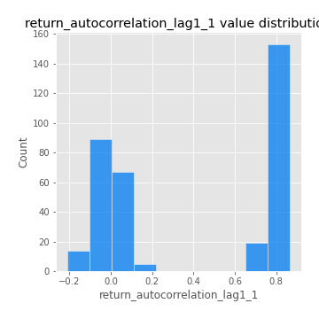
## Feature : return_autocorrelation_lag1_2
- **Feature type** : continous
- **Missing** : 0.0%
- **Unique** : 347
- **Count** :347.0
- **Mean** :0.03536632416234596
- **Std** :0.08030449690712954
- **Min** :-0.17778763204400128
- **25%th Percentile** : -0.016018588889109925
- **50%th Percentile** : 0.04109041063472714
- **75%th Percentile** : 0.08869989510183957
- **Max** :0.275108436203626

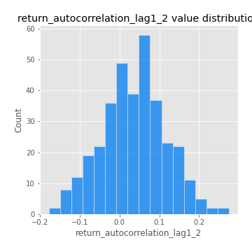
## Feature : return_autocorrelation_lag1_rolling_sd1
- **Feature type** : continous
- **Missing** : 0.0%
- **Unique** : 347
- **Count** :347.0
- **Mean** :0.9450526312995026
- **Std** :0.023025191158947803
- **Min** :0.8527138021609338
- **25%th Percentile** : 0.931984511488279
- **50%th Percentile** : 0.9492055582958349
- **75%th Percentile** : 0.9632566742458668
- **Max** :0.9816370074661068

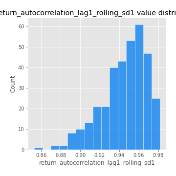
## Feature : return_autocorrelation_lag1_rolling_sd2
- **Feature type** : continous
- **Missing** : 0.0%
- **Unique** : 347
- **Count** :347.0
- **Mean** :0.9458285332952941
- **Std** :0.02031996114420202
- **Min** :0.8714886349010359
- **25%th Percentile** : 0.9350767249638527
- **50%th Percentile** : 0.94802220891468
- **75%th Percentile** : 0.9603272864936723
- **Max** :0.983940118474517

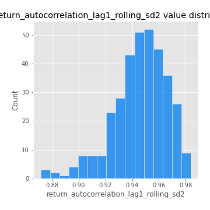
## Feature : return_correlation_ts1_lag_0
- **Feature type** : continous
- **Missing** : 0.0%
- **Unique** : 347
- **Count** :347.0
- **Mean** :0.48496325385630934
- **Std** :0.2122811168806658
- **Min** :-0.10256711281206837
- **25%th Percentile** : 0.32409496960217626
- **50%th Percentile** : 0.582049461905355
- **75%th Percentile** : 0.6622706628780035
- **Max** :0.7718560976188872

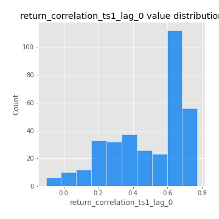
## Feature : return_correlation_ts1_lag_1
- **Feature type** : continous
- **Missing** : 0.0%
- **Unique** : 347
- **Count** :347.0
- **Mean** :0.12105447256947552
- **Std** :0.14222280086578995
- **Min** :-0.14801746278864836
- **25%th Percentile** : 0.00078457773392853
- **50%th Percentile** : 0.0902808849297199
- **75%th Percentile** : 0.24911868654862793
- **Max** :0.4176617697489701

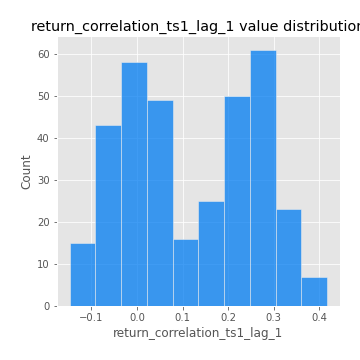
## Feature : return_correlation_ts1_lag_2
- **Feature type** : continous
- **Missing** : 0.0%
- **Unique** : 347
- **Count** :347.0
- **Mean** :0.11897127402270018
- **Std** :0.14760021384282712
- **Min** :-0.172871336111873
- **25%th Percentile** : -0.014462890736447707
- **50%th Percentile** : 0.1138267016865481
- **75%th Percentile** : 0.25256954116285957
- **Max** :0.429402596688188

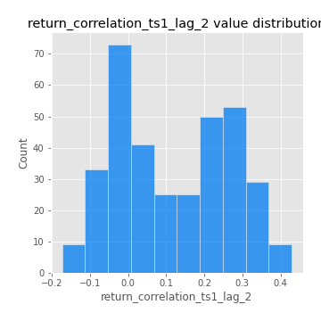
## Feature : return_correlation_ts1_lag_3
- **Feature type** : continous
- **Missing** : 0.0%
- **Unique** : 347
- **Count** :347.0
- **Mean** :0.1267542440675754
- **Std** :0.13971955805675695
- **Min** :-0.21147540839842804
- **25%th Percentile** : 0.008033929354749992
- **50%th Percentile** : 0.12764755425914873
- **75%th Percentile** : 0.25342320554310505
- **Max** :0.4127843487474458

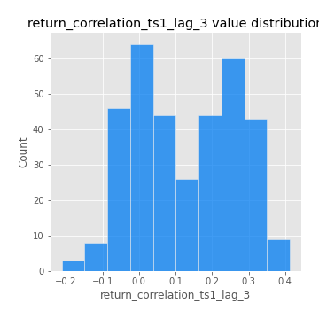
## Feature : return_correlation_ts2_lag_1
- **Feature type** : continous
- **Missing** : 0.0%
- **Unique** : 347
- **Count** :347.0
- **Mean** :0.12693192787479862
- **Std** :0.14186605231692692
- **Min** :-0.17665751184419612
- **25%th Percentile** : 0.004224735542197719
- **50%th Percentile** : 0.12892031530719528
- **75%th Percentile** : 0.24965413700447212
- **Max** :0.4141022440262992

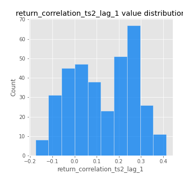
## Feature : return_correlation_ts2_lag_2
- **Feature type** : continous
- **Missing** : 0.0%
- **Unique** : 347
- **Count** :347.0
- **Mean** :0.12173434155495758
- **Std** :0.14758082258566063
- **Min** :-0.2757460186107768
- **25%th Percentile** : -0.0049898904652576565
- **50%th Percentile** : 0.114992135358775
- **75%th Percentile** : 0.25666121125001806
- **Max** :0.42566867636627137

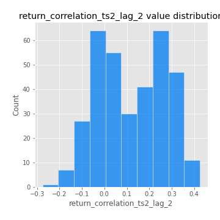
## Feature : return_correlation_ts2_lag_3
- **Feature type** : continous
- **Missing** : 0.0%
- **Unique** : 347
- **Count** :347.0
- **Mean** :0.13171338140827182
- **Std** :0.13482246545691082
- **Min** :-0.0998644332470592
- **25%th Percentile** : 0.011727465246873769
- **50%th Percentile** : 0.126014766281334
- **75%th Percentile** : 0.25108331894152547
- **Max** :0.42951391103144354

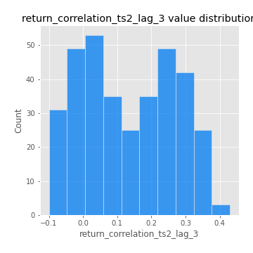
## Feature : price2_granger_cause_price1
- **Feature type** : continous
- **Missing** : 0.0%
- **Unique** : 347
- **Count** :347.0
- **Mean** :0.14079177587750322
- **Std** :0.24998930768474256
- **Min** :2.6569943848780724e-45
- **25%th Percentile** : 4.623894735731932e-06
- **50%th Percentile** : 0.0027277847964689078
- **75%th Percentile** : 0.18089558158450111
- **Max** :0.9757504007795685

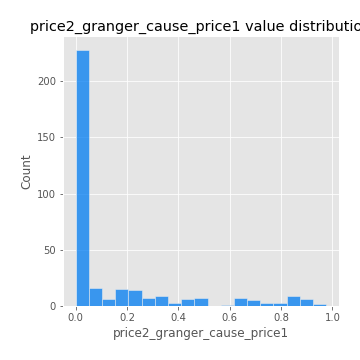
## Feature : price1_granger_cause_price2
- **Feature type** : continous
- **Missing** : 0.0%
- **Unique** : 347
- **Count** :347.0
- **Mean** :0.19537599664675812
- **Std** :0.25401919121833333
- **Min** :1.2012269232170316e-11
- **25%th Percentile** : 0.006201939219295145
- **50%th Percentile** : 0.07669989687421017
- **75%th Percentile** : 0.3073810398289791
- **Max** :0.9871292066441198

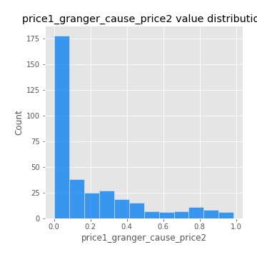

[<< Go back](../README.md)
