# Summary of 3_Linear

[<< Go back](../README.md)

## Logistic Regression (Linear)
- **n_jobs**: -1
- **explain_level**: 2

## Validation
 - **validation_type**: split
 - **train_ratio**: 0.75
 - **shuffle**: True
 - **stratify**: True

## Optimized metric
accuracy

## Training time

3.7 seconds

## Metric details
|           |   score |     threshold |
|:----------|--------:|--------------:|
| logloss   | 0.02681 | nan           |
| auc       | 1       | nan           |
| f1        | 1       |   0.495845    |
| accuracy  | 1       |   0.495845    |
| precision | 1       |   0.495845    |
| recall    | 1       |   3.47851e-05 |
| mcc       | 1       |   0.495845    |

## Confusion matrix (at threshold=0.495845)
|                      |   Predicted as real |   Predicted as simulated |
|:---------------------|--------------------:|-------------------------:|
| Labeled as real      |                  46 |                        0 |
| Labeled as simulated |                   0 |                       41 |

## Learning curves

## Coefficients
| feature                                 |   Learner_1 |
|:----------------------------------------|------------:|
| return_autocorrelation_lag1_1           |    2.91104  |
| return_correlation_ts1_lag_0            |    1.18486  |
| return_correlation_ts1_lag_1            |    0.900712 |
| return_correlation_ts2_lag_2            |    0.895587 |
| return_correlation_ts1_lag_2            |    0.857998 |
| return_correlation_ts2_lag_1            |    0.850944 |
| return_correlation_ts2_lag_3            |    0.795362 |
| return_correlation_ts1_lag_3            |    0.75652  |
| return_skew2                            |    0.496645 |
| return_autocorrelation_lag1_2           |    0.276864 |
| return_sd2                              |    0.27084  |
| return_skew1                            |   -0.283333 |
| return_autocorrelation_lag1_rolling_sd2 |   -0.407597 |
| price1_granger_cause_price2             |   -0.428603 |
| return_mean1                            |   -0.4662   |
| return_kurtosis2                        |   -0.537696 |
| return_sd1                              |   -0.629255 |
| return_autocorrelation_lag1_rolling_sd1 |   -0.701633 |
| price2_granger_cause_price1             |   -0.969891 |
| return_mean2                            |   -1.00631  |
| return_kurtosis1                        |   -1.73378  |
| intercept                               |   -2.98446  |

## Permutation-based Importance
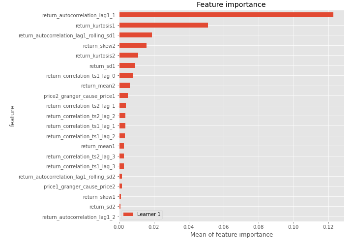
## Confusion Matrix

## Normalized Confusion Matrix

## ROC Curve

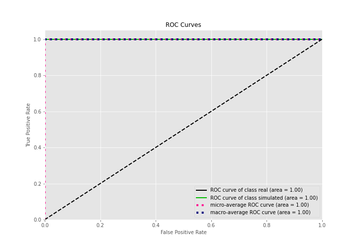

## Kolmogorov-Smirnov Statistic

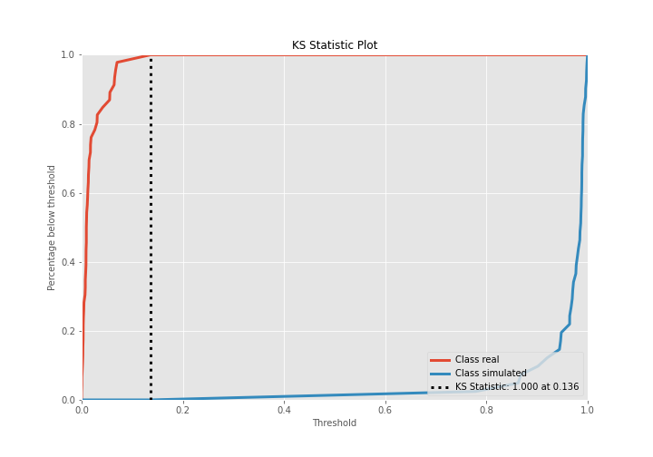

## Precision-Recall Curve

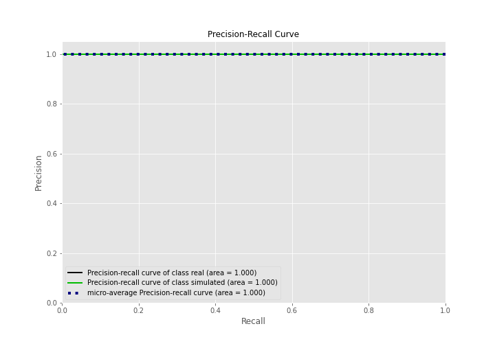

## Calibration Curve

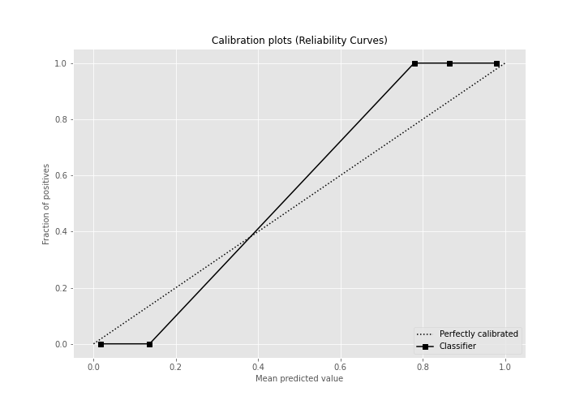

## Cumulative Gains Curve

## Lift Curve

## SHAP Importance
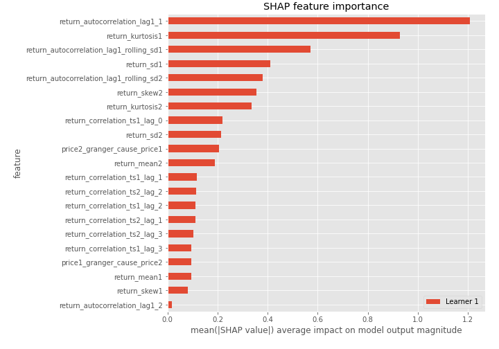

## SHAP Dependence plots

### Dependence (Fold 1)
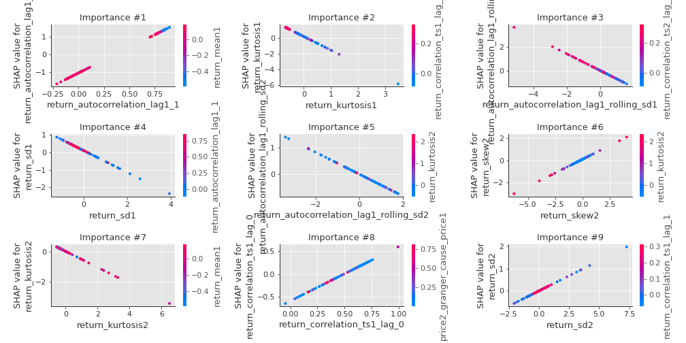

## SHAP Decision plots

### Top-10 Worst decisions for class 0 (Fold 1)
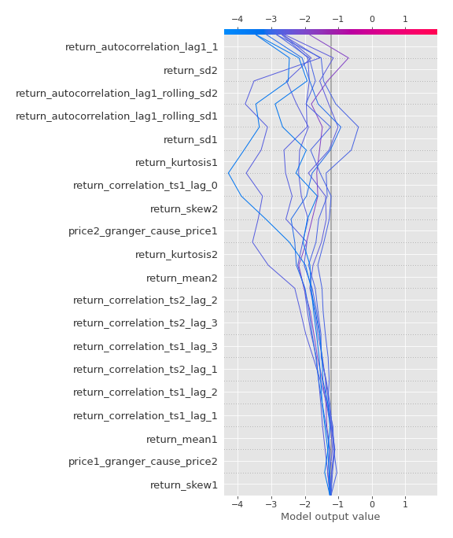
### Top-10 Best decisions for class 0 (Fold 1)
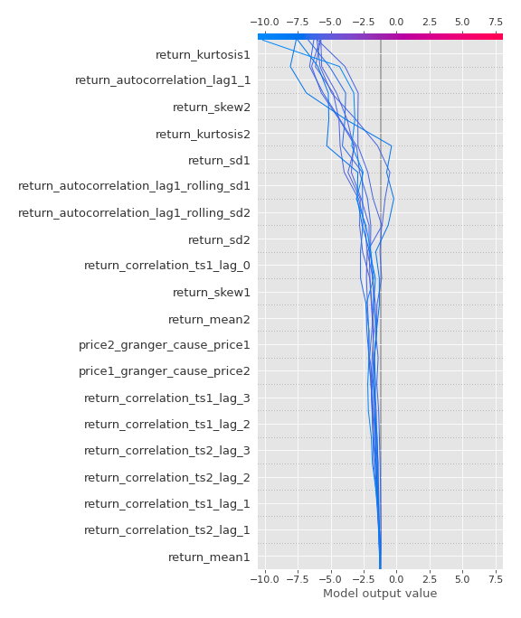
### Top-10 Worst decisions for class 1 (Fold 1)
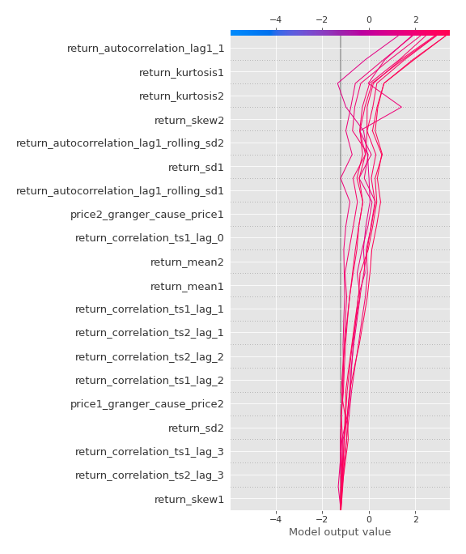
### Top-10 Best decisions for class 1 (Fold 1)
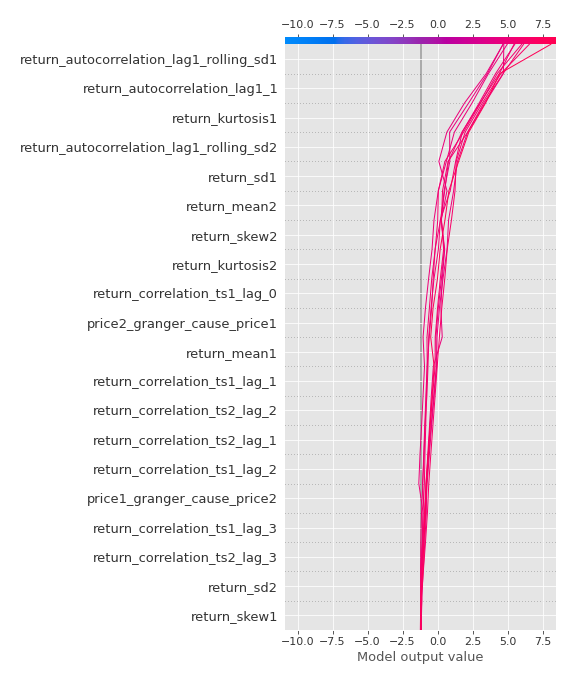

[<< Go back](../README.md)
