# Exploratory Data Analysis

[<< Go back](../README.md)
## Feature : target
- **Feature type** : categorical
- **Missing** : 0.0%
- **Unique** : 2
- **Count** :347
- **Unique** :2
- **Top** :real
- **Freq** :183

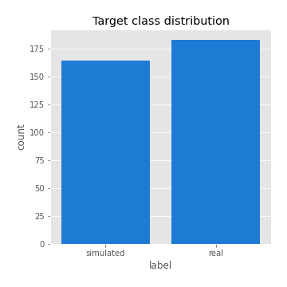
## Feature : return_mean1
- **Feature type** : continous
- **Missing** : 0.0%
- **Unique** : 347
- **Count** :347.0
- **Mean** :-0.05313614219047797
- **Std** :0.22686360138451672
- **Min** :-1.43338743379982
- **25%th Percentile** : -0.15878291041778386
- **50%th Percentile** : -0.0005831529300883745
- **75%th Percentile** : 0.09777652337974858
- **Max** :0.4726386875293224

## Feature : return_mean2
- **Feature type** : continous
- **Missing** : 0.0%
- **Unique** : 347
- **Count** :347.0
- **Mean** :-0.11560491532877024
- **Std** :0.2094488447775828
- **Min** :-0.8309606387871532
- **25%th Percentile** : -0.2782150290066602
- **50%th Percentile** : -0.0866050335919827
- **75%th Percentile** : 0.04457296413240232
- **Max** :0.6801605239983173

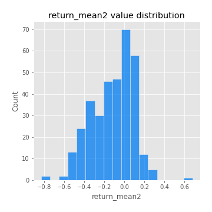
## Feature : return_sd1
- **Feature type** : continous
- **Missing** : 0.0%
- **Unique** : 347
- **Count** :347.0
- **Mean** :1.5213737430854206
- **Std** :0.3895091915934141
- **Min** :0.8733078831717243
- **25%th Percentile** : 1.3050749384749345
- **50%th Percentile** : 1.4235143058923456
- **75%th Percentile** : 1.615869805719273
- **Max** :3.332494027875222

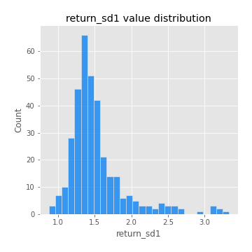
## Feature : return_sd2
- **Feature type** : continous
- **Missing** : 0.0%
- **Unique** : 347
- **Count** :347.0
- **Mean** :1.7396011332653643
- **Std** :0.4335297904909137
- **Min** :0.8198779632289204
- **25%th Percentile** : 1.5317935012651525
- **50%th Percentile** : 1.7250161318940966
- **75%th Percentile** : 1.83937928103821
- **Max** :4.59233049161685

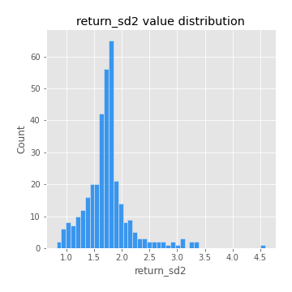
## Feature : return_skew1
- **Feature type** : continous
- **Missing** : 0.0%
- **Unique** : 347
- **Count** :347.0
- **Mean** :-0.32712635999054274
- **Std** :0.5641276691404142
- **Min** :-2.5068500114696386
- **25%th Percentile** : -0.5138404617653567
- **50%th Percentile** : -0.4102896771180189
- **75%th Percentile** : -0.21000704316137775
- **Max** :2.351757728252051

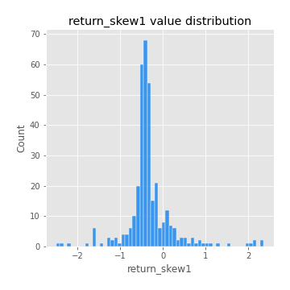
## Feature : return_skew2
- **Feature type** : continous
- **Missing** : 0.0%
- **Unique** : 347
- **Count** :347.0
- **Mean** :-0.26498665704866003
- **Std** :1.0959363056967024
- **Min** :-7.3762354994385335
- **25%th Percentile** : -0.5321996435721987
- **50%th Percentile** : -0.1420368410297251
- **75%th Percentile** : 0.20849602969419626
- **Max** :4.1920266082732045

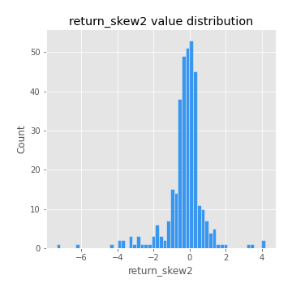
## Feature : return_kurtosis1
- **Feature type** : continous
- **Missing** : 0.0%
- **Unique** : 347
- **Count** :347.0
- **Mean** :2.058289833711146
- **Std** :4.196597702598957
- **Min** :-0.8898292849153382
- **25%th Percentile** : -0.5057780891909938
- **50%th Percentile** : 0.763577211319721
- **75%th Percentile** : 2.624353558208778
- **Max** :23.612665658846073

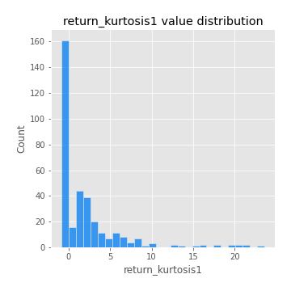
## Feature : return_kurtosis2
- **Feature type** : continous
- **Missing** : 0.0%
- **Unique** : 347
- **Count** :347.0
- **Mean** :5.140068643394215
- **Std** :9.408580696351867
- **Min** :-0.40679515274784306
- **25%th Percentile** : 0.93580132493272
- **50%th Percentile** : 2.0344783589735083
- **75%th Percentile** : 4.744782283697724
- **Max** :94.01659180149953

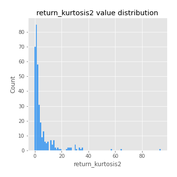
## Feature : return_autocorrelation_lag1_1
- **Feature type** : continous
- **Missing** : 0.0%
- **Unique** : 347
- **Count** :347.0
- **Mean** :0.37214768110313556
- **Std** :0.4175832423165375
- **Min** :-0.2110198016529991
- **25%th Percentile** : -0.027523563148759513
- **50%th Percentile** : 0.091378391138176
- **75%th Percentile** : 0.8109316237442992
- **Max** :0.894649166827321

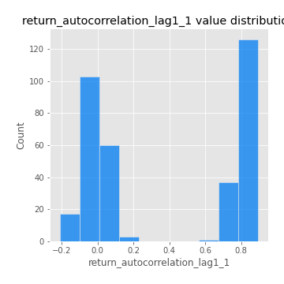
## Feature : return_autocorrelation_lag1_2
- **Feature type** : continous
- **Missing** : 0.0%
- **Unique** : 347
- **Count** :347.0
- **Mean** :0.039533281197410605
- **Std** :0.07700712648960899
- **Min** :-0.17778763204400128
- **25%th Percentile** : -0.009942152050516049
- **50%th Percentile** : 0.047441434950395885
- **75%th Percentile** : 0.09130859599837526
- **Max** :0.28429329771742795

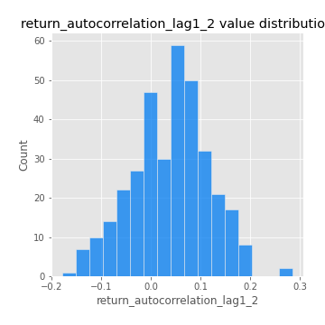
## Feature : return_autocorrelation_lag1_rolling_sd1
- **Feature type** : continous
- **Missing** : 0.0%
- **Unique** : 347
- **Count** :347.0
- **Mean** :0.9465882354338692
- **Std** :0.025109284254803712
- **Min** :0.8206729131369893
- **25%th Percentile** : 0.934606655759251
- **50%th Percentile** : 0.9506079997856299
- **75%th Percentile** : 0.9640970759433087
- **Max** :0.9870342687296267

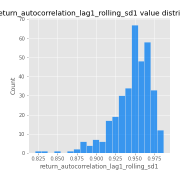
## Feature : return_autocorrelation_lag1_rolling_sd2
- **Feature type** : continous
- **Missing** : 0.0%
- **Unique** : 347
- **Count** :347.0
- **Mean** :0.9472916948911585
- **Std** :0.01999822728955526
- **Min** :0.8781957029872864
- **25%th Percentile** : 0.9368849494922478
- **50%th Percentile** : 0.9505446767465621
- **75%th Percentile** : 0.9610475290768272
- **Max** :0.9871675952783526

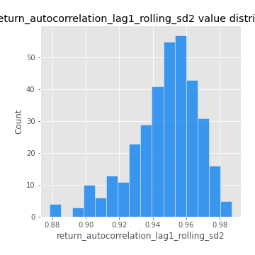
## Feature : return_correlation_ts1_lag_0
- **Feature type** : continous
- **Missing** : 0.0%
- **Unique** : 347
- **Count** :347.0
- **Mean** :0.4857070052259582
- **Std** :0.20947033298151274
- **Min** :-0.10256711281206837
- **25%th Percentile** : 0.3381206377935342
- **50%th Percentile** : 0.5604405203642585
- **75%th Percentile** : 0.6600076489073348
- **Max** :0.9937227277077512

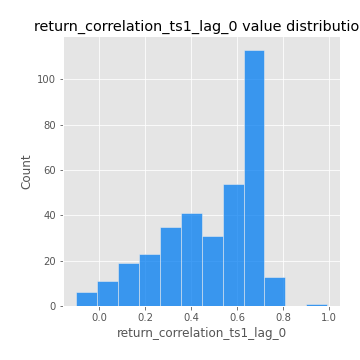
## Feature : return_correlation_ts1_lag_1
- **Feature type** : continous
- **Missing** : 0.0%
- **Unique** : 347
- **Count** :347.0
- **Mean** :0.11960268968915848
- **Std** :0.14528563313952525
- **Min** :-0.15425283552105754
- **25%th Percentile** : -0.002498041869026639
- **50%th Percentile** : 0.08567985088312549
- **75%th Percentile** : 0.26170123496778597
- **Max** :0.4072354260689995

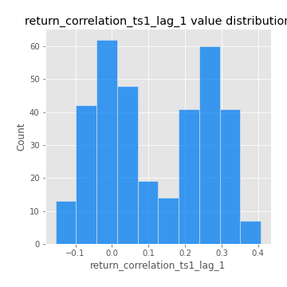
## Feature : return_correlation_ts1_lag_2
- **Feature type** : continous
- **Missing** : 0.0%
- **Unique** : 347
- **Count** :347.0
- **Mean** :0.11593502603128411
- **Std** :0.14608075727005895
- **Min** :-0.16038742223567365
- **25%th Percentile** : -0.020244727621800036
- **50%th Percentile** : 0.11331580663178385
- **75%th Percentile** : 0.25395335074163683
- **Max** :0.3920474238745046

## Feature : return_correlation_ts1_lag_3
- **Feature type** : continous
- **Missing** : 0.0%
- **Unique** : 347
- **Count** :347.0
- **Mean** :0.1250009835543492
- **Std** :0.14049005311956636
- **Min** :-0.21147540839842804
- **25%th Percentile** : 0.007900448740609765
- **50%th Percentile** : 0.1114732514780237
- **75%th Percentile** : 0.2543718756630417
- **Max** :0.39511272591747776

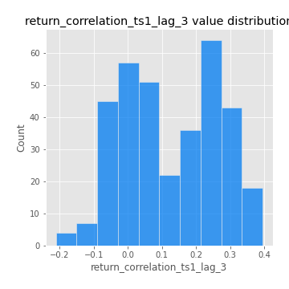
## Feature : return_correlation_ts2_lag_1
- **Feature type** : continous
- **Missing** : 0.0%
- **Unique** : 347
- **Count** :347.0
- **Mean** :0.12552215381527537
- **Std** :0.1413106335039035
- **Min** :-0.17665751184419612
- **25%th Percentile** : 0.002434222065348262
- **50%th Percentile** : 0.11482101636448343
- **75%th Percentile** : 0.2575001769412715
- **Max** :0.4045066913327668

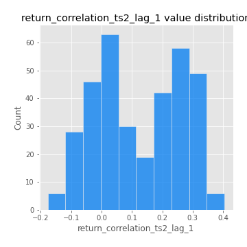
## Feature : return_correlation_ts2_lag_2
- **Feature type** : continous
- **Missing** : 0.0%
- **Unique** : 347
- **Count** :347.0
- **Mean** :0.11427993419972239
- **Std** :0.1475277438662536
- **Min** :-0.2757460186107768
- **25%th Percentile** : -0.012107112374198453
- **50%th Percentile** : 0.09043367523302702
- **75%th Percentile** : 0.2570394316832598
- **Max** :0.37809620221233065

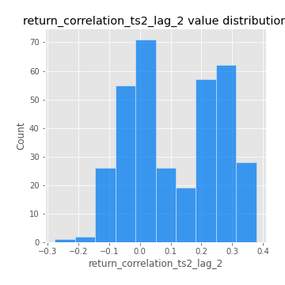
## Feature : return_correlation_ts2_lag_3
- **Feature type** : continous
- **Missing** : 0.0%
- **Unique** : 347
- **Count** :347.0
- **Mean** :0.1283972071014465
- **Std** :0.13444401044025273
- **Min** :-0.17697863431182184
- **25%th Percentile** : 0.014434113281906465
- **50%th Percentile** : 0.11110685043001825
- **75%th Percentile** : 0.24932748372518942
- **Max** :0.3851541179840777

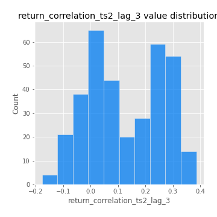
## Feature : price2_granger_cause_price1
- **Feature type** : continous
- **Missing** : 0.0%
- **Unique** : 347
- **Count** :347.0
- **Mean** :0.15640284932494683
- **Std** :0.26237352139102327
- **Min** :6.071197029229072e-17
- **25%th Percentile** : 1.9927696262889657e-05
- **50%th Percentile** : 0.0056799950096139366
- **75%th Percentile** : 0.20777430732486754
- **Max** :0.9898380228448623

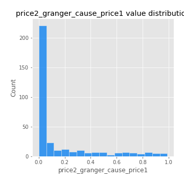
## Feature : price1_granger_cause_price2
- **Feature type** : continous
- **Missing** : 0.0%
- **Unique** : 347
- **Count** :347.0
- **Mean** :0.21871787579523055
- **Std** :0.2727646079102397
- **Min** :9.741130375027801e-08
- **25%th Percentile** : 0.008765215231947114
- **50%th Percentile** : 0.08443969346253738
- **75%th Percentile** : 0.3217644145592714
- **Max** :0.9756257527989649

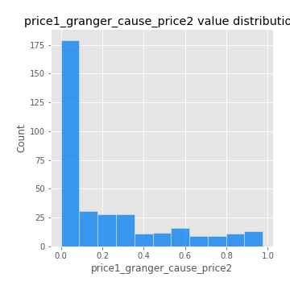

[<< Go back](../README.md)
