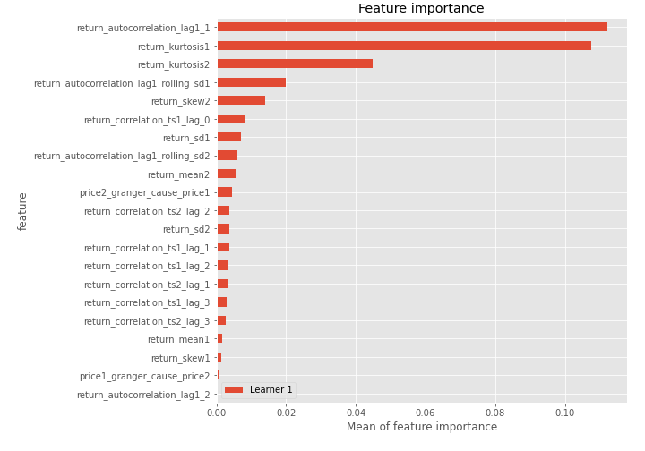
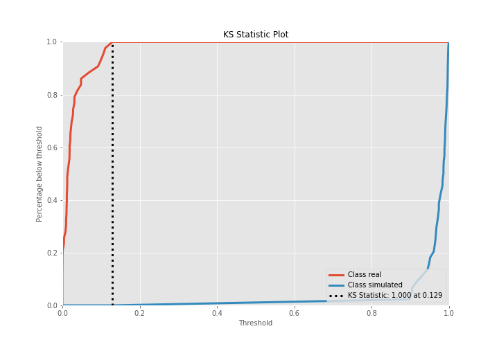
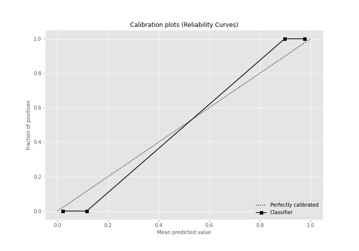
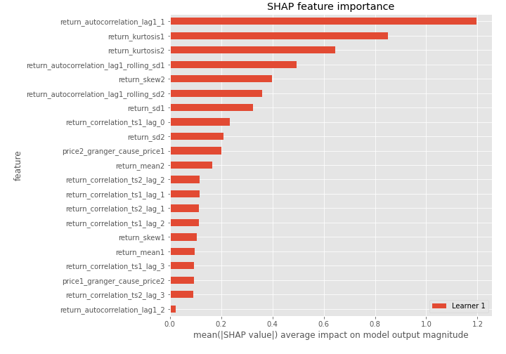
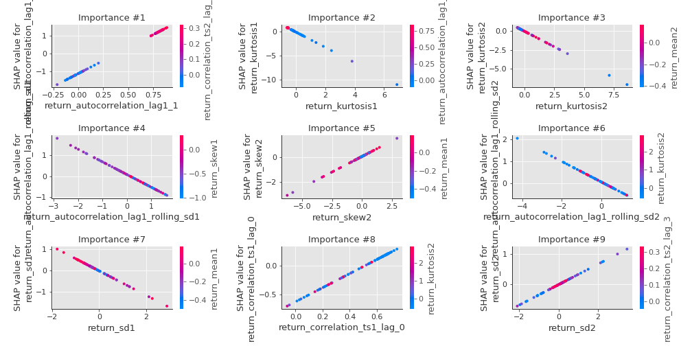
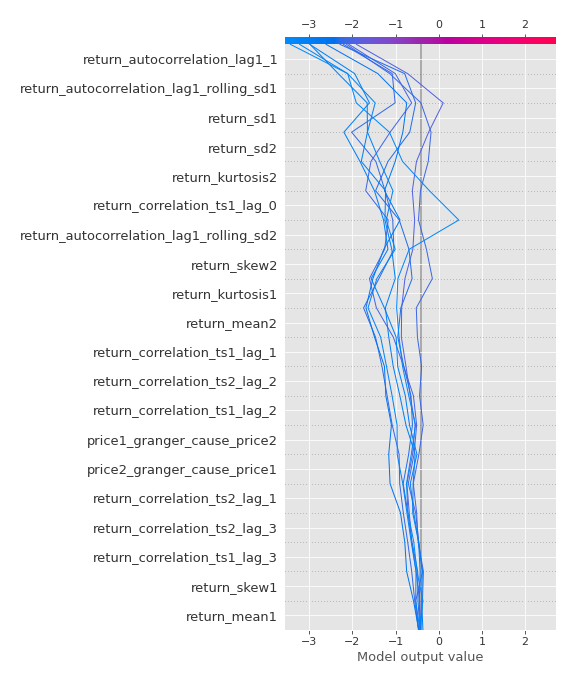
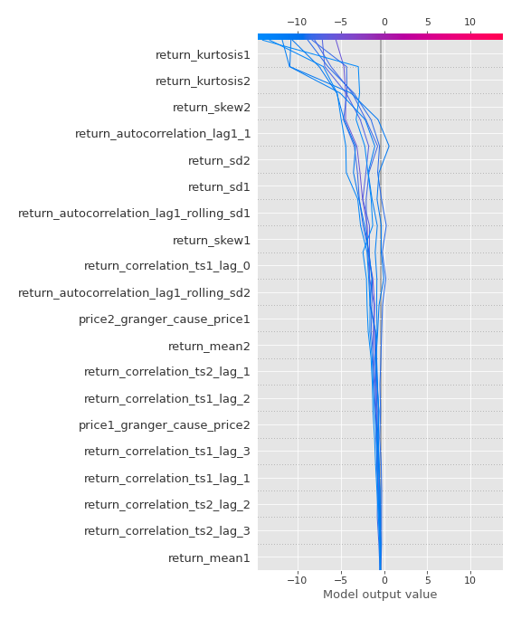
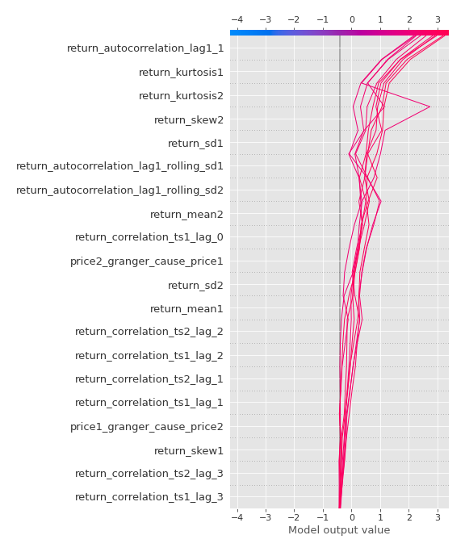
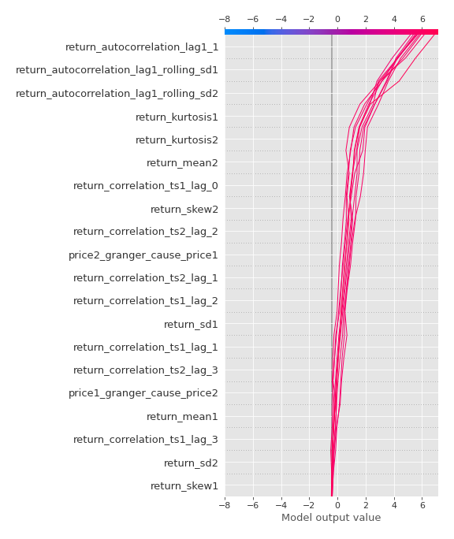

# Summary of 3_Linear

[<< Go back](../README.md)

## Logistic Regression (Linear)
- **n_jobs**: -1
- **explain_level**: 2

## Validation
 - **validation_type**: split
 - **train_ratio**: 0.75
 - **shuffle**: True
 - **stratify**: True

## Optimized metric
accuracy

## Training time

4.1 seconds

## Metric details
|           |     score |     threshold |
|:----------|----------:|--------------:|
| logloss   | 0.0272421 | nan           |
| auc       | 1         | nan           |
| f1        | 1         |   0.520181    |
| accuracy  | 1         |   0.520181    |
| precision | 1         |   0.520181    |
| recall    | 1         |   7.15485e-07 |
| mcc       | 1         |   0.520181    |

## Confusion matrix (at threshold=0.520181)
|                      |   Predicted as real |   Predicted as simulated |
|:---------------------|--------------------:|-------------------------:|
| Labeled as real      |                  43 |                        0 |
| Labeled as simulated |                   0 |                       44 |

## Learning curves

## Coefficients
| feature                                 |   Learner_1 |
|:----------------------------------------|------------:|
| return_autocorrelation_lag1_1           |    2.91064  |
| return_correlation_ts1_lag_0            |    1.22047  |
| return_correlation_ts2_lag_2            |    0.923896 |
| return_correlation_ts2_lag_1            |    0.914809 |
| return_correlation_ts1_lag_1            |    0.911186 |
| return_correlation_ts1_lag_2            |    0.880689 |
| return_correlation_ts2_lag_3            |    0.800905 |
| return_correlation_ts1_lag_3            |    0.724962 |
| return_skew2                            |    0.511388 |
| return_sd2                              |    0.337708 |
| return_autocorrelation_lag1_2           |    0.337012 |
| return_skew1                            |   -0.286545 |
| price1_granger_cause_price2             |   -0.396104 |
| return_autocorrelation_lag1_rolling_sd2 |   -0.466304 |
| return_mean1                            |   -0.535163 |
| return_sd1                              |   -0.577066 |
| return_autocorrelation_lag1_rolling_sd1 |   -0.611506 |
| return_kurtosis2                        |   -0.810248 |
| price2_granger_cause_price1             |   -0.977073 |
| return_mean2                            |   -1.02283  |
| return_kurtosis1                        |   -1.59271  |
| intercept                               |   -2.82055  |

## Permutation-based Importance

## Confusion Matrix

## Normalized Confusion Matrix

## ROC Curve

## Kolmogorov-Smirnov Statistic

## Precision-Recall Curve

## Calibration Curve

## Cumulative Gains Curve

## Lift Curve

## SHAP Importance

## SHAP Dependence plots

### Dependence (Fold 1)

## SHAP Decision plots

### Top-10 Worst decisions for class 0 (Fold 1)

### Top-10 Best decisions for class 0 (Fold 1)

### Top-10 Worst decisions for class 1 (Fold 1)

### Top-10 Best decisions for class 1 (Fold 1)

[<< Go back](../README.md)
