# Exploratory Data Analysis

[<< Go back](../README.md)
## Feature : target
- **Feature type** : categorical
- **Missing** : 0.0%
- **Unique** : 2
- **Count** :347
- **Unique** :2
- **Top** :simulated
- **Freq** :176

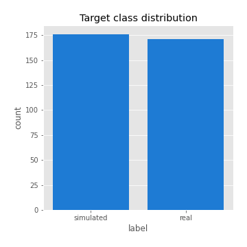
## Feature : return_mean1
- **Feature type** : continous
- **Missing** : 0.0%
- **Unique** : 347
- **Count** :347.0
- **Mean** :-0.06550773346093704
- **Std** :0.2259599385650319
- **Min** :-1.2118981410899932
- **25%th Percentile** : -0.1784431490884531
- **50%th Percentile** : -0.017642431798751003
- **75%th Percentile** : 0.08866235540863689
- **Max** :0.4525238546982604

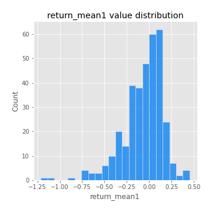
## Feature : return_mean2
- **Feature type** : continous
- **Missing** : 0.0%
- **Unique** : 347
- **Count** :347.0
- **Mean** :-0.12370179450225208
- **Std** :0.21527213161467526
- **Min** :-0.936775615543441
- **25%th Percentile** : -0.27124403904157485
- **50%th Percentile** : -0.09874883397150049
- **75%th Percentile** : 0.03868125681785426
- **Max** :0.6801605239983173

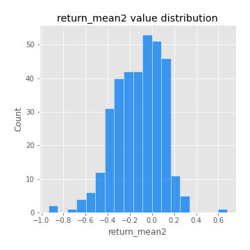
## Feature : return_sd1
- **Feature type** : continous
- **Missing** : 0.0%
- **Unique** : 347
- **Count** :347.0
- **Mean** :1.5196608639730438
- **Std** :0.3815032495348285
- **Min** :0.8102430347636637
- **25%th Percentile** : 1.304557865939292
- **50%th Percentile** : 1.4246329583007116
- **75%th Percentile** : 1.623545104315937
- **Max** :3.181425034216533

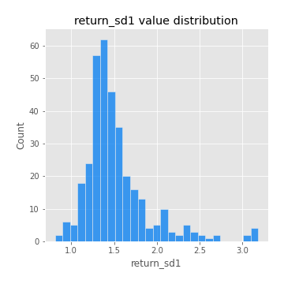
## Feature : return_sd2
- **Feature type** : continous
- **Missing** : 0.0%
- **Unique** : 347
- **Count** :347.0
- **Mean** :1.7329543940244396
- **Std** :0.3894989378336924
- **Min** :0.8198779632289204
- **25%th Percentile** : 1.555503654702854
- **50%th Percentile** : 1.7303905983432288
- **75%th Percentile** : 1.8666956806801627
- **Max** :4.59233049161685

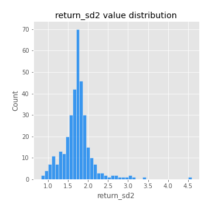
## Feature : return_skew1
- **Feature type** : continous
- **Missing** : 0.0%
- **Unique** : 347
- **Count** :347.0
- **Mean** :-0.41334511421779446
- **Std** :0.6697323877955983
- **Min** :-4.239645236578449
- **25%th Percentile** : -0.5289693711343497
- **50%th Percentile** : -0.42629620602752133
- **75%th Percentile** : -0.3013619527617427
- **Max** :2.351757728252051

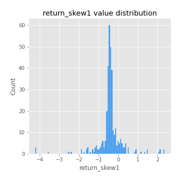
## Feature : return_skew2
- **Feature type** : continous
- **Missing** : 0.0%
- **Unique** : 347
- **Count** :347.0
- **Mean** :-0.23539276093178585
- **Std** :1.0308238153065918
- **Min** :-6.262899561987459
- **25%th Percentile** : -0.4750379639885711
- **50%th Percentile** : -0.12973387589299412
- **75%th Percentile** : 0.1819787344285251
- **Max** :4.1920266082732045

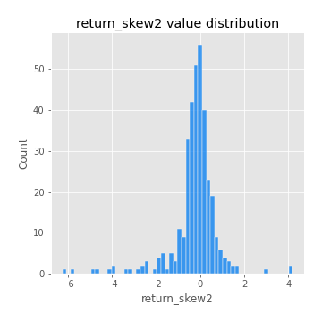
## Feature : return_kurtosis1
- **Feature type** : continous
- **Missing** : 0.0%
- **Unique** : 347
- **Count** :347.0
- **Mean** :2.345137899316266
- **Std** :5.563565769470804
- **Min** :-0.8540807610497296
- **25%th Percentile** : -0.5177923124174246
- **50%th Percentile** : -0.07853733175196265
- **75%th Percentile** : 2.6990337880253565
- **Max** :40.485294874464934

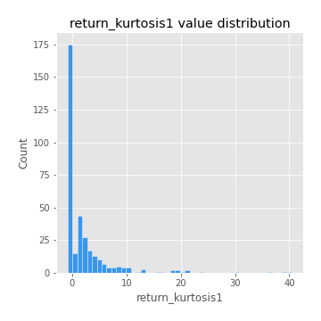
## Feature : return_kurtosis2
- **Feature type** : continous
- **Missing** : 0.0%
- **Unique** : 347
- **Count** :347.0
- **Mean** :4.655822050735015
- **Std** :8.154346758095079
- **Min** :-0.5168923081264287
- **25%th Percentile** : 0.7695221569409734
- **50%th Percentile** : 1.8628064801568347
- **75%th Percentile** : 4.9249476983869025
- **Max** :64.99818629655663

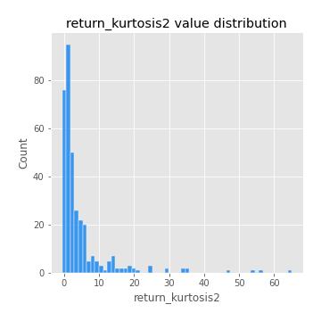
## Feature : return_autocorrelation_lag1_1
- **Feature type** : continous
- **Missing** : 0.0%
- **Unique** : 347
- **Count** :347.0
- **Mean** :0.4018298545432342
- **Std** :0.41558403806010263
- **Min** :-0.2110198016529991
- **25%th Percentile** : -0.018497057396311183
- **50%th Percentile** : 0.7101585988515451
- **75%th Percentile** : 0.8125641987227135
- **Max** :0.8856856341373318

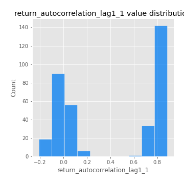
## Feature : return_autocorrelation_lag1_2
- **Feature type** : continous
- **Missing** : 0.0%
- **Unique** : 347
- **Count** :347.0
- **Mean** :0.038911574963662765
- **Std** :0.08329931318986587
- **Min** :-0.2364404317158175
- **25%th Percentile** : -0.013401127539921185
- **50%th Percentile** : 0.042422518272491654
- **75%th Percentile** : 0.09850464255010088
- **Max** :0.2958205320524561

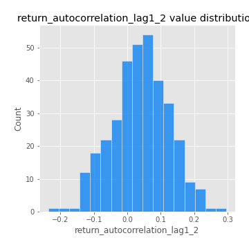
## Feature : return_autocorrelation_lag1_rolling_sd1
- **Feature type** : continous
- **Missing** : 0.0%
- **Unique** : 347
- **Count** :347.0
- **Mean** :0.9452982061168537
- **Std** :0.02213913739454304
- **Min** :0.8490288247784546
- **25%th Percentile** : 0.9339435093454156
- **50%th Percentile** : 0.9483664769823577
- **75%th Percentile** : 0.9609291717235067
- **Max** :0.9870342687296267

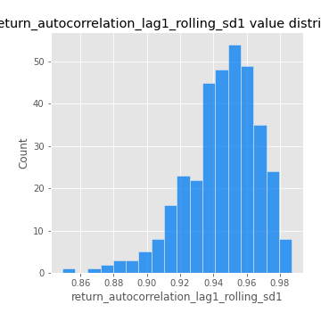
## Feature : return_autocorrelation_lag1_rolling_sd2
- **Feature type** : continous
- **Missing** : 0.0%
- **Unique** : 347
- **Count** :347.0
- **Mean** :0.9467642663150285
- **Std** :0.019759418275944202
- **Min** :0.8649793343450707
- **25%th Percentile** : 0.9364536390953524
- **50%th Percentile** : 0.9497910482287766
- **75%th Percentile** : 0.9596799232240051
- **Max** :0.983940118474517

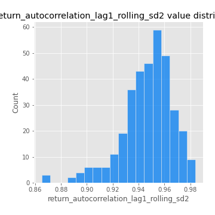
## Feature : return_correlation_ts1_lag_0
- **Feature type** : continous
- **Missing** : 0.0%
- **Unique** : 347
- **Count** :347.0
- **Mean** :0.4937058486008015
- **Std** :0.21620953187058703
- **Min** :-0.07366870340906873
- **25%th Percentile** : 0.3380361619663287
- **50%th Percentile** : 0.6018799966749986
- **75%th Percentile** : 0.6675145306833641
- **Max** :0.9937227277077512

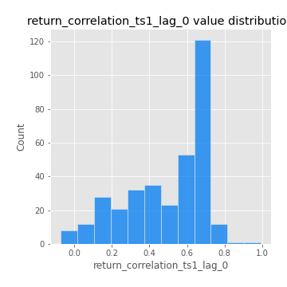
## Feature : return_correlation_ts1_lag_1
- **Feature type** : continous
- **Missing** : 0.0%
- **Unique** : 347
- **Count** :347.0
- **Mean** :0.12966221495754346
- **Std** :0.14767863290900296
- **Min** :-0.18856827637524448
- **25%th Percentile** : -0.00030284869388125154
- **50%th Percentile** : 0.14868984778667463
- **75%th Percentile** : 0.2612313766373269
- **Max** :0.4166385036322626

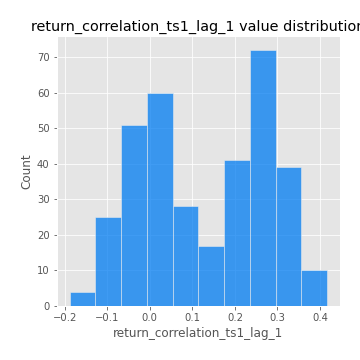
## Feature : return_correlation_ts1_lag_2
- **Feature type** : continous
- **Missing** : 0.0%
- **Unique** : 347
- **Count** :347.0
- **Mean** :0.1266859546901194
- **Std** :0.14581748237646558
- **Min** :-0.172871336111873
- **25%th Percentile** : -0.00912758376554021
- **50%th Percentile** : 0.13124645189183137
- **75%th Percentile** : 0.25630539080549497
- **Max** :0.4045240053761419

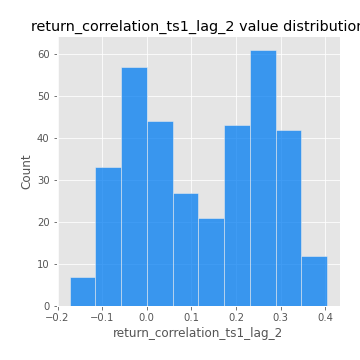
## Feature : return_correlation_ts1_lag_3
- **Feature type** : continous
- **Missing** : 0.0%
- **Unique** : 347
- **Count** :347.0
- **Mean** :0.1343257783711661
- **Std** :0.14198732516873575
- **Min** :-0.18059033867783728
- **25%th Percentile** : 0.011579836397076443
- **50%th Percentile** : 0.1511284633931713
- **75%th Percentile** : 0.26281044257552333
- **Max** :0.4055794940724152

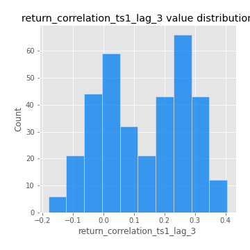
## Feature : return_correlation_ts2_lag_1
- **Feature type** : continous
- **Missing** : 0.0%
- **Unique** : 347
- **Count** :347.0
- **Mean** :0.13608873095269478
- **Std** :0.14364593947432305
- **Min** :-0.17665751184419612
- **25%th Percentile** : 0.009978021480878067
- **50%th Percentile** : 0.15102463888625375
- **75%th Percentile** : 0.2626831138553536
- **Max** :0.40448068483718885

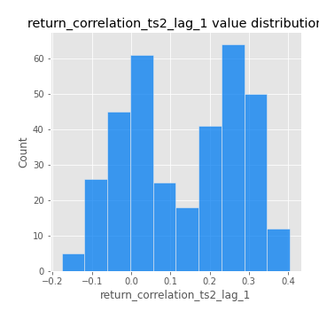
## Feature : return_correlation_ts2_lag_2
- **Feature type** : continous
- **Missing** : 0.0%
- **Unique** : 347
- **Count** :347.0
- **Mean** :0.12361232289984629
- **Std** :0.14933711395516278
- **Min** :-0.18793480063267962
- **25%th Percentile** : -0.012890922386680027
- **50%th Percentile** : 0.13413271614411015
- **75%th Percentile** : 0.25603413191829455
- **Max** :0.40641677661735776

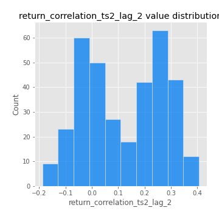
## Feature : return_correlation_ts2_lag_3
- **Feature type** : continous
- **Missing** : 0.0%
- **Unique** : 347
- **Count** :347.0
- **Mean** :0.1388402248731069
- **Std** :0.13526022627541373
- **Min** :-0.13287767820660334
- **25%th Percentile** : 0.01943440785464433
- **50%th Percentile** : 0.14004581067959815
- **75%th Percentile** : 0.26284272233115613
- **Max** :0.40516196332385124

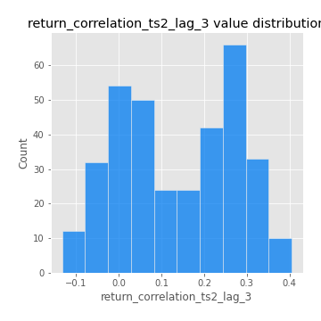
## Feature : price2_granger_cause_price1
- **Feature type** : continous
- **Missing** : 0.0%
- **Unique** : 347
- **Count** :347.0
- **Mean** :0.14386349902849427
- **Std** :0.255148381562203
- **Min** :1.2021508411579031e-26
- **25%th Percentile** : 3.6439181908646594e-06
- **50%th Percentile** : 0.002300588561762426
- **75%th Percentile** : 0.17214970020597586
- **Max** :0.9898380228448623

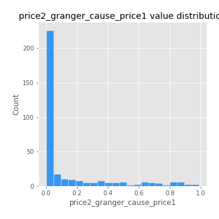
## Feature : price1_granger_cause_price2
- **Feature type** : continous
- **Missing** : 0.0%
- **Unique** : 347
- **Count** :347.0
- **Mean** :0.206451504611929
- **Std** :0.2678565563209464
- **Min** :1.2012269232170316e-11
- **25%th Percentile** : 0.005664820922129172
- **50%th Percentile** : 0.07678884071992578
- **75%th Percentile** : 0.3129492832447373
- **Max** :0.9631221701503747

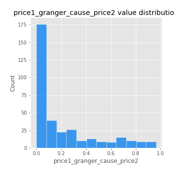

[<< Go back](../README.md)
