# Exploratory Data Analysis

[<< Go back](../README.md)
## Feature : target
- **Feature type** : categorical
- **Missing** : 0.0%
- **Unique** : 2
- **Count** :347
- **Unique** :2
- **Top** :real
- **Freq** :176

## Feature : return_mean1
- **Feature type** : continous
- **Missing** : 0.0%
- **Unique** : 347
- **Count** :347.0
- **Mean** :-0.0721763027313547
- **Std** :0.24426891996294223
- **Min** :-1.4432138013182332
- **25%th Percentile** : -0.2006574603893132
- **50%th Percentile** : -0.024558404007134393
- **75%th Percentile** : 0.09155542898848351
- **Max** :0.5289096029517206

## Feature : return_mean2
- **Feature type** : continous
- **Missing** : 0.0%
- **Unique** : 347
- **Count** :347.0
- **Mean** :-0.12190889344271641
- **Std** :0.21806569951956128
- **Min** :-0.8639323130979313
- **25%th Percentile** : -0.27105022873458584
- **50%th Percentile** : -0.08638015642616681
- **75%th Percentile** : 0.04415527592142304
- **Max** :0.6801605239983173

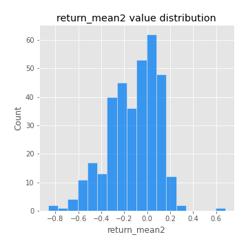
## Feature : return_sd1
- **Feature type** : continous
- **Missing** : 0.0%
- **Unique** : 347
- **Count** :347.0
- **Mean** :1.5384689984534767
- **Std** :0.3976890536357699
- **Min** :0.8733078831717243
- **25%th Percentile** : 1.3080258405898157
- **50%th Percentile** : 1.4394418966428764
- **75%th Percentile** : 1.642180503878207
- **Max** :3.332494027875222

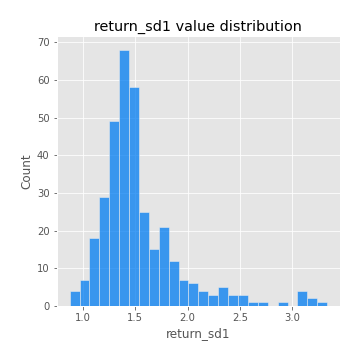
## Feature : return_sd2
- **Feature type** : continous
- **Missing** : 0.0%
- **Unique** : 347
- **Count** :347.0
- **Mean** :1.767959010722025
- **Std** :0.4178909405531094
- **Min** :0.8198779632289204
- **25%th Percentile** : 1.553333386273452
- **50%th Percentile** : 1.7609227932853313
- **75%th Percentile** : 1.8828863287709996
- **Max** :4.59233049161685

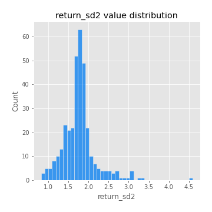
## Feature : return_skew1
- **Feature type** : continous
- **Missing** : 0.0%
- **Unique** : 347
- **Count** :347.0
- **Mean** :-0.38087441012703066
- **Std** :0.6745827523732129
- **Min** :-4.239645236578449
- **25%th Percentile** : -0.504424073238309
- **50%th Percentile** : -0.41327696479901
- **75%th Percentile** : -0.2507266394453382
- **Max** :2.1285977762978217

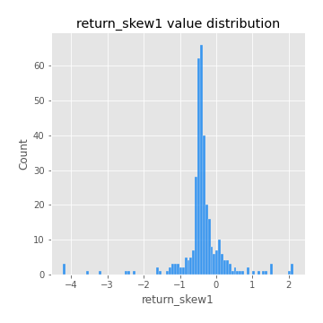
## Feature : return_skew2
- **Feature type** : continous
- **Missing** : 0.0%
- **Unique** : 347
- **Count** :347.0
- **Mean** :-0.24264145529649303
- **Std** :1.0239101094450933
- **Min** :-6.262899561987459
- **25%th Percentile** : -0.44540018996077335
- **50%th Percentile** : -0.11681289323054848
- **75%th Percentile** : 0.20549902370678147
- **Max** :4.0310261345618

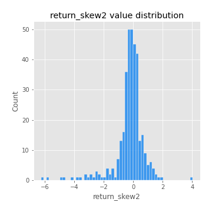
## Feature : return_kurtosis1
- **Feature type** : continous
- **Missing** : 0.0%
- **Unique** : 347
- **Count** :347.0
- **Mean** :2.2281802072309143
- **Std** :5.4542952798111
- **Min** :-0.8734497632497153
- **25%th Percentile** : -0.5342372334811836
- **50%th Percentile** : 0.45236352801461255
- **75%th Percentile** : 2.678812472527533
- **Max** :40.485294874464934

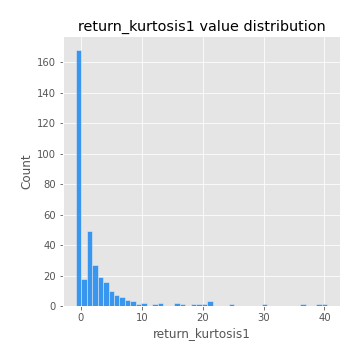
## Feature : return_kurtosis2
- **Feature type** : continous
- **Missing** : 0.0%
- **Unique** : 347
- **Count** :347.0
- **Mean** :4.948298312388979
- **Std** :8.527692146110489
- **Min** :-0.5266170072978733
- **25%th Percentile** : 0.8678132738509072
- **50%th Percentile** : 2.127068765715503
- **75%th Percentile** : 5.229735130765526
- **Max** :64.99818629655663

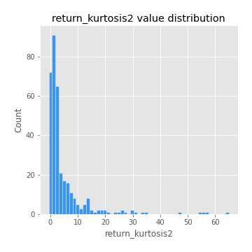
## Feature : return_autocorrelation_lag1_1
- **Feature type** : continous
- **Missing** : 0.0%
- **Unique** : 347
- **Count** :347.0
- **Mean** :0.3867303823820892
- **Std** :0.4173727599079519
- **Min** :-0.2110198016529991
- **25%th Percentile** : -0.025962464055177555
- **50%th Percentile** : 0.12926001801105047
- **75%th Percentile** : 0.8045536943576275
- **Max** :0.9053886834135106

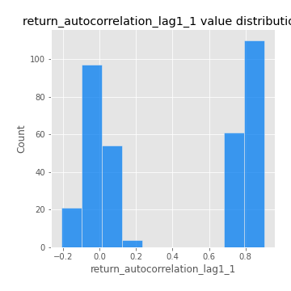
## Feature : return_autocorrelation_lag1_2
- **Feature type** : continous
- **Missing** : 0.0%
- **Unique** : 347
- **Count** :347.0
- **Mean** :0.038671881389778236
- **Std** :0.08199179833866584
- **Min** :-0.17778763204400128
- **25%th Percentile** : -0.02442407656256964
- **50%th Percentile** : 0.04152566280710759
- **75%th Percentile** : 0.09551209970807054
- **Max** :0.2805771600945024

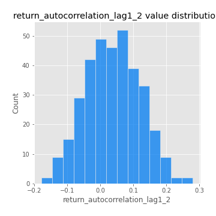
## Feature : return_autocorrelation_lag1_rolling_sd1
- **Feature type** : continous
- **Missing** : 0.0%
- **Unique** : 347
- **Count** :347.0
- **Mean** :0.9462908648998346
- **Std** :0.021784308733104527
- **Min** :0.851320801057694
- **25%th Percentile** : 0.9330921177352143
- **50%th Percentile** : 0.9486262037487734
- **75%th Percentile** : 0.9627653750309061
- **Max** :0.9870342687296267

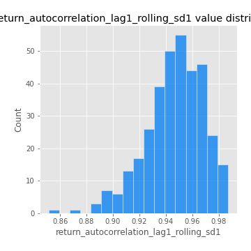
## Feature : return_autocorrelation_lag1_rolling_sd2
- **Feature type** : continous
- **Missing** : 0.0%
- **Unique** : 347
- **Count** :347.0
- **Mean** :0.9466453970360097
- **Std** :0.020033153404515492
- **Min** :0.8751521782217786
- **25%th Percentile** : 0.935213491306417
- **50%th Percentile** : 0.9489341212866542
- **75%th Percentile** : 0.9607918785368635
- **Max** :0.9871675952783526

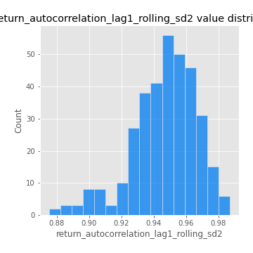
## Feature : return_correlation_ts1_lag_0
- **Feature type** : continous
- **Missing** : 0.0%
- **Unique** : 347
- **Count** :347.0
- **Mean** :0.49171129917952433
- **Std** :0.21098634020412668
- **Min** :-0.10256711281206837
- **25%th Percentile** : 0.3380361619663287
- **50%th Percentile** : 0.5853966212693299
- **75%th Percentile** : 0.6630638501709756
- **Max** :0.9937227277077512

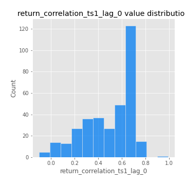
## Feature : return_correlation_ts1_lag_1
- **Feature type** : continous
- **Missing** : 0.0%
- **Unique** : 347
- **Count** :347.0
- **Mean** :0.1215406186719564
- **Std** :0.14789507474293184
- **Min** :-0.18856827637524448
- **25%th Percentile** : -0.004885111221206927
- **50%th Percentile** : 0.09529518508792652
- **75%th Percentile** : 0.25013087582333776
- **Max** :0.47071566072803056

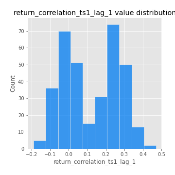
## Feature : return_correlation_ts1_lag_2
- **Feature type** : continous
- **Missing** : 0.0%
- **Unique** : 347
- **Count** :347.0
- **Mean** :0.12033629069179137
- **Std** :0.14480924749380406
- **Min** :-0.16038742223567365
- **25%th Percentile** : -0.010709294226384662
- **50%th Percentile** : 0.1168186809857013
- **75%th Percentile** : 0.25051477841913805
- **Max** :0.47197939694703445

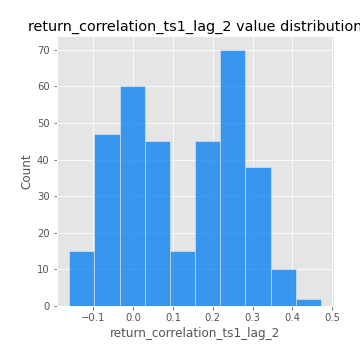
## Feature : return_correlation_ts1_lag_3
- **Feature type** : continous
- **Missing** : 0.0%
- **Unique** : 347
- **Count** :347.0
- **Mean** :0.13044068315700752
- **Std** :0.14033334331417519
- **Min** :-0.21147540839842804
- **25%th Percentile** : 0.010213408823100454
- **50%th Percentile** : 0.12858799427408343
- **75%th Percentile** : 0.2502411587338572
- **Max** :0.4328926920129381

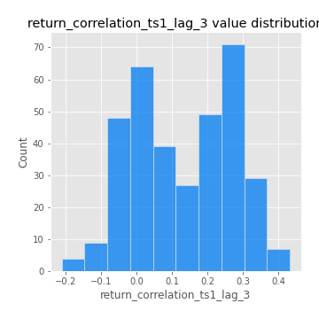
## Feature : return_correlation_ts2_lag_1
- **Feature type** : continous
- **Missing** : 0.0%
- **Unique** : 347
- **Count** :347.0
- **Mean** :0.12932727492226595
- **Std** :0.14481000135125158
- **Min** :-0.17665751184419612
- **25%th Percentile** : 0.004291667305781522
- **50%th Percentile** : 0.12892031530719528
- **75%th Percentile** : 0.25801812051136186
- **Max** :0.47389612065676495

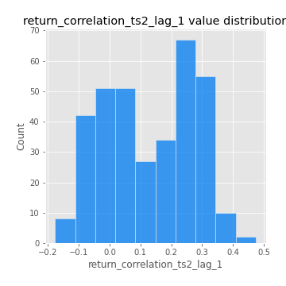
## Feature : return_correlation_ts2_lag_2
- **Feature type** : continous
- **Missing** : 0.0%
- **Unique** : 347
- **Count** :347.0
- **Mean** :0.11739031090438738
- **Std** :0.1486174680192455
- **Min** :-0.2757460186107768
- **25%th Percentile** : -0.012890922386680027
- **50%th Percentile** : 0.10075452998752527
- **75%th Percentile** : 0.2520809101874904
- **Max** :0.46987819325109553

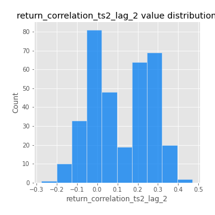
## Feature : return_correlation_ts2_lag_3
- **Feature type** : continous
- **Missing** : 0.0%
- **Unique** : 347
- **Count** :347.0
- **Mean** :0.13440929565487159
- **Std** :0.13728670485467145
- **Min** :-0.13344359675322365
- **25%th Percentile** : 0.015324645462413161
- **50%th Percentile** : 0.13329056753498508
- **75%th Percentile** : 0.2629479312396275
- **Max** :0.45903113394379774

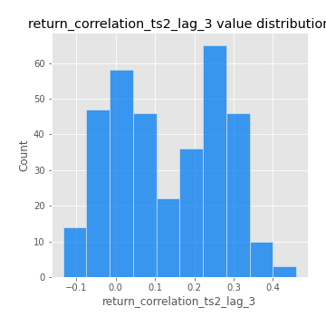
## Feature : price2_granger_cause_price1
- **Feature type** : continous
- **Missing** : 0.0%
- **Unique** : 347
- **Count** :347.0
- **Mean** :0.14614490630296612
- **Std** :0.25223547519990963
- **Min** :2.0419222931440484e-15
- **25%th Percentile** : 6.693122062248148e-06
- **50%th Percentile** : 0.002459185424477118
- **75%th Percentile** : 0.18693283962094231
- **Max** :0.9898380228448623

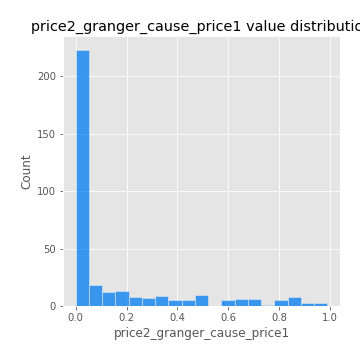
## Feature : price1_granger_cause_price2
- **Feature type** : continous
- **Missing** : 0.0%
- **Unique** : 347
- **Count** :347.0
- **Mean** :0.20305774237072605
- **Std** :0.2634580644104034
- **Min** :1.2012269232170316e-11
- **25%th Percentile** : 0.00738010614283804
- **50%th Percentile** : 0.07839956776717395
- **75%th Percentile** : 0.30968651450348117
- **Max** :0.9871292066441198

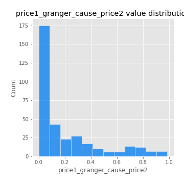

[<< Go back](../README.md)
